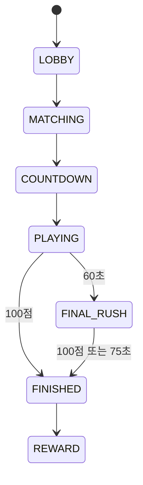

# 03. 게임 흐름과 상태 머신
> State boundaries follow RulesetV1 (`1.0.0`) half-open windows. At 75,000 ms new match input closes; only already-started meaning settlement may continue through the 80,000 ms cap.



## 플레이어 입력 상태
- ACTIVE
- ANSWER_LOCKED
- TAP_LOCKED
- MEANING_QUIZ
- FINISHED

## 좌표
모든 hitbox는 원본 이미지 기준 0~1 정규화 좌표로 저장한다.

```json
{"type":"circle","cx":0.41,"cy":0.63,"r":0.035}
```

## 줌/팬
클라이언트는 transform을 역변환해 원본 정규화 좌표를 서버에 전송한다. 서버가 최종 판정한다.
# Deterministic persisted phases

The authoritative match phases are `WAITING_FOR_ASSETS → COUNTDOWN → PLAYING → FINAL_RUSH → SETTLING → TIEBREAK_EVAL → SUDDEN_DEATH → FINISHED`, with `CANCELLED` as the no-contest terminal phase. `SETTLING` accepts only meaning answers whose quiz began before gameplay close and whose personal deadline is before the settlement cap.

Transport reconnect is not a persisted match phase. It is a derived client overlay which blocks local input while the authoritative connection epoch remains in the snapshot. Navigation state is likewise separate from persisted match phase.
