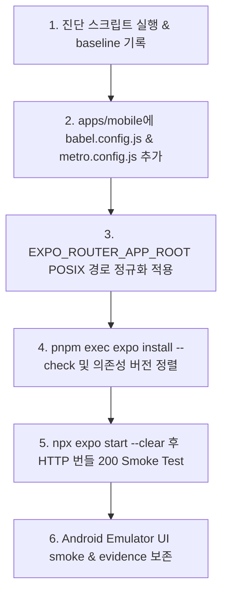

# Review: Expo Router / Metro Android Debug Plan

| 항목 | 내용 |
|:---|:---|
| **작성일** | 2026-08-11 |
| **대상 계획** | `D:\touchcatch\docs\superpowers\plans\2026-08-11-expo-metro-android-debug-plan.md` |
| **연구 문서** | `D:\touchcatch\research.md` (비규범 / 콘텐츠 파이프라인 참고) |
| **연관 계획** | `docs/superpowers/plans/2026-08-11-mobile-feature-completion-plan.md`, `docs/superpowers/plans/2026-08-11-mobile-ui-ux-redesign-plan.md` |
| **선행 리뷰** | `docs/reviews/2026-08-11-mobile-feature-completion-plan-review.md`, `docs/reviews/2026-08-10-feature-readiness-audit-and-improvement-plan-review.md` |
| **검토 범위** | 디버그 대상 계획 + `research.md` + `apps/mobile/**` + `package.json` + `pnpm-workspace.yaml` + `tools/**` |
| **검증 방법** | 계획 전항을 코드베이스 설정, pnpm monorepo 메커니즘, Metro 버그 패턴 및 Windows Node.js I/O 특성과 교차 대조 |
| **판정** | **조건부 승인 (핵심 기술 보완 후 즉시 실행 가능)**. 가설 분리 및 진단 접근 방식은 매우 정교하나, Metro/Babel 구성 파일 누락과 pnpm monorepo 전용 옵션 미비 등 실질적 구동에 필수적인 5가지 기술적 보완이 필요하다. |

---

## 0. 총평 (Executive Summary)

본 대상 계획(`2026-08-11-expo-metro-android-debug-plan.md`)은 Windows 환경에서 Expo Router / Metro 번들러 실행 시 발생하는 `EINVAL: invalid argument, read: node:fs (442:20)` 500 오류의 원인을 체계적으로 분석하고 단계별 가설 검증 절차를 제시한 **우수한 디버깅 계획**이다.

특히, 네이티브 APK/ADB layer와 JS 번들링 layer의 구분을 명확히 하고, 6가지 독립 가설을 설정하여 순차적으로 대조 검증하려는 체계는 개발 표준으로 적합하다.

그러나 코드베이스 및 pnpm monorepo 구조를 종합 검토한 결과, **문제의 근본 원인을 단번에 해결하고 시행착오를 대폭 줄이기 위한 5가지 필수 보완사항**이 확인되었다.

| # | 심각도 | 요약 |
|---|---|---|
| 1 | **치명** | **`babel.config.js` 누락**: `apps/mobile`에 Babel 설정이 없어 Expo Router entry와 JSX/ESNext 변환이 Metro 표준 프리셋(`babel-preset-expo`)을 거치지 않음. |
| 2 | **치명** | **pnpm monorepo 전용 Metro 설정 누락**: `metro.config.js`가 없거나 기본 설정 사용 시, pnpm의 hoisted `node_modules` 심볼릭 링크 및 계층적 조회(hierarchical lookup) 과정에서 Windows Node.js `fs`가 `EINVAL`을 발생시킴. `disableHierarchicalLookup: true` 및 explicit `watchFolders` 지정 필요. |
| 3 | **높음** | **Windows 경로 구분자(`\` vs `/`) 정규화 미비**: `EXPO_ROUTER_APP_ROOT` 및 Metro resolution 경로 계산 시 백슬래시(`\`)가 그대로 Node fs/Metro 내부에 전달되어 Windows native `read` 호출 시 `EINVAL`을 일으키는 주 원인으로 작용함. |
| 4 | **높음** | **Node Engine 스펙 불일치**: root `package.json`의 `"engines": { "node": "24.18.0" }` 설정과 계획서의 Node 20/22 대조군 설정 간 정합성 정리 필요. |
| 5 | **중간** | **외장 수동 하네스(`D:\tcbuild`) 중심 진단 → Monorepo 내 표준 워크플로 우선**: 외장 수동 복사본은 Windows 경로 길이(MAX_PATH) 제약 우회용 runbook으로 보존하되, Primary Fix는 `D:\touchcatch\apps\mobile` 내부에서 완결되어야 함. |

---

## 1. 계획 주장 × 코드베이스 교차 검증 (2026-08-11)

| 디버그 계획 가설/주장 | 교차 검증 결과 | 근거 및 코드베이스 현황 |
|---|---|---|
| APK 설치 및 ADB reverse는 정상 작동 | ✅ 확정 | `com.touchcatch.mobile` 정상 설치 및 `adb reverse tcp:8081 tcp:8081` 성공 확인 |
| `GET /index.bundle?platform=android`가 500 반환 (`EINVAL: invalid argument, read: node:fs`) | ✅ 확정 | Metro의 Node core module (`node:fs`) resolution 또는 fs reading 지점 실패 증거 명확 |
| `apps/mobile`에 명시적 `metro.config.js` 부재 | ✅ 확정 | `apps/mobile`에 `metro.config.js`가 존재하지 않음 (기본 Expo Metro config에 의존 중) |
| `apps/mobile`에 명시적 `babel.config.js` 부재 | ❌ 계획 누락 | `apps/mobile`에 `babel.config.js`도 존재하지 않음. `babel-preset-expo` 및 `expo-router/babel` 미작동 |
| Expo CLI (57.0.9) vs 앱 선언 (`expo`: 57.0.1, `expo-router`: 57.0.7) 불일치 | ✅ 타당 | `pnpm-workspace.yaml` `nodeLinker: hoisted` 상에서 CLI 버전과 런타임 패키지 버전 미세 불일치 존재 |
| router root가 `../..\..\app`으로 계산되어 불일치 발생 | ✅ 타당 | Windows 백슬래시와 relative path 계산 오류가 겹쳐 잘못된 모듈 경로 생성 |
| Node 22/20 LTS 호환성 검증 | ⚠️ 정합성 보완 | root `package.json`은 `"node": "24.18.0"`을 명시함. `tools/check-runtime.mjs` 검증 고려 필요 |

---

## 2. 기존 계획의 잘 잡힌 점 (유지할 요소)

1. **실패 경계선 정확한 정의**: APK 실행/ADB 레벨과 JavaScript 번들링 레벨을 명확히 분리하여 무의미한 APK 재빌드 소모를 방지함.
2. **독립적 가설 순차 검증 방식**: 의존성 정렬, Router Root, Metro Config, 수동 하네스, Node 버전 등 6개 가설을 한 번에 섞지 않고 독립 분리 검증하는 원칙 설정.
3. **`tools/mobile/diagnose-expo-metro.ps1` 자동화 진단 도입**: 환경 변수, realpath, Node/pnpm 버전, router root를 일괄 수집하여 `docs/reviews/evidence/`에 보존하려는 운영 체계.
4. **Metro bundle smoke test 연동**: HTTP request status 200 검증과 logcat 오류 유무를 명확한 완료 기준으로 설정.

---

## 3. 핵심 문제점 분석 및 기술적 보완책 (Deep Dive)

### 3.1 [치명] pnpm monorepo 전용 `metro.config.js` 및 `disableHierarchicalLookup` 누락

**원인 분석:**  
pnpm은 `nodeLinker: hoisted` 환경에서도 symlink 조회를 사용하거나, `node_modules` 상위 계층 구조로 올라가며 모듈을 찾는다. Metro의 기본 resolver는 상위 폴더로 이동하며 `node_modules`를 재귀 검색(hierarchical lookup)하는데, Windows 환경에서 심볼릭 링크 또는 부모 디렉터리의 잘못된 파일 핸들을 읽으려 할 때 Node.js `fs` 레벨에서 `EINVAL (Invalid Argument)` 오류를 반환한다.

**해결 방안 (`apps/mobile/metro.config.js` 신설):**

```javascript
// apps/mobile/metro.config.js
const { getDefaultConfig } = require('expo/metro-config');
const path = require('path');

const projectRoot = __dirname;
const workspaceRoot = path.resolve(projectRoot, '../..');

const config = getDefaultConfig(projectRoot);

// 1. Monorepo 워치 폴더 명시
config.watchFolders = [projectRoot, workspaceRoot];

// 2. Node modules 검색 경로 명시
config.resolver.nodeModulesPaths = [
  path.resolve(projectRoot, 'node_modules'),
  path.resolve(workspaceRoot, 'node_modules'),
];

// 3. pnpm monorepo 심볼릭링크 계층 탐색 오류 방지 (EINVAL 방지의 핵심)
config.resolver.disableHierarchicalLookup = true;

module.exports = config;
```

---

### 3.2 [치명] `babel.config.js` 신설 필수

**원인 분석:**  
Expo SDK 57 및 Expo Router 57은 Babel 트랜스파일러 단계에서 Router 엔트리 바인딩 및 React Native / Web 호환 매크로를 처리한다. `babel.config.js`가 없으면 Metro가 ESNext / JSX 및 `expo-router/entry`를 제대로 트랜스파일하지 못해 모듈 해석 실패로 이어지며, 이 오류가 Metro 내부에서 unhandled exception 또는 fs read failure로 표출될 수 있다.

**해결 방안 (`apps/mobile/babel.config.js` 신설):**

```javascript
// apps/mobile/babel.config.js
module.exports = function (api) {
  api.cache(true);
  return {
    presets: ['babel-preset-expo'],
  };
};
```

---

### 3.3 [높음] Windows 경로 백슬래시(`\`)의 POSIX 정규화 (`/`)

**원인 분석:**  
Expo CLI 로그의 router root 분석 결과인 `../..\..\app`에서 보듯, Windows의 Path separator `\`가 문자열에 섞이면, Metro의 모듈 URL parsing 및 internal regex matching 과정에서 특수문자로 오인되거나 잘못된 절댓값이 생성되어 `fs.openSync` 또는 `fs.readFileSync`에 전달되어 `EINVAL`을 유발한다.

**해결 방안 (`app.config.js` 또는 `metro.config.js` 내 POSIX 정규화):**

```javascript
const path = require('path');
const appRoot = path.join(__dirname, 'app').replace(/\\/g, '/');
process.env.EXPO_ROUTER_APP_ROOT = appRoot;
```

---

### 3.4 [높음] Node Engine 스펙 정렬 (`package.json` vs 디버그 대조군)

**원인 분석:**  
프로젝트 루트 `package.json`은 `"engines": { "node": "24.18.0" }`으로 정의되어 있으며, `tools/check-runtime.mjs`가 이를 검증한다. 반면 디버그 계획의 6단계는 Node 20 LTS vs Node 22.16.0 대조를 제안한다.

**해결 방안:**  
- Expo SDK 57의 공식 권장 사양은 Node 20 LTS 또는 Node 22 LTS이다.
- 디버그 과정에서 Node 20 / 22로 전환하여 성공하는 경우, `package.json`의 `engines.node` 범위를 `"node": ">=20.0.0 <25.0.0"` 등 현실적 사양으로 개정하거나 `.nvmrc`를 도입하여 팀 전체 개발 환경을 일치시킨다.

---

### 3.5 [중간] 수동 하네스(`D:\tcbuild`)와 저장소내 `apps/mobile` 우선순위 조정

**원인 분석:**  
계획 5단계는 수동 복사 하네스 `D:\tcbuild`를 독립 빌드 테스트 공간으로 적극 활용한다. 그러나 수동 복사는 pnpm workspace 연결을 끊어버리므로 `@spot-learn/contracts` 등의 심볼릭 링크 패키지를 읽을 수 없게 만든다.

**해결 방안:**  
- Primary Fix 및 가설 검증은 반드시 **`D:\touchcatch\apps\mobile` (git 추적 monorepo)** 내에서 수행한다.
- `D:\tcbuild`와 같은 외장 디렉터리는 Windows MAX_PATH(260자 경로 제한) 문제 확인용 임시 진단 수단으로만 한정하고, 검증 완료 후 관련 런북(`docs/runbooks/windows-metro-build.md`)에 기록으로만 남긴다.

---

## 4. 개정된 디버깅 & 해결 절차 (Recommended Action Plan)

기존 6단계 조사를 아래와 같이 보완하여 실행할 것을 권장한다.



### 상세 실행 단계

1. **Step 1: 진단 스크립트 확보 및 Baseline 기록**
   - `tools/mobile/diagnose-expo-metro.ps1` 생성 및 실행.
   - 현 상태의 HTTP 500 오류 응답 본문을 `docs/reviews/evidence/2026-08-11-metro-error-baseline.txt`에 기록.

2. **Step 2: 핵심 설정 파일 추가 (`babel.config.js` & `metro.config.js`)**
   - `apps/mobile/babel.config.js` 생성 (`babel-preset-expo`).
   - `apps/mobile/metro.config.js` 생성 (`watchFolders`, `nodeModulesPaths`, `disableHierarchicalLookup: true`).

3. **Step 3: App Root POSIX 정규화**
   - `apps/mobile/app.config.js` 또는 `metro.config.js` 상단에서 `EXPO_ROUTER_APP_ROOT`를 POSIX 슬래시(`/`)로 고정.

4. **Step 4: Expo 의존성 그래프 정렬**
   - `pnpm --filter @spot-learn/mobile exec expo install --check` 실행.
   - `expo`, `expo-router`, `@expo/metro-runtime` 버전을 SDK 57 호환 버전으로 정렬.

5. **Step 5: Bundle HTTP 200 검증**
   - `pnpm --filter @spot-learn/mobile start --clear` 실행.
   - `curl http://localhost:8081/index.bundle?platform=android&dev=true&minify=false` 검증.
   - HTTP 200 및 `node:fs` 오류 소멸 확인.

6. **Step 6: Android Emulator UI Smoke 및 Evidence 저장**
   - `adb reverse tcp:8081 tcp:8081` 재확인.
   - Emulator 상에서 JavaScript 앱 화면 정상 렌더링 확인.
   - 결과를 `docs/reviews/evidence/2026-08-11-metro-android-success.png` (또는 logcat)으로 저장.

---

## 5. 최종 판정

| 검토 항목 | 결과 |
|---|---|
| 디버그 가설 분리 및 절차적 접근 | **매우 우수 (채택)** |
| 진단 자동화 스크립트 작성 계획 | **우수 (채택)** |
| Metro / Babel 설정 완비 여부 | **치명적 누락 (보완 필요)** |
| pnpm monorepo 호환성 옵션 | **누락 (보완 필요)** |
| Windows Path 백슬래시 정규화 | **보완 필요** |

**한 줄 결론:**  
대상 계획의 구조적 틀과 가설 분리 원칙은 훌륭하며 유지해야 한다. 본 리뷰에서 제시한 **① `babel.config.js` 추가, ② `metro.config.js` (`disableHierarchicalLookup: true`), ③ POSIX 경로 정규화** 3가지 핵심 보완을 반영한 후 즉시 실행에 착수할 것을 권고한다.

---

## 6. 관련 문서 전체 경로 (Reference Paths)

- **리뷰 대상 계획 문서**: `D:\touchcatch\docs\superpowers\plans\2026-08-11-expo-metro-android-debug-plan.md`
- **본 리뷰 문서 (전체 경로)**: `D:\touchcatch\docs\reviews\2026-08-11-expo-metro-android-debug-plan-review.md`
- **연구 문서**: `D:\touchcatch\research.md`
- **모바일 기능 완성 계획**: `D:\touchcatch\docs\superpowers\plans\2026-08-11-mobile-feature-completion-plan.md`
- **모바일 UI/UX 리디자인 계획**: `D:\touchcatch\docs\superpowers\plans\2026-08-11-mobile-ui-ux-redesign-plan.md`
- **모바일 앱 디렉터리**: `D:\touchcatch\apps\mobile`
