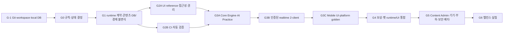

# Spot & Learn Battle 사양 정합성 및 MVP 구현 준비 Implementation Plan

> **For agentic workers:** REQUIRED SUB-SKILL: Use superpowers:subagent-driven-development (recommended) or superpowers:executing-plans to implement this plan task-by-task. Steps use checkbox (`- [ ]`) syntax for tracking.

**Goal:** 현재의 기획 패키지를 결정론적 게임 규칙, 비노출 콘텐츠 경계, 검증 가능한 데이터·이벤트 계약, 재현 가능한 개발 환경을 갖춘 구현 착수 가능 상태로 만든다.

**Architecture:** 매치 판정 규칙은 버전이 붙은 단일 `ruleset`에서 관리하고, 서버의 매치별 single-writer reducer가 PLAYER·SYSTEM·timer command를 하나의 총순서로 처리한다. 결정론은 동일한 초기 snapshot, engine/ruleset/content version, 랜덤 schedule, ordered command log를 묶은 replay bundle에 대해서만 보장한다. 클라이언트에는 공개 콘텐츠와 revision이 붙은 snapshot/event만 전달하며, canonical answer·alias·`correctOptionId`·미발견 hitbox는 비공개 저장소에 둔다. PostgreSQL 트랜잭션과 원장이 경기 결과·보상·펫 경제의 최종 기준이 된다.

**Tech Stack:** Node.js 24 LTS, pnpm 11, TypeScript strict, Expo SDK 57/React Native 0.86, NestJS, Socket.IO 4, PostgreSQL/Supabase, Redis, BullMQ(G3 durable adapter candidate), Vitest, Ajv Draft 2020-12, pgTAP, PostHog, Sentry.

**검증 갱신:** 2026-07-16 — `2026-07-16-spec-and-codebase-review-feedback.md`의 주장을 원 사양, 현재 파일, 승인된 UI/UX 레퍼런스, 공식 기술 문서와 교차검증했다. 피드백 문서는 규범 원본이 아니며 아래 계획에는 검증된 결론과 필요한 한정만 반영한다.

## Global Constraints

- 서버만 점수, 정답, 시간, phase, 승패, 보상 결과를 변경한다.
- 목표 점수는 `score >= 100`, 정규 gameplay 입력 구간은 `[0ms, 75_000ms)`, 파이널 러시는 `[60_000ms, 75_000ms)`로 정의한다. 75초 전에 열린 뜻 퀴즈 응답만 해당 quiz deadline과 80초 cap까지 settlement input으로 예외 허용한다.
- 모든 외부 state-changing PLAYER command는 `requestId`로 멱등 처리한다. 내부 SYSTEM/timer command는 각각 고유 `systemCommandId`/`timerId`를 사용한다. 서버 ingress의 `commandSeq`와 외부 event stream의 `eventSeq`는 각각 매치별 단조 증가하며 서로 재사용하지 않는다.
- 공개 응답과 모바일 번들에는 canonical answer, alias, 정답 식별자인 `correctOptionId`, 미발견 hitbox, service/secret key가 포함되지 않는다. 뜻 퀴즈의 오답 포함 options는 퀴즈가 시작된 뒤 safe projection으로만 전달한다.
- Data API에 노출한 table은 RLS와 명시적 role grant를 함께 가진다. view는 `security_invoker = true`로 보호된 기반 table의 RLS를 따르고 필요한 SELECT grant만 가지며, function은 최소 EXECUTE grant만 가진다. `private` schema는 exposed schemas에서 제외하고 `PUBLIC`, `anon`, `authenticated`, `service_role`의 schema/object/default privilege를 revoke한다.
- 재현성 주장은 같은 replay bundle의 domain state/event에만 적용한다. 프로세스 장애 복구, DB side effect, 외부 발행은 durable journal, transaction, ledger, outbox가 별도로 보장한다.
- TypeScript는 `strict: true`; 스키마·계약·DB 변경은 실패 테스트를 먼저 추가한다.
- 프로덕션 코드는 유효한 lockfile과 고정된 Node/package-manager 버전 없이 병합하지 않는다.
- 게시된 콘텐츠 revision과 ruleset version은 수정하지 않고 새 revision/version을 만든다.
- 현금 결제와 전투 능력 펫은 이 계획 범위 밖이며, 펫은 코스메틱 원칙을 유지한다.
- 매치 ruleset, economy config, UI theme, 인프라 SLO는 서로 다른 versioned SSOT다. 피드백의 축약 ruleset 예시처럼 모든 숫자를 한 JSON에 합치지 않는다.
- 50판 smoke, 10,000판 bot simulation, 실제 사용자 A/B는 서로 다른 증거다. simulation은 규칙 회귀·민감도에만 사용하고 사용자 지표의 표본 수는 primary metric과 MDE로 별도 산정한다.
- 콘셉트 이미지는 수동 rubric의 입력이며 자동 golden이 아니다. 사람이 승인한 플랫폼 구현 screenshot만 보정 후 회귀 golden으로 승격한다.
- 이 계획은 G-1~G2 기반 계약과 reference proof 범위다. 이후 기능에서 재사용할 migration·validator·reducer를 만들 수 있지만, 완성된 모바일 UI, 실시간 1:1, 보상 화면, 운영 도구, load test는 게이트 통과 후 별도 vertical-slice 계획으로 나눈다.
- 직접 실행하는 `Run` 명령은 현재 Windows PowerShell 5.1 호환을 위해 표시 순서대로 한 줄씩 실행한다. 예상하지 않은 `$LASTEXITCODE != 0`이면 중단하고, `Expected: FAIL` 단계는 명시한 오류를 assertion한 뒤에만 다음 단계로 진행한다. `package.json` script 내부와 Ubuntu CI의 `&&`는 해당 shell이 지원하므로 그대로 둔다.

---

## 1. 조사 범위와 현재 판정

### 조사 범위

- `README.md`를 가장 먼저 읽고, 문서에 지정된 01~13번 순서대로 전 파일을 확인했다.
- 추가로 `.env.example`, `schemas/game-content.schema.json`, `sql/001_initial_schema.sql`, 검토 피드백, 승인된 고충실도 UI/UX 명세와 원본 이미지 4개를 대조했다.
- 2026-07-16 검증 시 전체 파일은 24개다: Markdown 17개, PNG 4개, SQL 1개, JSON Schema 1개, 환경변수 예시 1개.
- UI 원본 4개의 실제 SHA-256은 UI/UX 명세의 `HOME_DEFAULT`, `MATCH_WORD_HUNT`, `MATCH_MEANING_SUCCESS`, `PET_COLLECTION` 값과 모두 일치한다.
- 현재 폴더는 Git 저장소가 아니며 `package.json`, lockfile, 앱 코드, 테스트 설정, CI, `.gitignore`가 없다.
- JSON은 문법상 유효하지만, 현 Schema는 required 필드 9개 중 `images`, `finalAnswer`, `meaningQuestion`의 property schema가 없고 배열 item도 정의하지 않는다.
- 데이터베이스 문서는 9개 테이블을 약속하지만 SQL은 7개만 만든다. `gacha_history`, `fusion_history`가 없다.
- SQL 전체에 RLS 활성화, policy, `GRANT`/`REVOKE`, idempotency key 저장소가 없다.

### 판정

**현재 상태: Step 0 이전 / 외부 베타 No-Go.**

아이디어와 핵심 루프는 선명하지만, 지금 구현을 시작하면 서로 다른 에이전트나 개발자가 승패·재접속·콘텐츠·보상 규칙을 다르게 해석할 가능성이 높다. 특히 정답 노출과 RLS 부재는 기능 완성도 문제가 아니라 서버 권위 자체를 무력화할 수 있는 출시 차단 위험이다.

### 잘 잡힌 기반

- 관찰 → 돌발 미션 → 단어·뜻 → 파이널 러시라는 75초 감정 곡선이 명확하다.
- 클라이언트가 점수를 직접 증가시키지 않는 서버 권위 원칙이 문서 전반에 일관된다.
- 정규화 좌표, 이미지 preload, 양쪽 load ack는 모바일 공정성의 좋은 출발점이다.
- 동시 클릭, 재접속, 75초 경계, 오답 연타, 보상 중복을 필수 테스트로 이미 인식했다.
- 자동 게시 금지와 사람의 hitbox 수정은 콘텐츠 품질에 맞는 방향이다.
- 펫을 코스메틱 중심으로 제한하고 MVP에서 현금 결제를 제외한 점은 경쟁 공정성에 유리하다.

## 2. 핵심 수치 검산

| 항목 | 계산 | 결과/의미 |
|---|---:|---|
| 기본 차이점 풀 | `7×6 + 3×9` | 69점 |
| 돌발 단어 풀 | `10 + 10 + 15` | 35점 |
| 최종 패키지 | `25 + 15 + 10` | 50점 |
| 59,999ms까지 이론 점수 풀 | `69 + 10 + 10 + 50` | 139점 |
| 60,000ms 스페셜 돌발까지 포함한 경계 점수 풀 | `139 + 15` | 154점 |
| 모든 차이를 파이널 러시에서 얻는 최대 | `138 + 35 + 50` | 223점 |
| 최종 패키지 비중 | `50 / 69` | 기본 차이점 풀의 72.5% |
| 최종 패키지와 함께 100점에 필요한 최소 차이 | `4×6 + 3×9 + 50` | 7개로 101점 |
| 공개 hitbox를 초당 8회로 모두 탭하는 이론 시간 | `10 / 8` | 1.25초 |
| pity·잔여·대표/잠금 보호를 모두 끈 분석 상한에서 합성까지 포함한 전설 재료 환산 | `0.02 + 0.18/5 + 0.8/25` | 뽑기당 0.088, 약 11.4회당 1개; runtime 기대값이 아님 |

마지막 계산은 pity를 적용하지 않고 “같은 등급 아무 카드 5장”으로 합성 가능하다는 현재 문구를 그대로 적용한 이상적 장기값이다. 실제 50/150 pity 시나리오의 장기율과 동일하지 않으며, 제품 목표 없이 이 값만으로 경제가 비정상이라고 단정하지 않는다.

## 3. 문제·개선 레지스터

`P0`는 외부 테스트 전 반드시 해결, `P1`은 기능 구현 전 해결, `P2`는 베타 전 해결, `P3`는 유지보수 개선을 뜻한다.

| ID | 우선순위 | 근거 | 문제와 영향 | 완료 게이트 |
|---|---|---|---|---|
| SEC-01 | P0 | `08_DATABASE_SCHEMA.md:8`, `sql/001_initial_schema.sql:35-46` | 공개 읽기로 의도된 한 행에 `final_answer`, aliases, opaque `meaning_question`/`content_json`, DRAFT가 함께 있다. 해당 JSON에 해답·hitbox가 저장되고 그 열까지 SELECT가 허용되면 함께 노출된다. | G2에서 공개 catalog/private solution 분리, role/column·projection·Zod negative fixture 통과; 실제 PostgREST/Socket wire 비노출 E2E는 외부 client 전 G3 gate |
| SEC-02 | P0 | `08_DATABASE_SCHEMA.md:6-10`, `sql/001_initial_schema.sql:1-78` | raw SQL에 RLS/policy와 명시적 grant/revoke가 전혀 없다. 프로젝트 default grant 설정에 따라 전면 노출 또는 42501 전면 차단이 달라져 의도한 접근 계약을 재현할 수 없다. | exposed schema 설정, default privilege, table/view/function 역할 행렬과 anon/auth/service 실제 테스트 통과 |
| MATCH-01 | P0 | `02_CORE_RULES_AND_BALANCE.md:4-12,41-46`, `03_GAME_FLOW_AND_STATE_MACHINE.md:9-12` | 60초, 75초, 동시 claim, 양쪽 100점의 처리 순서가 없어 같은 입력이 다른 승자를 만들 수 있다. | `commandSeq`/`eventSeq`, timer 우선순위, initial snapshot/random schedule을 경계 전이표와 fake-clock/property test로 고정 |
| MATCH-02 | P0 | `README.md:9`, `02_CORE_RULES_AND_BALANCE.md:34-37` | +25로 100점이 되면 5초 뜻 퀴즈와 +15/+10 전에 종료되어 핵심 학습 단계가 사라진다. | 최종 도전을 원자적 패키지로 정의하고 75점 시작 사례 자동 테스트 통과 |
| ECON-01 | P0 | `08_DATABASE_SCHEMA.md:10`, `sql/001_initial_schema.sql:61-78` | `reward_claimed` boolean은 원자적 conditional UPDATE에 쓸 수 있지만, 현재 SQL에는 재화 변경과의 단일 transaction, business unique key, request hash/response replay, 원장·outbox가 없어 effect-once 지급을 보장하지 않는다. | 동일 key 20회 동시 요청에 ledger/보상 각 1건, 동일 응답 replay, 다른 payload hash 거절 |
| RULE-01 | P1 | `README.md:9`, `02_CORE_RULES_AND_BALANCE.md:4-6` | “100점 즉시 승리”와 “최소 15초 보장”이 충돌한다. 15초 전 이론상 119점이 가능하다. | README를 기준으로 최소 15초 문구 삭제, `score >= 100` 테스트 고정 |
| RULE-02 | P1 | `02_CORE_RULES_AND_BALANCE.md:14-31`, `04_UX_SCREEN_SPEC.md:19-23` | 차이점/돌발 미션이 공유 선점인지 개인별인지, 이미 선점된 영역 재탭 처리도 없다. | 공유 `UNCLAIMED → CLAIMED_BY_PLAYER` 모델과 거절 사유 명시 |
| RULE-03 | P1 | `02_CORE_RULES_AND_BALANCE.md:25,41-46` | 버프의 수치·기간·중첩·계산 순서가 없어 점수를 계산할 수 없다. | MVP v1 버프를 글자 공개로 축소하고 opponent lock/추가 점수 버프는 후속 범위로 이동 |
| RULE-04 | P1 | `02_CORE_RULES_AND_BALANCE.md:27-39` | 최종 단어 재시도, alias 정규화, 뜻 오답/timeout, 중복 제출, 점수 하한이 없다. | 최대 시도·NFKC 정책·1회성·`max(0, score-delta)`를 규범화 |
| STATE-01 | P1 | `02_CORE_RULES_AND_BALANCE.md:8-12`, `03_GAME_FLOW_AND_STATE_MACHINE.md:5-13`, `sql/001_initial_schema.sql:3` | 규칙에는 SUDDEN_DEATH가 있지만 상태 머신/DB/Socket에는 없다. 반대로 DB의 CANCELLED는 흐름에 없다. | phase enum과 전이를 한 계약으로 통합하고 불법 전이를 DB와 코드가 거부 |
| STATE-02 | P1 | `03_GAME_FLOW_AND_STATE_MACHINE.md:15-20` | ACTIVE/ANSWER_LOCKED/TAP_LOCKED/MEANING_QUIZ가 단일 상태인지 병렬 상태인지 불명확하다. | phase, boardInput, answerInput, overlay를 직교 상태로 분리하고 조작 행렬 작성 |
| NET-01 | P1 | `09_API_AND_SOCKET_EVENTS.md:12-29` | 이벤트 이름만 있고 payload, 인증, ack, error, version, request/event ID, revision이 없다. | 공유 runtime schema와 contract test 통과 |
| NET-02 | P1 | `07_REALTIME_SERVER_SPEC.md:16-19` | 5~15초 disconnect 구간, snapshot 필드, event gap/replay, adapter 선택이 없다. | `<15초` 복구/`>=15초` 기권, full snapshot fallback, 4.9/5.1/14.9/15.0초 테스트 통과 |
| CONTENT-01 | P1 | `schemas/game-content.schema.json:5-45` | required 이름만 있고 내부 타입·items·좌표·추가 필드 제한이 없다. 잘못된 콘텐츠도 유효해질 수 있다. | valid fixture 3개 승인, 모든 negative fixture가 정확한 JSON path에서 거절 |
| CONTENT-02 | P1 | `sql/001_initial_schema.sql:35-58` | mutable row와 중복 열/JSON 때문에 게시 후 변경, 과거 경기 재현 실패, 데이터 drift가 가능하다. | immutable revision/hash/ruleset pin과 게시 버전 UPDATE 거부 테스트 통과 |
| DATA-01 | P1 | `sql/001_initial_schema.sql:50-78` | winner가 참가자인지, 2인 상한, 상태 전이, 수치 범위, 대표 펫 1개를 DB가 보장하지 않는다. | CHECK/unique/trigger/RPC 및 불변식 테스트 통과 |
| DATA-02 | P1 | `sql/001_initial_schema.sql:5-78` | 경기 이력이 profile을 참조해 계정 삭제가 막힐 수 있고 익명화/보존 정책이 없다. | 계정 삭제 후 이력의 비식별화와 개인 데이터 제거 테스트 통과 |
| ECON-02 | P1 | `05_PET_COLLECTION_SYSTEM.md:14-35` | 포인트 획득량, EXP 귀속/곡선, pity reset 일부가 없지만 대표 펫·잠금 펫 재료 금지는 명시돼 있다. 보호를 무시한 이상적 장기 전설 재료 환산은 0.088/draw 상한일 뿐, 이것만으로 희소성이 비정상이라고 단정할 제품 목표는 없다. | 50/150 pity와 대표/잠금 제외를 baseline으로 고정하고, 분석 상한·후보 variant를 장기 stream·독립 사용자 cohort로 분리 시뮬레이션한 뒤 제품 승인 |
| UX-01 | P1 | `04_UX_SCREEN_SPEC.md:20-26` | 색만으로 소유를 표시하고 줌/팬/탭/키보드/오버레이가 경쟁하며 연결·잠금 피드백이 없다. | 44pt/48dp, 색 외 표식, reduced motion, 글자 확대, gesture conflict 인수 기준 통과 |
| UX-02 | P1 | `docs/superpowers/specs/2026-07-16-high-fidelity-ui-ux-reference-design.md:24,256-318` | 기존 Task 8에는 승인된 원본 hash, UI theme, 수동 fidelity rubric, provenance gate가 없으며 콘셉트와 구현 golden의 경계도 없다. | Task 8A manifest/theme/schema/hash 검사와 수동 rubric 승인; 실제 플랫폼 golden은 후속 Mobile UI 계획에서 보정 후 생성 |
| CONTENT-03 | P1 | `10_CONTENT_AND_IMAGE_PIPELINE.md:5,15-28` | 자산 출처·모델/약관 버전·prompt hash·권리 승인·교육 검수·삭제 절차가 없다. | rights/provenance manifest 승인 없이는 게시 불가 |
| CONTENT-04 | P1 | `03_GAME_FLOW_AND_STATE_MACHINE.md:23-26`, `10_CONTENT_AND_IMAGE_PIPELINE.md:21-27`, `13_CODING_AGENT_PROMPTS.md:61` | 자동화는 bounding box, 예시/운영 도구는 원형 hitbox이며 A/B 이미지 위치 차이를 표현하지 않는다. | MVP는 A/B 각각의 circle hitbox로 통일하고 geometry validator 통과 |
| QA-01 | P1 | `11_TEST_AND_BALANCE_PLAN.md:3-21`, `12_IMPLEMENTATION_ROADMAP.md:27-28` | 테스트에 입력·expected·반복·oracle가 없고 50판은 정밀 밸런스 추정에 부족하다. 10,000판도 bot model의 결과일 뿐 사용자 행동의 오라클은 아니다. | 50판 smoke, 규칙 property, contract, DB/RLS, 후속 2-client/load, bot simulation, powered user A/B를 분리 |
| ROADMAP-01 | P1 | `12_IMPLEMENTATION_ROADMAP.md:3-28`, `13_CODING_AGENT_PROMPTS.md:3-70` | client-first 구현 후 서버 권위로 재작성하며 auth/RLS·validator·telemetry가 늦다. | 계약/CI → 엔진 → auth/RLS → server vertical slice → mobile 순으로 재배치 |
| REPO-01 | P1 | 전체 파일 목록 | Git, manifest, lockfile, CI, `.gitignore`, 로컬 DB/Redis가 없어 fresh checkout이 재현되지 않는다. | 빈 checkout에서 `pnpm install --frozen-lockfile`, 이어서 `pnpm check`가 각각 성공 |
| OBS-01 | P2 | `README.md:35-36`, `sql/001_initial_schema.sql:71-78` | analytics provider가 미정이고 event taxonomy, trace, SLO, redaction이 없다. | PostHog+Sentry 역할 분리, metric dictionary, trace/redaction 테스트 |
| ENV-01 | P2 | `.env.example:1-8` | 모바일 공개 값과 service/DB/Redis secret이 한 파일에 섞여 있다. | 앱별 env schema와 secret scan, production localhost 차단 |
| DOC-01 | P3 | `README.md:38-51` | 문서 owner/status/normative source/ADR/changelog가 없어 규칙 복제가 drift를 만든다. | 요구사항 traceability의 누락·고아 0건, 문서 검사 통과 |

## 4. 권장 규칙 기준선

이 계획을 실행할 때 아래 값을 G0의 제안 기준선으로 사용한다. 제품 책임자가 다른 값을 선택하면 `rulesetVersion`을 올리고 같은 테스트 표를 갱신한다.

1. **승리:** 점수는 0 미만으로 내려가지 않으며 `score >= 100`이 된 첫 원자적 점수 이벤트가 승리한다. “최소 15초”는 삭제한다.
2. **시간:** 일반 구간 `[0, 60_000)`, 파이널 러시 `[60_000, 75_000)`. 75초에는 board, 새 final answer, hint 같은 신규 gameplay 입력을 닫지만 75초 전에 시작된 뜻 퀴즈의 `SUBMIT_MEANING`은 `min(quizStartedAt + 5_000, 80_000)`까지 settlement 입력으로 허용한다.
3. **최종 도전:** 원 사양대로 `차이점 1개 발견 OR 돌발 단어 1개 성공 OR elapsed >= 12초` 중 먼저 발생한 조건에서 활성화한다. `12초 AND 단서`로 바꾸려면 별도 제품 승인과 ruleset version 상승이 필요하다. 최종 단어 오답은 경기당 최대 3회, 정답 후 중복 제출은 거절한다.
4. **최종 패키지:** 단어 정답만으로 점수를 즉시 주지 않는다. 5초 뜻 선택 완료/timeout 때 +25 또는 +50을 하나의 원자적 score event로 적용한다. 75초 전에 시작한 뜻 퀴즈만 최대 80초까지 settlement grace를 가진다.
5. **공유 자원:** 차이점과 돌발 오브젝트는 경기 전체의 공유 선점 자원이다. 이미 선점된 영역 재탭은 무벌점 `ALREADY_CLAIMED`다.
6. **동시성:** ingress가 PLAYER/SYSTEM/timer command 모두에 매치별 `commandSeq`를 부여하고 reducer가 내보낸 각 event에는 별도의 `eventSeq`를 부여한다. 시각 `t`에 새 PLAYER 또는 SYSTEM command를 처리하기 전에 `dueAtMs <= t`인 timer를 먼저 enqueue한다. 같은 objective는 첫 accepted command 하나만 소유한다.
7. **동점:** 75초와 settlement 후 점수 → 최종 패키지 성공 → 어려운 차이 수 → 규정된 오답 수 순으로 비교한다. 여전히 같으면 10초 중립 목표 sudden death, 무응답이면 `DRAW`다.
8. **재접속:** PvP 시계는 계속 흐른다. disconnect `<15초`는 snapshot 복구, `>=15초`는 해당 플레이어 기권이다. 양쪽 동시 단절이나 서버 장애는 `NO_CONTEST`이며 양쪽 패배로 기록하지 않는다.
9. **MVP 버프:** 돌발 성공은 점수와 hint credit 1개만 제공한다. `USE_HINT`는 credit 1개를 소비해 match seed에서 고정한 순서의 미공개 최종 글자 1개를 공개한다. “다음 차이 보너스”와 “상대 힌트 잠금”은 v1에서 제외한다.
10. **MVP hitbox:** `circle`만 지원하며 각 difference는 `imageA`, `imageB` hitbox를 따로 가진다. rectangle/polygon은 schema version 2 후보로 남긴다.
11. **분석 도구:** PostHog는 행동·실험, Sentry는 crash/error에 사용한다. 정답 원문·JWT·secret·불필요한 PII는 어느 쪽에도 전송하지 않는다.
12. **UI 기준:** 네 콘셉트 원본은 hash가 고정된 수동 rubric 입력이다. SSIM 0.97/픽셀 차이 기준은 실제 구현을 사람이 승인하고 동일 runner의 반복 capture noise와 known mutation으로 보정한 뒤에만 후보 gate로 사용한다.
13. **시뮬레이션:** 50판은 PR smoke, 10,000판은 versioned bot archetype별 nightly 규칙 민감도, 100,000 draw/user cohort는 경제 모델 검증에 사용한다. 실제 만족도·학습·공정성은 telemetry와 사전 표본 산정 A/B로 판단한다.

## 5. 목표 파일 구조

아래 트리는 책임 경계를 보여 주는 핵심 경로의 비포괄 요약이다. 각 Task의 `Files` 목록이 생성·수정 파일의 권위 있는 전체 목록이다.

```text
spot_learn_battle/
  apps/
    mobile/
      .env.example
    server/
      .env.example
    admin/
      .env.example
  packages/
    contracts/
      package.json
      tsconfig.json
      src/
        rules.ts
        match.ts
        socket.ts
        socket.schema.ts
        idempotency.ts
        delivery-policy.ts
        content.ts
        economy.ts
        index.ts
    game-engine/
      package.json
      tsconfig.json
      src/
        reducer.ts
        replay.ts
    content-validator/
      package.json
      tsconfig.json
      src/
        validate-content.ts
    config/
      package.json
      tsconfig.json
      src/
        env.ts
        env.test.ts
  config/
    ruleset.v1.json
    economy.v1.json
    ui-theme.v1.json
  content/fixtures/
    valid/
    invalid/
  docs/
    decisions/
    design/ui-reference/
      README.md
      manifest.json
      raw/
    operations/
    requirements-traceability.md
    superpowers/plans/
  schemas/
    ruleset.schema.json
    economy.schema.json
    game-content.public.schema.json
    game-content.private.schema.json
    rights-manifest.schema.json
    ui-theme.schema.json
    ui-reference-manifest.schema.json
    analytics-event.schema.json
  supabase/
    config.toml
    migrations/
    tests/database/
  tests/
    specs/
    contracts/
    simulation/
  .github/workflows/ci.yml
  .gitignore
  .nvmrc
  .secretlintrc.json
  .secretlintignore
  package.json
  pnpm-lock.yaml
  pnpm-workspace.yaml
  tsconfig.base.json
```

책임 경계는 다음과 같다.

- `config/ruleset.v1.json`: 점수·시간·경계값의 단일 규범 원본.
- `config/economy.v1.json`: simulation/ADR용 mutable `DRAFT` working candidate이며 production 입력이 아니다.
- `config/economy/economy.v<semver>.json`: 승인 뒤 생성하고 절대 덮어쓰지 않는 production draw/fusion/pity/EXP SSOT. loader는 explicit versioned path와 canonical hash를 pin하고 `DRAFT`를 거절한다.
- `config/ui-theme.v1.json`: 승인된 색·타입·간격·표면 토큰의 단일 원본.
- `packages/contracts`: 모바일·서버·테스트가 함께 쓰는 타입과 runtime schema.
- `packages/game-engine`: I/O 없이 command와 timer를 state/event로 바꾸는 결정론 reducer.
- `schemas/game-content.public.schema.json`: 클라이언트에 노출 가능한 게시 metadata와 asset manifest.
- `schemas/game-content.private.schema.json`: 서버 전용 정답·alias·A/B hitbox·뜻 정답.
- `supabase/migrations`: 불변 content revision, RLS, 원장, 경제 트랜잭션.
- `content/fixtures`: validator와 게임 테스트가 공유하는 고정 콘텐츠.
- `docs/design/ui-reference`: 콘셉트 원본의 hash/provenance, 포함·제외 범위와 수동 rubric. 구현 golden은 저장하지 않는다.
- 기존 01~13 문서: 단일 원본을 재서술하지 않고 ruleset/contract/ADR을 설명하고 링크한다.

## 6. 게이트와 예상 순서



| 게이트 | 예상 | 종료 조건 |
|---|---:|---|
| G-1 | 2~3 개발일 | Git/workspace/lockfile/local Supabase와 env validator, 빠른 `pnpm check` 재현 |
| G0 | 7~10 개발일 | 규칙 결정표, concrete state/reducer/replay/scheduler 계약, score·timer 경계 테스트 승인 |
| G1 | 12~18 개발일 | Socket/OpenAPI runtime schema, content/DB/economy 계약, RLS/grant, idempotency fixture 승인 |
| G2 | 5~8 개발일 | full `pnpm verify`, UI reference/hash/rubric, 권리·문서 traceability 승인 |
| 합계 | 26~39 개발일 + 제품/보안 리뷰 | 후속 vertical slice가 규칙·보안·UI 원본을 재해석하지 않아도 되는 상태 |

이 추정은 G-1~G2 기반 계약만 대상으로 하며 전체 제품 완료 일정이 아니다. 기존 `12_IMPLEMENTATION_ROADMAP.md`의 1인 6~10주/2인 4~7주 end-to-end 수치는 보안·운영·플랫폼 gate를 반영하지 않은 추정이므로 Task 10에서 명시적으로 폐기한다. G3A~G5의 일정은 아래 다섯 후속 계획이 각자 dependency, 인력, 외부 승인, 위험을 산정한 뒤에만 다시 합산한다.

## 7. 실행 작업

### Task 1: 저장소 안전장치와 재현 가능한 부트스트랩

**Files:**
- Create: `.gitignore`
- Create: `.nvmrc`
- Create: `.npmrc`
- Create: `package.json`
- Create: `pnpm-lock.yaml`
- Create: `pnpm-workspace.yaml`
- Create: `tsconfig.base.json`
- Create: `eslint.config.mjs`
- Create: `vitest.config.ts`
- Create: `tools/check-runtime.mjs`
- Create: `.secretlintrc.json`
- Create: `.secretlintignore`
- Create: `packages/contracts/package.json`
- Create: `packages/contracts/tsconfig.json`
- Create: `packages/contracts/src/index.ts`
- Create: `packages/config/package.json`
- Create: `packages/config/tsconfig.json`
- Create: `packages/config/src/env.ts`
- Create: `packages/config/src/env.test.ts`
- Create: `supabase/config.toml`
- Create: `supabase/tests/smoke.test.sql`
- Create: `.github/workflows/ci.yml`
- Create: `docs/operations/repository-rules.md`
- Create: `apps/mobile/.env.example`
- Create: `apps/server/.env.example`
- Create: `apps/admin/.env.example`
- Delete after split: `.env.example`
- Modify: `README.md`
- Baseline-track: 현재 `README.md`, `01_...`~`13_...`, `schemas/game-content.schema.json`, `sql/001_initial_schema.sql`, 두 plan·한 spec을 포함한 `docs/superpowers/**`, root PNG 4개 전부

**Interfaces:**
- Consumes: 현재 24개 문서/스키마/레퍼런스 파일.
- Produces: Node 24.18.0, pnpm 11.13.0, 빠른 `pnpm check`, Docker 기반 `pnpm check:db`, 통합 `pnpm verify`, tested 앱별 환경변수 allow-list/production URL 경계.

- [ ] **Step 1: 현재 실패 기준을 기록한다**

Run: `git rev-parse --show-toplevel`

Expected: FAIL with `not a git repository`.

Run: `corepack enable`

Expected: PASS and the pnpm shim becomes available for the remaining local commands.

Run: `pnpm check`

Expected: FAIL because `package.json` does not exist.

- [ ] **Step 2: source control과 secret 보호를 먼저 만든다**

Run: `git init -b main`

Create `.gitignore` with:

```gitignore
node_modules/
.pnpm-store/
.expo/
.next/
dist/
coverage/
artifacts/
*.log
.env
.env.*
!.env.example
apps/*/.env
apps/*/.env.*
!apps/*/.env.example
supabase/.branches/
supabase/.temp/
```

Create `.nvmrc` with `24.18.0`.

Create `.npmrc` with `engine-strict=true`. `tools/check-runtime.mjs`는 `process.version === 'v24.18.0'`과 install 시 `npm_config_user_agent`의 `pnpm/11.13.0`을 exact 검사하고, mismatch면 현재/expected version만 출력한 뒤 non-zero로 종료한다. 이는 `Intl.Segmenter`/ICU가 달라질 수 있는 다른 24.x를 local install에서도 허용하지 않기 위한 실행 gate다.

- [ ] **Step 3: workspace와 공통 TypeScript 계약을 만든다**

Create `pnpm-workspace.yaml`:

```yaml
packages:
  - apps/*
  - packages/*
```

Create `package.json` with these required fields and scripts. 콘텐츠와 문서 검사는 해당 구현 Task에서 `check`에 추가한다.

```json
{
  "name": "spot-learn-battle",
  "private": true,
  "packageManager": "pnpm@11.13.0",
  "engines": { "node": "24.18.0", "pnpm": "11.13.0" },
  "scripts": {
    "preinstall": "node tools/check-runtime.mjs",
    "check:runtime": "node tools/check-runtime.mjs",
    "check": "pnpm check:runtime && pnpm lint && pnpm typecheck && pnpm test && pnpm secret:scan",
    "check:db": "pnpm exec supabase db reset --local && pnpm exec supabase db lint --local --fail-on error && pnpm exec supabase test db --local",
    "verify": "pnpm check && pnpm check:db",
    "db:start": "pnpm exec supabase start",
    "lint": "eslint .",
    "typecheck": "tsc -p tsconfig.base.json --noEmit",
    "test": "vitest run",
    "secret:scan": "secretlint \"**/*\""
  }
}
```

Create `tsconfig.base.json` with `target: "ES2023"`, `module: "ESNext"`, `moduleResolution: "Bundler"`, `moduleDetection: "force"`, `strict`, `noUncheckedIndexedAccess`, `exactOptionalPropertyTypes`, `noImplicitOverride`, and `useUnknownInCatchVariables` enabled. 이 조합은 초기 typecheck에서 Bundler resolution의 module 전제도 만족한다.

Dependency 설치 전에 `packages/contracts/package.json`(`name: "@spot-learn/contracts"`, `private: true`, `type: "module"`, source export), extending tsconfig, `src/index.ts`의 `export {};`를 먼저 만든다. 같은 시점에 `packages/config/package.json`(`name: "@spot-learn/config"`, `private: true`, `type: "module"`, source export), extending tsconfig, `env.ts`, `env.test.ts`도 만든다. 이렇게 해야 최초 lockfile에 두 workspace importer가 모두 기록된다.

Run:

```bash
corepack pnpm add -Dw typescript @types/node eslint @eslint/js typescript-eslint globals vitest tsx ajv ajv-formats smol-toml supabase secretlint @secretlint/secretlint-rule-preset-recommend
```

Expected: dev tool versions are pinned and the initial `pnpm-lock.yaml` is created.

Create `eslint.config.mjs` for TypeScript files and `vitest.config.ts` with Node test environment; fast default tests explicitly exclude `tests/database/**`. `tsconfig.base.json` must additionally enable `resolveJsonModule`, `types: ["node"]`, an ES2023 lib, and include `packages/**/*.ts`, `tests/**/*.ts`, `tools/**/*.mts`.

Create `.secretlintrc.json`:

```json
{
  "rules": [{ "id": "@secretlint/secretlint-rule-preset-recommend" }]
}
```

Create `.secretlintignore` with `node_modules/`, `.pnpm-store/`, `pnpm-lock.yaml`, `coverage/`, `dist/`, `content/fixtures/assets/`, `docs/design/ui-reference/raw/`, and the four current root PNG filenames. The committed `.env.example` files may contain variable names and empty values only.

Run `pnpm exec supabase init` once and commit the generated `supabase/config.toml`. Set `project_id = "spot-learn-battle"`; do not link a remote project or write credentials.

Create `supabase/tests/smoke.test.sql`:

```sql
begin;
select plan(1);
select pass('local database is reachable');
select * from finish();
rollback;
```

- [ ] **Step 4: 환경변수를 런타임별로 분리한다**

`apps/mobile/.env.example`에는 `EXPO_PUBLIC_API_ORIGIN`, `EXPO_PUBLIC_SUPABASE_URL`, `EXPO_PUBLIC_SUPABASE_PUBLISHABLE_KEY`, `EXPO_PUBLIC_POSTHOG_KEY`, `EXPO_PUBLIC_SENTRY_DSN`만 둔다.

`apps/server/.env.example`에는 `PORT`, `SUPABASE_URL`, `SUPABASE_SECRET_KEY`, `DATABASE_URL`, `REDIS_URL`, `SENTRY_DSN`을 둔다.

`apps/admin/.env.example`에는 `NEXT_PUBLIC_SUPABASE_URL`, `NEXT_PUBLIC_SUPABASE_PUBLISHABLE_KEY`, 서버 전용 `SUPABASE_SECRET_KEY`를 분리하고 client component에서 secret을 import하지 않는 규칙을 주석으로 적는다.

`packages/config/src/env.ts`는 exact allow-list와 required non-empty 값을 가진 `parseMobileEnv`, `parseServerEnv`, `parseAdminServerEnv`, `projectAdminPublicEnv`를 export한다. mobile/admin public projection에 `SUPABASE_SECRET_KEY`, `DATABASE_URL`, `REDIS_URL`이 있거나, production의 API/Supabase/DB/Redis origin이 `localhost`, `127.0.0.1`, `0.0.0.0`이면 거절한다. `env.test.ts`는 세 valid fixture, unknown key, mobile secret, empty required value, production localhost, admin public secret leak를 각각 검증한다.

- [ ] **Step 5: CI의 첫 gate를 만든다**

`.github/workflows/ci.yml`은 Ubuntu, Node `24.18.0`, pnpm `11.13.0`에서 두 required job을 실행한다.

- `check`: `corepack enable`, `pnpm install --frozen-lockfile`, `pnpm check`.
- `database`: 같은 install 뒤 `pnpm db:start`, `pnpm check:db`. 종료 정리는 `if: always()` 단계의 `pnpm exec supabase stop --no-backup`으로 수행한다.

PR에서는 실제 Supabase/Redis credential을 사용하지 않고 local ephemeral stack만 사용한다. GitHub repository ruleset에서 두 job을 required check로 지정하는 절차는 `docs/operations/repository-rules.md`에 기록하고, 저장소 생성 전에는 적용 여부를 주장하지 않는다.

- [ ] **Step 6: 빈 checkout 재현을 검증한다**

Run: `corepack pnpm install`

Expected: PASS using the existing lockfile with no lockfile change.

Run: `corepack pnpm install --frozen-lockfile`

Expected: PASS with no lockfile change.

Run: `pnpm check:runtime`

Expected: PASS only on exact Node 24.18.0 and pnpm 11.13.0; a fixture/subprocess with Node 24.17.x or a different pnpm user-agent exits non-zero before install/check.

Run: `pnpm check`

Expected: PASS; lint/typecheck와 environment boundary tests가 성공한다.

Run: `pnpm db:start`

Expected: PASS and local stack health checks succeed.

Run: `pnpm check:db`

Expected: PASS; local stack is healthy, empty migration baseline resets, DB lint exits non-zero on an error, and pgTAP reports no failing files.

Run: `pnpm exec supabase stop --no-backup`

Expected: PASS and no bootstrap stack remains running.

Run: `git status --short`

Expected: 현재 24개 artifact 중 앱별 예시로 교체할 root `.env.example`을 제외한 23개 retained artifact와 intentional bootstrap 파일만 표시되고, 실제 `.env`나 secret file은 표시되지 않는다. root PNG 4개는 Task 8A가 복제본의 identity를 검증하는 provenance source이므로 이 단계에서 추적한다.

- [ ] **Step 7: 커밋한다**

```bash
git add -A
git status --short
git diff --cached --check
pnpm secret:scan
git commit -m "chore: bootstrap reproducible workspace"
```

커밋 직전 staged 목록을 23개 retained artifact와 Task 1 생성 목록에 대조한다. 예상 밖 파일이 있으면 커밋하지 말고 원인을 해결한다. `git add -A`는 새 저장소의 기존 문서·SQL·schema·feedback/spec/plan·root PNG를 빠뜨리지 않기 위해 의도적으로 사용한다. root `.env.example`은 최초 커밋 전에 앱별 예시로 교체되므로 Git deletion으로 나타나지 않는 것이 정상이다.

### Task 2: 단일 ruleset과 규칙 결정표 고정

**Files:**
- Create: `config/ruleset.v1.json`
- Create: `schemas/ruleset.schema.json`
- Create: `packages/contracts/src/rules.ts`
- Create: `packages/contracts/src/rules.schema.ts`
- Create: `packages/contracts/src/rules.schema.test.ts`
- Create: `packages/contracts/src/canonical-json.ts`
- Create: `packages/contracts/src/canonical-json.test.ts`
- Modify: `packages/contracts/src/index.ts`
- Create: `tests/specs/ruleset.test.ts`
- Create: `tests/fixtures/ruleset/invalid-extra-property.json`
- Create: `tests/fixtures/ruleset/invalid-time-order.json`
- Create: `tests/fixtures/ruleset/invalid-score-semantics.json`
- Create: `tests/fixtures/ruleset/invalid-schedule.json`
- Create: `tests/fixtures/ruleset/invalid-tie-break.json`
- Create: `docs/decisions/ADR-001-match-resolution.md`
- Modify: `packages/contracts/package.json`
- Modify: `pnpm-lock.yaml`
- Modify: `README.md`
- Modify: `01_GAME_DESIGN_OVERVIEW.md`
- Modify: `02_CORE_RULES_AND_BALANCE.md`
- Modify: `03_GAME_FLOW_AND_STATE_MACHINE.md`
- Modify: `11_TEST_AND_BALANCE_PLAN.md`

**Interfaces:**
- Consumes: README 점수표와 본 계획의 “권장 규칙 기준선”.
- Produces: `RulesetV1`, `rulesetVersion = "1.0.0"`, 시간·점수·tie-break의 단일 원본.

- [ ] **Step 1: 모순을 재현하는 실패 테스트를 작성한다**

`tests/specs/ruleset.test.ts`에 다음 사례를 명시한다.

```ts
import rules from '../../config/ruleset.v1.json';
import { describe, expect, it } from 'vitest';

describe('ruleset v1 invariants', () => {
  it('uses non-overlapping half-open time windows', () => {
    expect(rules.time.assetLoadMs).toBe(20_000);
    expect(rules.time.countdownMs).toBe(3_000);
    expect(rules.time.playingMs).toBe(75_000);
    expect(rules.time.finalRushStartsAtMs).toBe(60_000);
    expect(rules.time.wordHuntMs).toBe(5_000);
    expect(rules.time.wordHuntRevealMs).toBe(1_200);
    expect(rules.time.meaningSettlementCapMs).toBe(80_000);
  });

  it('keeps the documented score pools', () => {
    expect(7 * rules.score.normalDifference + 3 * rules.score.hardDifference).toBe(69);
    expect(rules.score.normalDifference * rules.score.finalRushDifferenceMultiplier).toBe(12);
    expect(rules.score.hardDifference * rules.score.finalRushDifferenceMultiplier).toBe(18);
    expect(rules.score.finalWord + rules.score.meaning + rules.score.combo).toBe(50);
  });

  it('defines one ordered tie-break chain', () => {
    expect(rules.tieBreak).toEqual([
      'SCORE',
      'FINAL_PACKAGE_CORRECT',
      'HARD_DIFFERENCES',
      'FEWER_FINAL_ANSWER_ERRORS',
      'SUDDEN_DEATH'
    ]);
  });

  it('keeps the documented OR unlock semantics', () => {
    expect(rules.finalChallenge.unlock).toEqual({
      atMs: 12_000,
      onDifferenceClaim: true,
      onWordHuntClaim: true
    });
  });

  it('uses earned credits for deterministic hint reveal', () => {
    expect(rules.hint).toEqual({
      creditsPerWordHuntWin: 1,
      charactersPerUse: 1,
      revealOrder: 'MATCH_RANDOM_SCHEDULE'
    });
  });
});
```

- [ ] **Step 2: 테스트가 기준 파일 부재로 실패하는지 확인한다**

Run: `pnpm vitest run tests/specs/ruleset.test.ts`

Expected: FAIL with module not found for `config/ruleset.v1.json`.

- [ ] **Step 3: 완전한 ruleset을 작성한다**

`config/ruleset.v1.json`에는 다음 값을 정확히 넣는다.

```json
{
  "rulesetVersion": "1.0.0",
  "targetScore": 100,
  "scoreFloor": 0,
  "time": {
    "assetLoadMs": 20000,
    "countdownMs": 3000,
    "playingMs": 75000,
    "finalRushStartsAtMs": 60000,
    "wordHuntMs": 5000,
    "wordHuntRevealMs": 1200,
    "meaningQuizMs": 5000,
    "meaningSettlementCapMs": 80000,
    "suddenDeathMs": 10000,
    "reconnectForfeitMs": 15000
  },
  "score": {
    "normalDifference": 6,
    "hardDifference": 9,
    "finalRushDifferenceMultiplier": 2,
    "normalWordHunt": 10,
    "specialWordHunt": 15,
    "finalWord": 25,
    "meaning": 15,
    "combo": 10,
    "wrongAnswer": -5,
    "finalRushWrongAnswer": -10
  },
  "lockMs": { "wrongAnswer": 2000, "finalRushWrongAnswer": 1500 },
  "wordHuntSchedule": [
    { "kind": "NORMAL", "spawnWindowMs": [16000, 22000] },
    { "kind": "NORMAL", "spawnWindowMs": [34000, 42000] },
    { "kind": "SPECIAL", "spawnAtMs": 60000 }
  ],
  "limits": { "maxBoardTapsPerSecond": 8 },
  "hint": {
    "creditsPerWordHuntWin": 1,
    "charactersPerUse": 1,
    "revealOrder": "MATCH_RANDOM_SCHEDULE"
  },
  "content": { "normalDifferences": 7, "hardDifferences": 3, "wordHunts": 3 },
  "finalChallenge": {
    "unlock": {
      "atMs": 12000,
      "onDifferenceClaim": true,
      "onWordHuntClaim": true
    },
    "maxWrongAttempts": 3,
    "atomicScoring": true
  },
  "tieBreak": [
    "SCORE",
    "FINAL_PACKAGE_CORRECT",
    "HARD_DIFFERENCES",
    "FEWER_FINAL_ANSWER_ERRORS",
    "SUDDEN_DEATH"
  ]
}
```

원문에 숫자가 없던 asset load 20초, countdown 3초, word-hunt 전체 활성 5초, final-answer 최대 오답 3회는 실행 가능한 G0 제품 제안값이며 ADR-001 승인 전 숨은 원 사양으로 취급하지 않는다. 큰 reveal 1.2초는 `04_UX_SCREEN_SPEC.md`의 기존 값을 보존한다. 제품 책임자가 바꾸면 ruleset version/hash와 시간/attempt 경계 fixture를 함께 갱신한다.

`schemas/ruleset.schema.json`은 위 모든 필드를 required로 하고 `additionalProperties: false`를 사용한다. parser의 schema/semantic invariant는 `targetScore` 양의 정수, `scoreFloor` 0 이상 정수, reward score 양의 정수, penalty score 음의 정수, 모든 duration/lock/tap limit 양의 정수, v1의 `finalRushDifferenceMultiplier: 2`, `wordHuntRevealMs <= wordHuntMs`, `finalRushStartsAtMs < playingMs <= meaningSettlementCapMs`를 강제한다. `wordHuntSchedule`은 정확히 NORMAL/NORMAL/SPECIAL 세 entry이며 normal `spawnWindowMs`를 `[fromMs, toMs)`로 해석해 `0 <= fromMs < toMs`, mission duration을 포함한 상호 비중첩, SPECIAL `spawnAtMs === finalRushStartsAtMs`를 검사한다. `tieBreak`는 중복 없이 문서의 exact five-item chain이고 content count, hint literal, max attempt cardinality도 exact v1 값이어야 한다. server CSPRNG seed에서 파생한 실제 spawn 시각은 match initial state에 저장한다.

Run: `pnpm add ajv ajv-formats --filter @spot-learn/contracts`

Expected: contracts manifest와 lockfile에 runtime JSON Schema validator dependencies가 기록된다.

`rules.schema.ts`는 Ajv 2020-12 strict mode로 schema를 compile하고 `parseRuleset(unknown): RulesetV1`에서 JSON Schema와 위 cross-field invariant를 모두 검사한다. extra property, 잘못된 time order, reward/penalty 부호, schedule cardinality/order/overlap, duplicate 또는 순서가 다른 tie-break fixture가 각각 named JSON path/rule로 거절되어야 한다.

`canonical-json.ts`는 schema 검증을 마친 JSON value만 받는 `canonicalJsonSha256(value)`와 raw asset bytes만 받는 `rawBytesSha256(bytes)`를 export한다. 구조화 값은 RFC 8785 canonical JSON → UTF-8 → SHA-256 lowercase hex, 파일 asset은 변환 없는 raw bytes → SHA-256이다. RFC 8785 number/string/key-order 공식 vector, object key 순서가 다른 동치 JSON의 같은 hash, 의미가 다른 array order/number/string의 다른 hash, NaN/Infinity/undefined 거절을 test로 고정한다. `rulesetHash`는 validated `RulesetV1` 전체에 이 helper를 적용한다.

`packages/contracts/src/rules.ts`는 JSON과 같은 이름을 사용하는 다음 계약을 export한다.

```ts
export type TieBreakRule =
  | 'SCORE'
  | 'FINAL_PACKAGE_CORRECT'
  | 'HARD_DIFFERENCES'
  | 'FEWER_FINAL_ANSWER_ERRORS'
  | 'SUDDEN_DEATH';

export type RulesetV1 = {
  rulesetVersion: '1.0.0';
  targetScore: number;
  scoreFloor: number;
  time: {
    assetLoadMs: number;
    countdownMs: number;
    playingMs: number;
    finalRushStartsAtMs: number;
    wordHuntMs: number;
    wordHuntRevealMs: number;
    meaningQuizMs: number;
    meaningSettlementCapMs: number;
    suddenDeathMs: number;
    reconnectForfeitMs: number;
  };
  score: {
    normalDifference: number;
    hardDifference: number;
    finalRushDifferenceMultiplier: 2;
    normalWordHunt: number;
    specialWordHunt: number;
    finalWord: number;
    meaning: number;
    combo: number;
    wrongAnswer: number;
    finalRushWrongAnswer: number;
  };
  lockMs: { wrongAnswer: number; finalRushWrongAnswer: number };
  wordHuntSchedule: readonly [
    { kind: 'NORMAL'; spawnWindowMs: readonly [number, number] },
    { kind: 'NORMAL'; spawnWindowMs: readonly [number, number] },
    { kind: 'SPECIAL'; spawnAtMs: number }
  ];
  limits: { maxBoardTapsPerSecond: number };
  hint: {
    creditsPerWordHuntWin: 1;
    charactersPerUse: 1;
    revealOrder: 'MATCH_RANDOM_SCHEDULE';
  };
  content: { normalDifferences: 7; hardDifferences: 3; wordHunts: 3 };
  finalChallenge: {
    unlock: {
      atMs: number;
      onDifferenceClaim: true;
      onWordHuntClaim: true;
    };
    maxWrongAttempts: 3;
    atomicScoring: true;
  };
  tieBreak: ReadonlyArray<TieBreakRule>;
};
```

`packages/contracts/src/index.ts`에서 `./canonical-json`, `./rules`, `./rules.schema`를 명시적으로 export한다.

- [ ] **Step 4: 문서 복제를 단일 원본 참조로 바꾼다**

README와 01~03 문서에는 `rulesetVersion 1.0.0`을 표시한다. `02`의 “최소 경기 보장시간 15초”는 삭제하고, 기존 세 최종 도전 조건의 OR 의미, 60/75초 경계, 최종 패키지 settlement, 공유 claim, score floor, 동점 후 DRAW를 표로 추가한다. `12초 AND 단서`는 승인되지 않은 동작 변경이므로 넣지 않는다.

- [ ] **Step 5: 경계 예제 테스트를 추가한다**

다음 행을 parameterized test로 넣는다.

| Server receive time | 입력 | 기대 |
|---:|---|---|
| 59,999ms | 일반 차이 | +6 |
| 59,999ms | 어려운 차이 | +9 |
| 60,000ms | 일반 차이 | +12 (`6 × 2`) |
| 60,000ms | 어려운 차이 | +18 (`9 × 2`) |
| 74,999ms | 어려운 차이 | +18 |
| 75,000ms | board/new final answer/hint 입력 | `MATCH_INPUT_CLOSED` |
| 75,000~79,998ms | 74,999ms에 시작한 뜻 퀴즈 응답 | quiz deadline 전이면 허용 |
| 79,999ms | 74,999ms에 시작한 뜻 퀴즈 응답 | 같은 시각 timeout timer가 먼저라 거절 |
| 80,000ms | settlement | 모든 뜻 퀴즈가 종료된 상태 |
| 점수 75 | 최종 단어+뜻 정답 | 원자적으로 +50, 125점 |
| 점수 75 | 최종 단어 정답+뜻 오답/timeout | 원자적으로 +25, 100점 |
| 점수 3 | 일반 오답 | 0점, 2초 answer lock |

- [ ] **Step 6: 검증하고 커밋한다**

Task 1에서 이미 `vitest run`과 env test를 만들었으므로 root test script를 완화하지 않고 ruleset suite를 추가한다.

Run: `pnpm vitest run tests/specs/ruleset.test.ts packages/contracts/src/canonical-json.test.ts packages/contracts/src/rules.schema.test.ts`

Expected: PASS.

```bash
git add config schemas packages/contracts tests/specs tests/fixtures/ruleset pnpm-lock.yaml README.md 01_GAME_DESIGN_OVERVIEW.md 02_CORE_RULES_AND_BALANCE.md 03_GAME_FLOW_AND_STATE_MACHINE.md 11_TEST_AND_BALANCE_PLAN.md docs/decisions
git commit -m "docs: freeze deterministic match ruleset"
```

### Task 3: 결정론 state machine과 reference reducer

**Files:**
- Create: `packages/game-engine/package.json`
- Create: `packages/game-engine/tsconfig.json`
- Create: `packages/game-engine/src/index.ts`
- Create: `packages/contracts/src/match.ts`
- Create: `packages/contracts/src/match.schema.ts`
- Create: `packages/contracts/src/match.schema.test.ts`
- Create: `packages/contracts/src/content.ts`
- Create: `packages/contracts/src/answer-normalization.ts`
- Create: `packages/contracts/src/answer-normalization.test.ts`
- Modify: `packages/contracts/src/index.ts`
- Modify: `packages/contracts/package.json`
- Create: `packages/game-engine/src/reducer.ts`
- Create: `packages/game-engine/src/replay.ts`
- Create: `packages/game-engine/src/scheduler.ts`
- Create: `packages/game-engine/src/input-projection.ts`
- Create: `packages/game-engine/src/reducer.test.ts`
- Create: `packages/game-engine/src/scheduler.test.ts`
- Create: `packages/game-engine/src/input-projection.test.ts`
- Create: `docs/decisions/ADR-002-match-single-writer.md`
- Modify: `pnpm-lock.yaml`
- Modify: `03_GAME_FLOW_AND_STATE_MACHINE.md`
- Modify: `07_REALTIME_SERVER_SPEC.md`

**Interfaces:**
- Consumes: `RulesetV1`, immutable content revision/hash, server-created `MatchInitialState`와 random schedule.
- Produces: concrete `MatchInitialStateV1`/`MatchStateV1`, `PlayerMatchCommand`, `SystemMatchCommand`, `TimerMatchCommand`, `MatchEvent`, `TimerIntent`, `CreateMatchResultV1`, `DomainDecision`, strict `parseMatchInitialStateV1`/`parseMatchCommandV1`/`parseReplayBundleV1`, shared `normalizeFinalAnswer`, pure `derivePlayerInputState`, `createMatchInitialState(input, rules)`, `reduceMatch(state, command, rules)`, `replayMatch(bundle)`.

- [ ] **Step 1: 타입을 먼저 고정한다**

```ts
import type { PrivateGameSolutionV1 } from './content';
import type { RulesetV1 } from './rules';

export type MatchPhase =
  | 'WAITING_FOR_ASSETS'
  | 'COUNTDOWN'
  | 'PLAYING'
  | 'FINAL_RUSH'
  | 'SETTLING'
  | 'TIEBREAK_EVAL'
  | 'SUDDEN_DEATH'
  | 'FINISHED'
  | 'CANCELLED';

export type PlayerInputState = {
  board: 'ENABLED' | 'RATE_LIMITED' | 'DISABLED';
  answer: 'LOCKED' | 'ENABLED' | 'COMPLETED';
  overlay: 'NONE' | 'WORD_HUNT_REVEAL' | 'MEANING_QUIZ' | 'RECONNECTING';
};
```

`packages/contracts/src/content.ts`에는 reducer가 직접 소비할 private SSOT를 먼저 만든다.

```ts

export type CircleHitboxV1 = { cx: number; cy: number; r: number };

export type PrivateGameSolutionV1 = {
  schemaVersion: '1.0.0';
  contentRevisionId: string;
  privateSolutionHash: string;
  differences: ReadonlyArray<{
    objectiveId: string;
    tier: 'NORMAL' | 'HARD';
    hitboxes: { imageA: CircleHitboxV1; imageB: CircleHitboxV1 };
  }>;
  wordHunts: ReadonlyArray<{
    missionId: string;
    kind: 'NORMAL' | 'SPECIAL';
    publicPrompt: string;
    hitboxes: { imageA: CircleHitboxV1; imageB: CircleHitboxV1 };
  }>;
  suddenDeath: {
    objectiveId: string;
    hitboxes: { imageA: CircleHitboxV1; imageB: CircleHitboxV1 };
  };
  finalChallenge: {
    canonicalAnswer: string;
    aliases: ReadonlyArray<string>;
    hintUnits: ReadonlyArray<string>;
    meaning: {
      prompt: string;
      options: ReadonlyArray<{ id: string; label: string }>;
      correctOptionId: string;
    };
  };
};
```

모든 구조화 hash는 Task 2의 `canonicalJsonSha256`만 사용한다. `publicContentHash`는 validated `PublicGameContentV1` 전체, `privateSolutionHash`는 자기 자신 key를 제외한 validated private solution에 적용한다. loader는 private 값을 재계산해 객체의 hash field와 pinned manifest 값을 모두 비교하고 raw image hash는 `rawBytesSha256`로 계산한다.

`answer-normalization.ts`의 `normalizeFinalAnswer`는 Node 24.18.0에서 locale-independent하게 `NFKC → Unicode White_Space 연속 구간을 U+0020 하나로 축약 → 양끝 trim → String.prototype.toLowerCase()` 순서만 적용한다. ko/en/ja 모두 같은 pipeline을 쓰며 accent/발음기호 제거, transliteration, 임의 typo 교정은 하지 않는다. reducer의 canonical/alias 비교, content validator의 uniqueness, Socket input validation이 반드시 이 함수를 공유한다. control character가 있는 raw input과 정규화 후 empty/상한 초과는 호출 adapter/schema가 거절한다.

이어서 `packages/contracts/src/match.ts`에 concrete state/command/event 계약을 둔다.

```ts

export type ExpectedMatchAssetV1 = {
  side: 'A' | 'B';
  url: string;
  sha256: string;
  encodedBytes: number;
  width: number;
  height: number;
  mimeType: 'image/png' | 'image/webp' | 'image/jpeg';
};

export type PinnedMatchContentManifestV1 = {
  contentRevisionId: string;
  publicContentHash: string;
  privateSolutionHash: string;
  assetPolicyVersion: '1.0.0';
  expectedAssets: readonly [ExpectedMatchAssetV1, ExpectedMatchAssetV1];
};

export type MatchRandomScheduleV1 = {
  wordHunts: readonly [
    { kind: 'NORMAL'; missionId: string; startsAfterMs: number; endsAfterMs: number },
    { kind: 'NORMAL'; missionId: string; startsAfterMs: number; endsAfterMs: number },
    { kind: 'SPECIAL'; missionId: string; startsAfterMs: number; endsAfterMs: number }
  ];
  hintRevealOrder: ReadonlyArray<number>;
  suddenDeathObjectiveId: string;
};

export type CreateMatchInitialStateInput = {
  matchId: string;
  createdAtMs: number;
  engineVersion: string;
  rulesetHash: string;
  playerIds: readonly [string, string];
  contentManifest: PinnedMatchContentManifestV1;
  privateSolution: PrivateGameSolutionV1;
  randomSchedule: MatchRandomScheduleV1;
};

export type MatchPlayerStateV1 = {
  playerId: string;
  assetLoadStatus: 'PENDING' | 'READY' | 'FAILED';
  assetFailure:
    | { reason: 'FETCH_FAILED'; assetHash: string; attempts: 2 }
    | { reason: 'ATTESTATION_MISMATCH' }
    | { reason: 'TIMEOUT' }
    | null;
  assetAttestation: {
    contentHash: string;
    assetHashes: ReadonlyArray<string>;
    decodedDimensions: ReadonlyArray<{ assetHash: string; width: number; height: number }>;
  } | null;
  score: number;
  wrongFinalAttempts: number;
  hintCredits: number;
  revealedHintIndexes: ReadonlyArray<number>;
  publicPattern: string | null;
  finalAnswerStatus: 'NOT_SUBMITTED' | 'MEANING_PENDING' | 'FAILED' | 'SETTLED';
  meaningCorrect: boolean | null;
  answerUntilMs: number | null;
  tapRateWindow: { windowIndex: number | null; acceptedCount: number };
};

export type MatchStateV1 = {
  matchId: string;
  engineVersion: string;
  rulesetVersion: '1.0.0';
  rulesetHash: string;
  contentRevisionId: string;
  contentHash: string;
  assetPolicyVersion: '1.0.0';
  createdAtMs: number;
  assetLoadDeadlineMs: number;
  expectedAssets: readonly [ExpectedMatchAssetV1, ExpectedMatchAssetV1];
  phase: MatchPhase;
  phaseEndsAtMs: number | null;
  startedAtMs: number | null;
  gameplayClosesAtMs: number | null;
  settlementCapAtMs: number | null;
  stateRevision: number;
  nextEventSeq: number;
  players: readonly [MatchPlayerStateV1, MatchPlayerStateV1];
  connections: readonly [
    { playerId: string; status: 'CONNECTED' | 'DISCONNECTED'; disconnectEpoch: number; disconnectedAtMs: number | null; forfeitAtMs: number | null },
    { playerId: string; status: 'CONNECTED' | 'DISCONNECTED'; disconnectEpoch: number; disconnectedAtMs: number | null; forfeitAtMs: number | null }
  ];
  objectives: ReadonlyArray<{
    objectiveId: string;
    kind: 'DIFFERENCE' | 'WORD_HUNT';
    ownerPlayerId: string | null;
  }>;
  activeMission: {
    missionId: string;
    kind: 'NORMAL' | 'SPECIAL';
    publicPrompt: string;
    startedAtMs: number;
    endsAtMs: number;
  } | null;
  finalChallenge: {
    unlockedAtMs: number | null;
    unlockSource: 'TIME' | 'DIFFERENCE' | 'WORD_HUNT' | null;
  };
  meaningQuizzes: ReadonlyArray<{
    playerId: string;
    quizOrdinal: number;
    startedAtMs: number;
    endsAtMs: number;
    submitted: boolean;
  }>;
  suddenDeath: {
    objectiveId: string;
    endsAtMs: number;
  } | null;
  randomSchedule: MatchRandomScheduleV1;
  privateSolution: PrivateGameSolutionV1;
  winnerPlayerId: string | null;
  endReason: MatchEndReason | null;
};

export type MatchInitialStateV1 = Omit<
  MatchStateV1,
  | 'phase'
  | 'phaseEndsAtMs'
  | 'startedAtMs'
  | 'gameplayClosesAtMs'
  | 'settlementCapAtMs'
  | 'stateRevision'
  | 'nextEventSeq'
  | 'connections'
  | 'activeMission'
  | 'finalChallenge'
  | 'meaningQuizzes'
  | 'suddenDeath'
  | 'winnerPlayerId'
  | 'endReason'
> & {
  phase: 'WAITING_FOR_ASSETS';
  phaseEndsAtMs: null;
  startedAtMs: null;
  gameplayClosesAtMs: null;
  settlementCapAtMs: null;
  stateRevision: 0;
  nextEventSeq: 1;
  connections: readonly [
    { playerId: string; status: 'CONNECTED'; disconnectEpoch: 0; disconnectedAtMs: null; forfeitAtMs: null },
    { playerId: string; status: 'CONNECTED'; disconnectEpoch: 0; disconnectedAtMs: null; forfeitAtMs: null }
  ];
  activeMission: null;
  finalChallenge: { unlockedAtMs: null; unlockSource: null };
  meaningQuizzes: readonly [];
  suddenDeath: null;
  winnerPlayerId: null;
  endReason: null;
};

type CommandBase = {
  commandId: string;
  matchId: string;
  commandSeq: number;
  receivedAtMs: number;
};

export type PlayerCommandPayload =
  | {
      type: 'READY';
      contentRevisionId: string;
      contentHash: string;
      assetHashes: ReadonlyArray<string>;
      decodedDimensions: ReadonlyArray<{
        assetHash: string;
        width: number;
        height: number;
      }>;
    }
  | { type: 'REPORT_ASSET_LOAD_FAILURE'; assetHash: string; attempts: 2 }
  | { type: 'TAP_IMAGE'; imageSide: 'A' | 'B'; x: number; y: number }
  | { type: 'SUBMIT_FINAL_ANSWER'; answer: string }
  | { type: 'SUBMIT_MEANING'; optionId: string }
  | { type: 'USE_HINT' };

export type TimerCommandPayload =
  | { type: 'ASSET_LOAD_TIMEOUT' }
  | { type: 'START_MATCH' }
  | { type: 'START_WORD_HUNT'; missionId: string }
  | { type: 'END_WORD_HUNT'; missionId: string }
  | { type: 'UNLOCK_FINAL_CHALLENGE' }
  | { type: 'START_FINAL_RUSH' }
  | { type: 'CLOSE_INPUT' }
  | { type: 'ANSWER_LOCK_EXPIRED'; playerId: string; wrongAttemptOrdinal: number }
  | { type: 'MEANING_TIMEOUT'; playerId: string; quizOrdinal: number }
  | { type: 'DISCONNECT_FORFEIT_TIMEOUT'; playerId: string; disconnectEpoch: number }
  | { type: 'SUDDEN_DEATH_TIMEOUT' };

export type ScheduleTimerIntent = {
  kind: 'SCHEDULE';
  timerId: string;
  dueAtMs: number;
  payload: TimerCommandPayload;
};

export type TimerIntent = ScheduleTimerIntent | { kind: 'CANCEL'; timerId: string };

export type CreateMatchResultV1 = {
  state: MatchInitialStateV1;
  timerIntents: readonly [ScheduleTimerIntent];
};

export type CreateMatchInitialState = (
  input: CreateMatchInitialStateInput,
  rules: RulesetV1
) => CreateMatchResultV1;

export type PlayerMatchCommand = CommandBase & {
  source: 'PLAYER';
  requestId: string;
  playerId: string;
  expectedRevision: number;
  payload: PlayerCommandPayload;
};

export type TimerMatchCommand = CommandBase & {
  source: 'TIMER';
  timerId: string;
  dueAtMs: number;
  payload: TimerCommandPayload;
};

export type SystemCommandPayload =
  | {
      type: 'PLAYER_CONNECTION_CHANGED';
      playerId: string;
      disconnectEpoch: number;
      status: 'CONNECTED' | 'DISCONNECTED';
    }
  | {
      type: 'CANCEL_NO_CONTEST';
      incidentId: string;
      reason: 'BOTH_DISCONNECTED' | 'SERVER_OWNERSHIP_LOST';
    };

export type SystemMatchCommand = CommandBase & {
  source: 'SYSTEM';
  systemCommandId: string;
  payload: SystemCommandPayload;
};

export type MatchCommand = PlayerMatchCommand | TimerMatchCommand | SystemMatchCommand;

export type RejectReason =
  | 'REVISION_AHEAD'
  | 'ALREADY_READY'
  | 'ALREADY_CLAIMED'
  | 'INPUT_LOCKED'
  | 'NO_HINT_CREDIT'
  | 'RATE_LIMITED'
  | 'OBSOLETE_TIMER'
  | 'OBSOLETE_SYSTEM_COMMAND'
  | 'MATCH_INPUT_CLOSED'
  | 'NOT_A_PARTICIPANT';

export type MatchEndReason =
  | 'SCORE_TARGET'
  | 'TIMEOUT_TIEBREAK'
  | 'SUDDEN_DEATH'
  | 'DRAW'
  | 'FORFEIT'
  | 'NO_CONTEST_ASSET_LOAD'
  | 'NO_CONTEST';

export type TerminalMatchPhase = 'FINISHED' | 'CANCELLED';

type EventBase = {
  eventId: string;
  matchId: string;
  eventSeq: number;
  causedByCommandSeq: number;
  stateRevision: number;
  occurredAtMs: number;
  phase: MatchPhase;
};

export type MatchEvent =
  | (EventBase & {
      type: 'ASSET_READY_CHANGED';
      payload: { playerId: string; readyCount: 1 | 2; countdownEndsAtMs: number | null };
    })
  | (EventBase & {
      type: 'MATCH_STARTED';
      payload: { startedAtMs: number };
    })
  | (EventBase & {
      type: 'FINAL_RUSH_STARTED';
      payload: { startedAtMs: number };
    })
  | (EventBase & {
      type: 'FINAL_CHALLENGE_UNLOCKED';
      payload: {
        unlockedAtMs: number;
        source: 'TIME' | 'DIFFERENCE' | 'WORD_HUNT';
        publicPattern: string;
      };
    })
  | (EventBase & {
      type: 'HINT_REVEALED';
      payload: { playerId: string; hintIndex: number; publicPattern: string };
    })
  | (EventBase & {
      type: 'HINT_CREDIT_CHANGED';
      payload: { playerId: string; delta: number; absoluteCredits: number };
    })
  | (EventBase & {
      type: 'ANSWER_LOCK_CHANGED';
      payload: {
        playerId: string;
        answerUntilMs: number | null;
        reason: 'WRONG_ANSWER' | 'FINAL_RUSH_WRONG_ANSWER' | 'EXPIRED';
      };
    })
  | (EventBase & {
      type: 'TAP_RESOLVED';
      payload: {
        playerId: string;
        requestId: string;
        hit: boolean;
        objectiveId: string | null;
      };
    })
  | (EventBase & {
      type: 'OBJECTIVE_CLAIMED';
      payload: {
        objectiveId: string;
        ownerPlayerId: string;
        kind: 'DIFFERENCE';
      };
    })
  | (EventBase & {
      type: 'WORD_HUNT_STARTED';
      payload: {
        missionId: string;
        kind: 'NORMAL' | 'SPECIAL';
        publicPrompt: string;
        startedAtMs: number;
        endsAtMs: number;
      };
    })
  | (EventBase & {
      type: 'WORD_HUNT_WON';
      payload: { missionId: string; playerId: string };
    })
  | (EventBase & {
      type: 'WORD_HUNT_ENDED';
      payload: { missionId: string; reason: 'TIMEOUT' };
    })
  | (EventBase & {
      type: 'SCORE_CHANGED';
      payload: { playerId: string; delta: number; absoluteScore: number };
    })
  | (EventBase & {
      type: 'MEANING_QUIZ_STARTED';
      payload: { playerId: string; quizOrdinal: number; endsAtMs: number };
    })
  | (EventBase & {
      type: 'SUDDEN_DEATH_STARTED';
      payload: { objectiveId: string; endsAtMs: number };
    })
  | (EventBase & {
      type: 'INPUT_CLOSED';
      payload: { closedAtMs: number; settlementCapAtMs: number };
    })
  | (EventBase & {
      type: 'PLAYER_CONNECTION_CHANGED';
      payload: {
        playerId: string;
        status: 'CONNECTED' | 'DISCONNECTED';
        disconnectEpoch: number;
        forfeitAtMs: number | null;
      };
    })
  | (EventBase & {
      type: 'MATCH_FINISHED';
      payload: { winnerPlayerId: string | null; endReason: MatchEndReason };
    });

export type DomainDecision =
  | { status: 'APPLIED' }
  | { status: 'REJECTED'; reason: RejectReason };

export type ReduceResult = {
  state: MatchStateV1;
  events: ReadonlyArray<MatchEvent>;
  timerIntents: ReadonlyArray<TimerIntent>;
  decision: DomainDecision;
};

export type ReduceMatch = (
  state: MatchStateV1,
  command: MatchCommand,
  rules: RulesetV1
) => ReduceResult;

export type ReplayBundleV1 = {
  bundleVersion: 1;
  engineVersion: string;
  ruleset: RulesetV1;
  rulesetVersion: '1.0.0';
  rulesetHash: string;
  contentRevisionId: string;
  contentHash: string;
  initialState: MatchInitialStateV1;
  commands: ReadonlyArray<MatchCommand>;
};

export type ReplayDecisionRecordV1 = {
  commandSeq: number;
  decision: DomainDecision;
};

export type ReplayResultV1 = {
  state: MatchStateV1;
  events: ReadonlyArray<MatchEvent>;
  timerIntents: ReadonlyArray<TimerIntent>;
  decisions: ReadonlyArray<ReplayDecisionRecordV1>;
};
```

`CreateMatchInitialStateInput`의 `contentManifest`는 client payload가 아니라 publish gate를 통과한 immutable content loader가 공급하는 trusted input이다. runtime validator는 `input.rulesetHash === canonicalJsonSha256(rules)`인지, player가 정확히 2명이고 서로 다른 match-scoped participant key인지, manifest에 A/B asset이 정확히 한 개씩 있고 immutable URL/SHA-256/dimension/MIME이 유효한지, private solution의 revision ID/hash가 manifest의 `contentRevisionId/privateSolutionHash`와 같은지, random schedule의 mission/sudden-death ID가 private solution의 ID 집합과 일치하는지 검사한다. random schedule은 정확히 3개 unique `missionId`를 갖고 private solution 및 ruleset의 NORMAL/NORMAL/SPECIAL slot과 순서·kind·ID가 exact one-to-one이어야 한다. 각 start offset은 자기 slot window 안(SPECIAL은 exact `spawnAtMs`)이고 `endsAfterMs = startsAfterMs + rules.time.wordHuntMs`여야 하며 duplicate/missing/extra mission fixture를 거절한다. hint order는 중복 없이 모든 hint unit index를 포함해야 한다. 생성 state에는 manifest의 revision/public hash/asset tuple만 pin한다. `MatchInitialStateV1`은 score/hint/attempt/rate count 0, player별 `assetLoadStatus: 'PENDING'`, failure/attestation null, connection `CONNECTED/epoch 0/disconnectedAtMs null/forfeitAtMs null`, `stateRevision = 0`, `nextEventSeq = 1`, gameplay deadline/winner/endReason null이며 `assetLoadDeadlineMs = createdAtMs + rules.time.assetLoadMs`다. `CreateMatchResultV1.timerIntents`는 바로 그 deadline의 `ASSET_LOAD_TIMEOUT` schedule 하나만 포함해야 한다. 서버 CSPRNG seed에서 미리 파생한 word-hunt offset, hint order, fresh neutral sudden-death target만 저장하고 `START_MATCH`가 절대 gameplay deadline을 만든다. reducer 안에서는 `Date.now()`, `Math.random()`, UUID 생성, DB/Redis 접근을 금지한다. `privateSolution`은 server/replay 전용이며 Task 4 snapshot/event projector가 그대로 직렬화하는 것을 금지한다.

외부 `matchId`는 DB와 일치하는 canonical UUID, client `requestId`는 CSPRNG UUIDv4이고, participant/mission/objective 같은 나머지 opaque ID는 ASCII 1~128자다. `requestId`는 participant scope이므로 내부 PLAYER `commandId = matchId + ':player:' + playerId + ':' + requestId`로 namespacing한다. TIMER/SYSTEM `commandId`는 각각 이미 match scope를 포함한 `timerId`/`systemCommandId`와 동일하게 두며 replay 중 새 ID를 생성하지 않는다. namespaced internal `commandId/timerId/systemCommandId`는 ASCII 1~512자로 별도 schema/DB CHECK를 둔다. 최대 길이 player ID로 만든 PLAYER ID가 512자 안에서 parse·DB round-trip되고 513자는 거절되는 fixture를 둔다. 두 participant가 같은 UUIDv4 requestId를 동시에 써도 request receipt와 command ID가 충돌하지 않는다. system command는 authenticated client envelope에 존재하지 않으며 trusted connection/ownership adapter만 ingress에 제출한다.

command의 logical effective time은 PLAYER/SYSTEM에서 `receivedAtMs`, TIMER에서 `dueAtMs`다. Timer ingress는 `receivedAtMs >= dueAtMs`를 검증하고 state transition, 후속 absolute deadline, domain event의 `occurredAtMs`는 delivery가 늦어도 effective time을 사용한다. 실제 delivery/관측 latency는 command metadata/telemetry로만 남기고 게임 판정 시계를 늘리지 않는다.

12초 timer와 차이점/word-hunt claim은 모두 같은 idempotent final-challenge unlock transition을 호출한다. `packages/contracts/src/index.ts`에서 기존 export를 보존하며 `./match`, `./content`, `./answer-normalization`을 export한다. reducer는 별도 answer/hitbox shape를 만들지 않고 `content.ts`의 `PrivateGameSolutionV1`만 소비한다.

`packages/game-engine/package.json`은 source `exports: { ".": "./src/index.ts" }`와 `@spot-learn/contracts: "workspace:*"` dependency를 선언한다. `src/index.ts`는 reducer/replay/scheduler/input-projection의 public API를 명시 export한다.

Task 4보다 먼저 persisted/queue 입력을 검증할 수 있도록 `match.schema.ts`는 initial/state/private solution/random schedule와 PLAYER/SYSTEM/TIMER 모든 branch를 nested `.strict()` schema로 정의하고 match UUID/request UUIDv4, external opaque ID 1~128, internal command·timer·system ID 1~512, derived `eventId` ASCII 1~64의 분리된 bound, string/array cardinality, finite coordinate, non-negative safe integer time/seq/revision, tuple/enum을 검사한다. `parseReplayBundleV1(unknown)`은 구조 parse 뒤 rules/content hash, exact command matchId/source, gap 없는 commandSeq, non-decreasing effective time, timer `receivedAtMs >= dueAtMs`와 prior intent match를 semantic validation한다. extra property, malformed internal source/payload, UUIDv1/v5/invalid-variant requestId, unsafe/negative time, 513자 internal ID, 65자 eventId, duplicate/gapped seq, invalid initial tuple/schedule, hash mismatch, timer without intent를 각각 negative fixture로 거절한다. reducer/replay public entry는 unknown input에 이 parser를 거치며 type assertion만으로 JSON/DB/queue payload를 신뢰하지 않는다. `packages/contracts/src/index.ts`에서 `./match.schema`를 export한다.

Run: `pnpm add zod --filter @spot-learn/contracts`

Expected: contracts manifest/lockfile에 Zod가 기록되고 새 game-engine workspace importer도 포함된다.

Run: `corepack pnpm install`

Expected: PASS with no lockfile change.

Run: `corepack pnpm install --frozen-lockfile`

Expected: PASS with no lockfile change.

- [ ] **Step 2: 실패하는 전이 테스트를 작성한다**

최소 다음을 각각 독립 테스트로 만든다.

- 59,999 → 60,000ms에서 `FINAL_RUSH_STARTED`가 정확히 한 번 발생.
- 같은 normal/hard difference claim이 59,999ms에는 +6/+9, 60,000ms에는 ruleset multiplier를 적용한 +12/+18을 만든다.
- 74,999ms command는 timer보다 먼저, 75,000ms command는 거절.
- 같은 objective에 동일한 old `expectedRevision`을 가진 100개 command를 넣어 accepted claim과 score event가 각 1개, 나머지 99개가 `ALREADY_CLAIMED`이며 revision 차이만으로 `REVISION_AHEAD`가 되지 않음.
- 12,000ms timer와 그 이전 차이점/word-hunt claim이 같은 unlock transition을 호출해 `FINAL_CHALLENGE_UNLOCKED`는 정확히 1개.
- hint 공개 뒤 replay/snapshot의 `publicPattern`은 같고 canonical answer/alias는 포함하지 않음.
- final answer 1·2번째 오답은 penalty/lock 뒤 재시도 가능하고, 3번째 오답은 penalty 적용과 함께 `finalAnswerStatus: FAILED`가 되며 4번째 제출은 state-neutral `INPUT_LOCKED`다. ADR에서 max가 바뀌면 이 경계도 version과 함께 바꾼다.
- word-hunt win은 score와 hint credit을 같은 revision에서 각각 1회 증가시키고, `USE_HINT`는 credit 1개를 소비해 precomputed next index만 공개하며 0 credit은 `NO_HINT_CREDIT`.
- asset load, countdown/start, word-hunt start/end, final unlock/rush/close, answer-lock expiry, meaning timeout, sudden-death timeout의 timer intent가 stable ID/dueAt으로 정확히 생성되고 같은 dueAt은 `timerId` 오름차순으로 매번 같은 순서가 됨.
- `createMatchInitialState`는 ruleset hash mismatch를 거절하고, 성공 시 state와 `createdAtMs + assetLoadMs`에 due인 `ASSET_LOAD_TIMEOUT` schedule intent 정확히 1개를 반환함.
- scheduler가 countdown 중 장시간 멈춰 여러 timer가 overdue된 뒤 PLAYER command가 들어오면, `dueAtMs/timerId` 순서로 새로 파생되는 overdue timer까지 fixed point로 모두 처리한 뒤 PLAYER를 판정하고 각 event/deadline은 logical due time을 유지함.
- READY의 hash/dimension exact set이 pinned manifest와 다르면 reporting player를 `FAILED/ATTESTATION_MISMATCH`로 바꾸고 applied terminal transition으로 phase `CANCELLED`, reason `NO_CONTEST_ASSET_LOAD`, `MATCH_FINISHED`를 정확히 한 번 만든다.
- `REPORT_ASSET_LOAD_FAILURE`는 expected asset hash와 literal `attempts: 2`일 때만 적용되어 reporting player를 `FAILED/FETCH_FAILED`로 바꾸고 같은 `CANCELLED/NO_CONTEST_ASSET_LOAD` transition을 만든다. 20초에도 어느 한쪽이 `PENDING`이면 timeout이 해당 player를 `FAILED/TIMEOUT`으로 바꾸고 종료한다.
- 양쪽 exact READY 뒤에는 asset timeout `CANCEL`과 countdown `START_MATCH` schedule intent가 함께 나오며, 취소와 경합해 나중에 도착한 timeout은 `OBSOLETE_TIMER`로 state/event sequence를 바꾸지 않는다.
- 두 client가 모두 revision 0 snapshot에서 보낸 READY는 순서대로 둘 다 적용된다. 첫 READY의 `ASSET_READY_CHANGED` revision 1을 아직 못 받은 두 번째 command도 current authoritative state에서 평가하고, 두 번째 ack는 snapshot을 요구하며 countdown이 시작된다.
- READY는 해당 player가 `PENDING`일 때만 평가한다. 최초 READY의 same-request retry는 stored ack를 replay하고, 이미 `READY`인 player의 새 requestId READY는 descriptor가 같거나 달라도 모두 state-neutral `ALREADY_READY`여서 새 event를 만들거나 match를 취소할 수 없다.
- 같은 player의 1초 half-open window에서 8개 board tap은 처리하고 9번째는 `RATE_LIMITED`, 다음 window 첫 tap은 다시 허용.
- difference/active word-hunt/sudden-death circle 각각에서 경계 위, `Number.EPSILON`을 고려한 representable just-inside, just-outside TAP을 넣어 exact hit formula와 no-epsilon 정책을 검증한다.
- 9번째 tap 거절은 persisted enum을 바꾸지 않지만 `derivePlayerInputState`가 현재 window count로 `RATE_LIMITED`를 반환하고, 다음 half-open window에는 timer 없이 `ENABLED`로 돌아온다. reconnect overlay도 authoritative state mutation 없이 connection view에서만 파생된다.
- 최종 퀴즈가 74,999ms에 시작되면 SETTLING, 79,998ms 응답은 허용, 79,999ms에는 timeout timer가 먼저 처리되고 80,000ms 전에는 settlement가 끝남.
- `CLOSE_INPUT` 뒤에도 이미 열린 `SUBMIT_MEANING`은 개인 quiz deadline/80,000ms cap 전까지 허용하고 board/new final answer/hint는 거절.
- tie-break가 모두 같으면 SUDDEN_DEATH, 10초 후 입력이 없으면 DRAW.
- tie-break의 SCORE, FINAL_PACKAGE_CORRECT, HARD_DIFFERENCES, FEWER_FINAL_ANSWER_ERRORS 각 criterion에서 앞 항목이 뒤 항목을 short-circuit해 winner와 `FINISHED/TIMEOUT_TIEBREAK`를 내는 fixture를 하나씩 둔다.
- SUDDEN_DEATH의 miss/rate-limit은 일반 board 규칙으로 처리하고 neutral target의 첫 valid `TAP_IMAGE` hit 하나만 winner와 `FINISHED/SUDDEN_DEATH`, exactly-one `MATCH_FINISHED`를 만든다. 이후 hit/timeout은 obsolete terminal input이다.
- `match_finished`는 어떤 interleaving에서도 정확히 1개.
- 모든 `APPLIED` command/timer는 같은 `stateRevision`을 가진 safe `MatchEvent`를 최소 1개 emit한다. 특히 first/second READY, timeout `END_WORD_HUNT`, `CLOSE_INPUT`은 각각 `ASSET_READY_CHANGED`, `WORD_HUNT_ENDED`, `INPUT_CLOSED`로 broadcast되어 다른 client의 revision watermark가 멈추지 않는다.
- disconnect epoch 1 → reconnect/cancel → epoch 2 재disconnect는 서로 다른 stable timer ID를 만들고, epoch 1 timeout의 중복/지연 delivery는 `OBSOLETE_TIMER`, epoch 2의 15초 timeout만 상대 승리 `FORFEIT`를 만든다.
- reconnect system command가 disconnect 후 14,999ms에 도착하면 timer cancel/RESUME, 정확히 15,000ms에는 due timer가 먼저라 FORFEIT다. 같은 시각 second-disconnect/no-contest incident와 timeout 경합도 timer-first total order의 한 결과만 만든다.
- receipt replay가 아닌 older/future-gap connection epoch 또는 현재 status와 모순되는 system command는 `OBSOLETE_SYSTEM_COMMAND`로 state/event sequence를 바꾸지 않으며 이 내부 reason은 client ack schema에 노출하지 않는다.
- terminal phase mapping은 `NO_CONTEST_ASSET_LOAD | NO_CONTEST → CANCELLED`, 그 밖의 `SCORE_TARGET | TIMEOUT_TIEBREAK | SUDDEN_DEATH | DRAW | FORFEIT → FINISHED`로 exhaustive하게 고정한다. 모든 end reason/phase/winner 합법 조합과 illegal cross-product를 test한다.
- `CANCEL_NO_CONTEST(BOTH_DISCONNECTED|SERVER_OWNERSHIP_LOST)` system command는 single writer를 거쳐 winner null/`CANCELLED/NO_CONTEST`와 `MATCH_FINISHED`를 한 번만 만들며 raw client payload로는 생성할 수 없다.
- 새 owner가 durable journal/lease generation의 연속성을 증명하지 못하면 recovery bootstrap은 일반 overdue timer fixed-point drain보다 먼저 unique lease-loss incident의 `CANCEL_NO_CONTEST(SERVER_OWNERSHIP_LOST)`를 sequence한다. system command의 effective time은 마지막 durable effective time 이상인 incident detection time이고, 같은 fenced recovery transaction은 outstanding timer jobs를 cancel/drop 상태로 기록한다. 이후 구 generation timer delivery는 operational telemetry만 남기고 command log에 sequence하지 않는다. 장기 outage가 임의 FORFEIT/시간승으로 바뀌지 않고 replay effective time도 감소하지 않는 fixture를 둔다. 연속성을 증명한 정상 recovery만 overdue timer catch-up 규칙을 사용한다.

- [ ] **Step 3: single-writer reducer 규칙을 구현한다**

`reduceMatch`는 wall clock을 직접 읽지 않는다. ingress는 입력 시각 `t`의 새 PLAYER 또는 SYSTEM command에 sequence를 주기 전에 `dueAtMs <= t`인 timer를 `(dueAtMs ASC, timerId ASC)`로 하나씩 처리하고, 그 처리에서 새로 생긴 `dueAtMs <= t` intent까지 더 이상 없을 때까지 fixed-point drain한 다음 외부 command에 sequence를 준다. reducer는 최종 `commandSeq` 순으로 한 번에 하나만 처리한다. 따라서 scheduler가 오래 멈췄어도 countdown/start/unlock/rush/close가 logical due time 순으로 catch up하고, 60,000ms에는 final-rush timer가 같은 시각의 tap보다 먼저, 75,000ms에는 input-close timer가 tap보다 먼저, disconnect +15,000ms에는 forfeit timer가 같은 시각 reconnect system command보다 먼저 처리된다. accepted difference delta는 tier의 base score에 현재 phase가 `FINAL_RUSH`일 때만 `rules.score.finalRushDifferenceMultiplier`를 곱한다. `CLOSE_INPUT`은 board/new final-answer/hint만 닫고, 이미 열린 meaning quiz는 개인 deadline과 80,000ms settlement cap까지 유지한다. 점수 변경과 winner/endReason 결정은 같은 state transition에서 수행한다.

circle hit는 normalized finite JS `Number`에서 `dx = x - cx`, `dy = y - cy`, `dx * dx + dy * dy <= r * r`일 때만 true이며 epsilon/화면 픽셀 보정을 더하지 않는다. TAP의 `imageSide`에 대응하는 circle만 검사한다. 같은 image side의 publish된 circle은 pairwise `centerDistanceSquared > (r1 + r2)^2`여야 하므로 경계 한 점도 둘을 동시에 hit할 수 없다.

유일한 선행 예외는 owner recovery가 이전 journal/lease fencing token과의 연속성을 증명하지 못한 경우다. 이때는 match 명령을 받기 전에 trusted recovery bootstrap이 lease-loss `CANCEL_NO_CONTEST`와 outstanding timer cancellation을 원자 journal/outbox에 기록하고 normal queue를 열지 않는다. 구 generation job은 adapter fencing에서 drop해 뒤늦은 dueAt으로 replay에 넣지 않는다. 이는 게임 시간 우선순위 변경이 아니라 authoritative history가 불명인 경기를 안전하게 취소하는 fencing 경계다.

`SCORE_CHANGED`는 delta와 `absoluteScore`를 함께 가지며 모든 sequenced event는 `phase`, `stateRevision`을 포함한다. applied command 하나당 `stateRevision`은 한 번 증가하고 그 command가 만든 event들은 같은 revision을 가진다. 모든 applied command는 safe event를 최소 1개 만들며, 한 command가 여러 event를 만들 수 있으므로 각 event마다 `eventSeq`를 증가시키고 `eventId = matchId + ':' + eventSeq`로 결정론적으로 만든다. canonical UUID 36자와 최대 safe-integer 16자리이므로 eventId의 provable max는 53자이고 schema/DB는 ASCII 1~64를 허용한다. max eventSeq round-trip과 65자 거절 fixture를 둔다. reducer의 rejected command는 state/event sequence를 바꾸지 않고 `DomainDecision`을 반환한다. READY attestation mismatch와 valid failure report는 거절이 아니라 종료 state/event를 만드는 applied command다. `IDEMPOTENCY_CONFLICT`, stored ack replay, invalid payload는 Task 4 conformance contract와 G3 production adapter의 책임이다.

`expectedRevision`은 global compare-and-swap이 아니라 client sync watermark다. `expectedRevision < state.stateRevision`인 모든 valid player command는 current authoritative state/phase/locks/objective ownership으로 정상 판정하고 ack에 `snapshotRequired: true`를 둔다. 같으면 정상 판정하고 gap이 없을 때 false다. 서버보다 큰 revision만 `REVISION_AHEAD`로 거절하고 snapshot을 요구한다. 따라서 서로 다른 objective의 in-flight TAP은 서로를 stale로 만들지 않고, 같은 objective의 후속 TAP은 현재 ownership에 따라 `ALREADY_CLAIMED`가 된다. CAS가 필요한 별도 관리 command는 v1 match command에 없으며 추가 시 command별 precondition을 새 protocol version에 명시한다.

board rate window는 `floor((receivedAtMs - startedAtMs) / 1000)`로 계산한다. player state의 window index가 바뀌면 count를 0으로 reset하고 accepted board tap만 증가시킨다. 동일 window에서 `maxBoardTapsPerSecond`에 도달한 다음 tap은 state/event sequence를 바꾸지 않고 `RATE_LIMITED` ack를 반환한다. READY는 player가 `PENDING`일 때만 hash 배열 순서에 의존하지 않고 asset hash를 key로 pinned manifest와 exact set/dimension 비교하며, 이미 READY면 내용 비교 전에 `ALREADY_READY`다. failure report는 `WAITING_FOR_ASSETS`, reporting player `PENDING`, manifest에 포함된 `assetHash`, `attempts === 2`에서만 유효하다.

`PlayerInputState`는 `MatchPlayerStateV1`에 저장하지 않는다. `derivePlayerInputState(state, playerId, serverNowMs, rules, connectionView)`가 phase/deadline, current tap window/count, answer lock/final status, active mission/meaning quiz에서 board/answer/overlay를 계산한다. overlay 우선순위는 `RECONNECTING > MEANING_QUIZ > WORD_HUNT_REVEAL > NONE`으로 고정한다. reconnect 중에는 client가 match command를 보내지 않고, meaning quiz 중에는 board를 `DISABLED`로 두고 해당 quiz 제출만 허용하며, word-hunt의 `[startedAtMs, startedAtMs + wordHuntRevealMs)` reveal 동안에는 board를 `DISABLED`/final answer를 `LOCKED`로 둔다. reveal이 끝난 뒤 active mission tap과 board는 일반 phase/rate rule로 돌아간다. `connectionView: 'CONNECTED' | 'RECONNECTING'`만 transport/client 입력이며 `RECONNECTING`은 replay state에 들어가지 않는다. snapshot projector는 CONNECTED 기준 derived value를 보내고 client는 실제 socket reconnect 동안 overlay/input block을 local override한다. word-hunt reveal 중 meaning quiz 시작, quiz 중 새 word hunt 시작, 둘이 겹친 상태의 reconnect/복구를 포함한 exhaustive phase/window/overlap fixture로 stored authoritative field와 derived UI enum의 drift를 막는다.

`createMatchInitialState`는 `ASSET_LOAD_TIMEOUT`을, 양쪽 READY는 asset timeout `CANCEL`과 countdown의 `START_MATCH`를, asset mismatch/failure terminal transition은 남은 asset/countdown timer `CANCEL`을, `MATCH_STARTED`는 word-hunt start/end·12초 unlock·60초 rush·75초 close를, 오답은 answer-lock expiry를, final answer 성공은 player별 meaning timeout을, tie-break 진입은 sudden-death timeout을 `timerIntents`로 낸다. server-only `PLAYER_CONNECTION_CHANGED(DISCONNECTED)`는 `disconnectEpoch`가 현재보다 정확히 1 클 때 state/event와 15초 forfeit timer를 만들고, 같은 epoch의 CONNECTED는 이를 취소한다. older epoch, 1보다 큰 future gap, status contradiction은 `OBSOLETE_SYSTEM_COMMAND`다. timeout은 player가 여전히 같은 disconnected epoch일 때만 상대 승리 `FORFEIT`를 적용한다. ownership adapter의 `CANCEL_NO_CONTEST`도 반드시 sequenced system command로 reducer를 통과한다.

`timerId = matchId + ':timer:' + type + ':' + logicalScope`에서 scope는 asset/countdown/final phase는 고정 phase ID, word hunt는 `missionId`, answer lock은 `playerId:wrongAttemptOrdinal`, meaning은 `playerId:quizOrdinal`, disconnect는 `playerId:disconnectEpoch`, sudden death는 `objectiveId`다. `systemCommandId`는 connection에 `matchId:system:connection:playerId:epoch:status`, no-contest에 `matchId:system:no-contest:incidentId`를 사용한다. 같은 generation 재배달은 같은 ID로 idempotent/obsolete이고, 같은 player의 다음 오답·quiz·disconnect는 ordinal/epoch 때문에 다른 ID다. reference scheduler는 `(dueAtMs ASC, timerId ASC)`로 `TimerMatchCommand`를 변환하고 actual enqueue time을 `receivedAtMs`에 기록한다. 같은 시각에는 그 정렬을 마친 timer command를 player command보다 먼저 배정하며, 각 처리 뒤 newly-due intent를 다시 queue에 넣어 fixed point를 만든다. 이 규칙으로 60초에는 `START_FINAL_RUSH`가 `START_WORD_HUNT`보다 먼저 처리된다. cancel 뒤 배달된 stale timer는 `OBSOLETE_TIMER`이고 state/event sequence를 소비하지 않는다. schedule→fire/cancel→reschedule, duplicate delivery, 장기 pause catch-up fixture를 timer type별로 둔다. source stack의 BullMQ는 G3 durable scheduler 후보로 ADR-002에 기록하되, stable ID dedupe/fixed-point catch-up/lease fencing과 atomic journal conformance를 통과할 때만 채택한다. 대체 adapter를 선택하면 BullMQ를 조용히 삭제하지 않고 새 ADR에 근거와 migration을 남긴다.

- [ ] **Step 4: state diagram을 계약과 맞춘다**

`03_GAME_FLOW_AND_STATE_MACHINE.md`에 `SETTLING`, `TIEBREAK_EVAL`, `SUDDEN_DEATH`, `CANCELLED`와 disconnect overlay를 추가한다. 앱 navigation 상태와 persisted match phase를 별도 표로 구분한다.

- [ ] **Step 5: property test로 재현성을 검증한다**

`replayMatch(bundle)`은 bundle에 포함된 immutable `ruleset`의 `canonicalJsonSha256`이 `rulesetHash`와 같은지, wrapper의 engine/ruleset/content ID·hash가 initial state와 같은지, 모든 command의 matchId가 같고 `commandSeq`가 빈틈 없이 엄격 증가하며 logical effective time이 감소하지 않는지 먼저 검증한다. timer command는 앞선 timer intent의 stable ID/payload/dueAt과 일치하고 `receivedAtMs >= dueAtMs`여야 한다. `ReplayResultV1`은 모든 command의 `{ commandSeq, decision }`을 rejection까지 순서대로 보존한다. 같은 bundle을 100회 replay하고 decision array, validated timer-intent array 전체, sequenced event array 전체, final `MatchStateV1` 전체를 각각 `canonicalJsonSha256`해 hash가 같고 winner/endReason도 같아야 한다. 이 hash에는 해당 구조의 모든 schema field와 array order를 포함하며 runtime-only object identity/serialization key order는 포함하지 않는다. 초기 state, random schedule, engine/ruleset/content version/hash 중 하나라도 다르면 동일성을 주장하지 않는다. command 순서를 바꾸는 테스트는 `commandSeq` 변경에 따른 decision/event/state 차이를 exact fixture로 고정한다. 이 테스트는 domain determinism을 증명하며 프로세스 장애 후 DB/outbox 복구를 증명하지 않는다.

- [ ] **Step 6: 검증하고 커밋한다**

Run: `pnpm vitest run packages/contracts/src/answer-normalization.test.ts packages/contracts/src/match.schema.test.ts packages/game-engine/src/reducer.test.ts packages/game-engine/src/scheduler.test.ts packages/game-engine/src/input-projection.test.ts --sequence.concurrent=false`

Expected: PASS with deterministic snapshot.

```bash
git add packages/contracts packages/game-engine pnpm-lock.yaml docs/decisions 03_GAME_FLOW_AND_STATE_MACHINE.md 07_REALTIME_SERVER_SPEC.md
git commit -m "feat: add deterministic match reducer contract"
```

### Task 4: 인증·Socket 전달·재접속 계약

**Files:**
- Create: `packages/contracts/src/socket.ts`
- Create: `packages/contracts/src/socket.schema.ts`
- Create: `packages/contracts/src/socket.test.ts`
- Create: `packages/contracts/src/idempotency.ts`
- Create: `packages/contracts/src/idempotency.test.ts`
- Create: `packages/contracts/src/rest-idempotency.ts`
- Create: `packages/contracts/src/rest-idempotency.test.ts`
- Create: `packages/contracts/src/attempt-limiter.ts`
- Create: `packages/contracts/src/attempt-limiter.test.ts`
- Create: `packages/contracts/src/delivery-policy.ts`
- Create: `packages/contracts/src/delivery-policy.test.ts`
- Create: `packages/contracts/src/projection.ts`
- Create: `packages/contracts/src/projection.test.ts`
- Create: `packages/contracts/src/openapi.test.ts`
- Create: `packages/contracts/openapi.yaml`
- Modify: `packages/contracts/src/index.ts`
- Modify: `packages/contracts/package.json`
- Modify: `package.json`
- Modify: `pnpm-lock.yaml`
- Create: `docs/decisions/ADR-003-socket-delivery.md`
- Modify: `06_CLIENT_ARCHITECTURE.md`
- Modify: `07_REALTIME_SERVER_SPEC.md`
- Modify: `09_API_AND_SOCKET_EVENTS.md`

**Interfaces:**
- Consumes: `MatchCommand`, `MatchEvent`, Supabase access token.
- Produces: discriminated `ClientCommandEnvelope`, `AcceptedCommandAck | RejectedCommandAck`, `MatchmakingNotification`, `ServerEventEnvelope`, viewer-scoped `MatchSnapshotV1`와 동등한 Zod runtime schema, exhaustive safe projector, `CommandReceiptStore`/`RestMutationReceiptStore`/`IngressAttemptLimiter` conformance contract, pure delivery/reconnect policy fixture.

- [ ] **Step 1: envelope contract test를 작성한다**

```ts
import type {
  ExpectedMatchAssetV1,
  MatchEndReason,
  MatchPhase,
  PlayerInputState,
  PlayerCommandPayload,
  RejectReason
} from './match';

export type ClientCommandEnvelope = {
  protocolVersion: 1;
  requestId: string;
  matchId: string;
  expectedRevision: number;
  clientSeq: number;
  payload: PlayerCommandPayload;
};

export type CommandRejectReason =
  | Exclude<RejectReason, 'OBSOLETE_TIMER' | 'OBSOLETE_SYSTEM_COMMAND'>
  | 'INVALID_PAYLOAD'
  | 'IDEMPOTENCY_CONFLICT';

export type AcceptedCommandAck = {
  protocolVersion: 1;
  requestId: string;
  accepted: true;
  stateRevision: number;
  lastEventSeq: number;
  snapshotRequired: boolean;
};

export type RejectedCommandAck = {
  protocolVersion: 1;
  requestId: string;
  accepted: false;
  reason: CommandRejectReason;
  stateRevision: number;
  lastEventSeq: number;
  snapshotRequired: boolean;
};

export type CommandAck = AcceptedCommandAck | RejectedCommandAck;

export type MatchmakingNotification = {
  protocolVersion: 1;
  type: 'match_found';
  notificationId: string;
  ticketId: string;
  matchId: string;
  preloadDeadlineMs: number;
  preload: {
    contentRevisionId: string;
    contentHash: string;
    assetPolicyVersion: '1.0.0';
    assets: readonly [ExpectedMatchAssetV1, ExpectedMatchAssetV1];
  };
};

type ServerEventBase = {
  protocolVersion: 1;
  eventId: string;
  matchId: string;
  eventSeq: number;
  stateRevision: number;
  occurredAtMs: number;
  phase: MatchPhase;
};

export type ServerEventPayloadMap = {
  state_advanced: { redacted: true };
  asset_ready_changed: {
    playerId: string;
    readyCount: 1 | 2;
    countdownEndsAtMs: number | null;
  };
  match_started: { startedAtMs: number };
  tap_result: {
    requestId: string;
    applied: true;
    hit: boolean;
    objectiveId: string | null;
  };
  difference_claimed: {
    objectiveId: string;
    ownerPlayerId: string;
    displayCircles: {
      imageA: { cx: number; cy: number; r: number };
      imageB: { cx: number; cy: number; r: number };
    };
  };
  word_hunt_started: {
    missionId: string;
    kind: 'NORMAL' | 'SPECIAL';
    publicPrompt: string;
    startedAtMs: number;
    endsAtMs: number;
  };
  word_hunt_won: { missionId: string; playerId: string };
  word_hunt_ended: { missionId: string; reason: 'TIMEOUT' };
  score_changed: { playerId: string; delta: number; absoluteScore: number };
  final_rush_started: { startedAtMs: number };
  final_challenge_unlocked: {
    unlockedAtMs: number;
    source: 'TIME' | 'DIFFERENCE' | 'WORD_HUNT';
    publicPattern: string;
  };
  hint_revealed: { playerId: string; hintIndex: number; publicPattern: string };
  hint_credit_changed: { playerId: string; delta: number; absoluteCredits: number };
  answer_lock_changed: {
    playerId: string;
    answerUntilMs: number | null;
    reason: 'WRONG_ANSWER' | 'FINAL_RUSH_WRONG_ANSWER' | 'EXPIRED';
  };
  meaning_quiz_started: {
    playerId: string;
    quizOrdinal: number;
    prompt: string;
    options: ReadonlyArray<{ id: string; label: string }>;
    endsAtMs: number;
  };
  sudden_death_started: {
    objectiveId: string;
    endsAtMs: number;
    displayCircles: { imageA: { cx: number; cy: number; r: number }; imageB: { cx: number; cy: number; r: number } };
  };
  input_closed: { closedAtMs: number; settlementCapAtMs: number };
  connection_changed: {
    playerId: string;
    status: 'CONNECTED' | 'DISCONNECTED';
    disconnectEpoch: number;
    forfeitAtMs: number | null;
  };
  match_finished: { winnerPlayerId: string | null; endReason: MatchEndReason };
};

export type ServerEventEnvelope = {
  [Name in keyof ServerEventPayloadMap]: ServerEventBase & {
    type: Name;
    payload: ServerEventPayloadMap[Name];
  };
}[keyof ServerEventPayloadMap];
```

Run: `pnpm add -D yaml --filter @spot-learn/contracts`

Run: `pnpm add -Dw @redocly/cli`

Expected: workspace manifest와 lockfile에 runtime schema/OpenAPI validation dependencies가 기록된다.

root `package.json`에 `"openapi:lint": "redocly lint packages/contracts/openapi.yaml"`을 추가하고 기존 `check`를 `pnpm check:runtime && pnpm lint && pnpm typecheck && pnpm test && pnpm openapi:lint && pnpm secret:scan`으로 확장한다. 이후 Task는 이 recurring gate를 제거하지 않는다.

Run: `corepack pnpm install --frozen-lockfile`

Expected: PASS with no lockfile change.

`socket.schema.ts`는 `ClientCommandEnvelope.payload`를 `type` 기준 Zod `discriminatedUnion`, `CommandAck`를 `accepted` 기준 discriminated union, `ServerEventEnvelope`를 위 event name별 strict branch로 정의한다. envelope의 revision/clientSeq는 0 이상 safe integer, matchId는 canonical UUID, requestId는 UUIDv4, derived eventId는 ASCII 1~64, 나머지 wire opaque ID는 1~128자의 보수적 allow-list다. internal 1~512 command/timer/system ID는 authenticated client payload로 받지 않는다. `TAP_IMAGE.x/y`는 NaN/Infinity를 거절하는 finite `[0,1]`; `optionId`는 `[A-Za-z0-9_-]{1,64}`다. final answer raw string은 control character를 금지하고 UTF-8 256 bytes/128 code points 이하이며, 공용 `normalizeFinalAnswer` 뒤 non-empty·64 code points/256 bytes 이하인 경우만 받는다. READY는 content/revision ID, SHA-256 2개 exact unique set, 같은 hash key의 dimension object 2개 exact unique set만 허용하고 width/height는 `1..16384` 정수다. preload asset은 A/B exact tuple, asset policy version, URL 1~2,048자, SHA-256, positive encodedBytes, `1..16384` dimension, 허용 MIME만 받으며 production projection은 publish policy의 8 MiB/4096/16M-pixel ceiling과 HTTPS URL을 다시 assert한다. `REPORT_ASSET_LOAD_FAILURE` branch는 SHA-256 형식의 expected asset hash와 `z.literal(2)` attempts만 받는다. 모든 array/object는 위 exact cardinality와 `.strict()`를 사용해 oversized/extra input을 sequencing 전에 `INVALID_PAYLOAD`로 거절한다.

pre-match `MatchmakingNotification`은 match event sequence와 분리한 strict runtime schema로 둔다. 타입과 schema의 command/event/notification branch 집합이 서로 다르면 실패하는 contract test도 둔다. notification의 `preloadDeadlineMs`, content ID/hash, A/B descriptor는 생성 state의 pinned public manifest와 exact match하고 URL은 immutable content-addressed path여야 하며 private hash/answer/hitbox를 금지한다. 테스트는 TypeScript type assertion이 아니라 `safeParse`로 잘못된 protocol version, payload의 userId, UUID가 아닌 requestId, UUIDv1/v5/invalid-variant requestId, 음수/unsafe revision, rejected ack의 누락된 reason, accepted ack의 reason, type에 맞지 않는 payload, client가 보낸 `PLAYER_CONNECTION_CHANGED/CANCEL_NO_CONTEST` 같은 system type, 미지원 event name, 추가 property, NaN/Infinity/-0.01/1.01 좌표, empty/control/oversized answer, duplicate/1개/3개 asset hash, duplicate dimension, 0/16385 dimension, non-HTTPS production/oversized/mutable asset URL을 각각 거절해야 한다. Rejected command는 event sequence를 소비하지 않고 `RejectedCommandAck`로만 전달한다. Sequenced `tap_result`는 applied tap의 hit/miss와 `objectiveId`만 전달한다.

`idempotency.ts`는 `CommandReceiptStore`의 durable reservation state machine을 정의한다. atomic `claimOrReplay(key, requestHash, ownerToken, leaseUntilMs)`는 `OWNER | PENDING | REPLAY(ack) | CONFLICT` 중 하나를 반환한다. OWNER만 attempt limiter와 single-writer sequencing을 수행하고 `complete(key, ownerToken, ack, commandSeq|null)`로 완료한다. PENDING caller는 bounded wait 뒤 completed ack를 읽으며 reducer에 enqueue하지 않는다. expired owner는 fencing token 아래 command receipt가 없을 때만 reclaim하고, 이미 command receipt/decision이 있으면 그 결과로 completion을 복구한다. Socket `requestHash`는 schema validation과 answer normalization 뒤 READY의 `assetHashes`와 `decodedDimensions`를 각각 `assetHash` 오름차순으로 canonicalize하고 `{ scope: 'MATCH_COMMAND_V1', matchId, playerId, payload }`만 `canonicalJsonSha256`한다. retry/idempotency identity인 `requestId`, sync-only `expectedRevision`, transport-only `clientSeq`, 수신 시각은 제외한다. 따라서 같은 의미의 normalized answer, JSON key reorder, READY array reorder는 같은 hash이고 payload/identity/scope 차이는 다른 hash다. Reference fake를 사용하는 contract test에서는 20개 동시 same-key/same-hash 호출에 OWNER와 reducer invocation이 정확히 1개이고 나머지는 같은 completed ack를 받으며, same-key/different-hash는 `IDEMPOTENCY_CONFLICT`다. READY 두 배열의 순서만 뒤집은 retry는 stored ack를 replay하고 실제 asset/dimension 변화는 conflict여야 한다. owner crash before/after command receipt와 stale lease recovery fixture도 둔다. 이것은 production durability 주장이 아니며, G3의 실제 adapter가 같은 conformance suite를 원자 journal transaction으로 통과해야 한다.

`attempt-limiter.ts`는 schema/auth 뒤 idempotency OWNER를 획득한 새 requestId의 `TAP_IMAGE`를 sequencing 전에 atomic `checkAndRecord(matchId, playerId, requestId, halfOpenWindow, maxAttempts)`하는 `IngressAttemptLimiter` contract를 둔다. duplicate/PENDING/REPLAY caller는 재계수하지 않고, 그 밖의 schema-valid TAP은 이후 reducer에서 hit/miss/`ALREADY_CLAIMED`가 될지와 무관하게 모두 센다. 9번째 이후는 reducer/`commandSeq`를 소비하지 않는 `RATE_LIMITED` ack로 reservation을 complete한다. 이는 claimed-coordinate spam의 ingress/DB 증폭을 막는 G3 operational gate이고, replay reducer의 accepted-tap rate state는 악성/직접 bundle에 대한 결정론적 defense-in-depth로 구분한다. pure fake는 8 unique attempt 허용, 9번째 차단, rejected-claim도 count, duplicate no-recount, 다음 half-open window reset, 두 concurrent 9번째 중 하나도 통과하지 않는 atomicity를 검사하며 production Redis/DB adapter는 G3에서 같은 suite를 통과한다.

`delivery-policy.ts`는 현재 `lastEventSeq/stateRevision`, 수신 event/snapshot, replay availability, disconnect elapsed를 입력받아 `APPLY_EVENT | IGNORE_STALE | REQUEST_REPLAY | REPLACE_SNAPSHOT | RESUME | FORFEIT` 중 하나를 반환하는 I/O 없는 reference function이다. `projection.ts`는 `projectMatchEvent(event, state, viewerPlayerId)`와 `projectSnapshot(state, viewerPlayerId, serverNowMs)`를 exhaustive switch/`assertNever`로 구현한다. global `eventSeq` cursor를 쓰므로 어떤 viewer에게도 sequenced event를 omit하지 않는다. 실제 payload 권한이 없는 viewer에게는 같은 eventId/eventSeq/stateRevision을 가진 strict `state_advanced: { redacted: true }` envelope를 보내 cursor만 전진시키며 원 event type/payload는 노출하지 않는다. 모든 domain event는 viewer마다 정확히 하나의 실제 wire branch 또는 이 redacted branch에 매핑된다. claimed difference는 `OBJECTIVE_CLAIMED.objectiveId`로 private solution의 해당 objective를 조회해 A/B `displayCircles` 둘만 projection하므로 tapped side를 state에 복원할 필요가 없다. `packages/contracts/src/index.ts`는 기존 `./rules`, `./match` export를 보존하고 `./socket`, `./socket.schema`, `./idempotency`, `./delivery-policy`, `./projection`의 public surface를 추가한다.

- [ ] **Step 2: Socket 인증과 참가자 권한을 명시한다**

Socket handshake는 Supabase access token을 받고 서버가 검증한다. 이 계획의 `playerId`는 auth UUID가 아니라 경기마다 새로 생성한 opaque `participantKey`의 계약상 이름이며 match 밖에서 상관할 수 없어야 한다. adapter는 token subject와 현재 membership을 서버에서 조회해 이 key로 resolve하고 payload에서는 받지 않는다. schema-valid UUIDv4라도 `requestId === authenticated token subject`이면 sequencing/receipt 저장 전에 `INVALID_REQUEST_ID`로 거절한다. 토큰 없음·변조·만료·차단은 handshake 401/403 또는 명시적 connect error가 된다. auth fixture는 equality rejection과 persisted command/event/replay payload에서 auth UUID 0건을 검사한다.

`openapi.yaml`은 source path를 보존한 exact endpoint set을 정의한다: Bearer `GET /v1/me`, cursor-paginated `GET /v1/pets?cursor&limit`(default 20, max 100), `POST /v1/pets/{id}/select`, `POST /v1/pets/{id}/lock`, `POST /v1/gacha/draw`, `POST /v1/fusion`, `POST /v1/matches/queue`, `GET /v1/matches/queue/{ticketId}`, `DELETE /v1/matches/queue/{ticketId}`, `POST /v1/matches/friend-room`, `POST /v1/matches/friend-room/{roomCode}/join`, `DELETE /v1/matches/friend-room/{roomCode}/members/me`. lock body는 strict `{ locked: boolean }`이다. GET에는 `Idempotency-Key`를 요구하지 않고, POST/DELETE state-changing operation에는 Bearer auth와 CSPRNG client-generated RFC 4122 UUIDv4 `Idempotency-Key`를 요구한다. API는 version 4/variant bits를 검사하고 UUID를 canonical lowercase로 parse해 DB `uuid`로 전달하며 이름·전화번호 같은 임의 client text, UUIDv1/v5, whitespace/control/oversize를 저장하지 않는다. `/v1/me`는 safe profile/point summary만, `/v1/pets`는 소유 pet의 public catalog metadata·level/exp/copies/selected/locked와 opaque next cursor만 반환하며 auth/service fields를 금지한다. lock endpoint는 caller-owned pet만 변경하고 fusion과 같은 user/pet lock order를 사용한다. 사용자당 active queue ticket과 active match는 각각 1개로 제한하고, 매칭 완료는 sequenced match event가 아닌 typed `MatchmakingNotification`으로 전달한다. 이 notification의 preload descriptor는 pinned public content hash와 A/B URL/hash/dimension/MIME만 포함하고 private solution field를 금지해 client가 20초 deadline 전에 실제 asset을 fetch/검증할 계약 경로를 제공한다. 친구 코드는 만료 시각과 host leave 정책을 가진다.

`openapi.test.ts`는 YAML을 runtime parse하고 OpenAPI version, operationId 중복 0, 위 method+path 12개의 exact 집합(누락/extra 0), 두 user-scoped GET의 Bearer security/no-idempotency와 pets pagination bounds, 모든 state-changing POST/DELETE의 Bearer auth/UUIDv4 `Idempotency-Key`, valid lowercase/uppercase v4의 same canonical DB identity와 UUIDv1/v5/invalid variant/empty/random text/whitespace/control/overlong invalid boundary, lock body의 required boolean/additionalProperties 금지, safe response/additionalProperties, response/error schema reference를 검사한다. REST와 Socket payload를 억지로 하나의 envelope로 합치지 않되 공통 version/error enum drift는 contract test에서 비교한다.

`rest-idempotency.ts`는 비경제 mutation scope `QUEUE_CREATE_V1 | QUEUE_CANCEL_V1 | FRIEND_ROOM_CREATE_V1 | FRIEND_ROOM_JOIN_V1 | FRIEND_ROOM_LEAVE_V1`와 `RestMutationReceiptStore` conformance contract를 정의한다. 인증 뒤 서버가 auth UUID를 payload에 쓰지 않고 private random `apiSubjectKey`로 resolve하며 identity는 `(apiSubjectKey, scope, idempotencyUuidV4)`다. request hash는 strict OpenAPI parse 뒤 `canonicalJsonSha256({ scope, method, routeTemplate, apiSubjectKey, pathParams, normalizedBody })`로 고정한다. path params는 schema가 허용한 exact ticketId/roomCode key만, body 없는 DELETE는 `normalizedBody: null`만 사용하고 header UUID, trace/time/retry metadata는 hash에서 제외한다. same identity/hash는 최초 `responseStatus`와 nullable strict response body를 replay하고 handler를 다시 호출하지 않으며, same identity/different hash는 `IDEMPOTENCY_CONFLICT`다. 서로 다른 subject/scope의 같은 UUIDv4는 독립이다.

Reference fake는 다섯 scope 각각 20-way same-key에 OWNER/handler 1회와 동일 stored response, different route/body/method hash conflict, two-subject same-UUID 독립 성공, PENDING wait, stale-owner fencing을 검사한다. 이것은 production durability 주장이 아니다. G3B authenticated realtime 계획은 `private.api_subjects.user_id`를 nullable unique FK `ON DELETE SET NULL`인 random mapping으로 만들고 PENDING/COMPLETED receipt table, atomic claim/reclaim/complete 함수, 20-session DB test를 구현한다. control receipt/hash/response에는 auth UUID/nickname/email/phone을 금지하고 queue/friend-room handler mutation과 receipt completion을 한 transaction으로 묶어 같은 conformance suite를 통과해야 외부 endpoint를 연다. 실제 auth/profile 삭제 뒤 mapping null과 API 비재식별화를 검사하고, control receipt retention/legal basis 승인 전 beta를 막는다. `packages/contracts/src/index.ts`는 `./rest-idempotency`를 export한다.

- [ ] **Step 3: 전달 보장 상태 전이를 pure conformance fixture로 고정한다**

Client → server는 ack timeout과 제한된 retry를 사용하되 동일 `requestId`를 유지한다. G3 adapter는 `(matchId, playerId, requestId)`에 request hash와 최종 ack를 저장하고 이 Task의 receipt-store conformance suite를 통과해야 한다. `expectedRevision`은 sync watermark이므로 current보다 낮은 command도 authoritative state에서 판정하고 ack의 `snapshotRequired`를 true로 하며, current보다 큰 값만 `REVISION_AHEAD`다. conformance fixture는 revision 0에서 동시에 보낸 두 READY가 둘 다 적용되고, 첫 READY/`END_WORD_HUNT`/`CLOSE_INPUT`의 safe event가 양쪽에 broadcast되며, 서로 다른 in-flight objective TAP은 모두 현재 ownership으로 판정되고 같은 objective 100건은 1 accepted + 99 `ALREADY_CLAIMED`가 되는지 확인한다. owner-only `tap_result`/hint/meaning event 뒤 public score event가 오는 fixture는 owner에게 실제 event, opponent에게 같은 seq의 `state_advanced`, 그 다음 public event를 전달해 어느 쪽도 gap/replay loop가 없어야 한다. Server → client pure fixture는 진짜 `eventSeq` gap이면 replay 요청, replay 불가 또는 public revision 불일치면 full snapshot 교체, 낮은 cursor이면 무시를 반환한다. 이 Task는 gateway/network recovery가 실제 동작한다고 주장하지 않는다.

- [ ] **Step 4: snapshot 필드를 고정한다**

`MatchSnapshotV1`에는 `matchId`, `protocolVersion`, `engineVersion`, `rulesetVersion`, `contentRevisionId`, `contentHash`, `serverNowMs`, `phase`, `phaseEndsAtMs`, `stateRevision`, `lastEventSeq`, safe preload descriptor/deadline/player status, CONNECTED 기준 derived `viewerInput`, 양쪽 connection status/epoch, absolute score, 공개된 claim ID와 A/B 표시 circle pair, 현재 mission, 플레이어별 lock deadline, safe final-challenge unlock/attempt/hint projection, 최종 퀴즈의 공개 prompt/options/remainingMs, nullable terminal result를 포함한다. canonical answer, alias, `correctOptionId`, 미발견 hitbox, asset attestation/failure detail은 포함하지 않는다.

```ts
export type MatchSnapshotV1 = {
  protocolVersion: 1;
  matchId: string;
  viewerPlayerId: string;
  engineVersion: string;
  rulesetVersion: '1.0.0';
  rulesetHash: string;
  contentRevisionId: string;
  contentHash: string;
  serverNowMs: number;
  phase: MatchPhase;
  phaseEndsAtMs: number | null;
  stateRevision: number;
  lastEventSeq: number;
  preload: {
    assetLoadDeadlineMs: number;
    assetPolicyVersion: '1.0.0';
    assets: readonly [ExpectedMatchAssetV1, ExpectedMatchAssetV1];
    players: ReadonlyArray<{
      playerId: string;
      status: 'PENDING' | 'READY' | 'FAILED';
    }>;
  };
  viewerInput: PlayerInputState;
  connections: ReadonlyArray<{
    playerId: string;
    status: 'CONNECTED' | 'DISCONNECTED';
    disconnectEpoch: number;
    forfeitAtMs: number | null;
  }>;
  scores: ReadonlyArray<{ playerId: string; absoluteScore: number }>;
  claimed: ReadonlyArray<{
    objectiveId: string;
    ownerPlayerId: string;
    displayCircles: {
      imageA: { cx: number; cy: number; r: number };
      imageB: { cx: number; cy: number; r: number };
    };
  }>;
  mission: {
    id: string;
    kind: 'NORMAL' | 'SPECIAL';
    publicPrompt: string;
    startedAtMs: number;
    endsAtMs: number;
  } | null;
  locks: ReadonlyArray<{ playerId: string; answerUntilMs: number | null }>;
  finalChallenge: {
    unlocked: boolean;
    unlockedAtMs: number | null;
    viewer: {
      wrongAttempts: number;
      maxWrongAttempts: number;
      hintCredits: number;
      revealedHintCount: number;
      publicPattern: string | null;
    };
  };
  meaningQuiz: {
    quizOrdinal: number;
    prompt: string;
    options: ReadonlyArray<{ id: string; label: string }>;
    remainingMs: number;
  } | null;
  suddenDeath: {
    objectiveId: string;
    endsAtMs: number;
    displayCircles: { imageA: { cx: number; cy: number; r: number }; imageB: { cx: number; cy: number; r: number } };
  } | null;
  result: {
    winnerPlayerId: string | null;
    endReason: MatchEndReason;
  } | null;
};
```

`READY`는 `{ contentRevisionId, contentHash, assetHashes, decodedDimensions }`를 ack한다. client-local CDN fetch는 첫 실패 뒤 정확히 한 번만 재시도하고, 두 번째 실패 때 expected hash와 `attempts: 2`를 가진 `REPORT_ASSET_LOAD_FAILURE`를 보낸다. valid failure report, READY attestation mismatch, 20초 timeout은 각각 applied terminal transition으로 `NO_CONTEST_ASSET_LOAD`를 만든다. 두 플레이어 모두 pinned hash/dimensions와 exact match한 READY일 때 asset timeout을 취소하고 countdown을 시작하며, 취소와 경합해 도착한 timeout은 `OBSOLETE_TIMER`다. word-hunt의 `publicPrompt`는 mission 시작 뒤에만, final challenge의 `publicPattern`은 unlock 뒤에만 projection한다. `publicPattern`은 공개된 글자와 마스킹 문자만 포함하며 canonical answer/alias를 별도 필드나 숨은 option으로 포함하지 않는다. authoritative state는 동시 player별 `meaningQuizzes`를 유지하되 각 snapshot은 `viewerPlayerId`의 quiz와 final-challenge 상태만 projection한다.

- [ ] **Step 5: disconnect 경계를 pure policy fixture로 테스트한다**

4.9초, 5.1초, 14.9초는 `RESUME`, 15.0초 이상은 `FORFEIT`를 반환한다. connection adapter는 disconnect/reconnect를 monotonic epoch의 `PLAYER_CONNECTION_CHANGED` system command로 single-writer ingress에 넣고, policy의 FORFEIT는 그 epoch의 `DISCONNECT_FORFEIT_TIMEOUT`으로만 적용한다. 양쪽 동시 단절과 server ownership loss는 unique incident ID의 `CANCEL_NO_CONTEST` system command를 enqueue하며 reducer 밖에서 match row를 직접 바꾸지 않는다. snapshot fixture는 fallback 교체 후 0/1/2 READY 각각의 safe preload status/deadline, 양쪽 connection status/epoch/forfeitAtMs, 모든 FINISHED/CANCELLED end reason의 result가 reference event stream과 의미상 동일함을 확인한다. 실제 Socket 복구 E2E는 G3에서 수행한다.

- [ ] **Step 6: scale 조건을 ADR에 고정한다**

MVP는 match별 single owner를 사용한다. multi-node 전환 시 polling을 유지하면 sticky session을 구성하고, 일반 Redis Pub/Sub adapter에 built-in connection recovery를 의존하지 않는다. Redis Streams adapter 또는 persisted event replay 중 하나를 ADR의 후속 migration gate로 둔다.

- [ ] **Step 7: 검증하고 커밋한다**

Run: `pnpm openapi:lint`

Expected: PASS with 0 OpenAPI syntax/reference/lint errors.

Run: `pnpm vitest run packages/contracts/src/socket.test.ts packages/contracts/src/idempotency.test.ts packages/contracts/src/rest-idempotency.test.ts packages/contracts/src/attempt-limiter.test.ts packages/contracts/src/delivery-policy.test.ts packages/contracts/src/projection.test.ts packages/contracts/src/openapi.test.ts`

Expected: PASS; schema, Socket duplicate/hash-conflict, five non-economy REST scopes의 20-way replay/conflict/two-subject cases, exhaustive domain→wire mapping, viewer-scoped private-field non-leak, stale/out-of-order/gap/snapshot, reconnect-boundary fixture가 모두 통과한다. live gateway/client 동작은 범위 밖이다.

```bash
git add packages/contracts package.json pnpm-lock.yaml docs/decisions 06_CLIENT_ARCHITECTURE.md 07_REALTIME_SERVER_SPEC.md 09_API_AND_SOCKET_EVENTS.md
git commit -m "docs: define authenticated socket delivery contract"
```

### Task 5: 공개/비공개 콘텐츠 분리와 엄격한 validator

**Files:**
- Create: `schemas/game-content.public.schema.json`
- Create: `schemas/game-content.private.schema.json`
- Create: `schemas/rights-manifest.schema.json`
- Modify: `packages/contracts/src/content.ts`
- Modify: `packages/contracts/src/index.ts`
- Create: `packages/content-validator/package.json`
- Create: `packages/content-validator/tsconfig.json`
- Create: `packages/content-validator/src/validate-content.ts`
- Create: `packages/content-validator/src/validate-content.test.ts`
- Create: `content/fixtures/valid/*.json` (3개)
- Create: `content/fixtures/invalid/*.json` (최소 12개)
- Create: `content/fixtures/assets/*` (valid fixture와 같은 해상도의 hash-pinned test assets)
- Deprecate after migration: `schemas/game-content.schema.json`
- Modify: `package.json`
- Modify: `pnpm-lock.yaml`
- Modify: `10_CONTENT_AND_IMAGE_PIPELINE.md`

**Interfaces:**
- Consumes: `RulesetV1`의 7/3/3 구성.
- Produces: `PublicGameContentV1`, `PrivateGameSolutionV1`, per-asset `RightsManifestV1`, root `RightsManifestSetV1`, versioned `AssetPublishLimitsV1`, `ContentValidationResult`.

Task 3에서 먼저 고정한 `PrivateGameSolutionV1`에 `PublicGameContentV1`, `RightsManifestV1`, `RightsManifestSetV1`을 같은 `content.ts`에 추가하고 기존 private shape는 바꾸지 않는다. `RightsManifestSetV1`은 `{ schemaVersion: '1.0.0', manifestSetId, entries: RightsManifestV1[] }`인 root file contract다. `packages/contracts/src/index.ts`에서 `./content`를 export한다. Schema/type parity test는 private와 rights-set의 every branch/key가 각 JSON Schema와 일치하는 valid/negative fixture를 검사해 reducer와 validator가 별도 answer/hitbox/rights shape를 만들지 못하게 한다. Validator의 결과 타입은 성공 시 이 계약들을, 실패 시 `{ path, ruleId, message }` 오류 배열을 반환하는 discriminated union으로 둔다.

`RightsManifestV1`은 `rightsRecordId`, `assetSha256`, `source.kind/sourceRecordId/sourceUri`, `generator.provider/model/modelVersion/termsVersion/generatedAt`, `prompt.available/sha256/unavailabilityReason`, `rights.status/licenseOrPermission/approverId/approvedAt`, `education.status/reviewerId/reviewedAt`, `takedown.ownerId/contact/runbookVersion`을 모두 required로 둔다. set JSON Schema는 non-empty entries와 각 record의 strict shape를 강제하고, JSON Schema의 `uniqueItems`로 표현할 수 없는 property별 `rightsRecordId/assetSha256` uniqueness는 semantic validator가 강제한다. 알 수 없는 generator 값은 빈 문자열이 아니라 명시적 `"UNKNOWN"`, prompt를 받지 못한 경우는 `available: false`, `sha256: null`, `unavailabilityReason: "NOT_AVAILABLE"` 조합만 허용한다. publish에는 manifest가 참조하는 모든 asset과 set entry가 SHA-256 기준 exact one-to-one이고 rights와 education이 모두 `APPROVED`여야 한다.

- [ ] **Step 1: 현재 permissive schema를 깨는 negative fixture를 먼저 만든다**

최소 다음 fixture를 각각 별도 파일로 만든다: null images, 빈 final answer, normalized canonical 또는 alias 65 code points 초과/256 UTF-8 bytes 초과, null difference 10개, word hunt 숫자 3개, 좌표 -0.01/1.01, 중복 ID, 8/2 difficulty count, word hunt 2개/4개, A/B 이미지 크기 불일치, 겹치거나 tangent인 hitbox, 정답 option ID 부재, malformed/empty/control hint unit, hint concat 불일치, NFKC/case/whitespace 정규화 뒤 canonical과 같은 alias 또는 alias 중복, sudden-death objective 누락·기존 ID 중복·A/B circle 누락, provenance source/model/terms/prompt 상태/license/takedown/교육 승인 각각 누락, rights set duplicate record/hash, public asset에 대한 missing/extra rights entry, malformed/truncated image, magic MIME mismatch, declared dimension mismatch, valid-image+trailing polyglot payload, EXIF orientation 회전 JPEG, animated APNG/WebP, encoded-byte 초과, header상 dimension/pixel 초과 decompression-bomb 후보. 64 code points/256 bytes exact boundary와 asset policy exact boundary는 valid contract fixture로 둔다.

- [ ] **Step 2: 공개 계약을 최소화한다**

Public schema에는 `contentRevisionId`, `schemaVersion`, `assetPolicyVersion`, `theme`, `language`, `difficulty`, `imageA/imageB`의 immutable content-addressed URL·SHA-256·encodedBytes·width·height·mimeType만 둔다. URL은 1~2,048자이며 production publish에는 HTTPS와 hash-addressed object path를 요구한다. `AssetPublishLimitsV1`은 version `1.0.0`, asset당 encoded bytes `<= 8 MiB`, width/height 각각 `<= 4096`, decoded pixels `<= 16,000,000`을 고정하고 public revision에 version을 pin한다. wire protocol의 16,384 generic ceiling과 별개로 publish gate는 더 좁은 이 정책을 적용한다. `additionalProperties: false`를 사용하고 status가 `PUBLISHED`인 revision만 public view가 반환한다.

- [ ] **Step 3: private solution을 완전 정의한다**

각 difference는 unique ID, `tier: NORMAL|HARD`, `hitboxes.imageA`, `hitboxes.imageB`를 가진다. circle은 `cx/cy` 0~1, `r` 0 초과 0.25 이하로 제한한다. word hunt는 정확히 3개이며 두 개 NORMAL과 한 개 SPECIAL, 시작 뒤 공개할 non-empty `publicPrompt`, A/B circle을 가진다. 모든 정규 objective와 ID가 다른 fresh neutral `suddenDeath` objective도 A/B circle을 필수로 가진다. final challenge의 canonical answer는 non-empty이고 저장값 자체가 `normalizeFinalAnswer(value)`와 같으며 64 Unicode code points/256 UTF-8 bytes 이하여야 한다. 모든 alias도 normalization 뒤 같은 상한을 만족하고 서로 unique하며 canonical과 달라야 한다. 이 상한은 Task 4 wire schema와 exact 동일하다. `hintUnits`는 pinned Node/ICU의 `Intl.Segmenter(content.language, { granularity: 'grapheme' })`가 canonical answer에서 만든 exact grapheme array와 같고, 각 unit은 non-empty·control-free이며 concatenation이 canonical answer와 byte-for-byte 같아야 한다. 의미 prompt, option 3개, opaque `correctOptionId`도 필수다. `correctOptionId`, 미시작 prompt, sudden-death hitbox는 private schema와 server-side projection builder에만 존재한다.

- [ ] **Step 4: JSON Schema 밖의 semantic validator를 작성한다**

validator는 다음 순서로 실패를 모은다.

1. public/private/rights-set JSON Schema
2. public/private `contentRevisionId` 일치, `privateSolutionHash`의 canonical 재계산값 일치, public asset SHA-256/encodedBytes와 rights set의 unique `assetSha256` 및 실제 fixture file bytes가 exact one-to-one
3. 7 NORMAL + 3 HARD, word hunt 2 NORMAL + 1 SPECIAL
4. magic/container MIME, container end/trailing payload, decoded actual dimensions가 선언과 일치하고 versioned encoded-byte/dimension/pixel limit 안이며 A/B dimensions/aspect가 일치; frame/page는 정확히 1, EXIF orientation은 absent 또는 1
5. circle이 이미지 경계를 벗어나지 않음
6. 같은 이미지 side의 difference/word-hunt/sudden-death 모든 circle 쌍에 `centerDistanceSquared > (r1 + r2)^2`를 요구해 overlap과 tangent를 모두 금지
7. correctOptionId가 options에 정확히 한 번 존재
8. canonical/alias normalization uniqueness와 grapheme `hintUnits` exact segmentation/concatenation
9. sudden-death ID가 모든 objective와 다르고 A/B circle이 유효하며 정규 objective와 겹치지 않음
10. provenance/model/terms/prompt/license/takedown 필드 조합이 유효하고 rights·education status가 모두 `APPROVED`

- [ ] **Step 5: valid fixture 3개를 만든다**

BEGINNER/ko, INTERMEDIATE/en, ADVANCED/ja 각 1개를 만들고 ruleset 1.0.0에 pin한다. 실제 이미지가 준비되지 않았다면 테스트 전용 1×1 placeholder가 아니라 동일 해상도의 명시적 fixture asset과 SHA-256을 함께 둔다.

- [ ] **Step 6: validator를 검증한다**

`packages/content-validator/package.json`은 `name: "@spot-learn/content-validator"`와 `ajv`, `ajv-formats`, `file-type`, `sharp`, `@spot-learn/contracts: "workspace:*"` dependencies를 선언한다. validator는 file size와 header dimension/pixels를 먼저 확인하고 `sharp`의 input pixel limit을 건 뒤에만 full decode해 실제 format/dimension을 검증한다. container length/end 뒤 trailing payload와 malformed decode를 거절하며 magic sniff, decoder format, declared MIME 세 값이 같아야 한다. animated/multi-page asset과 orientation not-in-{absent,1}은 client별 geometry drift를 막기 위해 거절하고, 회전/정규화가 필요하면 publish 전에 server가 새 bytes로 canonicalize한 뒤 새 raw hash/metadata를 만든다. manifest 작성 후 `corepack pnpm install`로 lockfile을 갱신하고 frozen install을 다시 확인한다.

Run: `corepack pnpm install`

Expected: lockfile에 `packages/content-validator` importer와 declared dependencies가 추가된다.

Run: `corepack pnpm install --frozen-lockfile`

Expected: PASS with no lockfile change.

`package.json`에 `"content:validate": "tsx packages/content-validator/src/validate-content.ts content/fixtures/valid"`를 추가하고 `check`를 `pnpm check:runtime && pnpm lint && pnpm typecheck && pnpm test && pnpm openapi:lint && pnpm content:validate && pnpm secret:scan`으로 확장한다. public/private/rights-set schema는 모두 `additionalProperties: false`, 정확한 array `items`, ID/string length, min/max를 명시한다.

Run: `pnpm content:validate`

Expected: 3 valid revisions, 0 errors.

Run: `pnpm vitest run packages/content-validator/src/validate-content.test.ts`

Expected: every invalid fixture fails at its named JSON path or semantic rule.

- [ ] **Step 7: 커밋한다**

```bash
git add schemas packages/contracts packages/content-validator content/fixtures package.json pnpm-lock.yaml 10_CONTENT_AND_IMAGE_PIPELINE.md
git commit -m "feat: split and validate game content manifests"
```

### Task 6: 불변 content revision, RLS, DB 불변식

**Files:**
- Move: `sql/001_initial_schema.sql` → `supabase/migrations/202607150001_initial_schema.sql`
- Modify: `supabase/config.toml`
- Create: `supabase/migrations/202607150002_content_security.sql`
- Create: `supabase/migrations/202607150003_rls_and_integrity.sql`
- Create: `supabase/tests/database/rls.test.sql`
- Create: `supabase/tests/database/api-surface.test.sql`
- Create: `supabase/tests/database/invariants.test.sql`
- Create: `tests/contracts/supabase-config.test.ts`
- Create: `tests/database/concurrency.test.ts`
- Create: `vitest.db.config.ts`
- Modify: `vitest.config.ts`
- Modify: `package.json`
- Modify: `pnpm-lock.yaml`
- Modify: `08_DATABASE_SCHEMA.md`

**Interfaces:**
- Consumes: `supabase/config.toml`, public/private content schemas, `MatchPhase`/terminal mapping, authenticated `auth.uid()`.
- Produces: safe public catalog, private solution, immutable content revision, match-scoped participant mapping, exact persisted phase contract, role policies.

- [ ] **Step 1: RLS 부재를 실패 테스트로 확인한다**

pgTAP test는 `information_schema.role_table_grants`, schema ACL, function execute privilege, `pg_class.relrowsecurity`, view `security_invoker`, `pg_proc.prosecdef/proconfig/proowner`, `pg_default_acl`을 검사한다. creator role/postgres가 public/private schema에 앞으로 만들 table/sequence/function의 default ACL에도 `PUBLIC`, anon, authenticated, service_role grant가 없어야 한다. anon/authenticated가 `match_players.score`, `matches.winner_participant_key`, `profiles.gacha_points`, `user_pets.copies`를 직접 UPDATE하면 프로젝트 default grant 설정과 무관하게 실패해야 한다. `service_role`도 `private` schema USAGE/operation EXECUTE 및 score·balance·inventory·ledger table의 direct INSERT/UPDATE/DELETE를 갖지 않는다. Supabase secret key는 별도 allow-list의 auth/admin capability에만 쓰고 권위 게임/경제 write는 direct `DATABASE_URL`의 `app_server` 경로만 사용한다. 호스트 파일인 `supabase/config.toml`은 pgTAP가 아닌 `tests/contracts/supabase-config.test.ts`가 `smol-toml`로 parse해 `[api].schemas`에 `public`, `graphql_public`만 있고 `private`가 없음을 검증한다.

- [ ] **Step 2: content storage를 분리한다**

`public.game_content_revisions`에는 공개 metadata, immutable version/hash/status/approvedAt을 둔다. `private.game_content_solutions`에는 revision과 one-to-one인 PK/FK, private JSON, private hash를 둔다. legacy `public.game_contents`의 `final_answer`, `answer_aliases`, `meaning_question`, `content_json`은 migration에서 validated public/private revision으로 분해한 뒤 원 table/secret columns를 drop하거나 client grant가 전혀 없는 archive로 옮기며 public compatibility view에 다시 투영하지 않는다. pgTAP은 anon/authenticated/service_role의 legacy secret-column SELECT와 private solution SELECT가 실패하고, Data API safe projection은 `status = 'PUBLISHED' AND approved_at IS NOT NULL`인 revision만 반환하며 DRAFT/unapproved rows는 0건인지 검사한다. client 역할에는 private schema usage 자체를 grant하지 않고 private hash도 공개 projection에 넣지 않는다.

`matches.content_revision_id`, `matches.ruleset_version`, `matches.ruleset_hash`, `matches.engine_version`, `matches.protocol_version`, 기존 `server_version`, `matches.experiment_variant`를 NOT NULL로 저장한다. 공개 revision과 대응 private solution은 같은 publish transaction에서 고정하고 게시 후 둘 다 UPDATE/DELETE를 거부하며 새 revision만 INSERT한다.

- [ ] **Step 3: 최소 권한 RLS를 적용한다**

먼저 `postgres`가 앞으로 만드는 table/function/sequence의 default privilege를 `PUBLIC`, anon, authenticated, service_role에서 revoke한다. 기존 객체 권한도 전부 revoke한 뒤 Data API에 필요한 table/view/function만 operation별로 명시적 grant한다. 모든 Data API 노출 table은 RLS를 활성화하고, 노출 view는 `security_invoker = true`를 기본으로 한다.

Data API에 노출한 JWT RPC는 `SECURITY INVOKER`가 기본이다. 예외적인 JWT `SECURITY DEFINER`는 migration의 명시적 allow-list, non-login 전용 owner, `SET search_path = pg_catalog`, schema-qualified reference, 함수 내부 `auth.uid()`/membership/ownership 검사, 입력 검증을 필수로 한다. Data API에 전혀 노출하지 않는 private definer는 별도 allow-list로 관리하고 같은 owner/search-path/qualification/input 검증을 적용하되 `auth.uid()`에 의존하지 않는다. operation 함수는 전용 non-superuser login `app_server`, policy publish 함수는 admin deployment principal만 membership을 갖는 별도 `NOLOGIN deployment_role`에만 exact EXECUTE를 주며 두 role은 상속/상호 EXECUTE할 수 없다. operation 함수는 subject mapping·match terminal result·expected policy hash 같은 trusted-server invariant를 DB에서 재검사하고 server `DATABASE_URL`은 `app_server`를 사용한다. 모든 function은 먼저 `REVOKE EXECUTE FROM PUBLIC, anon, authenticated, service_role`한 뒤 필요한 role/함수만 exact grant한다. pgTAP은 allow-list 밖 `prosecdef = true`가 0인지, definer의 `proconfig`/owner가 안전한지, JWT allow-list의 `auth.uid()` 검사, private operation/publish allow-list의 `app_server`/`deployment_role` cross-role denial과 forged subject/result 거절, PUBLIC/anon/authenticated/service_role matrix를 분리해 검사한다.

Committed `supabase/config.toml`의 `[api].schemas`는 `public`, `graphql_public`만 포함하고 `private`를 포함하지 않는다. 이는 단독 보안 장치가 아니므로 migration의 `REVOKE ALL ON SCHEMA private FROM PUBLIC, anon, authenticated, service_role` 및 default/object privilege revoke와 pgTAP 검사를 함께 유지한다.

authenticated 사용자는 자신의 profile/inventory를 읽되 닉네임 같은 명시된 safe field만 제한된 RPC 또는 column grant로 수정한다. RLS는 행만 제한하므로 `gacha_points`, score, copies는 client UPDATE grant를 갖지 않는다. 상대 닉네임·대표 펫은 match-scoped security-invoker view 또는 서버 응답으로만 제공한다. 게임 결과·점수·보상·경제 쓰기는 NestJS가 `DATABASE_URL`로 수행하는 단일 trusted-server transaction 경로로 고정하고 여러 service-key REST 호출을 한 transaction처럼 취급하지 않는다.

- [ ] **Step 4: DB 불변식을 추가한다**

다음 제약을 DB에서 강제한다.

- `level >= 1`, `exp >= 0`, `gacha_points >= 0`, `copies >= 1`, score floor 정책.
- 사용자당 selected pet 최대 1개 partial unique index.
- `(content_id, version)` unique, published hash unique.
- `match_players.seat_no`는 1 또는 2이고 `(match_id, seat_no)` unique다. participant join은 parent match row를 잠그는 app_server-only `private.join_match_participant_v1(match_id, participant_key, user_id)`만 사용해 동시 third join도 한 명만 남기며 winner participant FK를 유지한다.
- `(match_id, objective_id)` accepted claim unique.
- DB phase enum/constraint는 `WAITING_FOR_ASSETS`, `COUNTDOWN`, `PLAYING`, `FINAL_RUSH`, `SETTLING`, `TIEBREAK_EVAL`, `SUDDEN_DEATH`, `FINISHED`, `CANCELLED`와 exact 일치한다. legacy `WAITING`은 migration에서 `WAITING_FOR_ASSETS`로 변환하고 pgTAP가 누락/extra 0을 검사한다. `NO_CONTEST_ASSET_LOAD|NO_CONTEST`는 `CANCELLED`, 나머지 end reason은 `FINISHED`인 조합만 허용한다.
- `private.match_request_receipts`는 외부 PLAYER 요청의 `(match_id, participant_key, request_id uuid)`, requestId UUIDv4 version/variant CHECK, request hash, `status = PENDING | COMPLETED`, nullable stored ack/`command_seq`, owner token, lease/completion timestamps를 unique로 저장한다. CHECK는 PENDING일 때 owner token·lease가 non-null이고 ack/completed timestamp가 null, COMPLETED일 때 owner token·lease가 null이고 ack/completed timestamp가 non-null임을 강제한다. ingress attempt limit처럼 sequencing 전 거절도 COMPLETED이되 `command_seq = null`, reducer에 전달된 요청은 해당 command receipt를 가리킨다. 이 G2 migration은 reservation 상태와 nullability를 미리 고정하지만 production atomic `claimOrReplay/reclaim/complete` 함수, fencing transaction, 20-session duplicate test는 G3 adapter gate에서 구현한다. `private.match_command_receipts`는 sequenced PLAYER/SYSTEM/TIMER의 `match_id`, non-null `command_seq`, ASCII 1~512 `command_id`, `source`, canonical `command_hash`, decision을 가진다. hash form은 PLAYER=`request_hash`, SYSTEM=`canonicalJsonSha256({ scope: 'MATCH_SYSTEM_V1', matchId, payload })`, TIMER=`canonicalJsonSha256({ scope: 'MATCH_TIMER_V1', matchId, dueAtMs, payload })`로 exact 고정하고 command ID/seq/receivedAt은 제외한다. `(match_id, command_seq)`와 `(match_id, command_id)`는 unique이고 source별 FK/nullability CHECK가 request↔command 관계를 강제한다. 두 receipt table은 Data API exposed schema 밖에 두고 `app_server`의 exact function surface 외 direct role grant를 주지 않는다.
- `private.match_events`는 ASCII 1~64 `event_id`, `event_seq`, `caused_by_command_seq`, `state_revision`, `phase`를 가지며 `event_id = match_id::text || ':' || event_seq::text` CHECK, `event_id` unique, `(match_id, event_seq)` unique를 둔다. 한 command가 여러 event를 만들 수 있으므로 command uniqueness를 이 table에 두지 않고 receipt의 `(match_id, command_seq)`를 composite FK로 참조한다. 이 table도 Data API exposed schema 밖이며 direct client/service role grant가 없다.
- 합법적인 status/timestamp/winner/endReason 조합만 종료 함수에서 허용.

이 G2 receipt/event schema만으로 full crash recovery를 주장하지 않는다. G3 production adapter는 DB의 fenced `claimOrReplay/reclaim/complete`와 20-session same-key test를 추가하고, fencing token을 확인한 한 DB transaction에서 normalized private command/effective time, request+command receipt/decision, 새 snapshot revision, 모든 events, timer schedule/cancel state, delivery outbox를 함께 commit한다. G3는 match receipt/journal/socket delivery durability까지만 닫으며 BullMQ/Socket 발행은 outbox 뒤에 수행해야 한다. crash point별 fault injection으로 재기동 후 snapshot+ordered command/decision/event/timer를 복구하고 effect/event 중복 0, 누락 0인지 conformance test한다. journal 또는 lease 연속성이 증명되지 않으면 앞서 정의한 `SERVER_OWNERSHIP_LOST` cancellation 경계를 사용한다. 이 단계가 reward/pet side effect를 적용하지는 않으며 그 consumer·dispatcher와 runtime 연결은 G4 gate다.

- [ ] **Step 5: 계정 삭제 정책을 구현한다**

`match_players`는 경기 안에서만 unique한 random `participant_key`를 권위 ID로 쓰고 nullable `user_id` FK `ON DELETE SET NULL` 및 `(match_id, user_id) WHERE user_id IS NOT NULL` partial unique를 auth↔participant 삭제 가능 mapping으로만 둔다. Task 7의 `private.economy_subjects.user_id`도 nullable unique FK `ON DELETE SET NULL`이다. `matches.winner_participant_key`, receipts/events/replay/public projection은 participant key만 사용하며 auth UUID를 복제하지 않는다. 계정 삭제는 실제 auth/profile parent row를 삭제해 mappings를 null로 만들고 user_pets/인증 식별자를 삭제하되 immutable event log를 rewrite하지 않는다. Task 7의 durable ledger/idempotency/pity는 random economy subject key를 사용하며, retention/legal-basis 표가 승인되기 전 외부 베타를 차단한다. Task 6 DB/event-payload fixture는 FK cleanup order까지 포함한 실제 parent deletion 뒤 nickname, auth UUID, device/token이 persisted match payload와 public projection에 남지 않고 과거 replay가 participant key로 그대로 성립함을 검증한다. 실제 Sentry/PostHog 전송·삭제/redaction은 telemetry adapter가 생기는 후속 vertical-slice gate다.

- [ ] **Step 6: local DB를 검증한다**

`pnpm add -Dw pg @types/pg`로 Node concurrency harness를 추가한다. `tests/database/concurrency.test.ts`는 admin connection을 fixture setup에만 사용하고, 20개 race connection은 각각 `SET ROLE app_server` 뒤 `current_user = 'app_server'`를 assert한 다음 production trusted function과 Promise barrier로 동일 match의 third-seat race가 최대 2명만 남기는지 검사한다. harness는 `TEST_DATABASE_URL`이 없으면 실행 중인 local stack의 `supabase status -o env`를 내부 parse하되 credential을 출력하지 않고, loopback local DB가 아니면 fail closed한다. `vitest.db.config.ts`는 `tests/database/**/*.test.ts`만 include하고 root에 `"test:db:concurrency": "vitest run --config vitest.db.config.ts --sequence.concurrent=false"`를 추가한다. `check:db` 끝에는 `pnpm test:db:concurrency`를 붙이고, 빠른 `vitest.config.ts`는 이 디렉터리를 exclude한다. pgTAP은 schema/권한/단일 transaction invariant, Node harness는 실제 production-role multi-session race의 증거로 역할을 나눈다.

Run: `pnpm exec supabase stop --no-backup`

Expected: PASS whether or not a previous local stack was running.

Run: `pnpm db:start`

Expected: 기존 stack을 내린 뒤 committed `supabase/config.toml`의 exposed schema/API 설정을 다시 읽어 local Supabase health checks가 통과한다.

Run: `pnpm exec supabase db reset --local`

Expected: all migrations apply from empty DB.

Run: `pnpm vitest run tests/contracts/supabase-config.test.ts`

Expected: committed TOML parses and exposed schema assertion passes.

Run: `pnpm exec supabase db lint --local --fail-on error`

Expected: exit 0 with 0 lint errors; `--fail-on error`가 CI failure policy로 고정된다.

Run: `pnpm exec supabase test db --local`

Expected: default-grant matrix, anon/auth/service role behavior, private-schema denial, invoker/definer/search_path/owner/EXECUTE matrix, exact domain↔DB phase/end-reason parity, participant-key deletion mapping, match version columns, command-receipt/event sequence separation, and invariants pass.

Run: `pnpm test:db:concurrency`

Expected: PASS on 20 actual `app_server`-role sessions; concurrent third-seat attempts leave at most seat 1/2 and no privilege bypass is used.

- [ ] **Step 7: 커밋한다**

```bash
git add -A -- sql/001_initial_schema.sql supabase tests/contracts/supabase-config.test.ts tests/database/concurrency.test.ts vitest.config.ts vitest.db.config.ts package.json pnpm-lock.yaml 08_DATABASE_SCHEMA.md
git commit -m "fix: enforce content security and database invariants"
```

### Task 7: 멱등 보상(effect-once side effect)과 펫 경제 기준선

**Files:**
- Create: `supabase/migrations/202607150004_economy_ledgers.sql`
- Create: `supabase/tests/database/economy.test.sql`
- Create: `tests/database/economy-concurrency.test.ts`
- Create: `tests/helpers/load-test-economy-fixture.ts`
- Create: `config/economy.v1.json`
- Create: `config/pet-catalog.v1.json` (DRAFT working catalog; production 배포 금지)
- Create: `schemas/economy.schema.json`
- Create: `schemas/pet-catalog.schema.json`
- Create: `packages/contracts/src/economy.ts`
- Create: `packages/contracts/src/economy.schema.ts`
- Create: `packages/contracts/src/economy.schema.test.ts`
- Create: `packages/contracts/src/pet-catalog.ts`
- Modify: `packages/contracts/openapi.yaml`
- Modify: `packages/contracts/src/openapi.test.ts`
- Modify: `packages/contracts/src/index.ts`
- Create: `tools/simulate-pet-economy.mts`
- Create: `tests/simulation/pet-economy.test.ts`
- Create: `tests/fixtures/economy/invalid-extra-property.json`
- Create: `tests/fixtures/economy/invalid-pity-threshold.json`
- Create: `tests/fixtures/economy/invalid-pity-semantics-hash.json`
- Create: `tests/fixtures/economy/invalid-approved-metadata.json`
- Create: `tests/fixtures/economy/invalid-protection.json`
- Create: `tests/fixtures/economy/approved-v1.0.0.test.json` (test-only approval metadata; 배포 금지)
- Create: `tests/fixtures/economy/approved-pet-catalog-v1.test.json` (test-only; 배포 금지)
- Create: `tests/fixtures/economy/invalid-pet-catalog.json`
- Create: `docs/decisions/ADR-004-pet-economy.md`
- Modify: `05_PET_COLLECTION_SYSTEM.md`
- Modify: `08_DATABASE_SCHEMA.md`

**Interfaces:**
- Consumes: terminal match result와 deterministic reward business key, draw/fusion/select-pet/set-pet-lock client UUIDv4 `idempotencyKey`, draw/fusion/reward에 loaded approved economy/catalog bundle.
- Produces: versioned `EconomyV1`, immutable `PetCatalogRevisionV1`, `reward_ledger`, `gacha_history`, `fusion_history`, lineage-aware pity state, idempotent representative-pet selection, deterministic simulation report. 설정을 적용하는 경제 row는 economy/catalog version/hash를 pin한다. 네트워크 exactly-once를 주장하지 않고 동일 business/request key의 관찰 가능한 DB side effect 1회를 보장한다.

- [ ] **Step 1: 중복 지급 실패 테스트를 작성한다**

internal reward business key `(matchId, subjectKey, rewardType)`와 같은 payload hash를 20개 동시 호출해 reward row 1개, synthetic balance delta +1 정확히 1회, 같은 source reference의 outbox row 1개, 동일 response body만 허용하고 다른 committed result hash는 conflict여야 한다. 이 +1은 아래 deploy-blocked test-only policy의 transaction probe이며 제품 baseline이 아니다. client draw/fusion/select/lock은 같은 `(subjectKey, scope, idempotencyKey)` 20개에 stored response/mutation 1회와 해당 source reference의 outbox row 정확히 1개, 같은 key의 다른 payload hash에 `IDEMPOTENCY_CONFLICT`여야 한다. 서로 다른 두 subject가 같은 UUID key를 쓰는 fixture는 둘 다 성공하고 서로 다른 operation key/outbox 2개를 만들어야 한다. distinct key로 같은 subject/economy version에 동시에 보낸 draw는 point debit과 `(subject_key, pity_series_id)` pity counter를 잃지 않고 어떤 단일 직렬 순서와 동등해야 하며, 49/50·149/150 경계 동시 요청도 hard pity를 정확히 보존한다. fusion pgTAP은 (a) selected 또는 locked row가 material에 하나라도 포함되면 inventory/history/outbox 변경 0으로 거절, (b) `selected = false AND locked = false`인 같은 등급 eligible copy 5개만 정확히 한 번 소비하고 상위 등급 1개/history 1개/outbox 1개를 생성, (c) distinct key의 select/lock/fusion 동시 transaction에서도 공통 lock order 뒤 조건을 재검사해 보호 pet을 소비하지 않고 selected pet이 정확히 하나인지 검증한다.

- [ ] **Step 2: 원장과 outbox를 추가한다**

`private.economy_policy_revisions`, `private.pet_definitions`, `private.pet_catalog_revisions`, `private.pet_catalog_revision_entries` 및 모든 operational `private.economy_subjects/idempotency_requests/reward_ledger/gacha_history/fusion_history/gacha_pity_state/outbox_events`를 만든다. migration 004는 legacy `public.pet_catalog` rows를 immutable definitions로 이관·검증하고 `user_pets.pet_id` FK를 `private.pet_definitions.pet_id`로 바꾼 뒤 mutable rarity/`active` authority를 제거하거나 revision entry에서 파생한다. client metadata는 `app_server` Bearer REST가 반환하는 allow-listed safe DTO만 사용한다. migration 뒤 schema/ACL/RLS/function-surface test를 다시 실행해 payload tables가 exposed `public`에 생기지 않았는지 확인한다. 승인 workflow는 shared loader가 검증한 exact economy/catalog JSON, canonical hashes, policy scalars와 catalog entry 50개를 한 transaction으로 private revision tables에 INSERT하며 승인 뒤 UPDATE/DELETE를 trigger로 금지한다. `pet_definitions.pet_id`와 rarity/identity metadata는 전 revision에서 immutable하고 재사용하지 않으며 identity/rarity 변경은 새 ID다. catalog revision은 현재 draw/output eligible ID 30/15/5를 고르며, 과거 획득 후 retired된 ID는 immutable definition으로 계속 렌더링되고 다시 draw/output되지는 않지만 selected/locked가 아니면 저장된 rarity 기준 fusion material로 사용할 수 있다. `user_pets`는 stable pet ID를 참조하고 각 acquisition history는 당시 catalog refs를 pin해 새 catalog가 기존 row를 재해석하지 못한다. server startup은 configured files의 version/hash가 DB의 APPROVED revision/entry set과 exact 일치하는지 확인하고 불일치 시 기동하지 않는다. 따라서 SQL draw/fusion 함수는 repo 파일을 읽는다고 가정하지 않고, 전달받은 expected refs로 이 immutable DB rows를 조회해 policy와 eligible pet ID를 결정한다. `private.economy_subjects`는 random `subject_key`와 nullable unique auth `user_id` mapping을 분리한다. durable ledger/history/pity에는 subject key만 저장하고, idempotency request에는 subject key와 random UUIDv4 key 및 strict safe response만 저장한다. 어느 payload/hash/response에도 auth UUID, nickname, email, phone 같은 개인 text를 복제하지 않으며 계정 삭제 시 mapping을 null/delete한다. `private.idempotency_requests`는 `subject_key`, `scope`, DB `uuid` `idempotency_key`와 UUIDv4 version/variant CHECK, `request_hash`, `status`, `response_status`, `response_body`, timestamps를 가지며 `(subject_key, scope, idempotency_key)`가 unique다. raw header text를 다른 payload/operation key에 복제하지 않는다. match reward의 business key는 `(match_id, subject_key, reward_type)`다. reward/gacha/fusion/pity row에는 non-null economy version/hash와 catalog revision/hash를, draw/gacha/pity에는 `pity_series_id/pity_semantics_hash`를 기록해 같은 series ID의 의미 drift가 기존 counter를 재해석하지 못하게 한다. outbox는 reward/draw/fusion event에 이 policy refs를 required, select/lock처럼 policy-neutral event에는 모두 null인 conditional CHECK를 사용한다. match reward, draw, fusion은 서로의 history를 쓰지 않고 각 operation의 balance/inventory delta, 전용 history, stored response, outbox만 한 transaction에서 commit한다. select-pet/set-pet-lock은 숫자 경제 policy를 적용하지 않으므로 config version을 요구하지 않지만, 같은 idempotency table에서 stored response를 commit한다. 모든 balance/inventory mutation은 economy subject serialization row를 먼저 `FOR UPDATE`하고 pet row는 ID 오름차순으로 잠근다. draw는 `(subject_key, pity_series_id)` unique pity row를 같은 transaction에서 upsert/lock하고 `gacha_points >= cost` 조건부 debit, DB-pinned pity transform, server-side CSPRNG, pinned catalog entry의 inventory/history, stored response, outbox를 원자화한다. 이 순서로 distinct-key draw도 stale balance/counter를 읽지 않는다. select-pet은 target ownership/copies를 재검사한 뒤 기존 selected를 false, target을 true로 바꾸고 partial unique invariant·stored response·outbox를 한 transaction에서 commit한다. set-pet-lock은 같은 ownership/lock order 뒤 target의 `locked`를 requested boolean로 바꾸고 stored response/outbox와 commit한다. fusion은 같은 lock order 뒤 ownership, immutable input rarity, `selected = false`, `locked = false`, eligible copy 합계 5를 다시 확인하고 current pinned catalog entry의 output만 생성해 consume/output/history를 원자화한다. `reward_claimed`는 제거하거나 ledger에서 파생되는 비권위 cache로만 남긴다. G2 account-deletion pgTAP은 auth/profile row 실제 삭제 뒤 mapping이 `ON DELETE SET NULL`로 끊기고 retained ledger/history/pity에는 subject key만, idempotency request에는 random UUIDv4와 safe response만 남아 API 재식별이 불가능한지 검증한다. retention 기간/job은 G3 privacy artifact 승인 전 beta blocker로 남긴다.

위 문장의 client metadata 경로는 `app_server`가 private definition을 조회해 safe DTO만 반환하는 Bearer REST로만 채택한다. anon/authenticated가 직접 읽는 `private.pet_definitions` 기반 Data API `security_invoker` view는 만들지 않으며 client role에는 `private` schema USAGE도 부여하지 않는다.

`private.outbox_events`는 `event_id`, allow-listed `event_type`, positive `event_version`, `operation_scope`, canonical `operation_key`, `aggregate_type`, `aggregate_key`, strict versioned JSON object `payload`, `occurred_at`, `created_at`, nullable `published_at`을 가진다. client operation key는 raw header가 아니라 `canonicalJsonSha256({ subjectKey, scope, idempotencyUuid })`, reward operation key는 `canonicalJsonSha256({ matchId, subjectKey, rewardType })`로 만들어 full business identity를 포함한다. source reference는 `reward_ledger_id | gacha_history_id | fusion_history_id | idempotency_request_id` 중 정확히 하나만 non-null인 CHECK와 각 source column의 partial unique FK/index로 표현한다. 현재 v1 operation은 committed mutation마다 outbox 1개만 만들며 `(operation_scope, operation_key)`도 unique다. 따라서 같은 mutation retry가 새 publication intent를 만들 수 없고 서로 다른 subject의 같은 UUID는 충돌하지 않는다. 향후 한 source에서 복수 event를 내보내려면 event contract/uniqueness를 새 version과 ADR로 바꿔야 한다. reward/draw/fusion payload에는 해당 economy/catalog refs를 required, select/lock처럼 policy-neutral event에는 관련 refs가 모두 null인 conditional CHECK를 사용한다. payload의 allowed key/type/nullability와 timestamp 관계(`occurred_at <= created_at <= published_at` when published)는 event type/version별 pgTAP fixture로 고정한다. 이 Task는 mutation과 durable publication intent의 동일 transaction commit까지만 보장하며 dispatcher delivery/retry/dead-letter는 G4 gate다.

G2에는 singleton `private.economy_series_guard(singleton = true, supported_pity_series_id = 'pity-50-150-v1', pity_semantics_projection = null, pity_semantics_hash = null)`를 migration으로 seed하고 app roles의 direct write를 금지한다. `pitySemanticsHash`는 self hash를 제외한 full state-transition contract `{ thresholds, counterIncrementTiming, counterIncrementSources, hardPityOverlapPrecedence, transformAlgorithmVersion, rareOverrideRule, legendaryOverrideRule, rareResetRule, legendaryResetRule, fusionAffectsPity, eligibleResultSemantics }`를 shared TS loader가 RFC 8785 `canonicalJsonSha256`한 값이다. publish SQL이 `jsonb::text`를 hash한다고 가정하지 않는다. `private.publish_economy_bundle_v1`은 deployment path가 전달한 `LoadedApprovedEconomyV1`의 strict scalar/jsonb projection과 hash를 guard row `FOR UPDATE` 아래 함께 저장·비교한다. 첫 fully-valid approved publish만 같은 transaction 끝에 null projection/hash를 채우고, 이후 requested series, structural JSON projection 또는 hash 중 하나라도 다르면 revision/catalog/entry/guard row를 하나도 쓰지 않고 typed `UNSUPPORTED_SERIES_MIGRATION`을 반환한다. 같은 series+projection+hash의 compatible version만 게시할 수 있다. pgTAP은 다른 series, 같은 ID의 50→10 threshold, increment timing/source, overlap precedence, transform version, reset/override 변경 및 changed projection+forged old hash가 zero-row rejection이고 guard가 그대로인 반면 cost/base-probability-only v2는 pity projection이 같아 publish되는지 검사한다. G4 active-generation migration은 이 임시 single-series guard를 명시적으로 대체한다.

REST state-change `request_hash`는 인증 후 resolved random subject key, strict schema/normalization을 사용해 `{ scope: 'DRAW_V1' | 'FUSION_V1' | 'SELECT_PET_V1' | 'SET_PET_LOCK_V1', subjectKey, normalizedBody }`를 `canonicalJsonSha256`한다. `FUSION_V1` raw body는 `{ materials: [{ userPetId, count }] }`이고 duplicate ID를 합산한 뒤 positive integer count/총합 5를 검증하고 `userPetId` 오름차순 unique array로 canonicalize한다. 같은 5개 재료의 array/duplicate 표현 순서가 달라도 같은 hash이고 ID/count가 바뀌면 conflict여야 한다. `SELECT_PET_V1.normalizedBody`는 route의 opaque `petId`, `SET_PET_LOCK_V1.normalizedBody`는 `petId`와 boolean `locked`를 포함한다. auth UUID, `Idempotency-Key`, retry count/header, request timestamp/trace ID는 제외하고 operation identity와 의미 payload는 포함한다. key 자체는 OpenAPI UUIDv4 parse와 DB `uuid`+version/variant CHECK로 canonicalize하며 raw arbitrary text를 저장하지 않는다. 같은 key가 이미 있으면 transaction/config를 다시 적용하지 않고 stored response를 replay하므로, 배포 중 economy version이 바뀌어도 최초 transaction에 pin된 version/hash가 유지된다.

Task 7은 `packages/contracts/openapi.yaml`의 네 경제 endpoint를 여기의 최종 contract로 갱신한다. draw/select는 body 없이 각각 `normalizedBody: null`/route `petId`, fusion은 위 exact materials body, lock은 strict `{ locked: boolean }`이고 모두 UUIDv4 header를 사용한다. draw response는 acquired opaque user-pet/public pet/rarity, resulting point balance와 pity counters 및 economy/catalog/pity refs를, fusion response는 canonical consumed rows·output과 refs를, select/lock response는 target pet ID와 resulting boolean state만 strict하게 반환한다. auth UUID/private policy row/entropy를 금지하고 stored response schema와 DB 함수 반환 type을 같은 contract type에서 참조한다. public REST error subset은 draw가 `IDEMPOTENCY_CONFLICT | POLICY_MISMATCH | INSUFFICIENT_FUNDS`, fusion이 `IDEMPOTENCY_CONFLICT | POLICY_MISMATCH | NOT_OWNED | INVALID_MATERIALS`, select/lock이 `IDEMPOTENCY_CONFLICT | NOT_OWNED`다. 이 endpoint별 status/body mapping을 OpenAPI와 operation error-union exact-set test로 고정한다. internal `EconomyErrorCode`는 이 합집합에 `UNSUPPORTED_REWARD_POLICY | UNSUPPORTED_SERIES_MIGRATION`을 더한 exact union이다. 뒤의 두 코드는 public OpenAPI response에 넣지 않고 internal command/publish contract와 pgTAP에서만 검증한다.

위 문장의 client REST scope는 `DRAW_V1 | FUSION_V1 | SELECT_PET_V1 | SET_PET_LOCK_V1`이다. `REWARD_V1`은 public REST claim endpoint가 아니라 terminal match commit/outbox consumer가 호출하는 trusted internal business command이며 key는 `matchId:subjectKey:rewardType`, hash는 `{ scope: 'REWARD_V1', matchId, subjectKey, rewardType, committedResultRevision }`의 canonical hash다. client가 reward amount/result를 제출하거나 user Idempotency-Key로 재지급을 요청하는 경로는 만들지 않는다.

`202607150004_economy_ledgers.sql`은 앱이 ad-hoc SQL을 조합하지 않도록 exact trusted surface인 `private.publish_economy_bundle_v1`, `private.award_match_reward_v1`, `private.draw_pet_v1`, `private.fuse_pets_v1`, `private.select_pet_v1`, `private.set_pet_lock_v1`을 만든다. publish 함수는 `deployment_role`만, operation 함수는 `app_server`만 호출한다. 네 client operation 함수는 subject key, request key/hash, normalized payload와 expected economy/catalog refs(해당 시)를 받고 immutable DB revision을 exact 조회한 뒤 stored JSON response 또는 자기 endpoint의 위 typed error subset을 반환한다. `award_match_reward_v1`은 trusted business key/result/pinned refs를 받아 `IDEMPOTENCY_CONFLICT | POLICY_MISMATCH | UNSUPPORTED_REWARD_POLICY`, publish 함수는 `UNSUPPORTED_SERIES_MIGRATION`을 포함한 internal `EconomyErrorCode`를 반환한다. `award_match_reward_v1` input에는 amount/EXP delta가 없고 DB-pinned policy가 reward type의 amount를 도출한다. approved policy에 해당 reward type/amount가 없으면 ledger·balance·outbox를 하나도 쓰지 않고 `UNSUPPORTED_REWARD_POLICY`다. private server-only definer 규칙(non-login owner, `search_path = pg_catalog`, schema-qualified refs, strict input, DB subject/match/policy invariant)을 따르고 `auth.uid()`를 요구하지 않으며 `PUBLIC/anon/authenticated/service_role` EXECUTE는 revoke한다. pgTAP과 Node concurrency harness는 이 함수만 호출해 production transaction path를 우회하지 않는다.

draw는 business/idempotency row와 subject/pity locks를 획득해 stored response/conflict를 먼저 결정한 뒤에만 entropy를 소비한다. private helper `private.secure_random_below_v1(n)`은 migration에서 확인한 schema-qualified pgcrypto `gen_random_bytes`로 unsigned 32-bit 값을 만들고 `limit = floor(2^32 / n) * n` 이상이면 다시 뽑는 rejection sampling 후 modulo를 적용한다. bigint `1 <= n <= 4_294_967_296`만 허용하며 rarity와 catalog index 모두 이 helper를 사용하고 PostgreSQL `random()`이나 raw modulo를 금지한다. helper 자체는 외부 role EXECUTE를 갖지 않는다. pgTAP은 0/negative/4,294,967,297 거절과 1/4,294,967,296 boundary, function definition/ACL, `random()` 부재를 검사하고, 20-way same-key harness는 loser가 reroll하지 않고 exact stored outcome을 받는지 검증한다.

- [ ] **Step 3: 문서에 존재하는 경제 기준선만 고정한다**

`economy.v1.json`과 `EconomyV1`은 `economyVersion: "1.0.0"`, `pitySeriesId: "pity-50-150-v1"`, computed `pitySemanticsHash`, DRAFT `catalogRevision/catalogHash` reference 및 원 사양에 실제로 존재하는 다음 값만 baseline으로 둔다.

- draw cost 100 points, rarity 확률 COMMON/RARE/LEGENDARY = 80/18/2%.
- rare-or-better hard pity 50회, legendary hard pity 150회. 피드백의 10회는 baseline이 아니라 별도 후보 variant다.
- 현재 비교 baseline은 COMMON 5장 → RARE random 1장, RARE 5장 → LEGENDARY random 1장이다.
- 모든 runtime fusion은 `excludeSelected: true`, `excludeLocked: true`를 강제한다. 이는 후보가 아니라 원 사양 baseline이다.
- 승리 EXP 100, 패배 EXP 60, 단어+뜻 perfect +40. mode와 EXP 귀속 대상은 원문에 없다.
- catalog pool은 COMMON 30, RARE 15, LEGENDARY 5종이다. 실제 draw/fusion 대상 ID는 mutable `pet_catalog.active`가 아니라 hash-pinned immutable catalog revision의 exact eligible ID 배열에서만 고른다.

원 사양에 없는 point 지급량, DRAW/FRIEND/AI/FORFEIT별 보상, 등급 내 가중치, EXP 대상이 대표 펫인지 경기 시작 시 pinned pet인지는 `ADR-004`의 명시적 제품 결정 전까지 approved runtime policy에 넣지 않는다. 이런 reward type의 first delivery는 성공/0 지급으로 가장하지 않고 ledger·balance·outbox 변경 0의 `UNSUPPORTED_REWARD_POLICY`다. 기존 `profiles.level/exp`를 근거 없이 삭제하지 않는다. 결과 화면은 후속 구현에서 계산을 재수행하지 않고 committed ledger 값을 그대로 표시한다. 유일한 예외는 G2 transaction 검증용 test-only `MATCH_GACHA_POINTS +1` probe이며 runtime/product config가 아니다.

원문에 없는 pity reset을 숨겨진 사실처럼 baseline에 넣지 않는다. 다만 경계 테스트와 비교 시뮬레이션을 실행하기 위해 `simulation-policy-v0` 가정을 별도로 기록한다: direct draw 직전 counter가 49/149이면 50/150번째 draw를 각각 rare-or-better/legendary로 강제하고, 두 조건이 겹치면 legendary가 우선한다. rare pity에서 원래 roll이 COMMON일 때만 RARE로 승격하고 기존 RARE/LEGENDARY roll은 유지한다(희귀/전설을 90/10으로 재정규화하지 않는다). legendary pity는 원래 roll과 무관하게 LEGENDARY로 override한다. direct rare-or-better는 rare counter를, direct legendary는 두 counter를 reset하며 fusion은 어느 counter도 바꾸지 않는다. 등급 내 draw와 fusion output pet ID는 각 catalog에서 균등 분포로 뽑는다. 이 transform/균등 가중치는 inventory 흐름 비교를 위한 simulation-only 가정이다. `ADR-004`가 reset/transform/가중치를 승인하거나 교체하기 전 `economy.v1.json`의 상태는 `DRAFT`이고 production 배포 대상이 아니다. production loader는 `status !== 'APPROVED'`인 config를 시작 시 거절한다.

`pet-catalog.schema.json`/`PetCatalogRevisionV1`은 `catalogRevision`, lifecycle, unique opaque pet IDs와 exact COMMON 30/RARE 15/LEGENDARY 5 배열을 strict하게 검증한다. `catalogHash`는 lifecycle/approval metadata와 self hash를 제외한 `{ schemaVersion, catalogRevision, entries }` policy projection의 canonical hash라 DRAFT→APPROVED metadata 추가만으로 변하지 않는다. full 승인 artifact hash는 audit용 별도 `catalogArtifactHash`다. 게시된 catalog revision은 UPDATE/DELETE하지 않는다. `economy.schema.ts`는 Ajv 2020-12 strict mode로 `parseEconomy(unknown): EconomyV1`, package index에 export하지 않는 `validateEconomyBundleCore(economy, catalog, expectedHashes)`, 그리고 production admission을 더하는 `loadProductionEconomy(economy, catalog, expectedHashes): LoadedApprovedEconomyV1`을 제공한다. 공통 schema는 `economyVersion` semver, non-empty `pitySeriesId`, exact recomputed `pitySemanticsHash`, catalog revision/hash, `additionalProperties: false`, 확률 합 1, 양의 cost/count, 50/150 threshold, `excludeSelected/excludeLocked: true`, `DRAFT | APPROVED` lifecycle 상태와 simulation policy enum을 검증하고, `APPROVED`일 때 non-empty `approvalDecisionId/approvedBy/approvedAt`을 조건부 required로 둔다. production loader는 한 catalog artifact 안의 unique ID, exact 30/15/5 grouping, entry rarity, economy cross-reference와 policy/artifact hashes를 계산해 `{ config, economyVersion, economyHash, catalog, catalogRevision, catalogHash, catalogArtifactHash, pitySeriesId, pitySemanticsHash }`를 반환한다. 현재 두 working JSON은 DRAFT이므로 generic parser만 통과하고 production loader에서는 의도적으로 거절된다. extra property, invalid threshold, stale pity semantics hash, protection false, catalog hash/count/current-artifact duplicate ID·rarity grouping mismatch, approval metadata 없는 APPROVED fixture는 named path/rule에서 거절한다. cross-revision identity/rarity immutability는 stateless loader가 주장하지 않는다. pgTAP은 v1 publish 뒤 같은 pet ID의 identity 또는 rarity를 바꾼 v2 publish가 전체 transaction을 rollback해 새 revision/entry 0건인지 검사하고, unchanged stable definition을 후속 catalog eligibility에서 재사용하는 것은 허용한다. `packages/contracts/src/index.ts`에서 기존 export를 보존하며 `./economy`, `./economy.schema`, `./pet-catalog`를 추가로 export하되 test-only helper는 export하지 않는다.

`approved-v1.0.0.test.json`과 대응 test-only approved catalog는 DB transaction test만 위한 명시적 `TEST_ONLY_TRANSACTION_PROBE`, test approver/decision, `MATCH_GACHA_POINTS: 1`, EXP unsupported를 가진다. `tests/helpers/load-test-economy-fixture.ts`의 `loadTestEconomyFixture`만 exact `tests/fixtures/economy/` canonical path와 marker/approver를 확인한 뒤 위 shared strict validation core로 이를 `LoadedApprovedEconomyV1`로 만든다. production loader와 server startup/deploy command의 negative test는 test marker/path/approver 중 하나라도 있으면 거절한다. local DB test는 admin connection으로 fixture를 읽되, publish 직전 `SET ROLE deployment_role`과 `current_user = 'deployment_role'` assertion을 통과한 session에서만 이 policy를 게시하고 `RESET ROLE`한다. 그 뒤 `award_match_reward_v1`이 caller amount 없이 pinned +1을 도출하는지 검사한다. transaction fixture는 두 파일에서 계산한 economy/catalog/pity refs를 ledger/history에 기대하며 실제 제품 승인이나 지급량 baseline을 가장하지 않는다.

승인 순서는 catalog policy projection 검증·승인/immutable write → mutable economy DRAFT의 catalog revision/hash를 그 승인값에 맞춤 → economy 승인/immutable write다. 최초 승인 전 DRAFT edit는 revision/semver를 강제로 소비하지 않지만, 승인된 artifact는 절대 수정하지 않는다. 승인 시 policy projection(확률·cost·pity·fusion·EXP·simulation transform/catalog reference)의 `canonicalJsonSha256`이 DRAFT와 같고 lifecycle/approval metadata만 추가된 경우에만 `economyVersion`을 유지할 수 있다. 숫자·알고리즘·eligibility/catalog ID가 하나라도 바뀌면 해당 semver/revision을 올린 새 파일을 만들고 ADR/fixture도 함께 갱신한다. G2가 지원하는 rollover는 같은 `pitySeriesId`와 exact `pitySemanticsHash`로 counter를 이어가는 경우뿐이다. version 변경만으로 49/149 progress를 0으로 reset하는 것은 금지하며 same-semantics rollover 경계 test를 둔다. 기존 guard와 다른 series/hash의 activation은 G2 함수가 fail closed하며 counter/config pointer를 바꾸지 않는다.

비호환 series/semantics activation은 G4의 별도 ADR/migration 전까지 `UNSUPPORTED_SERIES_MIGRATION`이다. 그 후속 gate는 singleton active economy/catalog/pity-semantics refs+monotonic generation, new client draw/fusion의 `expectedGeneration`, `idempotency replay/conflict → active row FOR SHARE/full-ref check → subject/pity/pet lock` 순서, activation의 active row `FOR UPDATE`→기존 writer drain→counter migrate/clamp→refs/generation atomic flip을 모두 구현해야 한다. race test는 old key가 flip 뒤에도 stored response를 replay하고, 새 old-generation key는 `POLICY_MISMATCH`, 새-generation key는 migrated counter에서 계속됨을 증명한다. async match reward는 active pointer를 뒤늦게 읽지 않는다. G4 match creation/terminal durable intent가 당시 immutable economy/catalog refs+generation을 pin하고 `award_match_reward_v1`이 그 historical approved ref와 committed result를 검증해 delayed first delivery도 원래 policy로 처리하며, same-key replay는 다시 적용하지 않는다. 배포 설정은 versioned paths와 expected economy/catalog/pity semantics hashes를 함께 pin하며, 기존 승인 파일을 in-place 수정하거나 mutable working JSON을 production에서 읽지 않는다.

- [ ] **Step 4: pity 없는 합성 분석 대조군을 고정한다**

먼저 pity를 끄고 무한 기간·잔여 재료·대표/잠금 보호를 모두 무시해 같은 등급 아무 카드 5장을 전부 합성 가능하다고 보는 `analytic-no-pity-any-rarity` 대조군의 분석식 `0.02 + 0.18/5 + 0.80/25 = 0.088`을 테스트한다. 이것은 모든 재료가 소비 가능할 때의 장기 재료 환산 상한이며 매 draw의 전설 확률, runtime 보호 규칙을 적용한 기대값, 첫 전설 획득시간, 50/150 pity baseline의 기대값이 아님을 테스트 이름과 report에 명시한다. 목표 희소성이 아직 없으므로 “비정상”이라는 이유로 실패시키지 않는다.

- [ ] **Step 5: baseline과 redesign 후보를 분리해 시뮬레이션한다**

`tools/simulate-pet-economy.mts`는 injected seeded PRNG를 받아 다음 시나리오를 별도 version으로 실행한다.

1. `analytic-no-pity-any-rarity`: 0.088 분석식만 검산하는 pity 없는 대조군.
2. `baseline-50-150-any-rarity`: 원 사양의 threshold와 `simulation-policy-v0`, 같은 등급의 eligible copy 5장 합성. 각 simulated user의 첫 획득 pet을 representative로 pin해 그 row는 제외한다.
3. `candidate-50-150-same-pet`: 50/150을 유지하고 같은 pet ID 중복만 합성 재료로 사용하며 마지막 보유본·대표·잠금·레벨 2 이상을 제외.
4. `candidate-10-150-same-pet`: 피드백의 10회 rare pity를 독립 후보로만 비교.

각 시나리오는 (a) 고정 seed 여러 개의 100,000-draw 장기 stream으로 rarity/inventory/fusion material 흐름을, (b) pity state를 매번 초기화한 독립 사용자 100,000 cohort로 first-legendary median/p95와 pity 발동률을 측정한다. representative 제외는 baseline부터 모델링하지만 optional user lock 행동은 분포 근거가 없어 simulated locked set을 empty로 두고, report에 실제 lock 사용자의 fusion material 흐름보다 높은 상한일 수 있음을 표시한다. production draw는 서버 CSPRNG를 사용하며 test/simulation seed를 production 결과 생성에 사용하지 않는다. 제품 책임자가 목표 source/sink와 희소성 범위를 승인한 variant만 APPROVED immutable file로 승격하고 나머지는 DRAFT report fixture로 남긴다. production loader가 DRAFT를 거절하는 negative fixture를 함께 둔다.

- [ ] **Step 6: 경제 simulation과 transaction을 검증한다**

Run: `pnpm tsx tools/simulate-pet-economy.mts --seed 20260715 --draws 100000 --users 100000 --out artifacts/economy/20260715.json`

Expected: four versioned scenarios are present; rerun with the same arguments produces a byte-identical JSON report; 오직 `analytic-no-pity-any-rarity` stream만 0.088에 predeclared Monte Carlo tolerance 안에서 수렴하고 pity 시나리오는 별도 결과를 낸다; stream metrics and independent-cohort metrics are separate. 승인 전에는 임의 median 목표로 pass/fail하지 않는다.

Run: `pnpm vitest run tests/simulation/pet-economy.test.ts packages/contracts/src/economy.schema.test.ts`

Expected: PASS for deterministic seed injection, `simulation-policy-v0` COMMON→RARE/LEGENDARY override와 pity boundary/reset 49/50 and 149/150, economy schema negative fixtures, transaction input validation, no-pity analytic formula, scenario isolation, and report schema.

Run: `pnpm db:start`

Expected: PASS and the local stack is healthy.

Run: `pnpm check:db`

`tests/database/economy-concurrency.test.ts`는 admin connection으로 test fixture를 읽고 `loadTestEconomyFixture`가 shared strict validation core로 refs를 계산한 뒤, `SET ROLE deployment_role`과 exact `current_user` assertion을 거친 session에서만 test-only approved bundle을 publish하고 `RESET ROLE`한다. 20개 race connection은 각각 `SET ROLE app_server`와 `current_user = 'app_server'` assertion 뒤 위 private operation functions만 호출한다. same-key collapse/different-hash conflict, distinct-key draw의 serialized equivalence와 compatible same-`pitySeriesId`+semantics-hash rollover, series/threshold/reset mismatch activation의 fail-closed no-change, cost/probability-only compatible publish, fusion-vs-select-vs-lock race를 실제 production-role multi-session으로 검증하며 SQL에 version/hash를 하드코딩하지 않는다.

Expected: empty DB reset이 migration `202607150004_economy_ledgers.sql`까지 적용하고 lint error 0; duplicate/concurrent reward, same-key/different-key draw, 49/50·149/150 및 compatible same-series+semantics economy-version rollover pity race, incompatible series/semantics no-change rejection, fusion, select-pet, set-pet-lock의 same-key/different-target-or-body conflict와 concurrency가 통과하고 economy/catalog/pity refs, selected partial unique 및 no lost pity update/negative balance/copies를 유지한다.

Run: `pnpm openapi:lint`

Expected: PASS with the Task 7 strict economy request/response/error schemas and no broken references.

Run: `pnpm vitest run packages/contracts/src/openapi.test.ts packages/contracts/src/economy.schema.test.ts`

Expected: PASS with OpenAPI↔economy scope/body/UUIDv4/error/ref set drift 0.

- [ ] **Step 7: 커밋한다**

```bash
git add supabase config/economy.v1.json config/pet-catalog.v1.json schemas/economy.schema.json schemas/pet-catalog.schema.json packages/contracts/openapi.yaml packages/contracts/src/openapi.test.ts packages/contracts/src/economy.ts packages/contracts/src/economy.schema.ts packages/contracts/src/economy.schema.test.ts packages/contracts/src/pet-catalog.ts packages/contracts/src/index.ts tools/simulate-pet-economy.mts tests/simulation tests/database tests/helpers/load-test-economy-fixture.ts tests/fixtures/economy docs/decisions 05_PET_COLLECTION_SYSTEM.md 08_DATABASE_SCHEMA.md package.json pnpm-lock.yaml
git commit -m "feat: add idempotent economy contracts and ledgers"
```

### Task 8A: 고충실도 UI reference 계약

**Files:**
- Create: `docs/design/ui-reference/README.md`
- Create: `docs/design/ui-reference/manifest.json`
- Create: `docs/design/ui-reference/rights-manifest.json`
- Copy: root의 `ChatGPT Image 2026년 7월 16일 오전 01_25_27 (1).png` → `docs/design/ui-reference/raw/home-default.png`
- Copy: root의 `ChatGPT Image 2026년 7월 16일 오전 01_25_28 (2).png` → `docs/design/ui-reference/raw/match-word-hunt.png`
- Copy: root의 `ChatGPT Image 2026년 7월 16일 오전 01_25_28 (3).png` → `docs/design/ui-reference/raw/match-meaning-success.png`
- Copy: root의 `ChatGPT Image 2026년 7월 16일 오전 01_25_28 (4).png` → `docs/design/ui-reference/raw/pet-collection.png`
- Create: `config/ui-theme.v1.json`
- Create: `config/ui-screen-contract.v1.json`
- Create: `schemas/ui-theme.schema.json`
- Create: `schemas/ui-screen-contract.schema.json`
- Create: `schemas/ui-reference-manifest.schema.json`
- Create: `tools/check-ui-reference.mjs`
- Create: `tests/contracts/ui-theme.test.ts`
- Create: `tests/contracts/ui-screen-contract.test.ts`
- Create: `tests/contracts/ui-reference-manifest.test.ts`
- Create: `tests/specs/ui-visual-acceptance.md`
- Modify: `package.json`
- Modify: `04_UX_SCREEN_SPEC.md`
- Modify: `06_CLIENT_ARCHITECTURE.md`
- Modify: `10_CONTENT_AND_IMAGE_PIPELINE.md`

**Interfaces:**
- Consumes: 승인된 UI/UX 명세와 실제 hash가 검증된 941×1672 PNG 4개.
- Produces: `UiThemeV1`, `UiScreenContractV1`, `UiReferenceManifestV1`, four-entry `RightsManifestSetV1`, hash/provenance·문서 drift 검사, 콘셉트 수동 rubric. 실제 구현 screenshot/golden은 생산하지 않는다.

- [ ] **Step 1: 원본 identity를 실패 테스트로 고정한다**

`tests/contracts/ui-reference-manifest.test.ts`는 다음 exact tuple 네 개가 누락되거나 hash/dimension/state ID가 다르면 실패해야 한다.

| ID | target file | SHA-256 |
|---|---|---|
| `HOME_DEFAULT` | `raw/home-default.png` | `80141f74c0f7353bba31d9952bdbeb4d715716065b6cff2e591f94fa3763129e` |
| `MATCH_WORD_HUNT` | `raw/match-word-hunt.png` | `59ab13e90d337af02e94c8c9dbfd8aff8dbd54b203acfe768a3641e0b70ab189` |
| `MATCH_MEANING_SUCCESS` | `raw/match-meaning-success.png` | `90fce90a3fd50fb9ea665634fc3d5651452ec44369e5375c7e2197c2c5211b18` |
| `PET_COLLECTION` | `raw/pet-collection.png` | `ef5e490dc05917a3178974d74ace212b1e981803ffb3b3747a12498e35bf5949` |

Run before copy/manifest: `pnpm vitest run tests/contracts/ui-reference-manifest.test.ts`

Expected: FAIL because `docs/design/ui-reference/manifest.json` is absent.

- [ ] **Step 2: 원본과 provenance manifest를 저장한다**

각 UI manifest entry는 `id`, relative `file`, 위 `sha256`, `width: 941`, `height: 1672`, `source: "USER_PROVIDED_AI_GENERATED"`, `promptAvailable: false`, `promptHash: null`, root `rightsManifestSetId`, 해당 `rightsRecordId`, `usage`, `includedRegions`, `excludedRegions: ["DEVICE_FRAME", "DYNAMIC_ISLAND", "STATUS_BAR", "SAMPLE_COPY", "SAMPLE_VALUES"]`, `rightsStatus: "REVIEW_REQUIRED"`를 가진다. root에는 self field를 제외한 UiTheme policy projection의 `themeVersion/themeHash`를 pin하고, 각 네 entry에는 `{ themeHash, status, reviewerId, reviewedAt }` theme review record를 둔다. 현 단계는 실제 승인을 꾸며내지 않고 `REVIEW_REQUIRED/null/null`이다. theme token 또는 플랫폼 색 공간 변경은 `themeVersion`을 올리고 네 entry 모두 새 hash에 대해 재검토해야 하며, 하나라도 old hash/missing review이면 APPROVED/beta-ready가 될 수 없다. `rights-manifest.json`은 Task 5의 `RightsManifestSetV1` root와 full `RightsManifestV1` entry 네 개로 네 hash를 정확히 한 번씩 연결한다. set/record ID와 asset hash는 모두 unique여야 하며 missing/extra entry를 금지한다. 모르는 generator/terms는 명시적 `UNKNOWN`, prompt는 `NOT_AVAILABLE`로 기록한다. 원본 prompt나 생성 권리를 추측하지 않으며 rights 승인이 없으면 beta asset으로 승격하지 않는다.

- [ ] **Step 3: UI token SSOT를 작성한다**

`config/ui-theme.v1.json`은 승인된 `docs/superpowers/specs/2026-07-16-high-fidelity-ui-ux-reference-design.md`의 stable numeric visual contract를 다음 exact v1 token으로 보존하고 화면 파일의 임의 literal 값을 금지한다. 승인 명칭 `color.primary.600/400/900`은 silent flattening하지 않고 nested key identity를 그대로 유지한다.

```json
{
  "themeVersion": "1.0.0",
  "color": {
    "primary": { "400": "#35A8FF", "600": "#0068D9", "900": "#0B2F76" },
    "ink": "#0B2347",
    "opponent": "#D63B4A",
    "success": "#00875A",
    "reward": "#FFD447",
    "aqua": "#16BFC0",
    "legendary": "#7A4CE0",
    "surface": "#FFFFFF",
    "background": "#F5FAFF",
    "border": "#D4E5F2",
    "muted": "#5E6C80",
    "overlay": "rgba(5,20,45,0.72)"
  },
  "typography": {
    "fontAssetId": null,
    "fontRightsStatus": "REVIEW_REQUIRED",
    "display": { "xl": { "fontSize": 40, "lineHeight": 48, "fontWeight": 900 } },
    "heading": {
      "lg": { "fontSize": 28, "lineHeight": 36, "fontWeight": 800 },
      "md": { "fontSize": 22, "lineHeight": 30, "fontWeight": 800 }
    },
    "body": {
      "lg": { "fontSize": 16, "lineHeight": 24, "fontWeight": 600 },
      "md": { "fontSize": 14, "lineHeight": 20, "fontWeight": 600 }
    },
    "label": { "sm": { "fontSize": 12, "lineHeight": 16, "fontWeight": 600 } },
    "tabularNumericRoles": ["SCORE", "TIMER"]
  },
  "radius": { "control": 16, "card": 20, "hero": 24, "pill": 999 },
  "space": {
    "baseGrid": 8,
    "exceptionGrid": 4,
    "screenX": 16,
    "cardPadding": [16, 20],
    "sectionGap": [20, 24],
    "gridGap": [8, 12]
  },
  "depth": {
    "card": { "borderWidth": 1, "offset": [0, 2], "blur": 6, "color": "rgba(11,35,71,0.10)" },
    "emphasis": { "offset": [0, 6], "blur": 16, "color": "rgba(11,35,71,0.14)" },
    "ctaBottomLip": [3, 4],
    "pressedScale": 0.97
  },
  "control": {
    "primaryCtaHeight": [60, 64],
    "secondaryCtaHeight": [52, 56],
    "meaningOptionHeight": [56, 64],
    "differenceRingDiameter": [32, 40],
    "modalMaxWidth": 360,
    "modalMaxHeightVh": 80
  },
  "icon": {
    "defaultSize": 24,
    "bottomTabSize": [26, 28],
    "ctaIllustrationSize": [36, 48],
    "outlineWidth": [2, 2.5],
    "fillColorCount": [2, 4]
  },
  "gradient": {
    "header": { "from": "#0068D9", "to": "#35A8FF", "direction": "VERTICAL" }
  },
  "pattern": { "headerOpacity": [0.08, 0.15] },
  "textLayout": { "ctaMaxLines": 2 },
  "motionMs": {
    "pressed": [90, 120],
    "modal": [180, 220],
    "differenceRing": [180, 250],
    "scoreCountUp": [250, 350],
    "wrongShakeMax": 300,
    "successReward": [650, 900],
    "reducedMotionCrossfadeMax": 100
  },
  "touchTarget": { "iosPt": 44, "androidDp": 48 },
  "viewport": {
    "baseline": [390, 844],
    "minimum": [320, 568],
    "additionalReview": [412, 915],
    "portraitOnlyMvp": true
  },
  "responsive": {
    "petGrid": [
      { "minWidth": 320, "maxWidth": 374, "columns": [3], "allowTwoPane": false },
      { "minWidth": 375, "maxWidth": 599, "columns": [4], "allowTwoPane": false },
      { "minWidth": 600, "maxWidth": null, "columns": [5, 6], "allowTwoPane": true }
    ],
    "textScale200": { "twoColumnCtaColumns": 1, "petGridColumns": [2, 3] }
  }
}
```

Schema는 모든 key를 required로 하고 모든 object에 `additionalProperties: false`, hex/rgba pattern, 양의 유한 number, 정렬된 min/max tuple, 끊김·겹침 없는 breakpoint 320~599와 600+ catch-all, version pattern을 검사한다. tuple은 승인 spec의 허용 범위이지 구현이 매 render마다 임의값을 고르는 허가가 아니다. 후속 Mobile UI 계획은 플랫폼별 concrete 값을 이 범위 안에서 고정하고 golden을 재승인한다. font family는 rights 승인 전 `fontAssetId: null`/`REVIEW_REQUIRED`이고 runtime production loader가 거절한다. 권리가 확인된 font asset ID를 넣는 변경은 theme version과 rights manifest를 함께 갱신해야 하며 typography metrics는 그와 독립해 이 SSOT에 고정된다.

- [ ] **Step 4: 네 화면·컴포넌트·상태 계약을 완성한다**

`config/ui-screen-contract.v1.json`을 strict `UiScreenContractV1` 단일 원본으로 만든다. screen의 `orderedBlockIds`와 reusable `componentIds`를 별도 namespace로 둔다. 각 block은 `renderComponentIds` 1개 이상과 optional slot을 가져 composite section도 표현한다. HOME은 exact 8 block(`BRAND_HEADER`, `PROFILE_CURRENCY`, `PET_HERO`, `PRIMARY_ACTIONS`, `SECONDARY_MODES`, `DAILY_MISSION`, `LEARNING_MESSAGE`, `BOTTOM_TABS`), MATCH는 HUD→WORD_SLOTS→BOARD_PAIR→ACTION_DOCK 및 독립 MISSION_OVERLAY slot, MEANING은 modal 내부 MASCOT→REWARD_BANNER→COMPLETED_WORD→QUESTION→CHOICES_3→STREAK→LEARNING_BONUS, PET은 HEADER→PET_CURRENCY_HERO→SEGMENT_TABS→COLLECTION_GRID→GACHA→FUSION_GUIDE→BOTTOM_TABS를 exact 순서로 가진다. 공통 component allow-list는 `ScreenScaffold`부터 `FusionGuide`까지 승인 spec의 16개 경계를 그대로 담고 모든 block mapping이 그 집합만 참조하게 한다.

각 component는 `viewModelOnly: true`, `computesServerState: false`, `emitsIntentOnly: true`를 required로 한다. 전 interactive component의 `default | pressed | disabled | loading | success | error`와 applicable `locked | pending | offline | reconnecting | empty`, 서버 확정 전 pending-only 표시, sample copy/value 비권위 규칙도 required다. screen별 `requiredBehaviorIds`는 HOME의 sole highest-priority CTA·shape-preserving skeleton·error-reason disabled state, MATCH의 synchronized uncropped content rect·server-confirmed ring/score·1,200ms mission transition·FINAL_RUSH coordinate invariance, MEANING의 pre-submit correct-answer a11y/order non-leak·mandatory modal dismissal block·server-confirmed reward animation, PET의 locked silhouette+unlock condition·insufficient-balance acquisition guidance를 exact allow-list로 가진다. 반응형 수치는 중복 저장하지 않고 `UiThemeV1`의 `viewport/responsive` token path를 참조한다.

`04_UX_SCREEN_SPEC.md`에는 이 네 ordered block/state/behavior/responsive 계약의 generated normative section을, `06_CLIENT_ARCHITECTURE.md`에는 component boundary와 `snapshot/event + local accessibility → feature adapter → view model → component → user intent` 단방향 흐름을 넣는다. `tools/check-ui-reference.mjs`는 bounded generated markers 사이를 config에서 다시 렌더링해 byte diff가 0인지 검사한다. 따라서 prose에 숫자·순서를 두 번 손으로 유지하지 않는다. `tests/contracts/ui-screen-contract.test.ts`는 missing/reordered block, block/component ID 혼용, unknown component/state, missing required behavior, `viewModelOnly: false`, breakpoint token drift를 거절하고 `tests/contracts/ui-theme.test.ts`는 승인 spec의 nested `color.primary.*`/typography style identity와 stable token projection/theme hash가 exact 일치하는지 검사한다.

- [ ] **Step 5: reference checker를 구현한다**

`tools/check-ui-reference.mjs`는 UI theme/screen/reference manifest 세 JSON Schema와 rights-set schema를 Ajv 2020-12로 검증하고, 각 파일의 SHA-256/dimension, manifest의 상대 경로, 중복 ID/file, root `rightsManifestSetId`와 unique `rightsRecordId/assetSha256` 연결, UI asset 네 개와 rights entry 네 개의 exact one-to-one, root PNG와 copied PNG의 hash 동일성을 검사한다. theme hash/version과 네 entry의 review hash/status를 함께 검사해 token drift 뒤 4-fixture reapproval 누락을 거절한다. absolute local path, missing/extra/duplicate rights entry, `promptAvailable: false`인데 non-null prompt hash, 미승인 rights/theme review를 beta-ready로 표시한 entry도 거절한다. `package.json`에 `"ui:reference:check": "node tools/check-ui-reference.mjs"`를 추가하고 당시 `check`의 기존 runtime/OpenAPI/content/secret gates 사이에 `pnpm ui:reference:check`를 넣어 recurring gate로 만든다.

Run: `pnpm ui:reference:check`

Expected: PASS with `4 references, 4 hashes matched, 0 schema errors, 0 absolute paths`.

Run: `pnpm vitest run tests/contracts/ui-reference-manifest.test.ts tests/contracts/ui-theme.test.ts tests/contracts/ui-screen-contract.test.ts`

Expected: PASS with `4 references, 4 hashes matched, 0 schema errors, 0 absolute paths`.

- [ ] **Step 6: 수동 fidelity rubric과 미래 golden 절차를 분리한다**

`tests/specs/ui-visual-acceptance.md`는 390×844 앱 content rect에서 정보 계층, block 크기 ±4dp 또는 ±2%, token, typography, mascot/icon tone을 검사하고 P0/P1 0건을 요구한다. 콘셉트 원본을 자동 pixel/SSIM 기준으로 사용하지 않는다고 명시한다.

후속 Mobile UI 계획은 사람이 승인한 iOS/Android 구현 screenshot만 golden으로 승격한다. 같은 runner/OS/emulator/font/scale/locale/GPU, fixed seed/time, mask를 고정하고 반복 capture noise와 known P0/P1 mutation으로 fixture별 threshold를 보정한다. `SSIM >= 0.97`과 `RGB 절대 차이 12/255 초과 픽셀 <= 5%`는 보정 전 후보값이며 baseline 자동 갱신을 금지한다.

- [ ] **Step 7: 커밋한다**

```bash
git add docs/design/ui-reference config/ui-theme.v1.json config/ui-screen-contract.v1.json schemas/ui-theme.schema.json schemas/ui-screen-contract.schema.json schemas/ui-reference-manifest.schema.json tools/check-ui-reference.mjs tests/contracts tests/specs/ui-visual-acceptance.md 04_UX_SCREEN_SPEC.md 06_CLIENT_ARCHITECTURE.md 10_CONTENT_AND_IMAGE_PIPELINE.md package.json
git commit -m "docs: freeze validated UI reference contract"
```

### Task 8B: 조작·접근성·콘텐츠 게시 gate 명세

**Files:**
- Modify: `04_UX_SCREEN_SPEC.md`
- Modify: `10_CONTENT_AND_IMAGE_PIPELINE.md`
- Create: `docs/design/ui-runtime-assets/README.md`
- Create: `docs/design/ui-runtime-assets/manifest.json` (empty DRAFT registry until approved runtime assets exist)
- Create: `schemas/ui-runtime-asset-manifest.schema.json`
- Create: `tools/check-ui-runtime-assets.mjs`
- Create: `tests/contracts/ui-runtime-asset-manifest.test.ts`
- Create: `tests/fixtures/ui-runtime-assets/invalid-beta-unapproved.json`
- Create: `docs/operations/content-publish-runbook.md`
- Create: `docs/operations/content-takedown-runbook.md`
- Create: `tests/specs/ux-acceptance.md`
- Create: `tests/specs/ux-acceptance.test.ts`
- Modify: `package.json`

**Interfaces:**
- Consumes: public content manifest, `UiThemeV1`, `UiScreenContractV1`, server deadlines, derived `PlayerInputState`.
- Produces: 화면별 조작 우선순위, 접근성 기준, content/UI-runtime-asset publish/rollback/takedown 절차와 후속 기기 테스트 체크리스트. 앱이 없으므로 이 Task에서 기기 통과를 주장하지 않는다.

- [ ] **Step 1: 조작 허용 행렬을 문서화한다**

각 `phase × board × answer × overlay` 조합에 tap, pinch/pan, final submit, meaning submit, hint, word hunt claim의 허용/거부와 사용자 피드백을 표로 넣는다. lock countdown, connection state, rejected reason, score delta는 화면에 즉시 표시한다. modal focus, backdrop/system-back 차단, safe area, overflow, 긴 문구, disabled/loading/offline/reconnecting 상태를 포함한다.

- [ ] **Step 2: 플랫폼 접근성 하한을 고정한다**

iOS control은 최소 44×44pt, Android control은 최소 48×48dp를 사용한다. 차이점 소유 표시는 색+모양+이니셜을 함께 사용한다. reduced motion은 animation만 줄이고 server의 `revealAt/claimableAt`은 바꾸지 않는다. 200% 글자 확대, screen reader label/live announcement, 음소거/햅틱 해제에서도 모든 중요 상태가 전달되어야 한다.

- [ ] **Step 3: gesture와 hitbox 공정성을 명세한다**

pinch/pan 종료 직후의 synthetic tap은 gesture threshold에 따라 취소한다. client는 transform 역변환 좌표와 image side만 보내고 server가 content revision의 circle로 판정한다. 최소 지원 viewport에서 circle의 실제 tap target이 플랫폼 하한보다 작은 콘텐츠는 게시를 막는다.

- [ ] **Step 4: AI 튜토리얼과 홈 진입 인수 조건을 작성한다**

홈에 AI 연습, 랜덤 대전, 친구방 세 진입점을 둔다. 첫 AI 경기에서 차이점, word hunt, 최종 단어, 뜻, lock, final rush를 각 1회 수행하며 재실행 가능해야 한다. 아직 승인되지 않은 AI/친구 보상 수치를 UI 문구에 넣지 않는다. 실제 화면 구현과 실행은 후속 Mobile UI/Core Engine 계획으로 넘긴다.

- [ ] **Step 5: 콘텐츠와 UI runtime asset publish gate를 문서화한다**

제작 → schema → semantic geometry → asset hash/diff mask → provenance/rights/교육 검수 → 최소 기기 QA → 승인 → immutable public/private publish 순으로 진행한다. 승인 없이 publish할 수 없고, rollback은 이전 revision을 active로 전환하며 이미 시작한 match의 pinned revision은 바꾸지 않는다.

별도 `UiRuntimeAssetManifestV1`은 `icons | illustrations | background-patterns | logos | fonts` class별 entry에 relative file, SHA-256, encoded bytes, decoded dimension/format/MIME(해당 시), usage screen/component, source/generator/model/terms/prompt hash, license/permission, rights status·approver·approvedAt, visual review ID를 strict하게 요구한다. mascot illustration은 `characterModelSheetId`와 palette/outline/proportion review ID, icon은 style/palette review ID, font는 redistribution-license ID와 supported weight 범위를 추가로 요구한다. 파일/hash는 exact one-to-one이고 absolute path, unknown class, missing metadata, stale hash, duplicate file/hash, UI 글자·상태가 baked-in된 illustration을 거절한다. 현재 manifest는 실제 runtime asset을 가장하지 않는 empty DRAFT registry다.

`tools/check-ui-runtime-assets.mjs --target contract`는 empty DRAFT와 negative fixture를 포함한 schema/policy 검사를 수행한다. `--target beta`는 빌드 asset reference와 manifest entry가 exact one-to-one이고 모든 referenced entry가 `APPROVED`, theme/model-sheet review가 current version/hash이며 실제 file hash/dimension이 맞을 때만 성공한다. REVIEW_REQUIRED/UNKNOWN/DRAFT asset은 누락으로 대체하거나 숨겨 승인하지 않고 beta build를 차단한다. `package.json`에 `"ui:assets:check": "node tools/check-ui-runtime-assets.mjs --target contract"`를 추가하고 기존 recurring gate를 보존한 채 `pnpm ui:assets:check`를 `check`에 추가한다.

Run: `pnpm ui:assets:check`

Expected: PASS for the empty DRAFT registry and policy fixtures; `invalid-beta-unapproved.json` is rejected for the named rights-status reason. This does not claim beta assets are ready.

Run: `pnpm vitest run tests/contracts/ui-runtime-asset-manifest.test.ts`

Expected: PASS for strict class-specific metadata, file/hash uniqueness, empty-DRAFT handling, and explicit rejection of the unapproved beta fixture.

- [ ] **Step 6: 후속 UX 실행 체크리스트를 작성한다**

`tests/specs/ux-acceptance.md`는 iOS/Android의 exact `320×568`, `390×844`, `412×915` viewport에서 회색조, 200% 글자 확대, reduced motion, screen reader, modal focus, keyboard·screen-reader pre-submit correct-answer non-leak, background/resume, offline/reconnect를 기록할 exact 항목과 evidence 경로를 정의한다. 각 row는 unique requirement ID, platform, viewport, method, expected, evidence path, `NOT_RUN | PASS | FAIL | BLOCKED` status를 가진다. 320/390/412 각 viewport와 두 platform의 required category coverage가 없으면 구조 test가 실패한다. 현재 앱 코드가 없으므로 초기 status는 `NOT_RUN`이며 기기 PASS를 주장하지 않는다.

Run: `pnpm vitest run tests/specs/ux-acceptance.test.ts`

Expected: required category와 column이 모두 있고 ID 중복·빈 method·잘못된 status는 0건이다. 이는 checklist 구조 검사이지 기기 실행 결과가 아니다.

- [ ] **Step 7: 커밋한다**

```bash
git add 04_UX_SCREEN_SPEC.md 10_CONTENT_AND_IMAGE_PIPELINE.md docs/design/ui-runtime-assets schemas/ui-runtime-asset-manifest.schema.json tools/check-ui-runtime-assets.mjs tests/contracts/ui-runtime-asset-manifest.test.ts tests/fixtures/ui-runtime-assets docs/operations tests/specs/ux-acceptance.md tests/specs/ux-acceptance.test.ts package.json
git commit -m "docs: define accessible gameplay and publish gates"
```

### Task 9: 테스트·관측성·밸런스 측정 체계

**Files:**
- Create: `docs/analytics/event-taxonomy.md`
- Create: `docs/analytics/metric-dictionary.md`
- Create: `docs/testing/test-matrix.md`
- Create: `docs/testing/load-slo.md`
- Create: `docs/testing/simulation-model.md`
- Create: `schemas/analytics-event.schema.json`
- Create: `tests/contracts/analytics-event.test.ts`
- Create: `tests/fixtures/analytics/valid-event.json`
- Create: `tests/fixtures/analytics/invalid-private-fields.json`
- Create: `tests/fixtures/analytics/invalid-risk-signal-private.json`
- Modify: `11_TEST_AND_BALANCE_PLAN.md`
- Modify: `07_REALTIME_SERVER_SPEC.md`

**Interfaces:**
- Consumes: ruleset/content/protocol/server versions와 match event log.
- Produces: test pyramid, SLO, analytics event, A/B gate, redaction rules.

- [ ] **Step 1: 테스트 계층을 분리한다**

다음 suite와 owner를 문서화한다.

- Unit/property: reducer, 좌표 변환, alias NFKC, 점수/경계.
- Contract: REST/Socket/content schema version과 invalid payload.
- DB/RLS: anon/auth/service 역할, 불변식, idempotency, migration.
- Integration: 인증·2 client·reconnect·idempotent reward effect.
- E2E mobile: preload, gesture, background/resume, 결과.
- Load/soak: multi-node claim, Redis/worker restart, replay.
- Simulation: PR용 50판 smoke, nightly 10,000판 versioned bot sensitivity, Task 7의 100,000-draw stream/독립 사용자 cohort.
- Accessibility/security: touch target, 색 외 표식, 해답 비노출, secret/PII redaction.

`docs/testing/simulation-model.md`는 bot archetype마다 탐색 시간, tap rate, 정답률, final challenge 성향, reconnect 확률, model version을 명시한다. 50판은 wiring/smoke만 판정하고 밸런스 결론을 금지한다. 10,000판은 고정 seed에서 규칙 불변식·archetype별 민감도·ruleset 상대 비교를 측정하며 실제 사용자 만족도나 학습 효과의 오라클로 부르지 않는다. bot 구현과 10,000판 실행 파일은 후속 `Core Game Engine + AI Practice` 계획에서 작성한다.

- [ ] **Step 2: event taxonomy를 고정한다**

모든 event에 `eventVersion`, `eventSeq`, `stateRevision`, `occurredAt`, `matchId`, `anonymousUserId`, `engineVersion`, `rulesetVersion`, `contentRevisionId`, `experimentVariant`, `serverVersion`, `protocolVersion`을 포함한다. `schemas/analytics-event.schema.json`은 이 envelope와 event별 allow-list를 `additionalProperties: false`로 고정한다. canonical answer/alias/`correctOptionId`, JWT, 미발견 secret hitbox는 보내지 않는다.

원 사양의 같은 좌표 연타와 비정상 정답 반응시간은 각각 requirement `RISK-01`, `RISK-02`로 보존한다. G3 adapter는 `same_coordinate_burst_signal`에 raw x/y 대신 16×16 normalized cell bucket, count bucket, window-duration bucket만, `answer_reaction_time_signal`에 predeclared duration bucket만 기록한다. objective ID, hit/miss, answer text/hash, option/correctness, raw coordinate/timestamp는 금지한다. 이 신호는 threshold가 bot/human evidence와 privacy/security 검토를 거쳐 version 승인되기 전에는 command 거절·자동 ban·승패 변경에 사용하지 않고 관측/수동 조사 후보로만 쓴다. raw pseudonymous signal의 제안 retention은 30일, 비식별 aggregate는 180일이며 G3 privacy gate에서 승인/단축한다. 계정 삭제/redaction 및 rotating anonymous ID 정책을 적용하고 G5에서 false-positive·공정성 분석 뒤 enforcement 여부를 별도 ADR로 결정한다.

- [ ] **Step 3: 목표 지표를 계산 가능하게 정의한다**

원 사양의 target은 평균 경기시간 `50~70초`, final-rush 진입률 `40~65%`, 최종 도전률 `>=70%`, 경기당 평균 최종-answer 오답 시도 `0.5~1.5회`로 그대로 보존한다. human PvP에서 PLAYING에 진입한 match를 기본 cohort로 하고 `NO_CONTEST*`, internal test/bot을 제외하며 forfeit는 별도 slice와 포함/제외 두 값을 함께 낸다. final-rush 분자는 해당 phase 도달 match, 최종 도전 분자는 final challenge unlock 뒤 실제 answer attempt 1회 이상인 match다. 평균 오답 시도는 final challenge가 unlock된 eligible match당 wrong final-answer submission 합계로 정의한다. 별도 `wrong_attempt_rate`를 만들 수 있지만 기존 평균 횟수 metric을 대체하지 않는다. 이 범위들은 telemetry가 없는 현재는 observational product candidate이지 G2 release pass/fail이 아니며, 실제 cohort baseline과 powered experiment 뒤 versioned gate로 승인한다. simulation 지표에는 `botModelVersion`을 필수 dimension으로 넣는다. 실제 사용자 “날먹 체감”은 경기 후 5점 Likert 설문으로, 학습은 즉시 의미 정답률과 24시간 지연 회상률로 계량하며 bot simulation 결과로 대체하지 않는다.

- [ ] **Step 4: A/B 계약을 수정한다**

기존 B안의 final package 40은 ruleset 1.0.0과 충돌하므로 별도 ruleset version으로만 실험한다. 사용자 단위 stable assignment, SRM 검사, primary metric 1개, 사전 분산/기준율과 최소 검출 효과(MDE)에 따른 표본 크기, latency/crash/fairness/학습 guardrail, 중단 규칙을 요구한다. “10,000판”을 사용자 A/B의 고정 표본 수로 사용하지 않는다.

- [ ] **Step 5: 초기 SLO를 고정한다**

초기 beta 제안 용량은 동시 100경기/200 socket이다. 목표 서비스 지역에서 `tap_result` p95 250ms 이하, unexpected command failure rate 0.1% 미만, accepted claim/reward 중복 0건, match finish event 유실 0건을 candidate beta gate로 문서화한다. failure rate 분자는 unique schema-valid PLAYER requestId 중 `INTERNAL_ERROR`, durable receipt/transaction 실패, retry budget 뒤 ack timeout으로 끝난 수이고 분모는 gateway가 받은 unique schema-valid non-duplicate requestId다. `ALREADY_CLAIMED`, `ALREADY_READY`, `INPUT_LOCKED`, `RATE_LIMITED`, `REVISION_AHEAD` 같은 expected domain rejection과 invalid client payload는 별도 metric으로 제외하며 동일 requestId retry는 한 번만 센다. 목표 region/server build/protocol별 rolling 5분과 전체 30분 soak를 모두 보고 최소 10,000 unique requests 미만이면 비율 pass 대신 raw count/CI만 표시한다. 실제 server vertical slice가 생기면 2배인 동시 200경기/400 socket으로 30분 soak를 수행해 기준을 승인하거나 versioned SLO를 수정한다. 이 Task는 load 통과를 주장하지 않는다.

- [ ] **Step 6: 장애 재현성을 검증한다**

후속 vertical slice 인수 조건으로 임의 match 하나를 queue → handshake → preload → command → finish → reward까지 trace ID로 재구성할 수 있어야 한다. 로그/Sentry/PostHog에서 JWT, service key, canonical answer/alias/`correctOptionId`, 미발견 hitbox, 사용자 삭제 대상 PII가 0건이어야 한다. 현재 Task는 live telemetry를 주장하지 않고 schema/example 정적 계약만 검증한다.

Run: `pnpm vitest run tests/contracts/analytics-event.test.ts`

Expected: valid allow-listed event와 두 bucketed risk signal은 통과하고 private field/raw coordinate/raw answer/exact reaction timestamp를 넣은 fixture는 named JSON path에서 거절되며, taxonomy의 event/version 집합과 schema가 일치한다.

- [ ] **Step 7: 커밋한다**

```bash
git add docs/analytics docs/testing schemas/analytics-event.schema.json tests/contracts/analytics-event.test.ts tests/fixtures/analytics 11_TEST_AND_BALANCE_PLAN.md 07_REALTIME_SERVER_SPEC.md
git commit -m "docs: define measurable quality and observability gates"
```

### Task 10: 로드맵·코딩 프롬프트·추적성 재정렬

**Files:**
- Create: `docs/requirements-traceability.md`
- Create: `tools/check-docs.mjs`
- Create: `tests/specs/traceability.test.ts`
- Modify: `package.json`
- Modify: `README.md`
- Modify: `01_GAME_DESIGN_OVERVIEW.md` through `13_CODING_AGENT_PROMPTS.md`

**Interfaces:**
- Consumes: G-1~G2 산출물과 모든 요구사항 ID.
- Produces: 단계별 entry/exit gate, orphan 0 traceability, 실행 가능한 agent prompt.

- [ ] **Step 1: 요구사항 ID를 부여한다**

README와 01~13 문서의 규범 요구에 `RULE-*`, `STATE-*`, `SEC-*`, `RISK-*`, `API-*`, `DATA-*`, `ECON-*`, `CONTENT-*`, `UX-*`, `QA-*`, `OBS-*`, `ENV-*`, `DOC-*` ID를 붙인다. traceability 표는 각 ID를 규범 원본, schema/type, 구현 단계, 자동 테스트, 운영 지표에 연결한다. 특히 `RISK-01` same-coordinate burst와 `RISK-02` answer reaction-time은 G3 safe bucket telemetry/retention test와 G5 threshold·false-positive·enforcement ADR에 연결한다. `API-01` me와 `API-02` pets read는 Task 4 OpenAPI/pagination test와 realtime vertical slice에, `API-03` set-pet-lock은 `05_PET_COLLECTION_SYSTEM.md`의 locked-material 보호와 UI lock 상태에서 Task 4 strict endpoint·Task 7 `private.set_pet_lock_v1`/fusion race로, `API-04` select-pet은 `09_API_AND_SOCKET_EVENTS.md`의 기존 endpoint에서 partial unique selected invariant와 idempotency race로 연결한다. 검토 피드백 문서는 근거 링크가 될 수 있지만 normative source가 될 수 없다.

- [ ] **Step 2: 로드맵을 dependency 순으로 바꾼다**

새 순서는 다음과 같다.

1. Step G-1: Git/workspace/lockfile/CI/local Supabase bootstrap.
2. Step G0: 규칙/ADR, total ordering, reference reducer/replay bundle 승인.
3. Step G1A: runtime Socket/content schema와 negative fixtures.
4. Step G1B: Data API grant/RLS, private solution, idempotent DB/economy primitives.
5. Step G2A: UI reference manifest/theme/manual rubric, 접근성·게시 gate.
6. Step G2B: `pnpm verify`, traceability, 기존 문서/agent prompt 정렬.
7. Step 1: Core Game Engine + AI Practice vertical slice와 calibrated bot simulation.
8. Step 2: Auth/RLS를 사용하는 realtime 2-client vertical slice와 reconnect.
9. Step 3: Mobile UI Shell + Visual System, 사람이 승인한 플랫폼 golden.
10. Step 4: idempotent reward/result + pet economy runtime.
11. Step 5: admin publish/rollback.
12. Step 6: device/load/security/accessibility beta gate.
13. Step 7: telemetry와 power analysis가 준비된 user balance experiment.

`12_IMPLEMENTATION_ROADMAP.md`는 위 gate 명칭과 `G3A Core/AI → G3B authenticated realtime → G3C Mobile UI → G4 Rewards/Pets → G5 Content Admin/Beta → G6 experiment` dependency를 사용하도록 바꾼다. 기존 “1인 6~10주 / 2인 4~7주” 전체 일정은 `RETIRED_UNVALIDATED_ESTIMATE`로 표시하고 승인 일정처럼 남기지 않는다. G-1~G2의 26~39 개발일만 현재 계획 범위 추정이며, 나머지는 다섯 후속 계획 작성·리스크 검토 뒤 재산정한다.

- [ ] **Step 3: 각 코딩 프롬프트를 실행 단위로 바꾼다**

각 prompt에 선행 gate ID, exact file paths, input/output interface, 실패 테스트, 실행 명령, expected result, 비목표, secret/deploy 금지, 변경 파일 보고, rollback 조건을 넣는다. offline Step 1은 client-authoritative 게임을 만들지 않고 같은 pure reducer를 local adapter에서 사용하도록 한다.

- [ ] **Step 4: 문서 자동 검사를 작성한다**

`tools/check-docs.mjs`는 README의 문서 목록이 실제 파일과 일치하는지, 상대 링크 대상이 존재하는지, 모든 requirement ID가 traceability 표에 정확히 한 번 등장하는지 검사한다. 숫자 drift 검사는 normative surface인 `README.md`와 01~13 문서만 대상으로 하고 `docs/superpowers/plans|specs`의 역사적 근거·코드 예시는 제외한다. normative 문서의 ruleset/economy/UI 값은 SSOT 링크 또는 marker가 붙은 generated table에서만 허용한다. Task 1의 runtime/test script가 완화되지 않고 앞선 OpenAPI/content/UI asset gate도 보존되는지 검사한다. `package.json`에 `"docs:check": "node tools/check-docs.mjs"`를 추가하고 `check`를 `pnpm check:runtime && pnpm lint && pnpm typecheck && pnpm test && pnpm openapi:lint && pnpm docs:check && pnpm content:validate && pnpm ui:reference:check && pnpm ui:assets:check && pnpm secret:scan`으로 확장한다. `check:db`는 Docker 의존성이므로 빠른 `check`와 분리하고 `verify`가 둘을 순서대로 실행한다.

- [ ] **Step 5: 실패/성공을 확인한다**

Run before traceability completion: `pnpm docs:check`

Expected: FAIL listing orphan requirement IDs.

Run after completion: `pnpm docs:check`

Expected: PASS with `0 missing, 0 orphan, 0 duplicate`.

Run: `pnpm vitest run tests/specs/traceability.test.ts`

Expected: PASS with `0 missing, 0 orphan, 0 duplicate`.

- [ ] **Step 6: 전체 G-1~G2 gate를 실행한다**

```bash
corepack pnpm install --frozen-lockfile
pnpm db:start
pnpm verify
pnpm exec supabase stop --no-backup
git diff --check
```

Expected: all commands PASS; DB lint는 `--fail-on error`로 오류를 실패시키고, secret 0, valid content 3, invalid fixtures 전부 거절, UI reference 4 hashes matched, traceability missing/orphan/duplicate 0이다. 이 단계는 아직 commit 전이므로 intentional 변경 파일은 존재할 수 있다.

- [ ] **Step 7: 커밋한다**

```bash
git add README.md 01_GAME_DESIGN_OVERVIEW.md 02_CORE_RULES_AND_BALANCE.md 03_GAME_FLOW_AND_STATE_MACHINE.md 04_UX_SCREEN_SPEC.md 05_PET_COLLECTION_SYSTEM.md 06_CLIENT_ARCHITECTURE.md 07_REALTIME_SERVER_SPEC.md 08_DATABASE_SCHEMA.md 09_API_AND_SOCKET_EVENTS.md 10_CONTENT_AND_IMAGE_PIPELINE.md 11_TEST_AND_BALANCE_PLAN.md 12_IMPLEMENTATION_ROADMAP.md 13_CODING_AGENT_PROMPTS.md package.json docs/requirements-traceability.md tools tests/specs
git commit -m "docs: rebaseline implementation roadmap and gates"
```

- [ ] **Step 8: commit 이후 clean state를 확인한다**

Run: `git status --porcelain`

Expected: empty output. `git diff --check`만으로는 untracked file을 검출할 수 없으므로 이 검사를 생략하지 않는다.

## 8. G-1~G2 최종 인수 기준

- 같은 concrete initial snapshot, embedded ruleset/hash, engine/content version/hash, random schedule, ordered PLAYER/SYSTEM/timer를 가진 replay bundle을 100회 실행해 공용 RFC 8785 `canonicalJsonSha256` 기반 decision array/timer-intent/domain state/event hash가 각각 동일하다.
- 12,000/59,999/60,000/74,999/75,000/79,998/79,999/80,000ms 경계 결과가 전이표와 일치하고, normal/hard difference는 59,999ms +6/+9에서 60,000ms +12/+18로 정확히 전환된다.
- match-found/snapshot preload descriptor는 policy version, allow-listed HTTPS URL, MIME, encoded bytes, decoded dimensions, pinned A/B hash만 노출하고 private solution을 포함하지 않는다. READY asset attestation은 이 descriptor의 exact match 뒤에만 시작된다. attestation mismatch, expected hash에 대한 `attempts: 2` failure report, 20초 timeout은 applied `NO_CONTEST_ASSET_LOAD`이고, 양쪽 READY가 낸 timeout cancel 뒤 도착한 stale timer는 `OBSOLETE_TIMER`로 state/event를 바꾸지 않는다. player별 1초 window의 board tap 8개는 허용하고 9번째는 `RATE_LIMITED`다.
- `commandSeq`와 `eventSeq`가 분리되어 한 command의 여러 event가 충돌하지 않는다. 모든 APPLIED revision은 safe event가 최소 1개이고 READY/word-hunt end/input close 뒤에도 양쪽 watermark가 전진한다. viewer-private event도 상대에게 같은 seq의 redacted placeholder를 보내 다음 public event에서 gap loop가 없다. old expectedRevision의 동시 same-objective claim 100건은 accepted 1건·`ALREADY_CLAIMED` 99건·score event 1건이며 서로 다른 objective는 revision 차이만으로 거절되지 않는다.
- queue/friend-room의 다섯 mutation scope는 `(apiSubjectKey, scope, UUIDv4)` identity와 method/route/normalized-body hash를 사용한다. scope별 same-key 20-way에서 handler 1회와 stored status/body replay만 허용하고 different hash는 conflict이며, 같은 UUID의 다른 subject/scope는 독립이다. G2는 pure conformance contract까지이고 durable receipt+handler transaction과 20-session test는 G3B gate다.
- trusted internal reward는 `(matchId, subjectKey, rewardType)`, client draw/fusion/select/lock은 `(subjectKey, scope, UUIDv4)`를 쓴다. test-only approved +1 probe의 same-key DB transaction 20회에서 stored response, ledger, balance mutation과 unique source reference의 outbox는 각각 정확히 1개이고 different hash는 conflict다. approved runtime policy에 없는 reward type은 `UNSUPPORTED_REWARD_POLICY`와 side effect 0이다. client mutation도 same-key 20회에서 history/balance 또는 inventory mutation/outbox가 각각 1개다. reward/draw/fusion row·outbox는 applicable economy/catalog/pity refs를 pin하고 policy-neutral select/lock outbox의 refs는 모두 null이다. 같은 `pitySeriesId`와 exact `pitySemanticsHash`만 49/149 progress를 유지해 rollover할 수 있고, 다른 series 또는 같은 ID의 threshold/reset/override drift는 zero-row `UNSUPPORTED_SERIES_MIGRATION`이다. fusion은 selected/locked pet을 경합에서 소비하지 않는다. current-artifact catalog loader는 exact 30/15/5·hash를 검증하고 DB publish는 기존 ID의 identity/rarity 변경을 transaction 전체로 거절한다. pgTAP와 `SET ROLE app_server` Node multi-session harness가 이 불변식을 함께 통과한다. approved policy/catalog는 immutable이며 숫자·eligibility 변경은 새 version/revision이다. 실제 match receipt/journal/socket durability는 G3, reward/pet outbox consumer·dispatcher와 runtime 적용은 G4 gate다.
- exhaustive viewer-scoped projection과 Socket/snapshot Zod fixture에는 canonical answer, alias, `correctOptionId`, 미발견 hitbox, DRAFT가 없고 금지 필드를 넣은 fixture가 거절된다. 좌표/문자열/ID/READY array·dimension의 finite/cardinality/size 경계를 벗어난 payload는 sequencing 전에 `INVALID_PAYLOAD`다. 시작된 word-hunt prompt, masked final pattern, player별 동시 meaning quiz, fresh sudden-death target은 안전하게 표현된다. 실제 local PostgREST/Socket wire E2E는 gateway/client가 생기는 G3에서 통과해야 외부 client를 연결할 수 있다.
- 모든 Data API 노출 table/function은 역할별 RLS/grant/execute 테스트가 있고 `security_invoker` view는 보호된 기반 table을 우회하지 않는다. JWT RPC는 invoker가 기본이며 JWT definer allow-list만 non-login owner/safe search path/schema qualification과 함수 내부 `auth.uid()` ownership 검사를 통과한다. Data API 밖 private operation definer는 `auth.uid()`가 아니라 DB subject/match/policy invariant를 재검사하고 `app_server`만 EXECUTE하며, publish definer는 admin deployment principal이 `SET ROLE deployment_role`과 `current_user` assertion을 통과한 session에서만 실행한다. 두 server role의 상호 실행과 PUBLIC/anon/authenticated/service_role의 `private` USAGE/operation EXECUTE 및 권위 table direct write는 거절되고 pet metadata는 app_server Bearer REST safe DTO로만 노출된다. legacy content secret columns는 제거/비노출이고 Data API는 `PUBLISHED + approvedAt` safe revision만 읽는다. future default privilege도 client/service role에서 차단된다.
- G2의 실제 auth/profile parent 삭제는 FK 오류 없이 성공해 match participant와 economy subject의 auth mapping을 null로 만들고 user_pets·nickname·auth/device 식별자를 제거한다. retained match/economy history는 match-scoped random participant key와 random economy subject key만 권위 ID로 쓰며 request/idempotency receipt에는 constrained random UUIDv4와 strict safe response만 남아 과거 replay/ledger는 성립하지만 client API로 재식별할 수 없어야 한다. `private.api_subjects`와 control receipt는 아직 G2 산출물이 아니므로, G3B가 이를 만들 때 같은 parent-deletion mapping-null/API 비재식별화 test를 통과해야 queue/friend-room endpoint를 연다. retention/legal-basis 표 승인은 계속 외부 beta blocker다.
- ruleset/content/rights-set/economy/OpenAPI/UiTheme/UiScreenContract runtime parse와 negative fixture가 통과한다. content valid fixture 3개는 required sudden-death target, normalized unique alias, exact grapheme hint units, full provenance/license/takedown/교육 승인을 가지며 public SHA-256이 unique rights entry와 실제 asset file에 exact one-to-one이고, invalid fixture는 모두 명시한 사유로 실패한다. economy generic parser는 DRAFT를 허용하지만 production loader는 DRAFT와 승인 metadata 없는 APPROVED를 거절한다.
- match가 immutable content revision, ruleset version/hash, engine, protocol, server version을 기록한다.
- 4.9/5.1/14.9/15.0초 reconnect 경계는 sequenced SYSTEM command/epoch timer로 고정되고, 14,999ms reconnect는 RESUME, 15,000ms는 timer-first FORFEIT다. snapshot은 connection status/forfeit deadline을 복원하고 ownership loss/both disconnect는 single-writer NO_CONTEST다. 실제 두 client 복구 E2E는 G3 gate다.
- UI reference 4개는 manifest/rights-set schema, unique record ID, asset exact one-to-one, 실제 SHA-256/dimension 검사를 통과한다. nested color/typography identity, depth/CTA/icon/gradient/motion, 320~374 3열·375~599 4열·600+ 5~6열/2단 responsive token과 네 화면 ordered block↔component mapping/view-model-only/state/required behavior가 versioned SSOT 및 generated-doc drift test를 통과한다. theme hash가 바뀌면 version과 네 fixture review가 모두 갱신되어야 한다. UI runtime asset manifest는 icon/illustration/background/logo/font의 rights·model/style review·hash를 strict 검증하고 unapproved reference를 beta에서 차단한다. 콘셉트 이미지는 수동 rubric에만 쓰며 실제 iOS/Android golden과 기기 접근성 PASS는 후속 Mobile UI 계획의 gate다.
- 경제 baseline은 원 사양의 rare/legendary 50/150 pity를 보존하고, 10/150은 승인되지 않은 후보 report로만 존재한다. 장기 draw stream과 독립 사용자 cohort 결과를 혼합하지 않는다.
- `pnpm check`, `pnpm check:db`의 reset/lint `--fail-on error`/pgTAP, docs traceability가 fresh checkout에서 성공한다.
- Node/package manager/lockfile/CI가 고정되고 mobile/server/admin env allow-list, public secret 차단, production localhost 거절 tests가 통과한다.
- source의 same-coordinate/reaction-time 요구는 `RISK-01/02`로 G3 safe bucket·retention과 G5 threshold/enforcement decision에 연결된다. `GET /v1/me`·`GET /v1/pets`는 `API-01/02`, set-pet-lock은 `API-03`, select-pet은 `API-04`로 OpenAPI, DB function, idempotency/concurrency test까지 이어져 orphan이 아니다.

## 9. 후속 구현 계획 분할

G-1~G2 통과 후 다음 다섯 계획을 별도로 작성한다. 각 계획은 독립적인 working vertical slice와 테스트를 끝낸다.

1. **Core Game Engine + AI Practice:** production adapter, 좌표, content fixture, versioned bot, 50판 smoke/10,000판 nightly sensitivity simulation.
2. **Authenticated Realtime 1:1:** queue/friend room, Socket gateway, preload, reconnect, 2-client E2E.
3. **Mobile UI Shell + Visual System:** native component, safe area/접근성, 사람이 승인한 iOS/Android screenshot, 보정된 visual regression.
4. **Rewards + Pet Collection:** ledger transaction adapter, result UI, draw/fusion/catalog, approved economy variant와 monitoring.
5. **Content Admin + Beta Operations:** upload/editor/preview/publish/rollback, analytics, load/security/device beta gate.

## 10. 근거가 된 최신 공식 문서

- Expo 공개 환경변수는 번들에서 평문으로 보이므로 secret을 넣을 수 없다: https://docs.expo.dev/guides/environment-variables/
- Supabase raw SQL 테이블은 노출 schema에서 RLS를 직접 활성화해야 한다: https://supabase.com/docs/guides/database/postgres/row-level-security
- Supabase Data API는 grant와 RLS를 함께 요구하며 2026년 신규 프로젝트의 자동 grant 기본값이 바뀌었으므로 migration에서 둘 다 명시해야 한다: https://supabase.com/docs/guides/api/securing-your-api , https://supabase.com/changelog/45702-developer-update-may-2026
- Supabase secret/service role key는 frontend에 노출할 수 없다: https://supabase.com/docs/guides/database/secure-data
- Supabase local test는 committed `config.toml`과 실행 중인 stack이 필요하고 `db lint`는 `--fail-on` 기본값이 `none`이다: https://supabase.com/docs/reference/cli/supabase-db
- Socket.IO 기본 도착 보장은 at-most-once이며 추가 보장은 앱에서 구현한다: https://socket.io/docs/v4/delivery-guarantees/
- Socket.IO connection recovery는 항상 성공하지 않으며 Redis Pub/Sub adapter는 해당 기능을 지원하지 않는다: https://socket.io/docs/v4/connection-state-recovery
- multi-node polling에는 sticky session 또는 websocket-only 선택이 필요하다: https://socket.io/docs/v4/using-multiple-nodes/
- JSON Schema는 `properties`, `items`, `additionalProperties`를 명시해야 내부 구조와 추가 필드를 제한한다: https://json-schema.org/understanding-json-schema/reference/object
- Expo SDK 57은 Node 22.13 이상을 요구하며, Node 24는 현재 LTS다. 이 계획은 24.17.0 보안 수정도 포함하는 현재 Latest LTS 24.18.0을 pin한다: https://docs.expo.dev/versions/latest/ , https://nodejs.org/en/about/previous-releases , https://nodejs.org/en/blog/release/v24.18.0
- npm registry의 2026-07-16 `latest` dist-tag인 pnpm 11.13.0을 workspace와 CI에 동일하게 pin한다: https://registry.npmjs.org/pnpm/latest
- Apple은 44×44pt, Android는 48×48dp touch target을 권장한다: https://developer.apple.com/design/human-interface-guidelines/buttons , https://developer.android.com/guide/topics/ui/accessibility/views/apps-views
- Screenshot 비교는 동일 환경에서도 runner가 달라지면 결과가 달라질 수 있으므로 환경과 mask를 고정하고 baseline을 자동 갱신하지 않는다: https://playwright.dev/docs/test-snapshots

## 11. 실행 인계

이 계획은 `docs/superpowers/plans/2026-07-15-spec-hardening-and-mvp-readiness.md`에 저장한다.

실행 시 두 방법 중 하나를 사용한다.

1. **Subagent-Driven (recommended):** task마다 새 subagent를 배정하고 규칙/계약 검토와 품질 검토를 분리한다.
2. **Inline Execution:** `superpowers:executing-plans`로 Task 1~10(Task 8A/8B 포함)을 순서대로 실행하고 G-1/G0/G1/G2에서 검토 checkpoint를 둔다.
