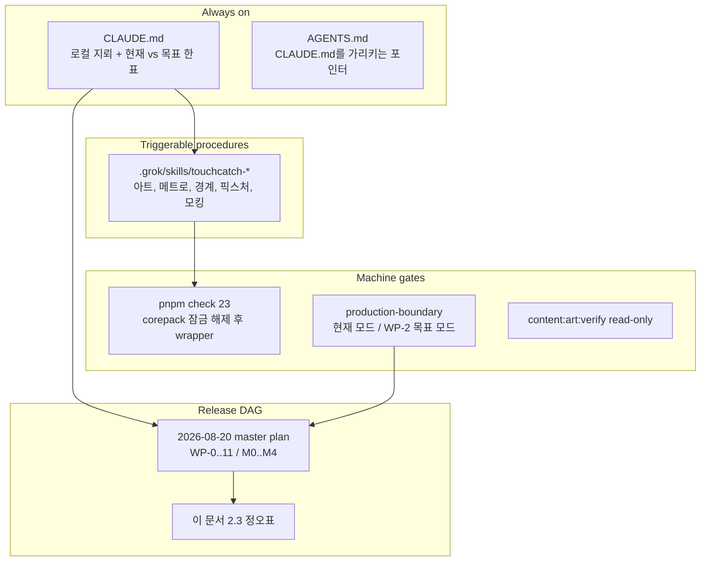

# Production Readiness Gap, Agent Workflow, and SSOT Improvement Plan

> **For agentic workers:** This plan is the execution SSOT for *process and document alignment*. Release feature work remains `docs/superpowers/plans/2026-08-20-production-service-readiness-master-plan.md`.
>
> Do **not** follow the Superpowers `subagent-driven-development` / `executing-plans` banner on this repository from Grok or Claude — those skills are not on this agent’s skill path. Sequential WP checkboxes in this file are the procedure. Grok `/execute-plan` (parallel Graphite PR DAG) is forbidden for this plan because it contradicts Superpowers SDD *and* this repo’s dirty-tree / single-RC constraint.

**Goal:** 2026-08-20 실서비스 준비도 통합 계획서가 여전히 올바른 NO-GO 판정을 유지하는지 재검증하고, 그 계획이 *에이전트가 실제로 실행하지 못하게 만드는* 문서·게이트·스킬 충돌을 제거한다. 기능 WP(게임 경로, OpenAPI, 승인, 배포)를 다시 쓰지 않는다. 실행 가능한 기준선, 에이전트 SSOT, CI 기계적 수정, 마스터 플랜 정오표를 먼저 닫는다.

**Architecture:** 출시 DAG는 08-20 계획의 WP-0…WP-11 / M0…M4를 유지한다. 이 문서는 그 DAG의 *선행 정합 계층*이다. CLAUDE.md는 로컬 세션 지뢰밭 SSOT로 남기되, 현재 개발 경계와 목표 생산 경계를 분리해 적는다. 반복 실패 절차는 저장소 스킬로 승격하고, `pnpm check`가 기억해야 할 것은 산문에 두지 않는다.

**Tech Stack:** 기존과 동일. Node 24.18.0, pnpm 11.13.0, TypeScript, Expo/React Native, Next.js Admin, Fetch HTTP server, Supabase/PostgreSQL, Vitest, GitHub Actions. 새 런타임 의존성을 이 계획으로 추가하지 않는다.

**Spec:** `docs/superpowers/plans/2026-08-20-production-service-readiness-master-plan.md`, `CLAUDE.md`, `docs/operations/repository-rules.md`, `docs/design/spot-difference-art-generation-guide.md`, 이 감사.

**Audit snapshot:** 2026-08-24, `D:\touchcatch`, 브랜치 `codex/production-pet-ranking-runtime`. 본 문서는 구현 권한이나 사람의 승인 권한을 대신하지 않는다.

## Global Constraints

- 08-20 마스터 플랜의 출시 차단 조건은 유지한다. DRAFT/PENDING/해시 불일치/서명자 부재는 fail-closed. 상태 문자열만 APPROVED로 바꾸지 않는다.
- 이 계획이 08-20 WP-2…WP-11을 “완료”로 표시하지 않는다. 2026-08-24 코드는 여전히 NO-GO다.
- 현재 작업 트리의 사용자 변경(펫 연출, geo 팩, 학습 아트 등)을 reset/삭제하지 않는다. 포함/후속 분리는 WP-0의 사람 결정이다.
- `config/ui-theme.v1.json`과 `config/ui-screen-contract.v1.json`은 편집하지 않는다.
- `check:db`는 로컬 DB를 지운다. 이 계획의 가드 플래그가 상륙하기 전에는 CI ephemeral stack 또는 전용 로컬 스택에서만 실행한다.
- 에이전트는 `learning-demo/registry.ts`를 라우트 그래프에 넣지 않는다. preview-registry 규칙은 **현재 테스트 계약**이지 **출시 목표**가 아니다. 둘을 한 문장으로 적지 않는다.

---

## 1. 결론

**출시 판정은 여전히 NO-GO다.** 08-20 계획의 P0 표는 한 줄도 닫히지 않았다. 지난 4일 동안 움직인 것은 개발 미리보기 플레이 가능성(derived hitbox 79/79 usable, preview 79팩, 워드헌트 큐레이션)과 펫/랭킹 UI 수직 슬라이스이지, 실서비스 경로가 아니다.

더 큰 문제는 기능 공백 자체가 아니라 **에이전트가 마스터 플랜을 실행하면 CLAUDE.md·테스트·스킬이 반대로 당긴다**는 점이다.

| 충돌 | 현재 진실 | 08-20이 요구하는 끝 상태 | 지금 에이전트가 하는 일 |
| --- | --- | --- | --- |
| 게임 라우트 | `spot-difference.tsx`가 `preview-home`/`preview-registry`를 정적 import. `production-boundary.test.ts`가 그 import를 **기대**. `__DEV__`가 아니면 “준비 중”. | 그 import를 전부 제거하고 `AuthoritativeLearningSessionScreen`만 남긴다. | CLAUDE.md를 따르면 WP-2를 **되돌린다**. |
| 펫/랭킹 | 정책 DRAFT → `REWARD_POLICY_NOT_APPROVED` → DISABLED. | 승인된 정책이 일치할 때만 capability를 켠다. 문자열 뒤집기 금지. | CLAUDE.md는 레이아웃 확인용 **임시 READY 픽스처**를 허용. 승인 산출물 오염 위험이 계획에 없다. |
| 실행 스킬 | 마스터 플랜 헤더: Superpowers SDD / executing-plans. | Codex `~/.codex/skills`에만 존재. | Grok는 `/execute-plan`(병렬 PR DAG) 또는 `/implement`를 고른다. Claude는 스킬을 못 찾는다. |
| 콘텐츠 숫자 | derived 79/79 usable, catalog 79 DRAFT, PLAY.md는 9팩, MOC는 81팩 100% PASS. | 승인된 최소 풀 + inventory ADMIT/HOLD/REJECT. | 에이전트가 “이미 81개 완료” 또는 “9팩 데모”를 믿고 출시 입력을 착각한다. |
| 작업 순서 | 브랜치에서 펫 연출·geo 팩·아트를 추가 중. | M0(기준선+게이트) → M1(서버 권위 캐주얼) → M2(펫/랭킹). | M2 UI를 M1보다 먼저 키우고 있다. |

08-20 계획은 **무엇을 출시 차단으로 볼지**는 맞다. **어떻게 에이전트가 그 일을 하게 할지**는 비어 있거나 잘못된 도구를 가리킨다. 이 문서가 그 구멍을 채운다.

---

## 2. 08-20 계획 대비 2026-08-24 코드 스냅샷

기능 WP는 닫히지 않았다. 아래는 재실측이다. 완료 체크박스를 옮기지 말 것.

### 2.1 그대로인 P0 NO-GO

| WP | 확인된 근거 |
| --- | --- |
| WP-0 | `docs/decisions/2026-08-20-launch-scope.md` 없음. `docs/release-evidence/` 없음. owners 파일은 역할만 있고 실명·만료·증거 URL이 없다. |
| WP-1 | `package.json` `check`는 23개의 `corepack pnpm …`. `tools/run-pnpm.mjs` 없음. `check:db`는 가드 없이 `supabase db reset --local`. |
| WP-2 | `apps/mobile/app/game/spot-difference.tsx`가 preview를 import. `AuthoritativeLearningSessionScreen` 없음. `apps/learning-preview` 없음. `tools/check-mobile-production-boundary.mjs` 없음. `answer.tsx`는 `evaluatePreviewAnswer`. |
| WP-3 | OpenAPI 21 path / 23 operation. 라우터는 `/v1` 10개 + `/healthz`. gacha/fusion/queue/friend-room/showcase/pets select-lock는 YAML만. `router.contract.test.ts` 없음. |
| WP-4 | manifest 79 `publishBlocked: true`. catalog 79 `DRAFT`. economy/daily-pet/weekly/progression/hint/pet-catalog/runtime-art/rights/signers 전부 `DRAFT`. art entries/keys는 빈 배열. `inventory.v1.json` 없음. |
| WP-5 | `socket.io` / `bullmq` / Redis 클라이언트 패키지 없음. Fetch HTTP만. |
| WP-6 | HTTP 수직 슬라이스(collection, daily-draw, promotion, leaderboard, challenges, attempts)는 있다. 정책 DRAFT라 앱은 DISABLED. Admin `PublishConsole`은 기존 `localStorage` 토큰 bootstrap만 있고 로그인 폼이 없다. |
| WP-7 | `infra/`, `deploy/`, `docs/operations/production-environment.md` 없음. CI는 로컬 계약 4 job. |
| WP-8 | `packages/contracts/src/analytics.ts`의 `privacyScan`만 있고 앱/서버 adapter 없음. Sentry/PostHog 패키지 없음. incident runbook 없음. |
| WP-9 | Google/Kakao 버튼 + PKCE는 있다. 계정 삭제, privacy/terms, `docs/legal` 없음. quarantine 입력은 미승인. |
| WP-10 | `versionName` `0.0.0`, `versionCode` 1, release `signingConfig signingConfigs.debug`. `eas.json` 없음. |
| WP-11 | blockers는 여전히 `BLOCKED_EXTERNAL`. go-no-go script/artifact 없음. |

### 2.2 08-20 이후 실제로 좋아진 것 (출시 증거가 아님)

- `content/learning/derived-hitboxes.v1.json`: `"usable": false` 0건. preview generator가 draft `difference_N`이 아니라 `derived-1` 좌표를 쓴다.
- `production-boundary.test.ts`가 generated preview 79팩, derived id, art-grid offender 빈 목록, scratch 재생성 byte identity를 검사한다.
- 워드헌트는 `content/learning/word-hunts.curated.v1.json`에서 오며 `content:wordhunts:check`가 `pnpm check` 23단계에 들어 있다.
- 펫/랭킹 모바일 컨트롤러와 서버 핸들러가 더 두껍다. `pets-route-controller.ts`는 `REWARD_POLICY_NOT_APPROVED`를 DISABLED로 유지한다. 이것은 올바른 fail-closed이지 기능 완료가 아니다.
- `createAttemptClient` / `createRankedSessionController`는 코드로 존재한다. 화면은 쓰지 않는다.

### 2.3 08-20 계획의 사실 오류 (정오표)

마스터 플랜을 실행할 때 아래를 현재 사실로 치환한다. 판정(NO-GO)은 바꾸지 않는다.

| 08-20 주장 | 2026-08-24 실측 | 영향 |
| --- | --- | --- |
| 라우터는 healthz + **9**개 모바일 경로 | **10**개 `/v1` + `/healthz`: me, pets/collection, leaderboard, daily-draw, duplicate-promotion, challenges, attempts, assets-ready, tap, complete | WP-3 inventory 기준이 한 경로 어긋남 |
| tap은 idempotency 예외(append-only, 키 없음) | `router.ts` 주석만 그렇게 말한다. `tapAttempt`와 OpenAPI는 UUID `Idempotency-Key`를 **요구** | WP-3 “의미를 통일” 과제가 이미 코드 내부에서 모순 |
| owners 경로 `docs/release-evidence-owners.md` | 실제 파일은 `docs/operations/release-evidence-owners.md` | WP-0 체크리스트가 빈 경로를 가리킴 |
| blockers의 “nine-pack” | catalog/manifest **79** | 출시 콘텐츠 풀 착각 |
| CLAUDE.md 25/79 플레이 불가, draft 좌표 49% | 역사적 사고 기록으로는 유효. **현재 derived는 79/79 usable**. preview 테스트가 79를 고정 | 에이전트가 현재 아트를 전부 다시 만들거나, 반대로 “이미 해결”로 오해 |
| e2e matrix의 `com.spotlearnbattle` | Gradle `applicationId`는 `com.touchcatch.mobile` | WP-10 증거 문서가 현 바이너리와 불일치 |

### 2.4 현재 작업 트리가 보여주는 순서 위반

세션 시작 시점 dirty tree에는 다음이 함께 있다.

- 펫 연출: `PetDrawCeremony`, `PetPromotionFX`, `PetRarityAura`, `InGameFXOverlay`, `GlassCard`
- 학습 아트/드래프트: geo 랜드마크 다수, papercut/lowpoly, 신규 source PNG
- `preview-registry.generated.ts`, `derived-hitboxes.v1.json`, `word-hunts.curated.v1.json` 갱신
- `design-tokens.ts`, `TabBar.tsx`, `HomeScreen.tsx`

08-20은 M2(펫)를 M1(서버 권위 캐주얼 세션 + 승인 콘텐츠) 뒤에 둔다. 연출과 팩 추가는 로컬 데모를 풍부하게 만들지만, production 라우트가 `__DEV__` 가드인 한 출시 경로를 한 단계도 닫지 못한다. 새 팩은 전부 `publishBlocked`/`DRAFT`로 남는다.

**개선:** 펫 FX와 geo 팩은 별도 후속 커밋으로 보존하되, release candidate에는 넣지 않는 것을 WP-0 기본 권고로 둔다. 사람이 뒤집기 전에는 M1을 막지 않는 변경만 RC에 태운다.

---

## 3. 워크플로우와 게이트

### 3.1 실제로 돌아가는 23단계 `pnpm check`

`tools/check-docs-lib.ts` `requiredGateCommands`가 순서까지 고정한다. 한 단계라도 `corepack pnpm X`가 아니면 `check:exact-order`로 실패한다.

1. `check:runtime`
2. `admin:check`
3. `mobile:check`
4. `ruleset:projections:check`
5. `content:schemas:check`
6. `content:catalog:check`
7. `content:wordhunts:check` (`--strict` 아님)
8. `content:drift:check`
9. `content:registry:utf8:check`
10. `ui:schemas:check`
11. `ui:docs:check`
12. `ui:reference:check`
13. `ui:assets:check`
14. `ui:acceptance:check`
15. `lint`
16. `typecheck` (root tsconfig: **server/admin/mobile app 라우트 제외**)
17. `test`
18. `openapi:lint`
19. `docs:check`
20. `release:reports:check`
21. `content:validate` (fixtures only)
22. `audio:feedback:check`
23. `secret:scan`

Serena memory `task_completion`은 아직도 **21단계**로 적혀 있다. CLAUDE.md의 23이 코드와 맞다. 메모리와 CLAUDE.md가 어긋나면 에이전트는 게이트를 덜 돌렸다고 착각한다.

### 3.2 CI

`.github/workflows/ci.yml` 네 job, 모두 이름이 `local contract/build evidence`다. 출시 언어를 쓰지 않는 것은 08-01 계획이 맞춘 부분이다.

중복:

- `pnpm check` 안에 이미 `mobile:check`와 (vitest를 통해) server 단위 테스트가 있다.
- CI가 `mobile` / `server` job을 다시 돌린다.

`docs/operations/repository-rules.md`는 필수 체크를 `check`와 `database`만 하라고 한다. `server`/`mobile` job은 required가 아니면 빨간색이어도 머지된다.

`check:db`는 파괴적이고 가드가 없다. concurrency 테스트는 hostname loopback + db name `/postgres`만 본다. 공유 개발 DB가 그 조건을 만족하면 지워진다.

야간 load/fault job은 없다. `release:load` / `release:fault`는 로컬 `tsx -e`다.

### 3.3 CLAUDE.md가 시키는 콘텐츠 명령 vs 게이트

| 명령 | `pnpm check` | 실제 동작 |
| --- | --- | --- |
| `content:art:grid:check` | 아님 | CLI는 offender를 **로그하고 0으로 종료**. 실패는 `production-boundary.test.ts`의 빈 목록 단언뿐 |
| `content:hitboxes:derive` | 아님 | 기본이 **write**. CI에서 돌리면 working tree를 바꾼다 |
| `content:preview:registry` | 아님 | **write**. production-boundary가 scratch 재생성으로 byte identity는 봄 |
| `content:wordhunts:check` | 포함 | 기계적 규칙만. 좌표가 물건 위에 있는지는 못 봄. `--strict` 꺼짐 |
| `content:hitbox:align:check` | 아님 | 주석: diagnostic, not a gate |
| `content:tapsize` | 아님 | 미포함 |

그래서 “아트 교체 후 CLAUDE.md 명령을 돌렸다”와 “CI가 초록”은 서로 다른 집합이다. 초록 CI는 히트박스를 다시 계산하지 않고, 그리드 스크립트 단독도 막지 못한다.

### 3.4 테스트가 공유 파일을 만지는 문제 (WP-1 미결)

`tests/specs/traceability.test.ts`는 일부 tmp 복제를 쓰지만, 여전히 `docs/testing/reports/release-blockers.v1.json`을 in-tree에서 `schemaVersion` 1→99로 썼다가 restore한다. `check-docs.mjs`에 root override가 없기 때문이다. Windows에서 restore가 `UNKNOWN: unknown error, open`을 내면 sentinel이 커밋될 수 있어 재시도 루프가 있다. 08-20 WP-1이 이  competion을 요구했고 그대로다.

`tools/content/learning-manifest.test.ts`의 `git show HEAD:`는 커밋되지 않은 draft/catalog 변경을 무시한다. CLAUDE.md가 말한 flake 원인이다.

### 3.5 WP-1 구현을 코드가 잠근 지점

`validateGateScripts`는 `check`의 각 토큰이 정확히 `corepack pnpm <cmd>`이길 강제한다. 08-20의 `tools/run-pnpm.mjs`로 바꾸면 **이 테스트가 먼저 실패해야 한다**. 계획서에 이 파일이 빠져 있어 에이전트가 wrapper만 넣고 `docs:check`/`traceability`에서 되돌아간다.

`packages/config/src/env.ts` `parseServerEnv`는 `REDIS_URL`과 `SENTRY_DSN`을 필수로 둔다. 서버 런타임 `loadRuntimeConfiguration`은 그 파서를 부르지 않고 `MOBILE_API_HOST` 기본값 `127.0.0.1`을 쓴다. 문서상 production env와 실행 env가 두 개다 (WP-3 미결).

### 3.6 08-01 워크플로 계획의 잔여

`docs/superpowers/plans/2026-08-01-workflow-codebase-research-improvement-plan.md`는 부분 상륙이다.

| Task | 상태 |
| --- | --- |
| CI job 분리, local-evidence 이름 | 상륙 |
| pipeline-constants SSOT, 강제 BEGINNER 제거 | 상륙. `--dry-run`/idempotent skip은 미상륙 |
| research.md 수치 75/150 | 대체로 상륙. stale-value 금지는 약함 |
| `content:drift:check` | 상륙. orphan은 warning |
| 모바일 LAN 스크립트/런북 | 코드 존재, 체크박스 미갱신 |
| nightly soak CI | 없음 |

08-01을 다시 실행하지 말고, 미상륙 항목만 이 문서 WP-C/F로 흡수한다.

---

## 4. 문서·매뉴얼·스킬 SSOT

저장소에 `AGENTS.md`와 `MANUAL.md`는 없다. Grok project rules는 `CLAUDE.md`를 읽는다. “manual”에 해당하는 실체는 다음 겹이다.

### 4.1 에이전트가 동시에 믿는 문서

| 문서 | 에이전트에게 하는 말 | 문제 |
| --- | --- | --- |
| `CLAUDE.md` | 로컬에서 한 번씩 깨진 규칙. 현재 세션의 실제 SSOT. | preview import를 안전 경계로 고정. 펫 READY 픽스처 허용. derived 25/79는 역사치. |
| 08-20 마스터 플랜 | 출시 DAG. Superpowers SDD 필수. | Grok/Claude는 그 스킬을 로드하지 않음. WP-2는 CLAUDE.md와 정면 충돌. |
| root `13_CODING_AGENT_PROMPTS.md` + `docs/04-Roadmap/13_…` | Step 0–8, NestJS+Socket.IO, `status: VERIFIED` | `12_IMPLEMENTATION_ROADMAP.md`가 Step 0–8을 **retired**라고 함. 둘 다 VERIFIED. |
| `12_IMPLEMENTATION_ROADMAP.md` | G3A→G6 | 08-20은 M0–M4 / Android casual beta. 세 번째 로드맵. |
| `docs/00-Dashboard/00_TOUCHCATCH_MOC.md` | 81팩, 78/81 10/10, 100% PASS | 규범 문서 아님. 에이전트가 건강 지표로 읽음. |
| `content/learning/PLAY.md` | 9개 draft 팩 로컬 데모 | 79 미리보기와 불일치. |
| `docs/02-Architecture/07_REALTIME_SERVER_SPEC.md` | frontmatter VERIFIED, 본문은 Nest/Socket/Redis **planned** | 08-20이 지적한 문서 진실성 문제 그대로. |
| `docs/02-Architecture/06_CLIENT_ARCHITECTURE.md` | `app/(tabs)/`, `src/services/socket.ts`, Zustand | 실제 트리: `app/game`, `app/pets`, `app/ranking`. socket.ts 없음. |
| Serena memories | `task_completion` 21단계 check, content_pipeline은 preview import가 규칙 | CLAUDE.md/package.json과 불일치. |
| `implementation_plan.md` | 500팩, 이중 생성 뉘앙스, ADVANCED r=0.050 | 아트 가이드·`pipeline-constants.js`(0.055)와 충돌. |
| Codex Superpowers skills | SDD, executing-plans, TDD, worktrees | Grok bundled skills와 이름만 비슷한 다른 기계. |

`docs:check`가 스캔하는 규범 표면은 **저장소 루트** `README.md` + `01_…`–`13_….md`다. `docs/01-GameDesign/` 복본은 YAML frontmatter가 있고 줄 번호가 달라 **지문이 다르다**. 에이전트가 `docs/01-GameDesign`만 고치면 게이트는 침묵하고 REQ 레지스트리는 구식이 된다.

### 4.2 CLAUDE.md가 잘 하는 것 (유지)

항상 켜 둘 가치가 있는 지뢰:

- B는 A의 마스크 편집. 비슷한 프롬프트로 B를 새로 만들지 않음.
- 드래프트 조용히 수정 금지 (sha256 핀).
- 게임 좌표는 derived hitbox만.
- `registry.ts`의 canonicalAnswer/privateSolutionHash는 라우트 그래프 금지.
- Metro가 떠 있으면 Gradle 금지. 헤드리스 에뮬레이터. Fast Refresh는 모듈 스코프를 안 바꿈.
- 테마 JSON 해시 락, 토큰은 추가만.
- PowerShell로 `package.json` 쓰지 않음.
- 정책 승인을 스크린샷 때문에 뒤집지 말 것 (픽스처 예외는 아래 WP-A에서 좁힘).

### 4.3 CLAUDE.md가 마스터 플랜을 막는 문장

콘텐츠 경계 섹션:

> 게임 라우트는 `preview-registry`만 임포트한다. `production-boundary.test.ts`가 이걸 강제한다.

이것은 **현재 개발 계약**이다. 08-20 WP-2는 그 테스트를 반대로 뒤집으라고 한다. 한 파일에 목표와 현재를 구별 없이 적어 두면, WP-2를 구현하는 에이전트는 “CLAUDE.md 위반”으로 자기 변경을 되돌린다.

펫 섹션의 “라우트에 임시 READY 픽스처를 넣고 되돌린다”는 로컬 확인용으로 이해되지만, 되되돌리는 게이트가 없다. dirty tree에 픽스처가 남으면 08-20 전역 제약(편의 승인 금지)과 충돌한다.

25/79·49% 표는 **사고 사례**로 남겨야 한다. 현재 derived 79/79와 같은 절에 현재형으로 두면 아트 파이프라인이 아직 32% 파손인 것처럼 읽힌다.

### 4.4 스킬 맵 — 있는 것, 없는 것, 잘못된 것

**Grok이 이 저장소에서 항상 읽는 것**

- `CLAUDE.md`
- `D:\touchcatch\.grok\rules\token-saving.md`
- 사용자 스킬 `token-saving`

**트리거되면 로드되는 bundled 스킬 (TouchCatch 비특화)**

- `imagine` / `game-asset-core`: 반복 피사체는 edit-chain을 말하지만 기본 “새 이미지”는 `image_gen`. 팩 A/B를 각각 생성하면 CLAUDE.md가 막으려던 32% 사고를 재현한다.
- `execute-plan`: 병렬 worktree PR DAG. 08-20 헤더의 executing-plans가 **아님**.
- `implement`, `design`, `review`, `create-skill`, `create-workflow`
- 게임 타일/캐릭터/UI 아이콘 스킬: 틀린그림 팩 워크플로가 아님.

**Codex에만 있는 Superpowers (마스터 플랜이 가리키는 것)**

- `C:\Users\petbl\.codex\skills\subagent-driven-development\SKILL.md`
- `C:\Users\petbl\.codex\skills\executing-plans\SKILL.md`
- plugin cache 6.3.0의 `using-git-worktrees`, `finishing-a-development-branch`는 user skills 트리에 없음.

Grok `config.toml`의 `skills.paths`는 Superpowers를 가리키지 않는다. 따라서 08-20 첫 줄은 **Grok/Claude 세션에서 죽은 지시**다.

**저장소에 없어 CLAUDE.md 실패가 반복되는 스킬**

1. 틀린그림 아트 (마스크 인페인트 + 4개 content 명령 + derived count 일치)
2. 워드헌트 큐레이션 (이미지 위 좌표, draft 복사 금지)
3. Android Metro/Gradle 순서와 x86_64
4. 헤드리스 에뮬레이터 + Fast Refresh 리로드
5. 정책 DRAFT vs 임시 픽스처 vs 진짜 승인
6. production-boundary 현재 계약 vs WP-2 목표
7. RN/expo-router 테스트 모킹

**이 세션에서 관측된 하니스 마찰**

`design` 스킬의 `host.py setup`은 일반 `python` 호출을 쓰는데, 프로젝트 token-saving 훅이 `wsl.exe … rtk python "C:\Users\petbl\…\host.py"`로 다시 치라고 거부했다. rtk는 그 Windows 경로를 찾지 못해 setup이 실패했다. 에이전트 워크플로 스킬과 프로젝트 훅이 서로 다른 호스트(Win python vs WSL rtk)를 가정한다.

### 4.5 08-10 / 08-11 계획과의 관계

- `2026-08-10-feature-readiness-audit-and-improvement-plan.md`: 서버 권위 학습 세션, preview 격리. HTTP attempt는 생겼고 UI는 아직 preview.
- `2026-08-11-production-pet-ranking-runtime-completion-plan.md`: 현재 브랜치 이름. 정책·아트·rights가 DRAFT인 한 “완료된 서비스 기능”이 될 수 없다고 08-20이 이미 말했다. 브랜치 작업은 그 경고를 부분적으로 무시하고 UI를 키우고 있다.

이 문서는 위 계획들을 삭제하지 않는다. 실행 순서를 08-20 M0/M1 뒤로 되돌린다.

---

## 5. 목표와 비목표

### Goals

- 에이전트 SSOT를 한 줄로 읽히게 만든다: 출시=08-20, 로컬 지뢰=CLAUDE.md, Step 0–8=역사.
- CLAUDE.md와 `production-boundary.test.ts`가 WP-2를 파괴하지 않게, 현재 계약과 목표 계약을 분리한다.
- TouchCatch 반복 실패를 저장소 스킬로 옮겨 CLAUDE.md를 줄인다.
- WP-1이 실제로 착륙할 수 있게 `validateGateScripts`·`check:db` 가드·traceability 격리를 이 계획의 코드 WP로 명시한다.
- 콘텐츠 읽기 전용 검증을 CI에 넣고, write 명령과 분리한다.
- 08-20 정오표를 마스터 플랜에 반영한다.
- MOC/PLAY.md/Serena memory의 낡은 숫자를 더 이상 SSOT처럼 보이지 않게 한다.

### Non-Goals

- 이 계획만으로 PRODUCTION_READY 선언.
- 정책 JSON을 APPROVED로 바꾸기, signer 채우기, 권리 승인.
- NestJS/Socket.IO/Redis 구현.
- 스테이징 인프라, 서명 키, OAuth 콘솔, 법무 문서 작성 (사람 증거).
- dirty tree 대량 revert.
- `apps/learning-preview` 이관과 AuthoritativeLearningSessionScreen — 그것은 08-20 WP-2. 이 계획은 그 작업을 **막지 않을 문서/테스트 사전 조건**만 만든다.
- UI 테마 해시 파일 편집.

---

## 6. 제안 설계

### 6.1 문서 계층 (한 사실 한 집)



규칙:

- 숫자(팩 수, 게이트 단계, 반지름)는 코드/생성 JSON에서만 권위. 대시보드 산문은 “비규범, 명령으로 재생성”만 적는다.
- REQ 마크다운은 루트 `NN_*.md`만 수정. `docs/01-…` 복본은 생성하거나 byte-identity 검사를 건다.
- 로드맵은 08-20이 출시 순서. G3A–G6는 요구사항 ID 골격. Step 0–8은 역사.

### 6.2 CLAUDE.md 재구성 스케치

상단에 고정 포인터 (짧은 표만):

```markdown
## 이 저장소에서 문서를 고르는 법
- 실서비스 출시 순서: docs/superpowers/plans/2026-08-20-production-service-readiness-master-plan.md
- 그 계획의 2026-08-24 정오표·에이전트 정합: docs/superpowers/plans/2026-08-24-production-readiness-gap-and-agent-workflow-improvement-plan.md
- Step 0–8 프롬프트는 역사 문서다. 구현 순서로 쓰지 않는다.
```

콘텐츠 경계를 두 모드로 나눈다.

| 모드 | 허용 | 금지 | 강제자 |
| --- | --- | --- | --- |
| **현재 (WP-2 이전)** | 게임 라우트가 `preview-registry` / `preview-home` import. `__DEV__` 가드 필수. | `learning-demo/registry.ts`, `canonicalAnswer`, `privateSolutionHash`가 라우트·generated preview에 등장 | 현 `production-boundary.test.ts` |
| **목표 (WP-2)** | `AuthoritativeLearningSessionScreen`만. preview는 `apps/learning-preview`. | `apps/mobile` import graph의 learning-demo | 뒤집을 테스트 + signed bundle scanner |

WP-2를 구현하는 작업은 같은 PR에서 테스트를 목표 모드로 전환해야 하며, 그때 CLAUDE.md의 “현재” 행을 삭제한다. 그 전까지 에이전트는 현재 행을 지킨다.

펫 확인:

- 승인 JSON을 고치지 않는다 (유지).
- 임시 READY는 `__DEV__` 전용 라우트 분기 또는 테스트 픽스처 모듈에만 둔다. `config/*.v1.json`과 `normative-numeric-approvals.v1.json`은 금지.
- 확인이 끝나면 분기를 되돌리지 않은 PR은 머지하지 않는다. 테스트가 “production 라우트 기본값이 DRAFT disabled”를 고정.

25/79 표는 “2026-08 재작업 이전 사고”로 옮기고, 현재 수치는 `derived-hitboxes.v1.json` + `content:drift:check` JSON을 인용하라고 한다.

### 6.3 저장소 스킬

위치: `D:\touchcatch\.grok\skills\<name>\SKILL.md` (Grok 우선, Claude compat로도 보임). Codex Superpowers 전체를 복사하지 않는다.

| 스킬 | 트리거 | 핵심 절차 | CLAUDE.md에서 뺄 것 |
| --- | --- | --- | --- |
| `touchcatch-spot-difference-art` | 틀린그림 A/B 생성·교체, Imagine 사용 | 가이드 강제 → A `image_gen` 1장 → B는 **반드시** `image_edit` 마스크 → `art:grid:check`(failing) → `hitboxes:derive` → 의도 개수 불일치 시 abort → `preview:registry` → 워드헌트 재검토 | 긴 아트 절. 한 줄 포인터만 남김 |
| `touchcatch-word-hunt` | 워드헌트 좌표 | `-a.png`를 열고 curated JSON만 수정. draft `wordHunts` 복사 금지. 검증기는 물건 위 여부를 못 봄 | 짧은 경고만 |
| `touchcatch-android-metro` | Gradle, `mergeDebugResources`, android/app/build 잠금 | Metro 종료 → `cmd /c rmdir` → x86_64 assemble → Metro 재시작 | 긴 Gradle 절 |
| `touchcatch-emulator-qa` | 모바일 UI 확인 | 창 크래시 시 headless swiftshader, screencap, EventEmitter=캐시, Fast Refresh 한계와 `RELOAD_APP_ACTION` | 에뮬레이터 장문 |
| `touchcatch-policy-fixtures` | 펫/랭킹 화면이 안 열림 | DISABLED가 정상. 승인 파일 금지. `__DEV__` 픽스처만. 되돌림을 PR 조건으로 | “임시 READY” 모호 문장 |
| `touchcatch-production-boundary` | 게임 라우트, preview, registry, WP-2 | 6.2 표. 현재 테스트 기대값을 목표인 줄 알고 바꾸지 말 것 | 경계 절 중복 |
| `touchcatch-rn-test-mocks` | 새 RN/Expo API, 화면 테스트 SyntaxError | 그 화면을 렌더하는 **모든** 테스트 파일 mock 갱신. 픽스처가 기능을 켜는지 확인 | 프론트엔드 총알 일부 |

공통 규칙: 스킬은 명령을 복제하지 않고 `package.json` 스크립트 이름을 가리킨다. 반지름·팩 수를 스킬에 하드코딩하지 않는다.

08-20 헤더 교체 문구 (마스터 플랜 상단):

```markdown
Grok: 이 파일의 체크박스를 순서대로 구현한다. `/execute-plan` 병렬 DAG를 쓰지 않는다.
Claude/Codex: superpowers:executing-plans 또는 subagent-driven-development가 로드된 세션에서만 그 스킬을 쓴다.
```

선택: Grok `~/.grok/config.toml` `[skills].paths`에 Codex Superpowers를 넣지 않는다. 병렬 의미와 git 소유권이 다르다. 필요하면 포인터 스킬 `touchcatch-execute-wp` 하나가 “한 WP씩, 막히면 정지, dirty tree 삭제 금지”만 적는다.

### 6.4 게이트 기계적 수정 (08-20 WP-1을 실행 가능하게)

1. **`validateGateScripts`를 wrapper-aware로**
   - 허용: `corepack pnpm <cmd>` (현재) 또는 `node tools/run-pnpm.mjs <cmd>` (목표).
   - 전환 PR은 테스트와 `package.json`과 `tools/check-docs.mjs`를 함께 바꾼다.

2. **`tools/run-pnpm.mjs`**
   - 먼저 `check-runtime.mjs`와 동일한 Node/pnpm 판정.
   - 자식은 `process.execPath` + 현재 `npm_execpath`. 재귀 corepack 금지.
   - CI 로그에 execPath, version, user_agent를 인쇄.

3. **`check:db` 가드**
   - `TOUCHCATCH_ALLOW_LOCAL_DB_RESET=1` 없으면 종료.
   - CI database job에만 세팅.
   - 스크립트 이름 또는 docs에 local-reset임을 명시.

4. **traceability 격리**
   - `tools/check-docs.mjs --root=<tmp>` 또는 `RELEASE_BLOCKERS_PATH`.
   - in-tree `release-blockers.v1.json` mutate-and-restore 테스트 삭제.

5. **`git show HEAD:` 제거**
   - working tree 또는 fixture를 읽는다. 커밋 identity가 필요하면 명시적 snapshot fixture.

6. **읽기 전용 아트 검증 `content:art:verify`**
   - art-grid: offender면 exit 1 (CLI 수정).
   - derive `{ write: false }` 후 committed JSON diff.
   - preview scratch regenerate (이미 테스트에 있음) — 게이트 스크립트로 승격 가능.
   - **write 스크립트는 CI에 넣지 않는다.**

7. **CI 중복**
   - `pnpm check`에서 `mobile:check`를 빼거나 CI `mobile` job을 뺀다. 둘 중 하나.
   - `server:check`는 root `typecheck`가 server를 빼므로 **독립 job 유지**. `repository-rules.md`에 required 여부를 명시.

8. **OpenAPI↔router 예비 테스트**
   - 08-20 WP-3의 `router.contract.test.ts`는 본 계획이 아니라 08-20이 소유한다. 여기서는 테스트가 CLAUDE.md에 막히지 않는다는 것만 확인.

### 6.5 숫자·복본 문서

- MOC 통계 표를 삭제하거나 `pnpm content:drift:check` JSON을 붙여 넣는 생성기로 교체. “100% PASS / 81팩” 금지.
- PLAY.md: 9팩 → “개발 미리보기 팩 수는 generated preview의 `count`”. `__DEV__` 설명은 유지.
- Serena memories: `task_completion` 23단계, `content_pipeline`에 현재/목표 경계. 이 계획이 착륙한 뒤 `write_memory`.
- `docs/testing/frozen-registry-policy.md`의 “91-entry” 문장 정정.
- architecture `status: VERIFIED` + 본문 `planned` 조합은 `docs:check`가 경고하거나 frontmatter를 `PARTIAL`로 낮춘다. REQ 본문을 지우지 않는다.

---

## 7. 인터페이스 / 게이트 변화

### 7.1 `validateGateScripts` (목표)

현재: 각 단계는 길이 3이고 `[corepack, pnpm, cmd]`여야 한다.

목표 허용 두 형태:

```text
corepack pnpm <cmd>
node tools/run-pnpm.mjs <cmd>
```

`requiredGateCommands` 배열 자체(23개 이름과 순서)는 유지하되, 앞에 `content:art:verify`를 넣을지는 WP-F에서 결정한다. 넣으면 배열과 CLAUDE.md와 이 문서와 `task_completion` 메모리를 한 PR에서 맞춘다.

### 7.2 production-boundary 테스트 모드

WP-2 이전 (현재, 유지):

```ts
expect(source).toContain("from '../../src/learning-demo/preview-home'");
expect(source).toContain("from '../../src/learning-demo/preview-registry'");
```

WP-2 PR (08-20 소유, 이 계획이 길을 닦음):

```ts
expect(source).not.toMatch(/learning-demo/);
expect(source).toContain('AuthoritativeLearningSessionScreen');
```

중간 상태(“preview import도 없고 authoritative screen도 없음”)는 금지. 테스트가 한 PR에서 뒤집힌다.

### 7.3 환경 플래그

```text
TOUCHCATCH_ALLOW_LOCAL_DB_RESET=1   # check:db only, CI database job
```

프로덕션 서버 env에 넣으면 안 된다. 서버 부팅 경로가 이 변수를 읽지 않는 테스트를 둔다.

---

## 8. 데이터 모델

스키마 마이그레이션 없음. 추가되는 산출물:

- `content/learning/inventory.v1.json` — **08-20 WP-4 소유**. 이 계획은 스키마를 만들지 않고, 파일이 생기기 전 orphan warning을 오류로 올리지 말라고만 한다 (지금 오류로 올리면 미분류 geo 초안에 게이트가 죽는다).
- `docs/decisions/2026-08-20-launch-scope.md` — **08-20 WP-0, 사람**.
- 저장소 스킬 파일 — 이 계획 소유.

---

## 9. 대안

### 대안 A — 08-20만 실행하고 문서/스킬은 손대지 않음

WP-2 첫 PR이 `production-boundary`와 CLAUDE.md와 충돌해 되돌아간다. Superpowers 헤더 때문에 Grok가 병렬 `/execute-plan`을 켤 수 있다. **기각.** 지난 4일이 이 경로다.

### 대안 B — Superpowers 스킬을 Grok `skills.paths`에 연결

Codex와 동일한 SDD를 Grok에서도 쓴다. 그러나 `execute-plan`(Grok)과 `executing-plans`(Superpowers)가 이름 충돌이고, SDD는 병렬 구현자를 금지하는 반면 Grok execute-plan은 기본 병렬 4다. dirty RC 제약과 안 맞다. **기각 (기본).** Codex 전용 세션에서만 Superpowers를 쓴다.

### 대안 C — CLAUDE.md를 출시 계획으로 확장

항상 켜진 파일이 더 길어진다. 토큰을 쓰고, 아트/메트로 절차가 잘린다. 이미 실패 모드. **기각.**

### 채택 — 대안 D (이 문서)

출시 DAG는 08-20에 남긴다. 이 계획으로 에이전트 정합·게이트 잠금 해제·스킬 승격만 한다. 기능 코드는 08-20 WP가 연다.

---

## 10. 보안과 개인정보

- 스킬/문서에 시크릿, OAuth 클라이언트 시크릿, 승인 개인키를 넣지 않는다.
- 임시 READY 픽스처가 승인 JSON이나 번들 스캐너 allow-list를 우회하지 못하게 테스트를 둔다.
- preview-registry의 `title`/`correctOptionId`/`hintUnits`는 08-20이 이미 유출 후보로 본다. 이 계획은 그걸 “비밀 필드명만 없으면 안전”이라고 승격하지 않는다. CLAUDE.md가 generated 파일에서 필드명만 검사하는 한계를 명시한다.
- `check:db` 가드는 운영 DB reset을 막기 위한 것이다. 플래그 이름은 allow-reset이지 allow-prod가 아니다.

---

## 11. 관측성

이 계획은 제품 Sentry를 켜지 않는다. 프로세스 관측만:

- CI 로그에 Node/pnpm execPath 인쇄 (WP-C).
- `content:art:verify` 실패 시 offender key와 derived count mismatch를 JSON으로 출력.
- Serena `task_completion` / `content_pipeline` / `suggested_commands`를 계획 착륙 후 갱신. 갱신하지 않으면 다음 세션이 21단계 check를 다시 퍼뜨린다.

---

## 12. 롤아웃

1. 문서 포인터 + CLAUDE.md 현재/목표 표 (동작 변화 없음, 테스트 유지).
2. 스킬 추가 (동작 변화 없음).
3. 게이트 잠금 해제: `validateGateScripts` → wrapper → `check:db` 가드 → traceability 격리. 각각 독립 PR 가능하나 wrapper와 validateGateScripts는 같은 PR.
4. `content:art:verify` 읽기 전용 게이트.
5. 08-20 마스터 플랜 헤더/정오표 패치.
6. 이후 세션은 08-20 WP-0/WP-1/WP-2를 이 정합 위에서 실행.

롤백: 스킬과 문서 포인터는 언제든 되돌려도 런타임에 영향 없음. 게이트 wrapper는 `corepack pnpm` 형태로 되돌릴 수 있게 validateGateScripts가 둘 다 허용하는 동안만 전환한다. 허용 기간이 끝나면 corepack 형태를 제거한다.

---

## 13. 리스크

| 리스크 | 심각도 | 완화 |
| --- | --- | --- |
| CLAUDE.md를 고치면서 preview 규칙을 너무 일찍 삭제 | critical | 현재 행을 WP-2 PR 전까지 유지. 테스트가 현재 행을 강제 |
| `content:art:verify`를 지금 넣으면 dirty geo 팩이 CI를 죽음 | major | verify는 committed derived/preview identity만. 미커밋 아트는 그 PR의 책임. orphan 오류화는 WP-4까지 연기 |
| `check:db` 가드가 로컬 습관을 깨뜨림 | minor | CLAUDE.md와 suggested_commands에 플래그 한 줄 |
| 스킬이 imagine 기본값을 이기지 못함 | major | 아트 스킬 description에 “틀린그림, image_gen으로 B 만들지 말 것”을 트리거 문장으로 넣음 |
| 세 로드맵이 남은 채 에이전트가 G3B realtime을 시작 | major | CLAUDE.md 상단 포인터 + 13번 문서 역사 배너 |
| 펫 FX dirty tree가 RC에 섞임 | major | WP-0 권고: 후속 커밋, 이 계획이 삭제하지 않음 |

---

## 14. 작업 패키지

08-20 WP 번호와 섞지 않기 위해 **A–G**를 쓴다. 끝난 뒤에 08-20 WP-0부터 재개한다.

### WP-A. 에이전트 SSOT 포인터와 CLAUDE.md 이중 모드

**우선순위:** P0
**의존성:** 없음

- [ ] 루트 `AGENTS.md`를 추가한다. 내용은 CLAUDE.md + 08-20 + 이 문서 포인터만. 규칙을 복제하지 않는다.
- [ ] CLAUDE.md 상단에 “문서 고르는 법” 표를 넣는다.
- [ ] 콘텐츠 경계를 6.2의 현재/목표 표로 바꾼다. preview import를 출시 목표처럼 쓰지 않는다.
- [ ] 25/79 표를 역사 사례로 옮기고, 현재 수치는 derived/drift 명령을 가리킨다.
- [ ] 펫 READY 픽스처를 `__DEV__`/테스트 모듈로 한정한다고 적는다.
- [ ] `13_CODING_AGENT_PROMPTS.md` (루트와 docs 복본) 상단에 “retired, not an implementation order” 배너. frontmatter `status: VERIFIED`는 `HISTORICAL` 또는 동등한 비출시 상태로. REQ ID는 유지.
- [ ] `content/learning/PLAY.md`의 “nine draft packs”를 generated count에 맞춘다.
- [ ] MOC 건강 표를 비규범/생성으로 바꾸거나 삭제한다.

**완료 증거:** WP-2를 시작하려는 에이전트가 CLAUDE.md만 읽고 preview import를 목표로 착각하지 않는다. `production-boundary.test.ts`는 아직 현재 모드.

### WP-B. 저장소 스킬

**우선순위:** P0
**의존성:** WP-A의 현재/목표 문장 (스킬이 그 표를 가리킴)

- [ ] `.grok/skills/touchcatch-spot-difference-art/SKILL.md`
- [ ] `.grok/skills/touchcatch-word-hunt/SKILL.md`
- [ ] `.grok/skills/touchcatch-android-metro/SKILL.md`
- [ ] `.grok/skills/touchcatch-emulator-qa/SKILL.md`
- [ ] `.grok/skills/touchcatch-policy-fixtures/SKILL.md`
- [ ] `.grok/skills/touchcatch-production-boundary/SKILL.md`
- [ ] `.grok/skills/touchcatch-rn-test-mocks/SKILL.md`
- [ ] 선택: `.grok/skills/touchcatch-execute-wp/SKILL.md` (한 WP, 정지, 트리 삭제 금지, `/execute-plan` 금지)
- [ ] 08-20 마스터 플랜 헤더의 REQUIRED SUB-SKILL 줄을 6.3 문구로 교체한다.
- [ ] CLAUDE.md 장문을 스킬 포인터로 줄인다. 지뢰 한 줄은 남긴다.

**완료 증거:** 틀린그림 요청 시 imagine만 따르지 않고 아트 스킬이 로드될 트리거 문장이 description에 있다. Grok 세션이 Superpowers를 필수라고 착각하지 않는다.

### WP-C. 게이트 잠금 해제 (08-20 WP-1의 선행)

**우선순위:** P0
**의존성:** 없음 (WP-A와 병렬 가능)

- [ ] `validateGateScripts`가 `node tools/run-pnpm.mjs <cmd>`를 허용하는 실패 테스트를 먼저 추가한다.
- [ ] `tools/run-pnpm.mjs` 구현. runtime check 실패 시 자식 금지.
- [ ] `package.json` `check` / `check:db`의 재귀 `corepack pnpm`을 wrapper로 교체.
- [ ] `TOUCHCATCH_ALLOW_LOCAL_DB_RESET` 가드. CI database job에만 설정.
- [ ] `check-docs.mjs` root/report path override. traceability의 in-tree mutate 삭제.
- [ ] `learning-manifest.test.ts`의 `git show HEAD:` 제거.
- [ ] CI check job이 wrapper 경로/버전을 로그.
- [ ] 고정 런타임에서 `pnpm check` 1회 PASS (전체 3연타는 08-20 WP-1 완료 조건으로 남긴다).

**완료 증거:** 부모 Node 24.18.0/pnpm 11.13.0일 때 자식이 다른 corepack Node로 새지 않는다. `check:db`는 플래그 없이 거부한다.

### WP-D. 08-20 정오표 패치

**우선순위:** P1
**의존성:** 없음

- [ ] 마스터 플랜 §1 표: 9경로 → 10경로.
- [ ] tap idempotency: 주석/핸들러/OpenAPI 모순을 WP-3 과제로 명시. “키 없음”을 현재 사실처럼 쓰지 않음.
- [ ] owners 경로를 `docs/operations/release-evidence-owners.md`로.
- [ ] “nine-pack” → 79 catalog / publishBlocked.
- [ ] CLAUDE.md 25/79를 역사치로 주석.
- [ ] 이 문서 링크를 마스터 플랜 §2에 추가.

**완료 증거:** 에이전트가 마스터 플랜만 읽고 라우터 9경로/나인팩을 재구현하지 않는다.

### WP-E. 작업 트리 분류 (사람, 삭제 없음)

**우선순위:** P0
**의존성:** 제품 소유자 (에이전트는 목록만)

- [ ] 현재 dirty 변경을 세 바구니로 분류한 표를 `docs/release-evidence/`가 생기기 전에는 `docs/reviews/2026-08-24-working-tree-disposition.md`에 적는다: (1) M1에 필요, (2) M2 이후 보존, (3) 실험/보류.
- [ ] 기본 권고: 펫 FX, geo 팩, 신규 source PNG는 (2). derived/preview/wordhunt 정합 수정은 (1) 후보이나 승인 파이프 전에는 출시 입력이 아님.
- [ ] 에이전트는 이 표 없이 checkout/restore하지 않는다.

**완료 증거:** 08-20 WP-0의 “196개 검토”가 2026-08-24 트리에 대해 파일 목록을 갖는다.

### WP-F. 읽기 전용 콘텐츠 검증

**우선순위:** P1
**의존성:** WP-C (게이트 순서 테스트와 함께 넣을 것)

- [ ] `tools/content/check-art-grid.js`가 offender면 exit 1.
- [ ] `content:art:verify` 스크립트: grid fail + derive write:false diff + preview scratch identity.
- [ ] `requiredGateCommands`에 넣을지 결정. 넣으면 23→24 또는 wordhunts 옆으로 삽입하고 CLAUDE.md/메모리를 같은 PR에서 갱신.
- [ ] `content:wordhunts --strict`는 큐레이션 완료 전 CI에 넣지 않는다. 이 결정문을 CLAUDE.md에 한 줄로.

**완료 증거:** 구도 격자가 구워진 이미지는 테스트뿐 아니라 CLI/CI도 실패한다. derive write가 CI에서 돌지 않는다.

### WP-G. 메모리와 복본 문서

**우선순위:** P2
**의존성:** WP-A, WP-C, WP-F (단계 수가 확정된 뒤)

- [ ] Serena `task_completion`, `content_pipeline`, `suggested_commands`, `conventions`를 코드와 맞춘다.
- [ ] `docs/testing/frozen-registry-policy.md` 91-entry 문장.
- [ ] architecture 문서 frontmatter `VERIFIED` vs 본문 planned: `PARTIAL` 또는 docs-check 경고.
- [ ] root `NN_*.md` vs `docs/0N-*` byte-identity 또는 “docs 복본은 비규범 네비게이션” 표시.

**완료 증거:** 새 세션의 Serena core/task_completion이 21단계를 말하지 않는다.

---

## 15. 08-20으로 돌아가는 순서

이 계획 A–C, D, E가 끝나면:

1. 08-20 WP-0 (사람: 범위, 소유자, RC 구성). 에이전트는 범위 문서를 대신 승인하지 않는다.
2. 08-20 WP-1 — WP-C가 wrapper/가드를 이미 넣었다면 남은 것은 3회 연속 `pnpm test`와 CI URL.
3. 08-20 WP-2 — CLAUDE.md 목표 모드 + 테스트 전환을 **같은 PR**에서.
4. WP-3 계약 동기화 (10경로 기준, tap 의미 통일).
5. WP-4 최소 승인 풀. 새 geo 팩은 inventory 결정 전 출시 입력 아님.
6. WP-7/8/9/10은 사람 증거와 함께. 펫 UI(M2)는 그 다음.

PvP(WP-5)는 08-20 권고대로 Android 비공개 베타에서 빼는 것이 기본이다. 스토어 카피에 PvP를 쓰면 P0으로 승격된다. 그 결정은 WP-0 문서에만 있다.

---

## 16. Open Questions

2026-08-24 세션에서 제품 소유자가 Android 우선을 선택하고 나머지는 공학 권고를 따르라고 했다. 기록:

1. **출시 범위 — DECIDED:** Android 비공개 캐주얼 베타. PvP·펫 보상·iOS는 후속 게이트. `docs/decisions/2026-08-20-launch-scope.md`.
2. **`content:art:verify`를 24번째 check에 넣지 않는다.** `derive-hitboxes.js`는 테스트에 넣기엔 너무 느리다(파일 주석). 그리드 검사는 이미 `production-boundary.test.ts`가 실패시킨다. CLI `content:art:grid:check`만 offender 시 exit 1로 고친다.
3. **CI `mobile` job은 유지** (병렬 조기 실패, `workflow-coverage.test.ts`가 workflow 문자열을 고정). `repository-rules.md` required 체크는 `check` + `database` + `server`.
4. **dirty tree는 현재 브랜치에 보존**, RC에서 제외. `docs/reviews/2026-08-24-working-tree-disposition.md`. 삭제·브랜치 분할 없음.
5. **Grok에 Superpowers paths를 연결하지 않는다.** 순차 체크박스 + `touchcatch-execute-wp`.

---

## Key Decisions

1. **08-20 마스터 플랜은 출시 DAG로 유지한다.** 이 문서는 대체물이 아니라 실행 정합 계층이다. 지난 4일의 코드는 NO-GO를 뒤집지 못했다.
2. **CLAUDE.md는 로컬 지뢰 SSOT로 남기되, 현재 개발 계약과 출시 목표를 한 표에 분리한다.** preview-registry import는 WP-2 이전의 강제 계약이다.
3. **반복 절차는 저장소 스킬, 잊으면 안 되는 금지는 게이트, 출시 순서는 계획서.** 한 사실을 세 곳에 길게 복제하지 않는다.
4. **Grok `/execute-plan`과 Superpowers `executing-plans`를 같은 것으로 취급하지 않는다.** 이 저장소의 Grok/Claude 세션은 체크박스 순차 실행이 기본이다.
5. **derived 79/79 usable는 개발 미리보기 품질이지 출시 승인가 아니다.** catalog/manifest는 여전히 DRAFT/publishBlocked.
6. **펫 연출과 신규 팩 추가는 M1을 대체하지 않는다.** 삭제하지 않고 RC에서 분리한다.
7. **`validateGateScripts`의 corepack 고정은 WP-1의 숨은 선행 조건이다.** wrapper PR은 이 테스트를 함께 바꾼다.
8. **`check:db`는 명시적 allow 플래그 없이 실행하지 않는다.**
9. **orphan draft를 지금 게이트 오류로 올리지 않는다.** inventory(WP-4) 전제 없이는 geo 작업 트리가 CI를 죽인다.
10. **아트 B의 기본 생성 경로는 `image_edit`이다.** bundled `imagine` 스킬의 `image_gen` 기본값을 저장소 스킬이 이긴다.

---

## PR Plan

각 PR은 독립적으로 머지 가능해야 한다. 승인 JSON·서명 키·인프라는 포함하지 않는다.

### PR-1 — Agent SSOT pointers

- **Title:** `docs: split current vs target production boundary in agent entrypoints`
- **Files:** `AGENTS.md` (new), `CLAUDE.md`, `13_CODING_AGENT_PROMPTS.md`, `docs/04-Roadmap/13_CODING_AGENT_PROMPTS.md`, `content/learning/PLAY.md`, `docs/00-Dashboard/00_TOUCHCATCH_MOC.md`
- **Depends on:** none
- **Changes:** 포인터, 현재/목표 표, 역사 배너, 낡은 팩 수 산문 제거. 테스트 변경 없음.

### PR-2 — TouchCatch skills and plan header

- **Title:** `chore: add TouchCatch operator skills and stop dead Superpowers header`
- **Files:** `.grok/skills/touchcatch-*/SKILL.md`, `docs/superpowers/plans/2026-08-20-production-service-readiness-master-plan.md` (header + §2 link + errata), this plan if needed
- **Depends on:** PR-1 (문장을 스킬이 가리킴)
- **Changes:** 스킬 추가, 08-20 정오표·헤더. 런타임 없음.

### PR-3 — Gate wrapper and db-reset guard

- **Title:** `build: pin nested pnpm to parent runtime and guard local db reset`
- **Files:** `tools/run-pnpm.mjs`, `tools/run-pnpm.test.ts`, `tools/check-docs-lib.ts`, `tools/check-docs.mjs`, `package.json`, `.github/workflows/ci.yml`, `tests/specs/traceability.test.ts`, `tools/content/learning-manifest.test.ts`, `CLAUDE.md` (check:db 플래그 한 줄)
- **Depends on:** none (PR-1과 병렬 가능)
- **Changes:** WP-C. `validateGateScripts`가 wrapper를 허용. CI database job에 `TOUCHCATCH_ALLOW_LOCAL_DB_RESET=1`.

### PR-4 — Read-only art verify

- **Title:** `test: fail CI when baked art grids or stale derived hitboxes land`
- **Files:** `tools/content/check-art-grid.js`, new `tools/content/verify-art-readonly.mjs` (name flexible), `package.json`, `tools/check-docs-lib.ts` if added to `check`
- **Depends on:** PR-3 if the command joins the frozen 23-list; otherwise none
- **Changes:** WP-F. write derive/preview는 여전히 수동.

### PR-5 — Working-tree disposition (docs only)

- **Title:** `docs: classify current dirty tree for release-candidate inclusion`
- **Files:** `docs/reviews/2026-08-24-working-tree-disposition.md`
- **Depends on:** 사람 검토. 에이전트는 초안 목록만.
- **Changes:** 삭제 없는 분류표.

### PR-6 이후

08-20 WP-0 (사람) → WP-1 잔여 3연타 테스트 → WP-2 (테스트 모드 전환 + AuthoritativeLearningSessionScreen). 이 문서의 PR이 아니다.

---

## References

- `docs/superpowers/plans/2026-08-20-production-service-readiness-master-plan.md`
- `docs/superpowers/plans/2026-08-01-workflow-codebase-research-improvement-plan.md`
- `docs/superpowers/plans/2026-08-10-feature-readiness-audit-and-improvement-plan.md`
- `docs/superpowers/plans/2026-08-11-production-pet-ranking-runtime-completion-plan.md`
- `CLAUDE.md`
- `docs/design/spot-difference-art-generation-guide.md`
- `docs/design/word-hunt-curation-guide.md`
- `docs/operations/repository-rules.md`
- `docs/operations/release-evidence-owners.md`
- `docs/release-evidence-blockers.md`
- `docs/04-Roadmap/12_IMPLEMENTATION_ROADMAP.md`
- `C:\Users\petbl\.grok\docs\user-guide\08-skills.md`
- `C:\Users\petbl\.grok\docs\user-guide\12-project-rules.md`
- Codex Superpowers: `C:\Users\petbl\.codex\skills\executing-plans\SKILL.md`, `subagent-driven-development\SKILL.md`
)
