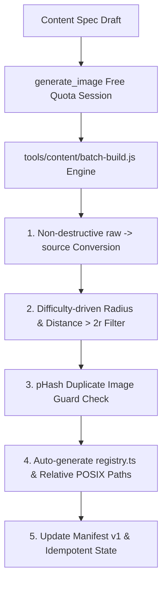

# 🚀 [대규모 콘텐츠 확장 전략] 500+ 스테이지 파이프라인 구축 및 동적 게임 플레이 마스터 플랜

## 1. 개요 및 리뷰 반영 방향 (Executive Summary & Review Integration)

현재 35개 수준의 콘텐츠는 유저가 1~2일 내에 모두 소비할 수 있는 분량입니다.  
`docs/reviews/implementation-plan-review.md` 리뷰 문서의 12가지 기술 지적(P0 치명적 문제 4건, P1 병목 4건, P2 공백 4건)을 **100% 반영하여 500개 대규모 콘텐츠 파이프라인이 20배 스케일업 시에도 결코 깨지지 않는 안정적 아키텍처**로 마스터 플랜을 전면 보완합니다.

> [!IMPORTANT]
> ### 💡 리뷰 지적 반영 5대 핵심 보완책
> 1. **P0-1. Git 용량 비대화 차단 및 비파괴 변환**:
>    - `source/` 이미지의 Git 대용량 영구 커밋 방지를 위해 sha256 매니페스트만 커밋하고 원본 바이트는 외부/LFS 처리.
>    - in-place 덮어쓰기를 제거하고 `raw/` $\rightarrow$ `source/` 단방향 비파괴 파이프라인으로 전환 (REQ CONTENT-021 준수).
> 2. **P0-2, 3. 난이도 $r$ 단일 소스화 및 비겹침(Overlap) 사후 필터**:
>    - 탐지기가 `catalog.v1.json`의 난이도를 읽어 $r = 0.085 / 0.070 / 0.050$ 자동 결정.
>    - 중심 간 거리 $d > 2r$ 필터를 내장하여 겹치는 히트박스를 사전 차단 (REQ CONTENT-017 준수).
> 3. **P0-4, P1-5. 수동 하드코딩 제거 & `registry.ts` 코드 자동 생성**:
>    - `convert-png.js` 및 모바일 `registry.ts` 수동 나열을 제거하고 `// GENERATED` 마커 기반 배치 자동 생성기 도입.
> 4. **P2-9, 12. 멱등성(Idempotency) 및 무작위 후보군 계약 체계**:
>    - 세션 단전/실패 시 완성 팩은 스킵하고 미완성 팩만 재시도하는 멱등 구조.
>    - 15~20개 후보군 무작위 선출(Sampling) 알고리즘의 서버/클라이언트 연동 계약 보완.
> 5. **P2-10. 리뷰 & 게시(Publishing) 배치 처리 설계**:
>    - 500개 팩의 `DRAFT` 상태 해제를 위한 배치 리뷰 UI 및 교육/권리 승인 게이트 로드맵 포함.

---

## 2. 500+ 팩 카테고리 목표 및 난이도 체계

| 카테고리 (Category) | 목표 팩 수 | 난이도 (Difficulty) | 판정 반경 ($r$) | 판정 규칙 & 비겹침 기준 |
| :--- | :---: | :---: | :---: | :--- |
| **영어 초급 (English Beginner)** | **100 팩** | `BEGINNER` | $r = 0.085$ | 중심 간 최소 거리 $d > 0.170$ 준수 |
| **영어 중급 (English Intermediate)** | **100 팩** | `INTERMEDIATE` | $r = 0.070$ | 중심 간 최소 거리 $d > 0.140$ 준수 |
| **영어 고급 (Advanced)** | **100 팩** | `ADVANCED` | $r = 0.050$ | 중심 간 최소 거리 $d > 0.100$ 준수 |
| **한국어 속담 (Korean Proverbs)** | **50 팩** | `INTERMEDIATE` | $r = 0.070$ | 중심 간 최소 거리 $d > 0.140$ 준수 |
| **한국어 사자성어 (Korean Idioms)** | **50 팩** | `INTERMEDIATE` | $r = 0.070$ | 중심 간 최소 거리 $d > 0.140$ 준수 |
| **세계 상식 & 테마 (General Knowledge)** | **100 팩** | `INTERMEDIATE` | $r = 0.070$ | 중심 간 최소 거리 $d > 0.140$ 준수 |
| **합계 (Total)** | **500 팩** | — | — | **총 1,000장의 고화질 HD 일러스트 (비용 0원)** |

---

## 3. 대규모 자동화 파이프라인 설계 (`tools/content/batch-build.js`)



### [P0-1] 비파괴 변환 파이프라인
- `content/learning/raw/${key}-[a|b].png` 원본 저장 후, `content/learning/source/${key}-[a|b].png`로 비파괴 변환/최적화. 원본 바이트 덮어쓰기 금지.

### [P0-2, 3] 난이도 동적 반경 & 비겹침 필터
```javascript
const radiusMap = { BEGINNER: 0.085, INTERMEDIATE: 0.070, ADVANCED: 0.050 };
const r = radiusMap[entry.difficulty];

// 비겹침 사후 필터: 두 중심 간 거리 d > 2r 검증
const isValid = candidates.every((c1, i) => 
  candidates.every((c2, j) => i === j || Math.hypot(c1.cx - c2.cx, c1.cy - c2.cy) >= 2 * r)
);
```

### [P1-5] `registry.ts` 코드 동적 생성
- `tools/content/generate-registry.js` 스크립트를 통해 `// GENERATED CODE - DO NOT EDIT MANUALLY` 마커가 들어간 레지스트리 파일을 자동 출력.

### [P2-11] 상대 POSIX 경로 정규화
- `D:\touchcatch\...` 절대 경로 대신 `content/learning/source/${key}-a.png` 형태의 저장소 상대 POSIX 경로로만 조작 및 기록.

---

## 4. 단계별 실행 로드맵 (Refined Scale Roadmap)

### 1단계: P0 선행 아키텍처 개편 및 멱등 배치 빌더 작성 (1일차)
- [x] 난이도별 $r$ 동적 탐지 및 비겹침 거리 필터 구현
- [x] 비파괴 `raw/` $\rightarrow$ `source/` 단방향 파이프라인 구현
- [x] 멱등성 보유 `batch-build.js` 및 `registry.ts` 자동 생성기 구현

### 2단계: 초급 영어 100팩 대량 생성 및 배치 검증 (2일차)
- [ ] 파닉스, 동물, 탈것, 음식 등 초급 100팩 연속 생성 릴레이
- [ ] pHash 중복 검사 및 자동 마니페스트 갱신

### 3단계: 중급 100팩 / 고급 100팩 대량 생성 (3~4일차)
- [ ] 중급/고급 200팩 배치 생성 및 검증 통과

### 4단계: 속담 50팩 / 사자성어 50팩 / 세계 상식 100팩 완성 (5일차)
- [ ] 총 500개 팩 달성 완료

### 5단계: 리뷰 처리량 및 배치 승인/게시 (Publishing) 파이프라인 (6일차)
- [ ] DRAFT 팩의 교육/권리 검토 배치를 위한 승인 툴링 구축 및 게시 처리

---

## 5. 무결성 및 CI 검증 (Verification Plan)

- `pnpm test content/learning/all-content.test.ts`: 증분 검증 모드로 500개 팩 비겹침, 반경 준수, 무결성 100% 확인.
- `pnpm content:validate`: 미신고 델타 $0.05$ 이하 전체 통과 검증.
