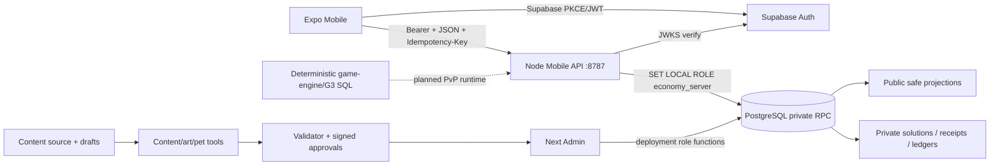
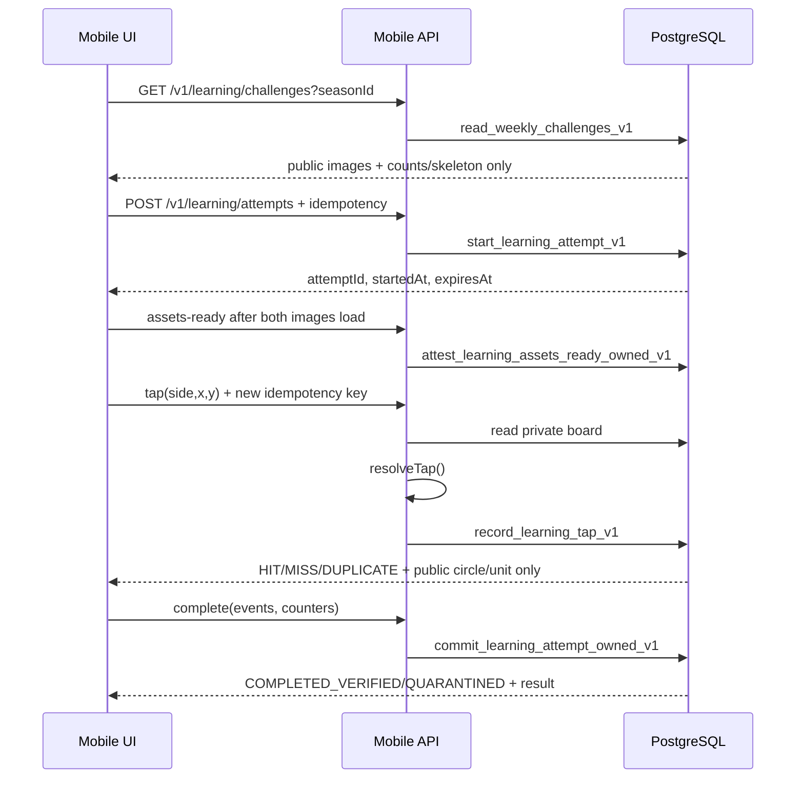
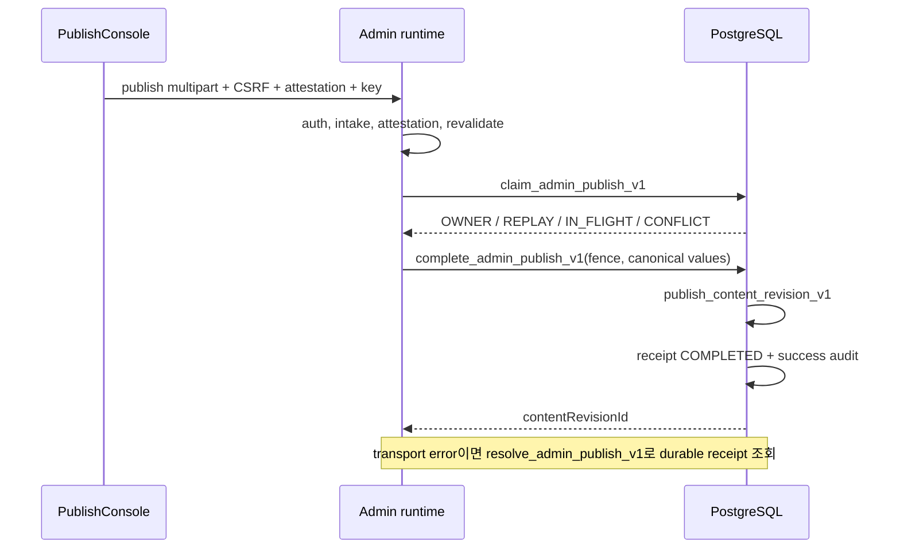

> **비규범 조사 문서 / NON-NORMATIVE RESEARCH SNAPSHOT**
>
> 이 문서는 2026-08-26의 **현재 dirty working tree**를 읽어 실제 호출 관계를 설명한 조사 보고서다. 정책 승인, 법률 의견, 출시 승인, 운영 증거를 새로 만들지 않는다. 충돌할 때는 [`CLAUDE.md`](CLAUDE.md), [Android 출시 범위 결정](docs/decisions/2026-08-20-launch-scope.md), 실제 코드·SQL·서명된 승인 산출물을 우선한다.

# TouchCatch 저장소 심층 연구 보고서

## 0. 조사 범위와 결론

조사 대상은 루트 문서, `apps/*`, `packages/*`, `config`, `content`, `schemas`, `supabase`, `tests`, `tools`, `docs`, CI와 Android native project다. 2026-08-26 17:04:44 KST(08:04:44 UTC)에 `codex/production-pet-ranking-runtime`, HEAD `2c8c70c50d13869771f55622c171c30aae967a7a`에서 `git status --porcelain=v1 --untracked-files=all`을 실행해 tracked 수정 91개와 untracked 파일 389개, 총 480개 경로를 관찰했다. 조사 중에도 계정 삭제 관련 파일이 추가·연결되고 있었으므로, 이 문서는 커밋 기준선이 아니라 **명시된 시각의 디스크 스냅샷**이며 이후 변경은 범위 밖이다.

한 문장으로 요약하면 다음과 같다.

> TouchCatch는 Expo 모바일, Node HTTP API, Next.js 콘텐츠 운영 콘솔, Supabase/PostgreSQL 권위 저장소, 결정론적 게임 엔진, 콘텐츠·승인·검증 도구를 한 모노레포에 모은 학습 게임이다. 현재 첫 목표는 Android 비공개 casual learning beta이며, 그 서버 권위 수직 슬라이스는 일부 연결됐지만 콘텐츠 배포·계정 삭제 worker·법무·복구·관측성·서명 AAB 증거가 없어 본 조사 문서의 관찰상 외부 beta는 `NO_GO_EXTERNAL`로 해석된다.

### 현재 상태 요약

| 영역 | 현재 코드/데이터 상태 | 출시 해석 |
|---|---|---|
| Android 앱 | Expo SDK 57 / RN 0.86, `com.touchcatch.mobile`, production route가 server-authoritative learning 화면을 사용 | signing fail-fast 등은 개선됐으나 signed AAB·Play·실기기 증거 없음 |
| Casual learning | challenge → attempt → assets-ready → tap → complete HTTP/DB 수직 슬라이스 구현, attempt policy는 enabled | production 화면은 힌트·word hunt·정답·서든데스 등을 아직 연결하지 않은 최소 slice |
| 콘텐츠 | catalog/manifest/derived는 79팩, derived 79/79 usable; draft는 138개; 5팩 별도 승인 bundle 존재 | 79 catalog는 전부 `DRAFT`, manifest는 전부 `publishBlocked`; 5팩도 production DB publish/season pin 증거 없음 |
| 펫·랭킹 | API·SQL·모바일 화면/FX가 존재 | economy/catalog/daily/art/rights가 DRAFT라 production은 의도적으로 `DISABLED` |
| 실시간 PvP | reducer, replay, timer, durable G3 SQL과 legacy `BattleScreen` 존재 | Socket.IO/Redis/BullMQ runtime 배선이 없고 첫 beta 범위 밖 |
| 계정 삭제 | 현재 dirty tree에 202 access-block API, receipt status, tombstone, 모바일 확인 UI/client가 부분 연결 | 실제 data disposal/provider revoke/auth delete worker, recent-auth, secure storage, public portal, 승인된 disposition이 없음 |
| Admin 게시 | Next.js validate/preview/attestation/idempotent publish 코드와 SQL receipt가 존재 | 기존 Supabase browser session·운영 DB 역할·secret·asset origin이 전제이며 production 배포 증거 없음 |
| 자동 검증 | `pnpm check` 26단계, `check:db` 별도 파괴적 DB gate, CI 4 jobs | local contract/build evidence일 뿐 release/deploy evidence가 아님 |

## 1. 문서와 진실의 우선순위

이 저장소는 오래된 기획, 실행 코드, 최신 출시 계획이 함께 있어 문서의 시대를 먼저 구분해야 한다.

1. **로컬 운영 지뢰:** [`CLAUDE.md`](CLAUDE.md), [`AGENTS.md`](AGENTS.md), `.grok/skills/*`.
2. **현재 제품 범위:** [`docs/decisions/2026-08-20-launch-scope.md`](docs/decisions/2026-08-20-launch-scope.md). Android closed/private beta, KR cohort, server-authoritative casual learning만 첫 binary에 포함한다.
3. **출시 DAG:** [2026-08-20 master plan](docs/superpowers/plans/2026-08-20-production-service-readiness-master-plan.md)의 WP-0…WP-11과 M0…M4.
4. **정오표/에이전트 정합:** [2026-08-24 gap plan](docs/superpowers/plans/2026-08-24-production-readiness-gap-and-agent-workflow-improvement-plan.md). master DAG를 대체하지 않고 사실 오류와 작업 순서만 보정한다.
5. **Google Play 시정 계획:** [2026-08-26 remediation plan](docs/superpowers/plans/2026-08-26-google-play-production-readiness-remediation-plan.md). R0…R9는 열린 계획이며 코드가 일부 생겼다고 checkbox가 자동 완료되지 않는다.
6. **실행 사실:** 현재 TypeScript, JSON, SQL migration, test가 문서보다 우선한다.
7. **역사 인벤토리:** 루트 `01_*`…`13_*`의 `DOC-*` 요구사항과 Step 0–8은 traceability source이지 구현 순서가 아니다. 루트 [`12_IMPLEMENTATION_ROADMAP.md`](12_IMPLEMENTATION_ROADMAP.md)의 G3A→G6도 제품/기술 gate의 역사적 계층이며, 현재 출시 실행 순서는 WP DAG다.

이 우선순위 자체도 현재 working-tree 자료를 해석하기 위한 것이다. 아래 SHA-256은 조사 스냅샷의 bytes를 고정하며, `untracked` 자료는 release evidence나 커밋된 조직 결정으로 승격되지 않는다.

| 참조 | Git 상태 | 조사 시점 SHA-256 | 해석 한계 |
|---|---|---|---|
| `CLAUDE.md` | tracked | `fb8b7761e9ba568843663c3abcdd3ef2286c71b1c88f6745d1b494b77cb1e142` | 현재 tracked operator 규칙 |
| `AGENTS.md` | untracked | `56f482cc08d764ab98ab9c1de872fa23d330ffbe6c12d2653368a1dddeb22eb9` | 이 working tree의 agent entry; release evidence 아님 |
| `2026-08-20-launch-scope.md` | untracked | `1635429c2938278769ea15fb37d06784a08f3083fdfa1e12f6f54afe4af610ea` | 현재 작업 범위 참조; 승인 artifact 아님 |
| `2026-08-20-production-service-readiness-master-plan.md` | untracked | `895f4c3ee315cac3cf1800e170fca58191b80d9d8ab88223c8ab20de2491cf3f` | working-tree master DAG |
| `2026-08-24-production-readiness-gap-and-agent-workflow-improvement-plan.md` | untracked | `df69d512f494b8fd12b72d8a2c3c8f7b7fd9e3e41a07dd543be3ae85942f2e9e` | working-tree errata |
| `2026-08-26-google-play-production-readiness-remediation-plan.md` | untracked | `27f6591cf6f0587fc75abad8a32b4732b9b16b1608f975a88e6a0f22dd556f7c` | 열린 작업 계획; 완료나 승인 증거 아님 |

### 상태 사전

같은 단어라도 subsystem마다 소유권과 전이 권한이 다르다. 특히 `APPROVED`는 전역 상태가 아니라 policy, content, rights, education, numeric decision 각각의 **서명 scope**다.

| 상태/값 | 소유 subsystem | 정확한 의미와 전이 권한 | 증거 | 보장하지 않는 다음 단계 |
|---|---|---|---|---|
| `DRAFT` | config/content manifest | 아직 production admission 불가; 승인된 사람·signer workflow만 전이 가능 | status field, canonical hash | rights 승인, DB 게시, capability enable |
| `publishBlocked=true` | learning inventory/manifest | pack을 publish input에서 제외 | manifest row | `usable`, 별도 approval bundle의 존재 여부 |
| source review `PENDING/APPROVED` | art/pet/rights review | 특정 source bytes와 review scope의 사람 판정 | reviewer/time/hash가 있는 review record | derivative 승인, runtime admission |
| `usable=true` | derived learning art | A/B delta가 preview 규칙상 플레이 가능 | derived hitbox 계산 결과 | 교육·권리 승인, `PUBLISHED` |
| scoped `APPROVED` | policy/content/rights/education/numeric approval | exact hash와 scope를 지정 signer/owner가 승인 | signature, signer registry, decision ID | 다른 scope 승인, DB row, release PASS |
| `PUBLISHED` | PostgreSQL content lifecycle | immutable public/private/rights revision이 DB publish transaction을 통과 | revision row, attestation/receipt | season pin, CDN object 존재, client 노출 |
| capability `enabled/disabled` | server runtime policy | API surface가 해당 policy bundle로 열림/닫힘 | validated config와 hash pins | 데이터 pool 존재, UI `READY` |
| UI `READY/EMPTY/STALE/ERROR/DISABLED` | mobile controller | 마지막 fetch/policy를 화면에 투영한 상태 | controller state/test | DB나 release 전체의 상태 |
| attempt `OPEN/COMPLETED_VERIFIED/QUARANTINED/...` | learning DB state machine | 한 시도의 권위 처리 결과; DB RPC만 전이 | attempt/receipt/best-record rows | content approval나 release readiness |
| deletion `ACCESS_BLOCKED/...` | privacy request state machine | 계정 접근 차단 또는 단계별 삭제 진행을 표현 | deletion request/status receipt | 실제 disposal 완료; `ACCESS_BLOCKED`는 삭제 완료가 아님 |
| release `PASS/BLOCKED_EXTERNAL` | release evidence/DAG owner | exact commit·artifact·environment·외부 증거의 판정 | immutable manifest, owner approval | 다른 release나 이후 artifact의 안전성 |

앞 단계나 한 subsystem의 상태가 뒤 단계 또는 다른 subsystem의 상태를 암시하지 않는다.

## 2. 모노레포 구성과 의존 관계

### 워크스페이스

| 경로 | 책임 |
|---|---|
| `apps/mobile` | Expo Router 모바일 앱, auth, learning, pet, ranking, profile, Android native project |
| `apps/server` | Fetch-style handler를 Node HTTP로 노출하는 authenticated mobile API |
| `apps/admin` | Next.js 콘텐츠 검증·preview·게시 콘솔 |
| `packages/config` | mobile/server production 환경변수의 strict parser |
| `packages/contracts` | Zod/JSON Schema/OpenAPI, canonical JSON/hash, REST/socket/domain DTO |
| `packages/content-validator` | public/private/rights bundle와 실제 이미지 bytes의 strict validator |
| `packages/game-engine` | PvP용 결정론적 reducer, timer scheduler, replay, hint engine |
| `packages/learning-competition` | 현재 HTTP learning attempt session/score verifier |
| `supabase` | PostgreSQL 17 local config, roles, ordered migrations, pgTAP |
| `content` | learning/pet 원본, draft, derived data, approval/fixture; audio bytes는 mobile assets에 별도 위치 |
| `config` | ruleset, policy, signer, UI, release/requirement evidence SSOT |
| `tools` | schema projection, content/art/pet/privacy/release 검증 및 생성기 |
| `tests` | cross-layer contract, requirement oracle, simulation, DB concurrency |
| `docs` | 결정, runbook, 승인, 리뷰, release blocker와 계획 |

`pnpm-workspace.yaml`은 `apps/*`와 `packages/*`를 workspace로 잡고 hoisted linker, injected workspace copies, strict peer dependency를 사용한다. 루트 TypeScript는 strict, `noUncheckedIndexedAccess`, `exactOptionalPropertyTypes`, `useUnknownInCatchVariables`를 켠다. 단, root `tsconfig.json`은 server를 포함하지 않으므로 `server:typecheck`가 별도 gate로 반드시 존재한다.

### 런타임 큰 흐름



현재 shipping 경로는 굵은 HTTP/Supabase 흐름이다. `game-engine`과 G3 durable SQL은 중요한 기반이지만 mobile HTTP runtime이 조립하지 않는다.

## 3. 모바일 앱 워크플로우

### 3.1 부팅과 provider 계층

진입점은 `apps/mobile/package.json`의 `expo-router/entry`다.

```text
expo-router/entry
  → app/_layout.tsx
    → SafeAreaProvider
    → MobileRuntimeProvider
    → MusicProvider
    → SafeAreaView
    → Slot
```

`MobileRuntimeProvider`는 mount 시 한 번 다음을 조립한다.

```text
EXPO_PUBLIC_* 환경
  → parseMobileEnvironment()
  → createMobileSupabaseRuntime()
  → createSessionController()
  → createMobileApiTransport()
  → createOAuthCoordinator()
  → createPetApi()
  → createRankingClient()
  → createAttemptClient()
  → createDeletionTransport()/createAccountDeletionClient()
  → createLocalAuthPurge()
  → session.initialize()
```

환경은 Supabase URL/key, API origin, weekly season UUID 네 개다. production에서는 HTTP/loopback API·Supabase origin을 거부한다. 실패하면 runtime은 `CONFIG_ERROR`이고 화면에는 auth/API 기능이 열리지 않는다.

공통 HTTP transport는 15초 timeout, Bearer token, 401 시 token refresh 후 1회 재시도, mutation UUIDv4 생성, typed `MobileApiError`를 제공한다.

### 3.2 라우팅과 production 노출

| Route | 실제 화면 |
|---|---|
| `/` | Home과 category/daily CTA |
| `/game/spot-difference` | `AuthoritativeLearningSessionScreen`만 import |
| `/game/answer` | 옛 preview answer를 실행하지 않고 game route로 redirect |
| `/auth/callback` | OAuth cold/warm callback 처리 |
| `/pets` | 정책 gate가 있는 컬렉션/뽑기/승급 |
| `/ranking` | weekly board |
| `/profile` | 가입·로그인·OAuth·로그아웃·계정 삭제 진행 상태 |

`TabBar`는 홈/펫/랭킹/프로필 정의를 갖지만 production 기본값에서는 reward surface를 숨겨 홈/프로필만 표시한다. 직접 deep link는 각 route controller와 서버 policy가 다시 fail-closed 처리한다.

Home은 현재 `hasAdmittedContent: true`와 “runtime READY이면 server available”이라는 얕은 모델을 사용한다. 따라서 CTA가 보여도 실제 challenge pool이 비었거나 정책/DB가 실패하면 game 화면 진입 뒤 `UNAVAILABLE`이 된다.

### 3.3 Password 및 OAuth 인증

세션 상태는 `loading | signed-out | signed-in(email) | error(AUTH_UNAVAILABLE)`다.

- 초기 복구: Supabase `getSession()` → 상태 게시 → `onAuthStateChange` 구독.
- password login: `signInWithPassword`.
- 가입: `signUpWithPassword`; email confirmation이 필요한 null session은 실패가 아니라 `CONFIRM_EMAIL`.
- 로그아웃: local scope sign-out.
- foreground/background: Supabase auto refresh를 시작/중지한다.
- 저장소: Expo SQLite가 설치한 `globalThis.localStorage`에 Supabase PKCE session을 지속한다.

OAuth:

```text
Google/Kakao 버튼
  → startOAuth(provider)
  → touchcatch.auth.pkce.pending 저장
  → signInWithOAuth(skipBrowserRedirect, touchcatch://auth/callback)
  → WebBrowser.openAuthSessionAsync()
  → callback URL/단일 code/fragment/extra query 검증
  → exchangeCodeForSession()
  → GET /v1/me로 subject bootstrap
  → READY 또는 ACCOUNT_SETUP_FAILED
```

`oauth-coordinator.ts`는 pending transaction 단계와 기존 session identity를 기록하고 duplicate callback을 terminal cache로 idempotent 처리한다. Android `app.json`, resolved Expo config, native manifest의 scheme는 현재 `touchcatch`로 정렬돼 있다.

### 3.4 Server-authoritative casual learning

핵심 파일은 `AuthoritativeLearningSessionScreen.tsx`, `ranked-session-controller.ts`, `attempt-client.ts`다.



controller phase는 `IDLE → OPENING → LOADING_ASSETS → PLAYING → SUBMITTING → SETTLED`이고 실패는 `UNAVAILABLE`이다.

- 두 이미지가 모두 load되기 전 board 입력을 막는다.
- board-local `locationX/Y`를 layout width/height로 나눠 [0,1] 좌표만 전송한다.
- client는 private hitbox/canonical answer를 갖지 않는다.
- start/assets/complete는 동일 lifecycle key를 재사용해 response loss를 replay한다.
- 물리 tap마다 새 key를 쓴다.
- score/time/ownership은 서버와 DB clock이 결정한다.
- response는 찾은 objective의 public circle과 새로 열린 answer unit만 준다.

현재 production 화면의 한계:

- controller가 받은 `openedUnits`를 실제 화면이 표시하지 않는다.
- `HintPanel`, `PetCoach`, 5-step hint ladder가 route에 연결되지 않았다.
- word hunt, final answer/meaning, countdown/final rush, sudden death UI가 없다.
- complete body의 `hintsUsed`와 `wrongAnswers`가 0으로 고정되고 local event는 사실상 tap뿐이다.
- 결과는 completion 여부/시간 중심이며 데모의 학습 결과 상세가 없다.
- Home의 `daily=1` query를 authoritative 화면이 소비하지 않는다.
- 공개 category filter는 ENGLISH/PROVERB 중심이다.

따라서 현재 경로는 “private 정답을 번들에 넣지 않고 서버가 tap을 판정하는 최소 vertical slice”이지, 루트 게임 규칙 전체가 shipping UI에 구현됐다는 뜻이 아니다.

### 3.5 개발 preview와 legacy PvP 경계

`apps/mobile/src/learning-demo`는 로컬 difference/word hunt/hint/correctOptionId를 들고 `FIND → SUDDEN_DEATH → QUIZ → COMPLETE`를 자체 판정한다. `preview-registry.generated.ts`도 answer 관련 필드를 포함하므로 개발 전용이다.

production route graph에는 다음이 들어가면 안 된다.

- `learning-demo`, `preview-home`, `preview-registry`
- `canonicalAnswer`, `privateSolutionHash`, `correctOptionId`, `hintUnits` 등 private marker
- draft/source path나 private DB URL/secret

`production-boundary.test.ts`와 `tools/check-mobile-production-boundary.mjs`가 source-level로 막는다. 이 스캔은 signed AAB의 transitive bundle/asset 검사를 대신하지 않는다.

`BattleScreen.tsx`는 `MatchSnapshotV1` 기반으로 word hunt, final rush, meaning quiz, sudden death, pinch/pan과 강한 접근성 처리를 구현하지만 현재 Expo Router public route에서 도달하지 않는다. 테스트 화면의 완성도를 현재 beta 기능 완성 증거로 쓰면 안 된다.

### 3.6 펫과 랭킹

펫:

```text
/pets
  → GET /v1/pets/collection
  → READY | EMPTY | SIGNED_OUT | DISABLED | ERROR
  → daily draw: POST /v1/pets/daily-draw
  → duplicate promotion: POST /v1/pets/duplicate-promotion
  → reveal/FX
  → collection reload
```

controller는 retry 가능한 실패에 동일 idempotency key를 보존한다. reveal animation이 실패해도 이미 성공한 mutation을 실패로 되돌리지 않는다. `PetCollection`은 copies/selected/locked/rarity 진행률을 그리고, promotion은 같은 pet 10 copies를 소비한다.

현재 server policy는 pet art/rights/economy가 DRAFT이므로 `PET_ART_NOT_APPROVED` 또는 `REWARD_POLICY_NOT_APPROVED`를 내고 UI는 `DISABLED`를 표시한다. dirty tree의 `PetDrawCeremony`, `PetPromotionFX`, `PetRarityAura`, `GlassCard` 등은 presentation이며 capability를 열지 않는다.

랭킹:

```text
/ranking
  → GET /v1/learning/leaderboard
  → READY | EMPTY | STALE | ERROR | DISABLED
```

이전 성공 board가 있으면 network error를 `STALE`로 유지하고, nickname은 control 문자를 제거하고 grapheme 길이를 제한한다. 현재 economy/catalog가 DRAFT라 `RANKING_POLICY_NOT_APPROVED`로 닫힌다.

### 3.7 계정 삭제: 현재 관찰된 access-block 흐름(삭제 완료 아님)

현재 profile에는 2단계 확인 카드와 진행 상태가 연결돼 있다.

```text
확인 카드
  → device가 256-bit receipt secret + idempotency key 생성
  → network 전 receipt를 localStorage에 먼저 저장
  → DELETE /v1/me
  → 202 ACCESS_BLOCKED 수신
  → session.closeForDeletion()
  → local sign-out + pending OAuth purge
  → receipt는 보존
  → 무인증 POST /v1/me/deletion-status로 polling
```

좋은 경계:

- response loss 뒤에도 status credential을 잃지 않도록 receipt를 먼저 저장한다.
- server는 receipt secret을 echo하지 않고 SHA-256만 DB에 넘긴다.
- auth session이 사라진 뒤에도 status를 확인할 수 있다.
- late auth callback이 계정을 다시 signed-in으로 열지 않도록 session을 latch한다.
- 사용자에게 즉시 access block, 삭제 대상, 상대 기록, 비동기 처리, 비가역성을 알린다.

그러나 출시 완료가 아닌 이유:

- receipt가 계획서가 요구한 `expo-secure-store`가 아니라 `localStorage`에 있다.
- password/Google/Kakao recent-auth challenge/exchange가 없다.
- app data disposal, provider unlink, Supabase Auth deletion, notification worker가 없다.
- public account-deletion portal과 실제 support/법무 문구가 없다.
- disposition/retention/child-directed 결정과 사람 서명이 없다.
- 관련 파일 다수가 untracked이며 clean RC/DB integration evidence가 없다.

현재 코드와 R2/R3/R4 목표를 분리하면 다음과 같다.

| 단계 | 현재 구현됨 | 계획만 존재 | 추가 권한/증거 |
|---|---|---|---|
| 요청 전 | 2단계 UI 확인, device receipt/idempotency key 생성 | password·Google·Kakao recent-auth challenge/exchange | privacy/legal의 정확한 고지 문구 승인 |
| 접수 | authenticated `DELETE /v1/me`; working-tree migration/code가 durable request/tombstone, 202 `ACCESS_BLOCKED`, replay를 정의 | clean RC에서 실제 migration/role 통합 | 적용 DB의 staging transaction·response-loss evidence는 없음 |
| 로컬 종료 | deletion latch, sign-out, pending OAuth purge, receipt 보존 | `expo-secure-store` adapter와 verified expiry cleanup | physical-device cold/warm OAuth 검사 |
| 상태 확인 | 무인증 receipt-proof polling과 모든 상태 DTO/UI 문구 | receipt recovery/public portal/support path | portal 배포·support owner evidence |
| 실제 처리 | 상태/stage schema만 존재 | app data disposal, provider revoke, Auth 삭제, notification outbox, unknown-outcome/manual-review worker | retention/disposition/legal-hold 사람 승인, provider·DB 운영 증거 |

`ACCESS_BLOCKED`만 현재 request RPC가 직접 만든다. `APP_DATA_DISPOSED`, `PROVIDERS_REVOKED`, `AUTH_DELETED`, `COMPLETED`, `FAILED_RETRYABLE`, `FAILED_PERMANENT`, `MANUAL_REVIEW`, `BLOCKED_LEGAL_HOLD`는 DB 제약·server parser·mobile 표시 모델에는 정의돼 있지만, 이 tree에는 그 상태로 안전하게 전이시키는 disposal/provider/auth worker가 없다. 따라서 클라이언트가 상태를 이해하는 것과 시스템이 그 상태를 달성하는 것은 별개다.

### 3.8 음악·효과음 runtime

배경음악은 app-wide `MusicProvider` 하나가 player와 설정을 소유한다.

```text
_layout.tsx
  → MusicProvider
  → readMusicSettings(localStorage)
  → createMusicPlayer(expo-audio lazy load)
  → screen의 useMusicMood(LOBBY | RELAX | RUSH)
  → literal require() asset를 replace/loop/play
```

프로필의 `MusicSettingsCard`는 음악 on/off와 작게/보통/크게를 저장하고, player가 이미 재생 중이어도 즉시 pause/play/volume을 반영한다. 저장소가 없거나 깨졌으면 기본값으로 돌아가며 화면을 실패시키지 않는다. `expo-audio`, source load, audio focus, silent mode가 실패해도 player는 예외를 삼키고 무음으로 계속한다. 별도 runtime permission 요청은 없고 release merge에는 runtime prompt 대상이 아닌 `android.permission.MODIFY_AUDIO_SETTINGS`와 haptic용 `android.permission.VIBRATE`가 남는다. `RECORD_AUDIO`는 요청하지 않는다.

효과음·haptic은 `BoardEvent`를 `find-1…8`, miss, complete와 selection/light/medium/success cue로 결정한 뒤 `expo-audio`/`expo-haptics`를 lazy-load하는 best-effort adapter다. 소리와 진동은 이미 화면에 보이는 정보를 보조할 뿐 유일한 정보 채널이 아니다. 다만 현재 사용자 UI는 **배경음악 설정만** 제공하고 효과음/haptic 설정을 영속화하지 않는다.

중요한 shipping 경계도 있다. production graph에서는 `HomeScreen`만 `LOBBY`를 선언하고, 개발용 `LearningDemoScreen`만 `RELAX/RUSH`와 feedback player를 호출한다. production `AuthoritativeLearningSessionScreen`은 현재 music/feedback module을 import하지 않는다. 즉 authoritative tap 결과가 효과음/haptic으로 연결되지 않았고 game 진입 시 새 mood도 선언하지 않는다. `useMusicMood`는 unmount cleanup/stop도 하지 않으므로 홈에서 game으로 이동하면 마지막 `LOBBY`가 계속 재생되고, direct deep link에서는 음악이 시작되지 않는다.

native module 최초 load 실패는 player 수명 동안 `null`로 cache돼 자동 재시도하지 않으며, AppState/background-resume 또는 audio-focus 복구 정책도 없다. runtime permission prompt는 없고 `RECORD_AUDIO`도 요청하지 않는다.

asset 경로는 Metro가 번들하도록 literal `require()`로 고정한다. `audio:feedback:check`는 10개 합성 WAV를 byte 재생성하고, 모든 audio file의 선언 여부·license·source·author·attribution·SHA-256을 검사하며, rights JSON에서 licensed track/credits TypeScript를 재생성 비교한다. 그러나 [`config/audio-rights-evidence.v1.json`](config/audio-rights-evidence.v1.json)의 status는 현재 `DRAFT`이고 이 gate는 DRAFT 자체를 거부하지 않는다. 생성된 `AUDIO_CREDITS`도 앱에서 import되지 않아 CC-BY credit가 사용자에게 reachable하지 않다. 새 licensed track은 generated manifest 외에 Metro literal `require()` switch를 수동 갱신해야 하지만 gate는 둘의 bijection을 검사하지 않는다. 로컬 provenance PASS는 사람의 license 승인, source/license의 실제 접근성, 또는 signed AAB 안의 최종 bytes 검사를 대신하지 않는다.

## 4. 서버 HTTP 런타임

### 4.1 부팅과 환경

`pnpm server:start`는 `node --env-file-if-exists=.env --import tsx src/runtime.ts`를 실행한다.

```text
parseMobileApiEnv()
  → policy/approval/art/rights JSON read
  → loadMobileRuntimePolicy()
  → pg.Pool(max 10, timeouts)
  → createPgRpcClient()
  → Supabase JWKS verifier
  → SubjectResolver
  → pet/ranking/me/deletion/attempt handlers
  → createMobileApiRouter()
  → Node HTTP listener
```

production 환경 parser는 credential-free HTTPS Supabase URL, PostgreSQL URL, non-loopback host, exact allowed origins를 요구하고 loopback provider/DB/Redis/Sentry 설정을 거부한다. signer registry hash pin이 주어지면 현재 registry canonical SHA-256과 exact 일치해야 한다.

Node HTTP adapter는 origin-relative target만 허용하고 path normalization mismatch, GET body, 과대 body, 잘못된 content type을 router 전에 거부한다. shutdown은 listener, idle connection, grace 후 all connection, pool 순서로 닫는다.

### 4.2 인증과 opaque subject

```text
Authorization: Bearer JWT
  → jose.jwtVerify(remote JWKS)
  → issuer /auth/v1, audience authenticated, ES256/RS256
  → UUID sub + role authenticated + non-anonymous
  → private.ensure_mobile_account_v1(auth UUID)
  → opaque economy_subjects.subject_key
```

raw JWT와 auth UUID는 domain/wire identity로 쓰지 않는다. `ensure_mobile_account_v1`는 subject와 기본 profile을 만들고 삭제 tombstone이 있으면 `ACCOUNT_CLOSED`를 발생시킨다. resolver는 이 상태만 410용으로 보존하고 나머지 DB 실패를 `SUBJECT_RESOLUTION_FAILED`로 평탄화한다.

각 RPC는 transaction 안에서 `SET LOCAL ROLE economy_server` 후 allow-listed `private.*` 함수 하나를 호출한다. 함수명과 SQL은 `apps/server/src/database/pg-rpc.ts`의 고정 map에 있어 임의 RPC 이름을 받을 수 없다.

### 4.3 실제 API surface

| Method / path | 권위 처리 | 성공 |
|---|---|---|
| `GET /healthz` | process liveness | 200 |
| `GET /ready` | attempt policy + DB `select 1` | 200/503 |
| `GET /v1/me` | JWT + subject bootstrap | `{accountReady:true}` |
| `DELETE /v1/me` | key + receipt + JWT → durable request/tombstone | 202 |
| `POST /v1/me/deletion-status` | receipt hash lookup, 의도적 무인증 | deletion status |
| `GET /v1/pets/collection` | reward policy + inventory projection + art | collection |
| `POST /v1/pets/daily-draw` | KST date, CSPRNG draw, effect-once transaction | draw |
| `POST /v1/pets/duplicate-promotion` | strict 10-copy materials + promotion transaction | promoted pet |
| `GET /v1/learning/leaderboard` | season/category/policy + aggregate | board |
| `GET /v1/learning/challenges` | approved pins + public challenge projection | challenges |
| `POST /v1/learning/attempts` | subject/key/pin 검증 + open attempt | attempt |
| `POST .../assets-ready` | owned attempt + DB clock stamp | OPEN/terminal |
| `POST .../tap` | private board 판정 + append tap | verdict |
| `POST .../complete` | server time verifier + terminal commit/best record | verified/quarantined |

`/ready`는 attempt capability가 enabled인지와 DB `select 1`만 확인한다. production 5-pack의 `PUBLISHED`/season pin, migration level, Auth/provider, deletion worker, CDN asset, telemetry delivery readiness는 포함하지 않으므로 배포 전체의 준비 상태로 해석하면 안 된다.

일반 JSON body는 16 KiB, complete는 64 KiB다. 404/405와 `Allow`, 413, 415가 구분된다. CORS는 configured origin과 loopback origins를 허용하고 preflight header를 Authorization/Content-Type/Idempotency-Key로 제한한다.

### 4.4 Learning 권위와 scoring

DB는 attempt ownership, season/challenge pin, policy/content hash, one-open constraint, idempotency receipt, assets-ready time, tap ordinal/claim uniqueness, terminal response와 best record를 소유한다. API process만 private board를 읽어 `resolveTap()`을 실행하고 wire response는 축소한다.

`verifyRankedAttempt()`는:

- completion = DB/server `completedAt - assetsReadyAt`;
- 500ms 미만 또는 시간 역전은 `QUARANTINED`/0점;
- display score = 100000 - capped time penalty - wrong tap 3000 - wrong answer 10000 - hint 15000;
- 최저 0점.

현재 `hintsUsed`와 `wrongAnswers`는 client body를 신뢰하고 event log의 semantic replay로 다시 계산하지 않는다. tap/wrong tap만 DB 기록에서 권위화됐다.

### 4.5 조사에서 확인된 서버/계약 결함

아래는 보고서 작성 시점의 코드 대조 결과이며 수정하지 않았다.

1. **Duplicate tap이 SQL 경로에서 MISS로 기록될 수 있다.** `attempt-handlers.ts`는 `resolved.outcome === 'HIT'`일 때만 objective ID를 DB에 넘긴다. SQL은 objective ID가 null이면 MISS, 이미 claim된 ID이면 DUPLICATE로 판정한다. 따라서 JS가 DUPLICATE를 알아도 null을 넘겨 wrong tap을 증가시킨다. mock repository test는 이 결합 오류를 잡지 못한다.
2. **`GET /v1/me` OpenAPI response drift.** OpenAPI `MeResponse`는 `profile.displayName`과 `points`를 요구하지만 handler는 `{accountReady:true}`를 반환한다.
3. **Deletion status security drift.** OpenAPI 전역 bearer security가 적용되지만 실제 status handler는 auth 없는 receipt polling을 의도한다. 계약에 explicit `security: []`가 없다.
4. **Deletion idempotency shape drift.** OpenAPI 공통 key는 UUIDv4지만 server deletion store는 더 넓은 16–128자 URL-safe key를 허용한다. 모바일은 UUID를 생성하지만 wire contract와 handler acceptance가 다르다.
5. **Policy error schema drift 가능성.** 실제 pet gate는 `PET_ART_NOT_APPROVED`를 주로 반환하지만 OpenAPI error enum이 모든 runtime code를 완전하게 고정하지 않는다.
6. production CORS도 모든 loopback origin을 허용한다. API가 public/LAN에 노출될 때 이 예외가 intended threat model과 맞는지 별도 결정이 필요하다.

## 5. PostgreSQL/Supabase 데이터 계층

### 5.1 보안 모델

- Supabase Data API exposed schema는 `public`과 `graphql_public`뿐이다.
- `private`는 설정 제외뿐 아니라 PUBLIC/anon/authenticated/service_role에서 usage/object/default ACL을 회수한다.
- security-definer 함수는 `search_path=pg_catalog`, schema-qualified object, dedicated owner, exact execute grant를 사용한다.
- local `supabase/roles.sql`은 테스트 관리자를 역할에 연결하는 bootstrap일 뿐 production provisioning 파일이 아니다.
- 주요 역할: `game_security_owner`, `deployment_role`, `app_server`, `economy_deployment_role`, `economy_server`, `admin_publish_role`, `privacy_operator`.
- client/service_role이 score, winner, private solution, inventory copies, receipt/event를 직접 쓰지 못한다.

### 5.2 migration 도메인

| 시기/파일군 | 핵심 역할 |
|---|---|
| `202607150001` | profiles, pets, content, matches의 초기 schema |
| `202607150002` | public content revision / private solution / rights / immutable publish |
| `202607150003` | match phase, receipt/event, RLS/integrity |
| `202607150004` | economy policy/catalog, subject, idempotency, reward/pity/inventory/outbox |
| `20260719*` | G3 journal/snapshot/timer/effect outbox, lease/fence, admin publish receipt |
| `202607300000` | daily draw와 duplicate promotion |
| `202607300002/3` | weekly season/challenge/attempt/best record/progression |
| `20260811/12` | mobile subject/pet/ranking projection과 5-tier pet 호환 |
| `202608140001/2` | attempt ownership wrapper, public challenge, authoritative tap log |
| `202608240001` | English casual season, nullable selected pet |
| `202608260001` | G3 table의 match FK 보강 |
| `202608260002` | deletion request, receipt hash, access tombstone |

### 5.3 원자적 workflows

Learning attempt:

- subject advisory lock과 one-open index;
- same idempotency key replay;
- assets-ready DB timestamp 1회;
- tap append-only, key unique, HIT objective unique;
- complete/terminal response/best record transaction.

Daily pet:

- subject row lock, KST date;
- cryptographic random 60/25/10/4/1 tier;
- 빈 tier는 아래 populated tier로 step-down;
- claim, inventory, history, outbox를 한 transaction에 기록.

Duplicate promotion:

- request hash/key replay·conflict;
- selected/locked 제외;
- 안정적 row order로 10 copies 소모;
- 위쪽 populated rarity로 승급;
- inventory/receipt/entitlement/history/outbox 원자 commit.

Weekly leaderboard:

- approved policy/season/pin coherence;
- verified best record aggregate;
- score desc → hints asc → wrong answers asc → wrong taps asc → completion asc → earliest completion → subject key 순 tie break.

Account deletion:

- request row와 access tombstone을 한 transaction에 넣어 202 시점부터 계정 사용 차단;
- same user/key/receipt replay, conflict 분리;
- receipt secret 대신 hash만 저장;
- `ACCESS_BLOCKED`부터 `COMPLETED`/failure/manual/legal-hold 상태와 stage 저장.

현재 deletion migration은 **접수와 차단**만 한다. 실제 데이터를 지우거나 provider/auth를 삭제하는 worker는 없다.

### 5.4 G3/PvP durable substrate

`private.g3_journal`, snapshots, command receipts, timer intents, effect outbox, match leases는 command sequencing, crash replay, fenced ownership, effect-once를 위한 기반이다. `tests/database/g3-concurrency.test.ts`는 duplicate request, lease/fence, sequence와 fault restart를 시험한다.

그러나 `apply_match_command_g3`를 호출하는 shipping app/server adapter가 없고 Socket.IO/Redis/BullMQ package도 없다. DB substrate의 존재는 realtime service 존재와 다르다.

### 5.5 개인정보 인벤토리

`tools/privacy/derive-data-subject-inventory.mjs`는 migration FK graph에서 `auth.users`, `private.economy_subjects`, `public.profiles`를 root로 추적한다. 현재 generated inventory는 27개 subject-linked table과 JSONB 자유형 컬럼, FK 밖 후보를 기록한다.

특히 G3/legacy quarantine/admin data는 FK 또는 JSONB 때문에 단순 cascade가 놓칠 수 있다. 2026-08-26 보강으로 G3 FK 일부가 추가됐지만, quarantine disposition과 운영자 data는 별도 사람 결정이 필요하다. inventory는 법률 승인이나 삭제 구현이 아니다.

### 5.6 DB 검증 위험

`check:db`는 reset → lint → pgTAP → Node concurrency를 실행한다. 현재 `202608260002`가 추가한 세 security-definer 함수가 `supabase/tests/database/rls.test.sql`의 exact allow-list에 보이지 않는다.

- `request_account_deletion_v1`
- `read_account_deletion_status_v1`
- `is_account_access_blocked_v1`

따라서 현재 migration 전체로 pgTAP를 실제 reset 실행하면 “unexpected security definer” assertion이 실패할 가능성이 높다. account deletion SQL 자체의 pgTAP/integration test도 아직 mock 기반 TypeScript coverage보다 얇다.

## 6. 공유 계약과 두 게임 모델

### 6.1 `@spot-learn/contracts`

이 package는 다음 cross-layer SSOT를 제공한다.

- canonical JSON과 SHA-256;
- content public/private/rights schema;
- learning challenge/attempt/tap/result Zod schema;
- pet catalog/economy/runtime-art/policy schema;
- match/rules/socket/delivery/recovery types;
- idempotency와 request hashing;
- analytics/privacy allow-list;
- UI contract.

`schemas/*.schema.json`은 일부 TypeScript schema에서 생성되며 `content:schemas:check`, `ui:schemas:check`가 drift를 막는다. `openapi.yaml`은 현재 shipping operation, `openapi.planned.yaml`은 PvP/gacha/fusion 등 계획 surface를 보존한다.

### 6.2 현재 HTTP learning model

`packages/learning-competition`은 한 명의 attempt를 열고 DB/server time 기반으로 검증하는 단순 model이다. 현재 Android casual slice가 실제 사용하는 것은 이 계층이다.

### 6.3 미래/legacy PvP model

`packages/game-engine`은 서버 권위 1:1 match용 결정론적 reducer다.

```text
WAITING_FOR_ASSETS
  → COUNTDOWN
  → PLAYING
  → FINAL_RUSH
  → SETTLING
  → TIEBREAK_EVAL
  → SUDDEN_DEATH
  → FINISHED
  ↘ CANCELLED
```

주요 불변식:

- ruleset/private solution/public content hash와 A/B asset attestation을 시작 시 pin;
- commandSeq, eventSeq, stateRevision 분리;
- 같은 logical time에는 `(dueAtMs,timerId)` timer를 fixed point까지 먼저 drain;
- normal/hard difference, word hunt, final answer/meaning, hint, rate limit, score floor를 reducer만 계산;
- 60초 final rush, 75초 input close, 최대 80초 meaning settlement;
- tie는 score → final package → hard difference → fewer errors → sudden death;
- disconnect epoch와 exact forfeit deadline;
- replay bundle hash 검증과 deterministic reconstruction.

`hint-engine`은 정확히 5단계 ladder를 순서대로 공개한다. ranked는 penalty unit을 누적하고 casual은 coach charge를 소비할 수 있다. 이 engine은 강한 기반이지만 current HTTP attempt 화면/DB flow와 아직 하나로 통합되지 않았다.

## 7. Learning/Pet 콘텐츠 파이프라인

### 7.1 Learning 파일 역할

| 경로 | 역할 | 출시성 |
|---|---|---|
| `content/learning/source/*-a/b.png` | 실제 A/B source bytes | hash가 draft/approval과 함께 움직여야 함 |
| `drafts/*.json` | public metadata + private solution + rights 입력을 묶은 governed draft | 자동 publish 금지 |
| `catalog.v1.json` | pack inventory/category/status | 현재 79개 전부 DRAFT |
| `manifest.v1.json` | revision/hash/admission/build 상태 | 현재 79개 전부 publishBlocked |
| `derived-hitboxes.v1.json` | 이미지 비교로 다시 계산한 실제 차이 원 | 개발 preview 판정, 승인 아님 |
| `word-hunts.curated.v1.json` | 사람이 아트 위에 놓은 hunt 좌표 | 자동 검사는 물체 의미를 모름 |
| `approvals/*.v1.json` | 승인된 5개 pack의 exact public/private/rights/source bundle | DB publish 전 입력 |
| `apps/mobile/src/learning-demo/preview-registry.generated.ts` | local require와 answer-ish field를 가진 개발 registry | production route 금지 |

현재 관찰값:

- catalog/manifest/derived 기준 pack: 79;
- derived usable: 79/79;
- curated hunt: 79 pack × 3 = 237 target;
- draft JSON: 138;
- 별도 approved pack bundle: 5.

draft가 catalog보다 많은 것은 신규 geo/idiom/art 작업이 dirty tree에 섞여 있기 때문이다. orphan draft/source는 자동 삭제하거나 publishable inventory로 세면 안 된다.

### 7.2 Spot-the-difference 아트 생성

가장 중요한 규칙은 **B가 A의 국소 편집본이어야 한다**는 것이다.

- A와 비슷한 prompt로 B를 새로 생성하지 않는다.
- mask 없는 full-frame img2img도 재생성과 같다.
- inpaint/masked edit로 의도한 물체만 바꾼다.
- guide grid, 조명·선 두께·질감의 전역 변화, 편집 bleed를 금지한다.

이유는 “픽셀은 많이 다르지만 사람이 찾을 수 있는 차이는 적은” 풀 수 없는 board가 만들어지기 때문이다. 세부 기준은 [아트 생성 가이드](docs/design/spot-difference-art-generation-guide.md)에 있다.

이미지 교체 뒤 순서:

```powershell
pnpm content:art:grid:check
pnpm content:hitboxes:derive
pnpm content:preview:registry
pnpm content:wordhunts:check
```

이 네 명령 중 정규 `pnpm check`에 들어가는 것은 `wordhunts:check`뿐이다. art PR은 네 단계를 별도 수행해야 한다.

### 7.3 Derived hitbox 알고리즘

`tools/content/derive-hitboxes.js`는 A/B를 256×256으로 축소하고 RGB 거리 임계값 70을 넘는 픽셀을 변화로 본다. morphology closing과 cluster를 적용하고 다음 성격의 gate를 둔다.

- 너무 작은 noise cluster 제거;
- 과도하게 넓은 frame/global change 거부;
- 전체 변화 비율이 너무 크면 `IMAGES_DIFFER_GLOBALLY`;
- 차이 수가 5개 미만이면 `TOO_FEW_DIFFERENCES`;
- 반경·density·경계 조건을 통과한 circle만 출력.

출력의 `usable=true`는 “derived circle로 개발 preview를 완주할 수 있음”을 뜻한다. draft에 손으로 쓴 `privateSolution.differences`와 `suddenDeath`는 실제 아트 정렬률이 낮았으므로 game 좌표로 재사용하지 않는다.

#### 두 개의 임계값 세트를 혼동하지 않는다

같은 "차이 검출"이라는 이름 아래 서로 다른 상수 두 벌이 돌고 있고, 소유자와 용도가 다르다.

| 세트 | 정의 위치 | 소비자 | 값 |
|---|---|---|---|
| derive (게임 좌표 산출) | `tools/content/derive-hitboxes.js` 모듈 상수 | `content:hitboxes:derive` 하나뿐 | `CHANGE_THRESHOLD = 70`(RGB 합), `GRID = 256`, `MIN_DIFFERENCES = 5`, `MAX_TOTAL_CHANGE = 0.18`, `MIN_RADIUS = 0.06`(WCAG 2.5.8 44pt) |
| authoring/QA (생성·검수) | `tools/content/pipeline-constants.js` SSOT | `auto-detect-delta.js`, `validate_image_pairs.js`, `batch-build.js` | 아래 baseline |

authoring/QA baseline은 `tools/content/pipeline-constants.js`에 SSOT로 고정되어 있고
`tools/content/pipeline-constants.test.ts`가 값을 핀으로 박는다.

- `PIXEL_THRESHOLD = 75` — 변화로 셀 채널 차이 임계값.
- `MIN_CLUSTER_CHANGED_PIXELS = 150` — 유효 cluster 최소 픽셀 수.
- `MAX_OUTSIDE_CHANGED_RATIO = 0.08` — 선언되지 않은 영역이 바뀌어도 되는 최대 비율(8%).
- `RADIUS_BY_DIFFICULTY = { BEGINNER: 0.085, INTERMEDIATE: 0.070, ADVANCED: 0.055 }`.
- `ADAPTIVE_RETRY_POLICY`는 threshold 90/100/120/140에서 radius와 outside ratio를 함께 완화한다.

즉 **게임에 실제로 들어가는 좌표는 derive 세트가 만든다.** pipeline-constants는 아트를
만들고 검수할 때의 기준선이지 런타임 hitbox의 소스가 아니다. 둘 중 하나만 고치고 다른 쪽이
같이 움직였다고 가정하면, 검수는 통과했는데 판이 안 끝나는 상태로 되돌아간다.

### 7.4 Word-hunt curation

`check-word-hunts.mjs`가 보장하는 것은 기계 규칙뿐이다.

- usable derived pack에만 entry;
- pack당 정확히 NORMAL, NORMAL, SPECIAL 순서의 최대 3개;
- kebab-case mission ID;
- [0,1] frame 내부;
- 최소 tap radius, 중복/겹침 금지.

“좌표가 실제 물체 위에 있는가”는 알 수 없다. 아트가 바뀌면 check가 green이어도 [word-hunt curation guide](docs/design/word-hunt-curation-guide.md)에 따라 A 이미지를 직접 보고 다시 놓아야 한다.

### 7.5 Preview registry

`generate-preview-registry.js`는 derived circle, curated hunt, PNG header의 aspect ratio를 합쳐 TypeScript registry를 생성한다. canonical/private hash 이름은 제거하지만 `title`, `correctOptionId`, `hintUnits`와 local A/B `require()`가 남는다.

따라서:

- local demo/test에는 유용;
- source field 이름을 일부 지웠다고 release-safe가 되지 않음;
- production route 또는 signed bundle에 들어가면 private-content leak 가능.

### 7.6 승인과 DB 게시

2026-08-24 승인 scope:

- policy: weekly competition + hint policy + ruleset 기반 Android casual attempts;
- content: `en-resilience`, `en-architecture-studio`, `en-3d-serenity`, `en-3d-creativity`, `en-3d-harmony` 다섯 pack;
- 제외: pet economy/art/rights, public store, iOS, realtime PvP, 일반적 법률 의견.

`tools/check-learning-content-approval.mjs`는 inventory admission, signer 상태, approval signature, pack canonical hash, source image bytes, derived hitbox, rights/education approval, URL과 final challenge를 대조하는 evaluator library다. standalone CLI main은 없고 `tools/content/learning-content-approval.test.ts`가 evaluator와 현재 working-tree의 signed 5-pack을 호출한다. evaluator, test, pack files는 모두 untracked이므로 커밋·release evidence가 아니다.

하지만 dedicated package script/CLI admission gate는 없고 일반 Vitest gate 안에 포함되며, 승인 bundle도 git manifest의 `publishBlocked`를 직접 풀지 않는다. 의도된 production 흐름은 다음이다.

```text
signed 5-pack approval
  → deployment principal이 exact bytes/canonical JSON 검증
  → private.publish_content_revision_v1
  → public game_content_revisions PUBLISHED
  → approved casual season/challenge pin
  → GET /v1/learning/challenges에 노출
```

현재 마지막 세 단계의 운영 환경 증거가 없다.

실행 책임·입력·출력까지 펼치면 다음과 같다. 이는 저장소가 지향하는 workflow이며, 현재 한 명령으로 조립된 production deploy pipeline은 아니다.

| 단계 | 실행 주체 | exact 입력 | 출력/보존 증거 | 현재 관찰 |
|---|---|---|---|---|
| 승인 bundle 검증 | content/education owner와 release operator | 5팩 canonical JSON, A/B bytes, derived hitbox, rights/education record, signer registry | checker PASS, approval hash/signature | signed 5-pack bundle과 checker 존재; root `pnpm check`에는 독립 admission gate로 배선되지 않음 |
| asset 배포·검증 | CDN/storage operator | 승인된 content-addressed A/B bytes와 allow-listed origin | remote object SHA-256/existence, upload/purge log | 구현·credential·운영 증거 없음 |
| DB 역할 활성화 | DB/release operator | provisioned login, exact environment approval, `deployment_role` 또는 제한된 admin publish role | session/current/invoked role attestation | 역할과 provisioning 문서는 있으나 5팩 deploy orchestrator 없음; Admin runtime도 `admin_publish_role`을 활성화하지 않음 |
| revision 게시 | 제한된 DB publish function/Admin protocol | public/private/rights canonical JSON과 hashes | `PUBLISHED` revision, private solution, rights manifest, attestation; Admin이면 durable receipt/audit | SQL 함수/receipt 구현은 존재; production receipt 없음 |
| season pin | economy deployment operator | exact 5 revision IDs, ruleset/hint/competition/pet-catalog pins, KST 주 경계 | season row와 5개 immutable challenge pin | `create_casual_season_v1` 구현은 존재; production season/pin 증거 없음 |
| readiness 확인 | release/QA owner | API origin, auth subject, pinned season, public asset URLs | challenge/list/start/tap/complete staging smoke와 evidence manifest | local fixture/test만 있고 staging 증거 없음 |
| rollback/takedown | content/CDN/DB operator | 영향 hash, 이전 approved immutable revision/manifest, owner/contact | CDN block/purge, unaffected revision activation, audit/incident record | 원칙 runbook만 있고 learning revision용 운영 자동화·rehearsal 없음 |

직접 `private.publish_casual_learning_revision_v1`를 호출하면 Admin receipt를 자동으로 만들지 않는다. 반대로 Admin receipt workflow는 submitted artifact를 게시하지만 signed 5-pack approval bundle을 자동 수집·검증·season pin하지 않는다. 이 둘 사이의 운영 조립이 비어 있다.

### 7.7 Pet asset pipeline

```text
generation catalog READY 후보
  → source audit(hash/dimension/slug/rarity)
  → source-manifest의 rights/visual/background/crop 승인
  → content-addressed source copy
  → Sharp CARD/PORTRAIT deterministic PNG
  → runtime-art/catalog/economy/policy approval
  → server policy enable
```

`audit-pet-assets.ts`는 normalized slug/rarity/hash/metadata를 만든다. `build-pet-assets.ts`는 모든 human review가 APPROVED인 source만 받아 card/portrait derivative를 생성하고 승인에서 빠진 hash-named output을 정리하므로 mutation command다.

`node tools/check-pet-runtime-approval.mjs`는 catalog/economy/daily/weekly/art/rights/source bytes/signature/signer와 URL bijection을 검증한다. 현재 source/mobile 이미지가 많이 존재해도 authoritative config는 다음과 같이 닫혀 있다.

- `economy.v1.json`: DRAFT
- `pet-catalog.v1.json`: DRAFT
- `daily-pet-loop.v1.json`: DRAFT
- `pet-runtime-art.v1.json`: DRAFT
- `pet-rights-evidence.v1.json`: DRAFT

즉 파일 possession은 usage rights나 runtime admission이 아니다.

### 7.8 UI/audio asset 경계

`ui-theme.v1.json`과 `ui-screen-contract.v1.json`은 literal byte SHA-256으로 frozen돼 있다. `check-ui-reference.mjs`는 schema, four concept PNG bytes, rights one-to-one, frozen theme/screen hash를 확인한다. concept reference는 runtime asset/approved golden이 아니다.

`apps/mobile/src/ui/design-tokens.ts`는 자유롭게 확장할 수 있지만 기존 frozen 값과 연결된 token은 바꾸지 않고 새 token만 추가하는 규칙이다.

audio workflow는 generated feedback와 licensed music bytes/provenance를 `audio:feedback:check`에서 재생성 check, provenance, license output으로 검증한다. 이것도 실제 provider/rights owner 승인과는 구분된다.

[`docs/runbooks/ui-asset-publish-rollback-takedown.md`](docs/runbooks/ui-asset-publish-rollback-takedown.md)는 approved, content-addressed immutable manifest만 활성화하고 rollback은 이전 승인 manifest 재활성화, takedown은 CDN hash 차단·unaffected manifest 전환·audit를 요구한다. `node tools/check-ui-assets.mjs --target contract|beta`의 로컬 PASS는 CDN 업로드, remote hash 확인, purge, rollback rehearsal가 완료됐다는 뜻이 아니다.

## 8. Next.js Admin 게시 워크플로우

### 8.1 브라우저 session bootstrap

`PublishConsole`은 기존 Supabase browser auth state가 `localStorage`에 있다고 가정한다.

```text
sb-<projectRef>-auth-token
  → access_token 추출
  → POST /api/admin/session (Bearer)
  → Supabase /auth/v1/user
  → app_metadata.roles에 CONTENT_PUBLISHER 확인
  → private.create_admin_session_v1
  → admin_session HttpOnly cookie
  → admin_csrf readable cookie + JSON token
```

session cookie는 Secure/SameSite=Strict/HttpOnly/1시간, CSRF cookie는 Secure/SameSite=Strict/1시간이다. 이후 요청은 exact `ADMIN_ALLOWED_ORIGIN`, cookie/header CSRF equality, DB session TTL/revocation, `CONTENT_PUBLISHER` role을 다시 검사한다.

콘솔 자체에는 login/onboarding UI가 없다. 이미 browser storage에 valid Supabase token이 있어야 한다.

### 8.2 Validate

browser는 정확히 artifact JSON, image A, image B 세 파일을 multipart로 보낸다.

`intakeMultipart`:

- artifact application/json, 1 MiB 이하, strict basename;
- A/B PNG/JPEG/WebP, 8 MiB 이하;
- magic bytes/extension/decode/single page;
- 각 축 4096 이하, 16M decoded pixel 이하;
- user filename을 storage path로 쓰지 않고 random locator 사용.

`createSubmittedArtifactValidator`:

- artifact 선언 hash/MIME와 upload bytes exact 일치;
- server temp directory에 hash filename을 `wx`로 기록;
- user-provided asset locator를 server-owned mapping으로 교체;
- `validateFixtureObject`로 schema + semantic + byte validation;
- finally temp directory 삭제.

성공 response는 public theme/language/difficulty/image metadata만 포함한다. private solution, answer, hitbox, rights detail은 projection하지 않는다. preview `img`는 upload temp bytes가 아니라 artifact의 CDN URL을 읽는다.

### 8.3 60초 attestation

validation 뒤 runtime은 canonical JSON body와 HMAC-SHA256 signature로 token을 만든다.

binding:

- artifact canonical hash;
- raw A/B hash;
- rights manifest hash;
- HMAC-derived actor/session ref;
- key ID, nonce, issued/expiry.

publish 시 exact key set, regex, max TTL 60초, clock skew 5초, HMAC timing-safe compare, 현재 multipart/actor/session/hash를 다시 검증하고 validator도 다시 실행한다.

### 8.4 Idempotent publish와 ambiguity



receipt는 idempotency key PK, attestation hash unique, owner, monotonic fence, lease, PENDING/COMPLETED, result를 가진다. lease가 만료되면 새 owner가 fence를 올려 claim하고 stale owner completion은 거부한다.

DB publish는 canonical text hash/JSONB equality, public/private/rights shape, revision/version, asset URL/origin, rights bijection을 다시 확인한다. 동일 revision/hash는 replay하고 충돌 revision은 거부한다.

연결이 끊기면 receipt를 조회해:

- matching COMPLETED → 성공 복구;
- receipt 없음 → zero effect;
- PENDING/조회 실패/hash 불일치 → `OUTCOME_UNKNOWN:RETRY_SAME_KEY`.

### 8.5 Admin의 강점

- client graph/chunk secret scanner가 DB/attestation/audit secret과 private marker를 차단;
- public preview DTO가 private answer를 projection하지 않음;
- origin + CSRF + DB-backed cookie session;
- short-lived artifact/actor/session-bound attestation;
- durable receipt, lease/fence, same-key replay;
- success audit가 publish transaction 안에 있음;
- audit actor/session을 HMAC ref로 바꾸고 PII-like value를 거부;
- private tables와 definer functions의 owner/search_path/grant를 pgTAP로 검사.

### 8.6 Admin의 실제 blocker/위험

1. **DB role activation 누락.** 최종 migration은 admin 함수 execute를 `admin_publish_role`에만 준다. 이 role은 NOLOGIN/NOINHERIT인데 runtime Pool은 `SET LOCAL ROLE admin_publish_role`을 하지 않는다. 정상 운영 login으로 현재 query를 실행할 수 없는 구조다.
2. **CDN publication gap.** upload bytes는 temp에서 검증 후 삭제된다. CDN/storage write, remote object hash/existence 확인, purge/rollback adapter가 없다. DB에는 artifact가 선언한 URL만 게시한다.
3. **browser token/XSS 경계.** Supabase access token이 localStorage에 있고 CSP/security headers가 보이지 않는다.
4. **session lifecycle.** publisher role revoke가 upstream에서 일어나도 DB session을 명시적으로 revoke/logout하는 endpoint가 없다.
5. **multipart pressure.** `request.formData()`가 먼저 전체 body를 parse하고 route-level streaming/content-length cap이 없다.
6. **60초 후 ambiguity.** runtime은 receipt resolve 전에 expired attestation을 decode하므로 오래 걸린 ambiguous publish를 same key로 복구하기 어렵다. UI도 reload-safe key/attestation 저장을 하지 않는다.
7. **운영 전제 부재.** DB login/secret manager/CDN credential/production asset origin/staging/audit viewer/restore evidence가 없다.

`apps/admin/src/testing/*`의 in-memory workflow, raw receipt store, direct deployment publisher, verified-auth adapter는 테스트 전용이며 production graph가 아니다.

Next build는 Windows filesystem의 temporary export/readlink 문제를 우회하기 위해 `tools/run-next-build.cjs`가 process별 `.next-build-<pid>-<timestamp>` dist dir와 preload shim을 만든다. 쌓여 있는 많은 `.next-build-*` 디렉터리는 build artifact이며 source 기능이 아니다.

## 9. 정책·승인·traceability

### 9.1 Runtime capability matrix

`apps/server/src/policy/mobile-runtime-policy.ts`는 capability별로 독립 fail-closed한다.

| Capability | 요구 조건 | 현재 |
|---|---|---|
| Attempts | approved+verified weekly competition, hint policy, parseable/hashable ruleset | enabled |
| Ranking | approved economy/catalog + weekly approval group | disabled: `RANKING_POLICY_NOT_APPROVED` |
| Rewards/Pets | approved economy/catalog/daily + signer-approved art/rights/source bytes | disabled: `PET_ART_NOT_APPROVED` 또는 reward policy error |

Casual attempt approval이 pet/ranking approval로 확장되지 않는 것이 설계의 핵심이다.

### 9.2 Signer registry와 승인 artifact

`trusted-approval-signers.v1.json`은 public Ed25519 key만 갖고 private issuing key는 repo에 없다. 현재 두 active signer를 포함하며 config status는 APPROVED다. server는 optional environment pin으로 registry canonical hash를 확인한다.

주의할 기록:

- casual-learning decision은 signer registry hash `04f5…`를 기록;
- 이후 content signer를 추가한 현재 registry/runbook/content decision은 `68be…`를 사용.

이것이 “승인 당시 immutable registry snapshot”인지 “현재 release trust set과 drift”인지 문서에서 명시하고 release evidence verifier가 어느 hash를 요구하는지 재확인해야 한다. 현재 runtime은 decision JSON 자체보다 현재 config/approval/signature를 소비하므로 즉시 startup failure와는 다르다.

### 9.3 Ruleset와 숫자 승인

`ruleset.v1.json`은 1.0.0 scoring/timing/cardinality/tie-break의 executable SSOT다. projection generator가 docs/contract 값과 맞춘다.

`normative-numeric-approvals.v1.json`은 현재:

- `VERIFIED_LOCAL_SSOT` 54개;
- `UNAPPROVED_BASELINE` 7개;
- overall `MIXED_VERIFIED_AND_UNAPPROVED`.

target-region soak, public PvP/matchmaking 같은 외부 숫자는 local constant가 존재해도 승인된 capacity/SLO가 아니다.

### 9.4 Requirement evidence system

루트 기획 문장은 `<!-- REQ: FAMILY-NNN -->` marker를 가진다. `docs/requirements-registry.v1.json`, `config/requirement-evidence.v1.json`, `requirement-classification`, generated coverage test와 `tools/requirement-oracle.ts`가 다음을 연결한다.

```text
문서 requirement
  ↔ source location/fingerprint
  ↔ schema/SSOT
  ↔ test case
  ↔ evidence kind/lifecycle/oracle expected
  ↔ release blocker projection
```

`docs:check`는 marker 누락/중복/orphan, source fingerprint drift, broken link, numeric hash/pointer, retired ID, exact gate order, generated SSOT, release blocker report를 검사한다. 이 시스템은 “문서가 코드와 연결됐는가”를 강하게 검사하지만 외부 법무/실기기/운영 증거를 생성하지 않는다.

## 10. 개발·운영 반복 워크플로우

### 10.1 Pinned runtime

정확한 계약:

- Node `24.18.0`;
- pnpm `11.13.0`;
- `packageManager`와 engine, `.nvmrc`, `check-runtime.mjs`가 동일 pin을 사용.

Windows fnm 예:

```powershell
$touchcatchPinnedRoot = Join-Path $env:APPDATA 'fnm\node-versions\v24.18.0\installation'
& (Join-Path $touchcatchPinnedRoot 'corepack.cmd') pnpm --version
```

`tools/run-pnpm.mjs`는 parent Node executable과 `npm_execpath`를 재사용해 하위 script가 fallback Node/pnpm으로 바뀌는 문제를 막는다.

### 10.2 Local backend + mobile

권장 순서:

1. pinned dependency install;
2. disposable local Supabase 시작;
3. server env와 signer hash pin 준비;
4. `pnpm server:start`;
5. Metro;
6. emulator reverse;
7. auth smoke와 app 확인.

```powershell
pnpm db:start
pnpm server:start
pnpm --dir apps/mobile start
adb reverse tcp:55321 tcp:55321
adb reverse tcp:18787 tcp:18787
adb reverse tcp:8081 tcp:8081
```

로컬 Google secret은 사용자가 연 shell 환경에만 있을 수 있으므로 agent가 파일에 저장하면 안 된다.

### 10.3 Android release build, manifest merge와 Metro

Metro가 project 전체를 crawl하며 `android/app/build` handle을 잡아 `mergeDebugResources` cleanup을 실패시킬 수 있다.

```text
Metro 종료
  → 필요 시 locked build dir 정리
  → Gradle build
  → Metro 재시작
```

emulator build는 arm64를 피하고 x86_64로 좁힌다. app id는 `com.touchcatch.mobile`이며 옛 `com.spotlearnbattle` 문서는 무시한다.

release task는 `KEYSTORE_PATH`, `KEYSTORE_PASSWORD`, `KEY_ALIAS`, `KEY_PASSWORD`와 keystore file이 없으면 실패한다. debug fallback은 제거됐다. 현재 versionCode는 1이며 signed release artifact/evidence는 없다.

Android source hardening은 다음 두 manifest layer와 contract test에 나뉜다.

- main manifest는 `allowBackup=false`, app ID/deep-link scheme과 직접 사용하는 `INTERNET`/`VIBRATE`만 선언한다.
- release overlay는 dependency가 끌고 오는 `READ_EXTERNAL_STORAGE`, `WRITE_EXTERNAL_STORAGE`, `SYSTEM_ALERT_WINDOW`를 `tools:node="remove"`로 제거한다.
- `android-release-hardening.test.ts`는 debug keystore fallback 금지, signing env fail-fast, Gradle distribution SHA-256, source manifest를 검사한다. 생성된 merged release manifest가 있을 때는 최종 permission set, target SDK, backup, package, OAuth scheme도 검사하지만 output이 없으면 이 test 부분은 skip된다.

현재 untracked인 [`tools/mobile/build-release-aab.ps1`](tools/mobile/build-release-aab.ps1)은 package script나 CI에 연결되지 않았고 다음 세 단계만 수행한다.

```text
production route boundary scan
  → mobile typecheck
  → Gradle bundleRelease(이 과정에서 manifest merge와 signing)
```

완전한 release chain은 `clean commit/environment approval → pinned frozen install → release manifest merge → permission/backup contract → production boundary/typecheck → allocated versionCode로 signed AAB → AAB 내부 route/private marker·manifest·endpoint·SDK/SBOM 검사 → signing certificate/checksum → immutable evidence manifest`여야 한다. 현재 helper는 bare `node`/`pnpm` 호출이라 스스로 runtime pin과 frozen install을 보장하지 않으며, source boundary/typecheck/AAB build 뒤의 AAB inspection, certificate/SBOM/endpoint 검증, evidence manifest 기록, Play upload를 수행하지 않는다. versionCode도 1에 고정되고 remote allocator/approved upload certificate 대조가 없다.

### 10.4 Emulator QA

typecheck는 device evidence가 아니다.

- window crash인데 process가 Responding이면 crash reporter dialog일 수 있어 headless boot 사용;
- `adb exec-out screencap`과 `adb shell input tap`으로 화면/입력 확인;
- boot `EventEmitter` redbox는 APK rebuild 전에 `expo start --clear`;
- module-scope constant/JSON policy import 변경은 Fast Refresh가 재평가하지 않으므로 full reload/force-stop;
- UI 변경은 320×568, 390×844, 412×915과 text scale/reduced motion/high contrast/device를 확인.

### 10.5 Policy-disabled 화면 검사

로그인해도 pet/ranking이 disabled인 것은 현재 정상이다. layout을 봐야 하면 test module 또는 `__DEV__` fixture만 사용하고 되돌린다.

금지:

- config DRAFT→APPROVED 문자열 flip;
- fake signer/approver/decision ID;
- normative numeric approval 변경;
- screenshot을 위한 production artifact 오염.

### 10.6 RN/Expo test mocks

화면 test는 React Native를 소수 host component로 mock한다. 새 `Keyboard`, `Animated`, `Share`, Expo Router/ESM module을 import하면 그 화면을 render하는 **모든** test mock을 갱신한다.

assertion 전에 fixture가 경로를 실제 활성화하는지 본다. `hintUnits` 없는 fixture는 hint button regression을 구조적으로 검출할 수 없다.

### 10.7 Production boundary 변경

`spot-difference.tsx`, preview registry, learning demo, authoritative screen을 수정할 때:

1. route import graph 검사;
2. source scanner 실행;
3. 정상/fixture sentinel scanner test;
4. web/mobile build;
5. 최종 signed artifact scanner는 release workflow에서 별도 실행.

### 10.8 Work package 실행

Grok parallel PR DAG를 사용하지 않는다.

1. launch scope를 읽음;
2. WP의 unchecked checkbox 하나 또는 PR 하나만 수행;
3. human approval/secret/environment blocker면 멈춤;
4. dirty tree를 reset/clean하지 않음;
5. smallest focused test;
6. merge gate에서 full check.

### 10.9 배포·복구·관측성: 현재 코드와 목표 workflow

현재 저장소가 제공하는 것은 strict env parser, local Node/Next/Expo runtime, ordered SQL migration과 local reset/pgTAP, deterministic load/fault/balance simulation, release blocker/owner 문서다. [`tools/release-evidence.ts`](tools/release-evidence.ts) 결과는 스스로 `DETERMINISTIC_LOCAL_NOT_PRODUCTION` 또는 `DRAFT_TEST_ONLY`라고 표시하며, [`config/release-verification-policy.v1.json`](config/release-verification-policy.v1.json)은 local simulation threshold를 고정할 뿐 실제 운영 배포를 수행하지 않는다. 특히 `release:load`는 target region에 network traffic을 보내는 soak가 아니라 10,000개의 합성 success sample을 evaluator에 넣는다.

| 운영 workflow | 현재 코드가 하는 것 | 없는 runtime/증거 | R7–R9 목표 |
|---|---|---|---|
| API/Admin/portal 배포 | local start/build와 env 검증 | deploy/IaC/container manifest, production portal, immutable promotion log | staging과 production HTTPS endpoint를 같은 승인 artifact로 배포·승격 |
| DB provisioning/migration | roles, forward migration SQL, local DB guard/pgTAP | production login/role activation, connection/TLS policy evidence, migration rehearsal | restricted principal, forward-only rehearsal, compatibility와 audit |
| backup/PITR/restore | 요구사항과 owner 표만 존재 | backup schedule, PITR, restore automation/drill report | production replica restore drill과 정기 owner 승인 |
| rollback/takedown | immutable 원칙과 UI asset runbook | API/DB/CDN rollback automation, kill switch rehearsal, production receipt | exact artifact rollback, CDN purge, data-integrity 확인과 audit |
| telemetry/on-call | analytics/redaction contracts와 local oracle | live Sentry/PostHog SDK delivery, alert, dashboard, on-call/escalation/incident evidence | redaction·deletion delivery test, alert coverage, incident/rollback rehearsal |
| release evidence | [`docs/release-evidence-blockers.md`](docs/release-evidence-blockers.md), [`docs/operations/release-evidence-owners.md`](docs/operations/release-evidence-owners.md) | release-specific manifest/schema directory, signed attachments, expiry/review records | clean RC부터 Play closed activation까지 hash-bound evidence와 multi-owner go/no-go |

즉 `pnpm check`, local DB PASS, deterministic soak simulation은 deploy·restore·telemetry 증거로 승격할 수 없다. 현재 tree에서 R7–R9는 구현 workflow가 아니라 필요한 운영 체인과 산출물 목록이다.

## 11. 자동 검증과 CI

### 11.1 `pnpm check` 26단계

| # | Gate | 보장 |
|---:|---|---|
| 1 | `check:runtime` | Node/pnpm pin |
| 2 | `admin:check` | admin typecheck, Next build, client secret boundary |
| 3 | `server:typecheck` | server strict TS |
| 4 | `mobile:check` | mobile tests/typecheck/web export |
| 5 | `ruleset:projections:check` | ruleset generated drift |
| 6 | `content:schemas:check` | content schema drift |
| 7 | `content:catalog:check` | catalog schema |
| 8 | `content:wordhunts:check` | curated coordinate mechanics |
| 9 | `content:drift:check` | catalog/manifest/draft/source/registry key drift |
| 10 | `content:registry:utf8:check` | generated registry encoding |
| 11 | `ui:schemas:check` | UI schemas |
| 12 | `ui:docs:check` | UI doc projections |
| 13 | `ui:reference:check` | frozen theme/screen/reference bytes |
| 14 | `ui:assets:check` | approved target별 runtime asset contract |
| 15 | `ui:acceptance:check` | viewport/state matrix |
| 16 | `lint` | ESLint |
| 17 | `typecheck` | root strict TypeScript |
| 18 | `test` | non-DB Vitest 전체 |
| 19 | `openapi:lint` | Redocly |
| 20 | `privacy:check` | migration-derived inventory byte drift + 삭제 처분이 현재 스키마를 전부 답하는지 |
| 21 | `portal:check` | 공개 account portal이 `docs/legal` 원본과 어긋나지 않았는지 |
| 22 | `docs:check` | requirements/numeric/link/gate/blocker drift |
| 23 | `release:reports:check` | deterministic match/economy reports |
| 24 | `content:validate` | valid content fixture |
| 25 | `audio:feedback:check` | audio bytes/provenance/license |
| 26 | `secret:scan` | repository secretlint |

포함되지 않는 중요한 단계:

- art grid check와 hitbox derive/preview regeneration;
- learning/pet approval CLI의 explicit execution;
- signed AAB/private marker/cert/manifest/SBOM inspection;
- production DB publish/season pin;
- staging/restore/telemetry/device/Play evidence.

### 11.2 DB gate

```powershell
$env:TOUCHCATCH_ALLOW_LOCAL_DB_RESET = '1'
pnpm check:db
```

순서:

1. runtime/ruleset projection;
2. `supabase db reset --local`;
3. DB lint fail-on-error;
4. pgTAP;
5. single-worker DB concurrency Vitest.

attached DB를 파괴하므로 명시적 opt-in 없는 실행은 거부한다. `verify`는 `pnpm check && pnpm check:db`다.

### 11.3 Vitest 층

- mobile/admin/server unit 및 render contract;
- package schema/reducer/replay/policy test;
- content/tool test;
- cross-layer contract와 OpenAPI inventory;
- requirement oracle/spec tests;
- deterministic simulation/release report;
- DB test는 별도 config, one worker, 실제 local PostgreSQL.

mock unit test와 실제 SQL semantics가 다를 수 있으므로 idempotency/concurrency/role/grant는 DB integration test가 필요하다.

### 11.4 GitHub Actions

`.github/workflows/ci.yml`은 PR과 main push에서 네 job을 실행한다.

- `check`: frozen install + `pnpm check`;
- `database`: local Supabase + guarded `check:db` + always stop;
- `server`: `server:check`;
- `mobile`: `mobile:check`의 병렬 fail-fast duplicate.

Android AAB build/upload, artifact attestation, staging/prod deploy, Play upload, release approval/evidence job은 없다. branch protection을 문서가 요구하지만 실제 GitHub setting 적용 증거는 repo에 없다.

## 12. 출시 DAG와 현재 판정

### 12.1 Master WP-0…WP-11

| WP | 목적 | 현재 해석 |
|---|---|---|
| WP-0 | scope/owner/clean baseline | Android scope 결정은 있음; clean RC·실명 owner/evidence는 없음 |
| WP-1 | reproducible gates | pin wrapper, DB guard, server typecheck 개선; current dirty full verify 증거 없음 |
| WP-2 | production game/private boundary | authoritative route/source scanner 있음; feature parity와 signed artifact scan 잔여 |
| WP-3 | OpenAPI/runtime scope sync | current/planned split과 route test 있음; 실제 response/security drift 발견 |
| WP-4 | content/policy/art approval pipeline | attempt policy와 5-pack 승인 있음; DB publish/season/나머지 rights·pet 승인 없음 |
| WP-5 | realtime PvP | first beta 범위 밖; runtime 미구현 |
| WP-6 | pet/ranking/admin | vertical slices 있음; policy DRAFT, admin operational blockers |
| WP-7 | infra/DB/staging/rollback | deployable infra, production DB, restore/PITR evidence 없음 |
| WP-8 | observability/security ops | live Sentry/PostHog, redaction delivery, incident/rollback evidence 없음 |
| WP-9 | auth/privacy/legal/store | deletion partial code; worker/portal/legal/human decisions 미완료 |
| WP-10 | signed mobile/device QA | release signing hardening partial; signed AAB/physical device/Play evidence 없음 |
| WP-11 | go/no-go/rollout | P0 blocker 0, signed decision, protected rollout가 없음 |

M1 Android beta critical path는 M0 + WP-2/3/4/7/8/9/10이다. WP-5/6을 제외해도 infra/privacy/legal/signed-device evidence가 없어 M1은 열리지 않는다.

### 12.2 2026-08-26 R0…R9

remediation plan의 모든 work package는 열린 계획이다.

- R0 clean RC/evidence ownership;
- R1 gate truthfulness;
- R2 data disposition/legal/child-directed human approval;
- R3 durable deletion DB/API/worker;
- R4 mobile deletion UX/recent-auth/secure receipt;
- R5 public portal/privacy/terms/Data Safety;
- R6 Android identity/permission/backup/signing;
- R7 deployable API/DB/portal + restore/observability;
- R8 protected release CI/immutable evidence;
- R9 staging → production internal → same-bundle closed review/activation.

dirty tree에 R1/R3/R4/R6 코드 일부가 생겼지만 worker, secure store/recent-auth, portal, protected CI, environment evidence가 없고 checkbox도 닫히지 않았다.

### 12.3 조사 시점의 비규범 go/no-go 해석

본 조사 문서의 관찰상 외부 closed beta는 `NO_GO_EXTERNAL`로 해석된다. 공식 판정 권한과 승인 artifact는 master DAG/WP-11 및 지정 owner에 있다.

local contract가 좋아진 것과 release 가능성은 별개다. 조사상 다음 항목이 외부 beta 전 선행되어야 한다.

- clean immutable RC 없음;
- production-published five-pack/season evidence 없음;
- deletion disposal worker와 승인된 retention/disposition 없음;
- public privacy/terms/deletion URL과 support 없음;
- production DB/backup/PITR/restore 없음;
- live observability/rollback/incident evidence 없음;
- signed AAB/artifact scan/physical device/OAuth provider/Play evidence 없음;
- release/deploy workflow와 final multi-owner approval 없음.

## 13. 조사 우선 기술 리스크(공식 release blocker status 아님)

아래 P0/P1/P2는 본 보고서의 검토 순서를 표시할 뿐, release owner가 승인한 blocker 등급이 아니다.

| 조사 우선도 | 발견 | 영향 |
|---|---|---|
| P0 | duplicate tap objective ID 전달 결함 | DUPLICATE가 MISS/wrong tap으로 기록될 수 있음 |
| P0 | account deletion worker 부재 | 202/access block 뒤 실제 data/provider/auth 삭제가 진행되지 않음 |
| P0 | admin runtime의 `admin_publish_role` 전환 부재 | 정상 운영 DB principal로 publish 함수 실행 불가 |
| P0 | Admin CDN upload/existence gap | DB에는 URL이 게시돼도 asset이 없거나 bytes가 다를 수 있음 |
| P0 | signed artifact/release CI 부재 | source scan과 local build를 release evidence로 승격할 수 없음 |
| P1 | OpenAPI `GET /me` DTO drift | generated client/contract와 runtime response 불일치 |
| P1 | deletion-status OpenAPI auth drift | auth 삭제 후 polling 설계가 문서와 모순 |
| P1 | deletion security-definer pgTAP allow-list 누락 가능성 | `check:db` 실패 또는 새 definer가 미검증 |
| P1 | hints/wrongAnswers client trust | attempt score/verification의 일부가 server replay로 재계산되지 않음 |
| P1 | Home availability hardcode | CTA enabled와 실제 challenge/policy/DB 상태가 다름 |
| P1 | account receipt localStorage / recent-auth 없음 | 계획한 credential/reauth security 수준 미달 |
| P1 | signer decision hash 시대 차이 | historic approval snapshot과 current trust set 해석 불명확 |
| P1 | art derive/approval CLI가 `pnpm check` 밖 | green check만으로 art/admission completeness를 오해할 수 있음 |
| P2 | Android profile keyboard 회피/edge-to-edge 실기기 미검증 | input 가림 가능성 |
| P2 | Admin token localStorage/CSP 부재 | XSS 시 publisher bearer 노출 범위 확대 |
| P2 | versionCode 1, dynamic JSC dependency, no allocator | reproducible release/upgrade 관리 미완성 |

## 14. 명령별 의미

| 명령 | 사용할 때 | 의미하지 않는 것 |
|---|---|---|
| `pnpm check` | merge 전 local contract/build gate | production ready |
| `pnpm verify` | check + disposable local DB gate | staging/Play/device evidence |
| `pnpm server:check` | server TS/unit | DB function integration 전체 |
| `pnpm mobile:check` | mobile contracts/TS/web export | Android native 실기기 |
| `node tools/check-mobile-production-boundary.mjs` | route source private marker scan | signed AAB transitive scan |
| `pnpm content:hitboxes:derive` | actual A/B delta 재계산 | 사람의 playability/rights 승인 |
| `pnpm content:wordhunts:check` | 좌표 shape/overlap 규칙 | 좌표가 실제 물체 위에 있음 |
| `pnpm exec vitest run tools/content/learning-content-approval.test.ts` | evaluator와 working-tree signed 5-pack admission 검증 | 커밋·release evidence, 승인/게시 권한, DB publish/season activation |
| `node tools/check-pet-runtime-approval.mjs` | pet policy/art/rights 결박 | 승인/게시 권한, config DRAFT 자동 승격 |
| `pnpm admin:check` | Admin compile/build/client boundary | DB role/CDN/production operation |
| `pnpm check:db` | local reset/lint/pgTAP/concurrency | production backup/restore |

## 15. 핵심 파일 인덱스

### 시작점

- [`package.json`](package.json)
- [`pnpm-workspace.yaml`](pnpm-workspace.yaml)
- [`CLAUDE.md`](CLAUDE.md)
- [Android launch scope](docs/decisions/2026-08-20-launch-scope.md)
- [master readiness plan](docs/superpowers/plans/2026-08-20-production-service-readiness-master-plan.md)
- [2026-08-24 errata](docs/superpowers/plans/2026-08-24-production-readiness-gap-and-agent-workflow-improvement-plan.md)

### Mobile

- `apps/mobile/app/_layout.tsx`, `index.tsx`, `profile.tsx`
- `apps/mobile/src/runtime/mobile-runtime.tsx`
- `apps/mobile/src/auth/{env,supabase-client,session-controller,oauth-coordinator}.ts`
- `apps/mobile/src/api/mobile-api-transport.ts`
- `apps/mobile/src/features/learning/{AuthoritativeLearningSessionScreen,ranked-session-controller,attempt-client}.tsx/ts`
- `apps/mobile/src/features/pets/*`, `features/ranking/*`
- `apps/mobile/src/features/feedback/{music-context,music-player,music-settings-store,feedback-player,feedback-cues}.ts/tsx`
- `apps/mobile/src/privacy/*`
- `apps/mobile/src/learning-demo/*`, `src/ui/BattleScreen.tsx`
- `apps/mobile/android/app/build.gradle`, `src/main/AndroidManifest.xml`, `src/release/AndroidManifest.xml`, `app.json`, `app.config.js`
- `tools/mobile/build-release-aab.ps1`, `tests/contracts/android-release-hardening.test.ts`

### Server/DB

- `apps/server/src/runtime.ts`
- `apps/server/src/http/{node-server,router,me-handler,attempt-handlers,pet-handlers,ranking-handler}.ts`
- `apps/server/src/auth/{bearer,supabase-jwt-verifier,subject-resolver}.ts`
- `apps/server/src/database/pg-rpc.ts`
- `apps/server/src/policy/mobile-runtime-policy.ts`
- `apps/server/src/privacy/account-deletion-store.ts`
- `supabase/roles.sql`, `supabase/migrations/*`, `supabase/tests/database/*`

### Contracts/engines

- `packages/contracts/src/{content,learning-attempt,learning-board,learning-policy,match,rules,canonical-json}.ts`
- `packages/contracts/openapi.yaml`, `openapi.planned.yaml`
- `packages/content-validator/src/validate-content.ts`
- `packages/game-engine/src/{reducer,scheduler,replay,hint-engine}.ts`
- `packages/learning-competition/src/{attempt-session,attempt-verifier}.ts`

### Content/Admin/verification

- `content/learning/{catalog.v1.json,manifest.v1.json,derived-hitboxes.v1.json,word-hunts.curated.v1.json}`
- `tools/content/{derive-hitboxes.js,generate-preview-registry.js,check-word-hunts.mjs,check-art-grid.js}`
- `tools/check-learning-content-approval.mjs`, `tools/check-pet-runtime-approval.mjs`
- `config/audio-rights-evidence.v1.json`, `tools/audio/*`
- `apps/admin/src/client/publish-console.tsx`
- `apps/admin/src/server/{runtime,handlers,intake,submitted-validator,attestation,auth,publish-protocol,audit}.ts`
- `tools/{check-runtime.mjs,run-pnpm.mjs,check-db.mjs,check-docs.mjs,requirement-oracle.ts}`
- `tools/release-evidence.ts`, `config/release-verification-policy.v1.json`
- `docs/release-evidence-blockers.md`, `docs/operations/release-evidence-owners.md`
- `docs/runbooks/ui-asset-publish-rollback-takedown.md`
- `.github/workflows/ci.yml`

## 16. 최종 해석

이 저장소의 가장 좋은 점은 fail-closed 경계가 여러 층에 있다는 것이다. client는 private solution을 받지 않고, server는 opaque subject와 allow-listed RPC를 사용하며, DB는 receipt/locks/RLS/definer grants를 강제하고, policy/content/art는 hash와 signer로 묶이며, 문서 요구사항도 기계 추적된다.

가장 큰 위험은 **부분적으로 완성된 여러 세대의 시스템이 한 tree에 동시에 존재한다는 것**이다.

- 완전해 보이는 demo/PvP 화면은 shipping route가 아니다.
- usable 79팩은 publish된 79팩이 아니다.
- signed 5-pack은 production season이 아니다.
- pet UI/SQL은 enabled pet economy가 아니다.
- deletion receipt/tombstone은 실제 disposal worker가 아니다.
- source scanner와 local CI는 signed Play artifact가 아니다.
- code gate PASS는 legal/rights/restore/device/operations 승인과 다르다.

본 문서가 제안하는 검토 순서는 새 기능 확장보다 현재 Android casual slice의 exact release chain을 닫는 것이다: clean RC → contract/DB 결함 수정 → approved 5-pack staging publish → durable deletion worker/secure mobile UX/portal/legal → deploy/restore/telemetry → signed AAB artifact scan → physical device/OAuth/Play evidence → multi-owner go/no-go. 실제 실행 순서와 공식 우선도는 master WP DAG 및 지정 owner가 결정한다.
