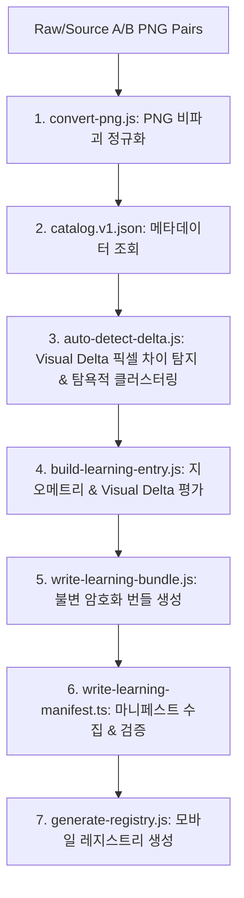

> **비규범 문서 / NON-NORMATIVE:** 이 문서는 이미지 생성, visual-delta, geometry, bundle 및 manifest 자동화 흐름을 설명한다. 힌트 사다리, 경제, 랭킹, 보상 또는 펫 정책의 권위 있는 근거가 아니다. 해당 규칙은 공유 계약, 승인된 정책 및 설계 문서를 따른다.

# 🔍 Spot & Learn Battle: 콘텐츠 생성 및 검증 파이프라인 심층 연구 보고서 (`research.md`)

## 1. 개요 (Overview)

본 보고서는 `touchcatch` 프로젝트 내 학습 콘텐츠 생성 및 검증 파이프라인(`content/learning/` 및 `tools/content/`)의 동작 구조, 데이터 흐름, 핵심 알고리즘 및 검증 체계를 심층 분석한 결과 문서입니다.

---

## 2. 콘텐츠 자동화 파이프라인 아키텍처 (Pipeline Architecture)

파이프라인은 원본 이미지(A/B 페어)로부터 최종 모바일 데모 레지스트리 생성까지 총 **7단계의 자동화 파이프라인**으로 작동합니다.

---

## 3. 주요 모듈별 역할 및 구현 상세 (Module Details)

### 3.1 `convert-png.js` (이미지 비파괴 정규화)
- `sharp` 라이브러리를 사용하여 `content/learning/raw/` 또는 `content/learning/source/`에 위치한 A/B 이미지의 포맷을 표준 PNG로 변환합니다.
- 메모리 캐시를 해제(`sharp.cache(false)`)하여 대량 빌드 과정 중 메모리 누수를 방지합니다.

### 3.2 `auto-detect-delta.js` (Visual Delta 알고리즘)
- **난이도별 탐지 반경 (`RADIUS_BY_DIFFICULTY`)**:
  - `BEGINNER`: $r = 0.085$
  - `INTERMEDIATE`: $r = 0.070$
  - `ADVANCED`: $r = 0.055$
- **픽셀 임계값 (`pixelThreshold = 60`)**: A/B 이미지 간 RGB 채널 최대 차이가 60 이상인 픽셀만 변경 픽셀로 간주합니다.
- **탐욕적 클러스터링 (Greedy Clustering)**:
  - 픽셀 좌표를 정규화($(x + 0.5)/width, (y + 0.5)/height$)한 후 거리 $r \times 1.2$ 범위 내 픽셀을 하나의 클러스터로 그룹화합니다.
  - 정확히 변경된 픽셀 수가 50개 이상인 유효 클러스터만 필터링합니다.
- **비겹침 처리 (Non-overlap Filter)**:
  - 영역 간 중심거리가 $2r$ 이상 떨어지도록 제약 조건(REQ CONTENT-017)을 적용하여 최대 10개의 겹치지 않는 변경 영역을 선별합니다.

### 3.3 `visual-delta.ts` (Visual Delta 노이즈 및 게이트 검증)
- 선언된 지오메트리 영역 내 변경 픽셀 수(`minChangedPixelsPerRegion`)가 부족하면 `MISSING_DECLARED_VISUAL_DELTA` 에러를 발생시킵니다.
- 지오메트리 영역 외부에서 무단 변경된 픽셀 비율(`outsideChangedRatio`)이 허용 기준(`maxOutsideChangedRatio = 0.05` 또는 `0.08`)을 초과하면 `UNDECLARED_VISUAL_DELTA` 에러로 차단합니다.

### 3.4 `write-learning-bundle.ts` (불변 카노니컬 번들 생성)
- **SHA-256 & UUID 식별자**: 이미지 파일 바이너리의 SHA-256 해시값과 메타데이터를 결합하여 불변 리비전 ID (`contentRevisionId`)를 UUID v4 형식으로 생성합니다.
- **Canonical JSON**: 키 정렬 및 서로그라운드 바이트 검증을 거친 결정론적(Deterministic) JSON 문자열을 생성하여 `privateSolutionHash`를 산출합니다.

### 3.5 `write-learning-manifest.ts` & `generate-registry.js`
- `catalog.v1.json`과 `drafts/`, `evidence/` 파일들을 검증한 후 `manifest.v1.json`을 갱신합니다.
- `hintUnits`는 canonical answer grapheme 배열로 보존하고, 교육 검토자가 쓴 `hintLadder`는 별도 필드로 전달합니다. 런타임에서 힌트 문구나 단계를 생성하지 않습니다.
- manifest는 사다리 입수 상태와 canonical hash를 기록하며, 다섯 단계가 입수되지 않은 bundle을 ranked 후보에서 제외합니다.
- `apps/mobile/src/learning-demo/registry.ts` 파일을 자동 생성하여 모바일 개발 환경(`__DEV__`)에서 로컬 플레이가 가능하도록 바인딩합니다.

---

## 4. 데이터 저장 구조 및 파이프라인 무결성 (Data Integrity)

| 디렉토리 / 파일 | 역할 및 특성 |
| :--- | :--- |
| `catalog.v1.json` | 각 학습 테마 팩의 메타데이터 (어휘, 뜻, 오답 선택지, 변경 10가지 내역, 출처) 저장소 |
| `geometry/*.json` | 자동 탐지되거나 검증된 차이점 영역, 돌발 단어(Word Hunt), 서든데스 좌표 저장소 |
| `evidence/*.visual-delta.json` | 픽셀 노이즈 검증 결과 및 평가 리포트 |
| `drafts/*.json` | 카노니컬 규격으로 검증된 최종 공개/비공개 조합 번들 |
| `manifest.v1.json` | 모든 검증 완료 팩의 메타 마니페스트 (테스트 및 배포 게이트) |

---

## 5. 결론 및 현재 상태 (Conclusion)

- **총 검증 완료 팩**: **56개 테마 팩** (`manifest.v1.json` 및 `catalog.v1.json` 100% 동기화 완수)
- **테스트 통과**: `pnpm test content/learning/all-content.test.ts` (100% PASS)
- **안전 장치**: `__DEV__` 조건부 로딩 및 사람의 승인(`REVIEW_REQUIRED`)을 위한 퍼블리시 게이트 보존
